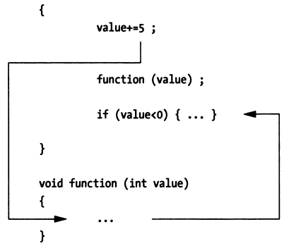

## 4.2 依赖（支持）

### 4.2.1 调试符号信息

编译器、连接器根据源代码构建可执行程序，可执行程序中的数据是面向极其的，而非面向人类的。

符号级调试器如何理解可执行程序中的数据，并在面向机器的数据和面向人类的源码信息之间进行转换呢？

这就需要调试符号表的支持了。当编译器将源代码转换成目标文件的时候，编译器会生成一些调试符号并将其存储到可执行程序文件中的特殊的section中。当连接器将多个目标对象文件连接成一个完整的可执行程序的时候，连接器会将分散在不同目标文件中的调试符号进行合并，然后存储到调试符号表中。


这里的调试符号如何生成、编解码、存储等是有相应的调试信息标准指导的，调试信息标准指引着编译器、连接器、调试器之间如何进行协作，如DWARF。编译器、连接器生成这些调试信息并将其存储到可执行程序的相应section中，调试器会读取可执行程序数据，并从中提取、解析与调试相关的信息，然后就可以构建起源码层面的视图。进而，调试器可以完成内存地址、指令地址、源码之间的相互映射。

In practice, depending on the format of the object file, debug symbol table records are typically placed in one of two locations:

不同的目标文件格式，调试符号表可能会存储在不同的地方，一般可能有两种存储方式：

- 存储在目标文件自身

    For example, [ELF](https://en.wikipedia.org/wiki/Executable_and_Linkable_Format) object format contains DWARF Debug symbol table.

    例如，[ELF](https://en.wikipedia.org/wiki/Executable_and_Linkable_Format) 文件格式包含了DWARF调试符号表对应的section，一般以".debug”或”.zdebug”开头。.debug开头的表示数据未压缩，.zdebug开头的表示数据经过了压缩。

    >这里给个实例，__debug_bin是一个由`dlv debug`生成的可执行程序，包含了调试符号信息，`readelf`可以用来读取ELF文件中的section header，下面我们列一下ELF文件中包含的调试信息相关的 section。
    >
    >```bash
    >[root@centos ~]# readelf -a __debug_bin | grep debug
    >[12] .zdebug_abbrev    PROGBITS         0000000000599000  0017b000
    >[13] .zdebug_line      PROGBITS         0000000000599114  0017b114
    >[14] .zdebug_frame     PROGBITS         00000000005a9f37  0018bf37
    >[15] .zdebug_pubnames  PROGBITS         00000000005b11a8  001931a8
    >[16] .zdebug_pubtypes  PROGBITS         00000000005b2fa0  00194fa0
    >[17] .debug_gdb_script PROGBITS         00000000005b624b  0019824b
    >[18] .zdebug_info      PROGBITS         00000000005b6273  00198273
    >[19] .zdebug_loc       PROGBITS         00000000005dcfe2  001befe2
    >[20] .zdebug_ranges    PROGBITS         00000000005e982d  001cb82d
    >```

- 存储在独立的文件

    例如，Microsoft Visual C++ 2.0生成的调试信息存储在独立的.PDB（Program Database）文件中，macOS平台上构建的调试符号信息一般存储在独立的.dSYM文件中。
    
    >这里给个示例，在macOS 10.15上，通过gcc -g构建一个包含调试符号的可执行程序，我们看下它生成的调试信息是如何存储的：
    >
    >**file: main.c**
    >
    >```cpp
    >#include <stdio.h>
    >#include <stdlib.h>
    >
    >int main(int argc, char *argv[])
    >{
    >	return 0;
    >}
    >
    >```
    >
    >```bash
    >$ gcc -g -o main main.c
    >$ ls
    >main main.c main.dSYM/
    >$ tree main.dSYM
    >main.dSYM/
    >└── Contents
    >├── Info.plist
    >└── Resources
    >   └── DWARF
    >       └── main
    >```
    >
    >可以看到，macOS 10.15上，gcc将调试信息也存储到了独立文件中main.dSYM。

调试符号信息有什么用呢？调试器利用调试符号能够将源码中的函数、变量映射为内存中的地址，也就意味着开发者可以直接对源码中函数、变量进行操作而不用关心具体的内存地址，这也是符号级调试器相比于指令级调试器的一大优势。

借助源码到内存地址的映射，符号级调试器就可以直接显示变量的值，如何做到的呢？因为变量标识符可以映射成程序的数据段地址（栈地址或者堆地址），此外，符号表中还记录了该变量的数据类型信息，这里的类型信息告诉调试器该变量一共占用多少个字节、实际用了多少比特、应该解读成哪种数据类型，调试器就可以正确显示变量的值。


这里的映射关系也包含从源代码语句与内存中代码段指令地址范围的映射，这个也是符号级调试器的优势。当希望单步执行一条语句的时候，调试器可以根据该语句对应的地址范围决定应该执行多少条指令后停下来。

### 4.2.2 调试支持

除了调试符号信息，调试器还需要其他的一些支持，即调试基础设施，包括：调试中断、系统调用、解释器、调试用户界面（GUI或者命令行）。

#### 4.2.2.1 调试中断

所有的商用操作系统都提供了调试相关的hook机制，这里的hook机制通常是通过内核系统调用的形式实现。为什么要通过系统调用实现呢？调试器调试应用程序的时候，需要读、写程序的数据、指令，就涉及到访问系统内存中一些受保护的特殊数据结构，普通用户进程是无权访问的，只能借助内核提供的系统调用来代表用户进程操作。

相比之下有个例外，DOS操作系统是实模式操作系统，由于没有对内存做保护，你可以直接做任何事情。

#### 4.2.2.2 系统调用

现在，绝大多数操作系统都实现了内存保护模式，内存保护模式是多用户、多任务操作系统的根基。如果没有保护模式，根本就不存在所谓的安全。关于内存保护模式如何实现的，可以参考X86系列处理器的演进发展史。

与DOS相反，Windows、Linux以及BSD都实现了内存保护模式，这意味着如果你想在这些平台上开发一个调试器，就需要通过平台提供的系统调用来实现。

以Linux系统调用为例，调试器进程（tracer）可以通过`ptrace(PTRACE_ATTACH…)` attach到一个被调试进程（tracee），然后操作系统内核会给tracee进程发送一个信号SIGSTOP，tracee进程就会停下来，tracer进程就可以通过`waitpid(pid)`来等待tracee停止事件。当tracer进程感知到tracee进程停止执行之后，tracer进程就可以进一步通过`ptrace`系统调用、配合其他ptrace参数`PTRACE_GETREGS、PTRACE_SETREGS、PTRACE_PEEKDATA、PTRACE_POKEDATA等`来读写tracee进程寄存器、内存数据（what，进程还有寄存器、内存数据？如果想不明白，可以了解下操作系统进程控制块PCB的概念以及Linux下taskstruct、GDT、LDT相关的知识）、控制代码的执行路径等。

> Linux平台对SIGSTOP信号的处理，可以参考：[How does SIGSTOP work in Linux kernel?](https://stackoverflow.com/questions/31946854/how-does-sigstop-work-in-linux-kernel)

#### 4.2.2.3 解释器

如果是调试一门解释型的语言，那就比通过系统调用的方式直接多了，因为所有的调试基础设施都可以直接内建在解释器中。通过一个解释器，就可以无限制地访问执行引擎。所有的调试操作及其依赖的能力都是运行在用户空间而非内核空间，也就不需要借助系统调用了。没有什么东西是被隐藏的。所要做的就是增加扩展来处理断点、单步执行等操作。

#### 4.2.2.4 内核调试器

操作系统构建起严格的内存保护模式之后，要想调试内核本身，就得通过一种特殊类型的调试器。传统的用户模式下的调试器是不行的，因为保护内存模式（如段、页式管理的相关逻辑）阻止了用户态程序操作内核映像。

你需要一个内核调试器！

内核调试器，能够指挥、控制中央处理器（CPU），这样就可以通过单步执行、断点等操作对内核代码进行调试、检查。这意味着内核调试器必须能够避开内存保护模式机制，通常内核级调试器都是与操作内核镜像打包在一起的。有些厂商要实现自己的内核级调试器，也会考虑将调试器作为设备驱动、可加载的内核模块的方式来设计、开发。

#### 4.2.2.5 调试用户界面

可能你还没注意到，调试关心的都是程序的状态。不同的调试器为用户提供了不同的方式来查看正在运行的程序的状态。某些调试器（例如gdb）进提供简单但一致的命令行界面。其他调试器可能会与GUI环境进行集成。我倾向于使用GUI调试器，因为GUI调试器能够同时呈现和访问更多的机器状态信息。使用GUI调试器，您可以轻松地同时监视数十个程序元素。

另一方面，如果你正在开发跨平台的应用程序，则可能很难找到在所有平台上都能运行的GUI IDE，这个时候跨平台的命令行调试器相比GUI调试器来说就有优势了。GNU调试器可能没有精美的GUI接口，但在任何平台上其命令行操作和行为都是一样的。命令行调试器相比GUI调试器拥有更陡峭的学习曲线，但是一旦你掌握了，你就可以跨平台调试你的应用程序。

### 4.2.3 符号调试器扩展

#### 4.2.3.1 动态断点

程序断点breakpoint，指的是程序中的一个位置，当程序执行到该位置时能够停下来，以便调试人员观察程序状态。

如果有动态断点的概念，那应该也有一个静态断点的概念，没错，这两种断点都存在。

> 除了动态断点、静态断点，还有软件断点和硬件断点，前者是通过机器指令来实现，后者是借助处理器提供的调试寄存器来实现，这里我们先讨论软件断点，有需要的话会在后文介绍硬件断点。

X86平台上创建软件断点可以通过指令`int 3`来生成**0xCC**这个一字节机器指令来创建，处理器执行完0xCC之后会暂停当前执行的进程。

具体是如何执行的呢？int 3表示会触发3号中断，对应机器指令是0xCC，处理器执行完该指令后就会触发3号中断，对应的中断服务就在IDT[3]中。BIOS中提供的中断服务程序是16位的，了解过Linux构建32位、64位内存保护模式的话，就会明白Linux启动后，IDT[3]指向的其实是Linux内核提供的中断处理程序，这里就是暂停执行当前tracee进程，并通知tracer进程tracee暂停执行。

好，现在理解了0xCC机器指令的用途之后，我们可以继续讨论静态断点和动态断点的区别：

1. **静态断点**

    静态断点指的是这样的断点，它是在程序中的某些位置通过硬编码的方式来创建的，如在程序中通过`int 0x3`汇编指令创建断点。静态断点的生命周期与进程的生命周期是相同的。我们可以在程序中插入一些分支判断逻辑，来决定是否创建特定的静态断点。

    一些获取、设置内存、寄存器的汇编指令也可以按需在代码中硬编码。

    比较好的解决方法是，上述创建静态断点、读写内存、读写寄存器等的操作封装成库的形式，这样就方便其他程序以共享库、静态库的方式来访问，用起来会方便点。

    静态断点不够灵活，定位一个问题，可能需要反复修改源码、调试，动态断点相比之下优势明显。

2. **动态断点**

    动态断点指的是程序在调试运行时，根据调试人员需要动态创建的断点，后面你会看到，动态断点使得符号调试器在源码中能够单步执行，可以联想下gdb next, step, finish, continue等操作。

    与静态断点不同，静态断点生命周期是进程生命周期，符号级调试器通常是通过动态断点来控制调试，动态断点的插入、移除一般是按照如下流程实现的：

    - 调试器识别出语句statement的第一条指令的操作码；
    - 调试器保存上述操作码的第一个字节，并将操作码的第一个字节替换成0xCC
    - 调试进程tracee执行完到上述指令位置，执行完0xCC之后将触发断点并暂停执行
    - 调试进程tracer将tracee的PC-1位置处的1字节数据由0xCC替换为原来的操作码数据
    - 调试器通知内核恢复tracee运行，并继续等待到达下一个断点

    我们通过下面的C语言语句进行下简单的说明：

    ```c
total = total +value;
    ```

    假定上述语句对应的汇编指令为：

    

    给上述语句设置一个动态断点，调试器首先获取statement对应的第一条指令的操作码的第一个字节0x8B，并将其替换为0xCC。当调试器遇到这个断点的时候，它会将其替换为原来的操作码数据，然后让tracee执行statement对应的完整的3条指令。
    
    一旦上述语句对应的指令被执行了之后，调试器可以考虑是否要再次为该语句设置动态断点，如果不可能执行到上述语句了，就可以不设置了，但是如果还是会执行到就会设置动态断点，比如for循环体中语句设置断点，当你调试完一轮之后，还希望下次循环进入时再次让断点生效，调试器这种情况下就应该再次插入断点。

#### 4.2.3.2 单步执行

对指令级调试器（也称机器级调试器）而言，单步执行很简单：处理器只需执行下一条机器指令，然后将程序控制权返回给调试器。 对于符号调试器，此过程并不那么简单，因为高级编程语言中的单个语句通常会转换为多个机器级指令。 您不能简单地让调试器执行固定数量的机器指令，因为高级源代码语句解析的机器指令数量会有所不同。

单步执行时，符号调试器必须使用动态断点。 如何插入动态断点将取决于执行的单步执行动作的类型，单步有三种不同类型：

1. **单步执行进入 (下一条语句)**

    当符号调试器单步执行一条源代码语句statement时，它将扫描前几条机器指令，以查看该语句是否为函数调用。 如果下一条指令的第一个操作码不是函数调用的一部分，则调试器将简单地保存该操作码并将其替换为断点。 否则，调试器将确定函数调用在内存中跳转到的位置，并用断点替换函数主体的第一个操作码，以便在调用函数后暂停执行。

    

2. **单步执行跳出 (一个函数)**

    当源代码级调试器退出函数例程时，它将在函数的活动记录（调用栈信息）中查找返回地址。 然后，它将返回地址处机器指令的操作码保存，并用断点替换。 当程序恢复执行时，该例程将完成其其余语句，并跳转到其返回地址。 然后执行路径将到达断点，程序控制权将交还给调试器。 这样做的结果是，您可以使调试器从被调函数返回到调用该函数的代码上。

3. **单步执行跳过 (下一条语句)**

    当源代码级调试器遍历一条语句时，它将查询程序的符号表以确定该语句在内存中的地址范围（这是在其中使用符号表的一种情况）。 一旦调试器确定了该语句的结束位置，它将保存该语句后的第一条机器指令的操作码，并将其替换为断点。 当恢复执行时，调试器将仅在执行路径遍历该语句之后才能重新获得程序控制。

    
