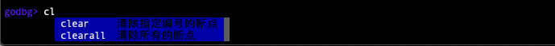
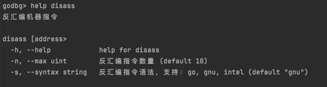

## 调试会话

### 实现目标：建立调试会话

为了使调试过程更方便，我们可能会有一些功能性、非功能性的需求：

- 能记住上次执行的调试命令，敲“回车”时可重复执行该命令避免再次输入；
- 能记住执行的命令列表，方便通过“上下按键”快速查找最近使用的命令；
- 能记住要显示的变量名列表，以便执行调试时能同时跟踪多个变量的值；
- 能记住曾经添加过的断点，以便快速查看断点列表，或者有选择地清除断点；
- 能维护调试有关的命令列表及其帮助信息，方便快速查看、掌握命令使用；
- 当一轮调试结束后，希望能根据当前调试过程快速发起新一轮调试；
- 在一轮调试过程中，希望能将当前调试状态回退几步，以回到之前的某个状态；
- 用户键入调试命令、参数信息应尽可能方便，要降低使用成本、记忆成本；
- 其他；

我们其实还可以想出更多的点子，而这些点子背后，其实是希望调试器能提供一个灵活的用户界面，它不仅为调试过程提供各种调试命令及使用帮助，也能维护当前调试过程的状态以提供更多更丰富的能力。

既然提及了“状态”，这其实就是一个类似“会话”的概念，我们就叫它“调试会话”。我们要为用户构建一个调试会话，以记录跟踪、协助用户完成调试过程。

### 代码实现

当我们的调试器成功trace了tracee线程时，我们就可以创建一个调试会话了。

前一小节中，我们曾介绍了`godbg exec <prog>`的方式启动并跟踪一个进程，并且我们提及了在`execCmd.PostRunE(...)`方法中通过`debug.NewDebugShell().Run()`来创建并启动一个调试会话，并粗略介绍了调试会话的工作过程。本小节我们继续详细介绍下调试会话的实现细节，读者了解后将能够熟悉cobraprompt的使用，或者使用liner能代替cobraprompt来实现不同风格的调试会话。

#### 基于cobraprompt实现

基于cobraprompt实现调试会话的代码位于`0_godbg/cmd/debug.go`中，其实现思路相对来说也比较简单：

- 利用cobra的命令管理能力，我们创建一个debugRootCmd，在其上注册其他的调试命令，如breakpoint、list、step、continue、exit等等，每一个子命令都对应着一个cobra.Command实现；
- prompt具备提示用户输入、获取并校验用户输入、动态补全输入的能力，cobraprompt是cobra和prompt的结合体，它的作用便是利用prompt来获取用户输入的命令，输入过程中支持自动补全，在用户输入正确的调试命令及参数时，将参数信息转交给debugRootCmd上注册的相应子命令来执行，如用户键入了exit，则执行exitCmd的逻辑；
- 为了方便用户快速查看调试命令的帮助信息，需对诸多的调试命令进行分组，因此对于调试命令的帮助信息需要进行定制化改造，我们用各个子命令的annotation来对其所属的命令分组（如断点类命令1-breaks、源码类命令2-source），然后通过自定义的帮助函数`helpMessageByGroups(rootCmd *cobra.Command)`来提取rootCmd下注册所有子命令的帮助信息并按分组进行汇总展示；
- 对具体一个子命令的详细帮助信息，则还是交由cobra debugRootCmd自身来管理；

```go
package debug

import (
	"bytes"
	"fmt"
	"sort"
	"strings"

	"github.com/c-bata/go-prompt"
	"github.com/hitzhangjie/godbg/target"
	cobraprompt "github.com/stromland/cobra-prompt"

	"github.com/spf13/cobra"
)

const (
	cmdGroupAnnotation = "cmd_group_annotation"

	cmdGroupBreakpoints = "1-breaks"
	cmdGroupSource      = "2-source"
	cmdGroupCtrlFlow    = "3-execute"
	cmdGroupInfo        = "4-info"
	cmdGroupOthers      = "5-other"
	cmdGroupCobra       = "other"

	cmdGroupDelimiter = "-"

	prefix    = "godbg> "
	descShort = "godbg interactive debugging commands"
)

const (
	suggestionListSourceFiles = "ListSourceFiles"
)

var (
	TraceePID   int
	breakpoints = map[uintptr]*target.Breakpoint{}
)

var debugRootCmd = &cobra.Command{
	Use:   "help [command]",
	Short: descShort,
}

// NewDebugShell 创建一个debug专用的交互管理器
func NewDebugShell() *cobraprompt.CobraPrompt {

	fn := func(cmd *cobra.Command, args []string) {
		// 描述信息
		fmt.Println(cmd.Short)
		fmt.Println()

		// 使用信息
		fmt.Println(cmd.Use)
		fmt.Println(cmd.Flags().FlagUsages())

		// 命令分组
		usage := helpMessageByGroups(cmd)
		fmt.Println(usage)
	}
	debugRootCmd.SetHelpFunc(fn)

	return &cobraprompt.CobraPrompt{
		RootCmd:                debugRootCmd,
		DynamicSuggestionsFunc: dynamicSuggestions,
		ResetFlagsFlag:         false,
		GoPromptOptions: []prompt.Option{
			prompt.OptionTitle(descShort),
			prompt.OptionPrefix(prefix),
			prompt.OptionSuggestionBGColor(prompt.DarkBlue),
			prompt.OptionDescriptionBGColor(prompt.DarkBlue),
			prompt.OptionSelectedSuggestionBGColor(prompt.Red),
			prompt.OptionSelectedDescriptionBGColor(prompt.Red),
			// here, hide prompt dropdown list
			// TODO do we have a better way to show/hide the prompt dropdown list?
			prompt.OptionMaxSuggestion(10),
			prompt.OptionShowCompletionAtStart(),
			prompt.OptionCompletionOnDown(),
		},
		EnableSilentPrompt: true,
		EnableShowAtStart:  true,
	}
}

// helpMessageByGroups 将各个命令按照分组归类，再展示帮助信息
func helpMessageByGroups(cmd *cobra.Command) string {

	// key:group, val:sorted commands in same group
	groups := map[string][]string{}
	for _, c := range cmd.Commands() {
		// 如果没有指定命令分组，放入other组
		var groupName string
		v, ok := c.Annotations[cmdGroupAnnotation]
		if !ok {
			groupName = "other"
		} else {
			groupName = v
		}

		groupCmds, ok := groups[groupName]
		groupCmds = append(groupCmds, fmt.Sprintf("  %-16s:%s", c.Name(), c.Short))
		sort.Strings(groupCmds)

		groups[groupName] = groupCmds
	}

	if len(groups[cmdGroupCobra]) != 0 {
		groups[cmdGroupOthers] = append(groups[cmdGroupOthers], groups[cmdGroupCobra]...)
	}
	delete(groups, cmdGroupCobra)

	// 按照分组名进行排序
	groupNames := []string{}
	for k, _ := range groups {
		groupNames = append(groupNames, k)
	}
	sort.Strings(groupNames)

	// 按照group分组，并对组内命令进行排序
	buf := bytes.Buffer{}
	for _, groupName := range groupNames {
		commands, _ := groups[groupName]

		group := strings.Split(groupName, cmdGroupDelimiter)[1]
		buf.WriteString(fmt.Sprintf("- [%s]\n", group))

		for _, cmd := range commands {
			buf.WriteString(fmt.Sprintf("%s\n", cmd))
		}
		buf.WriteString("\n")
	}
	return buf.String()
}

func dynamicSuggestions(annotation string, _ prompt.Document) []prompt.Suggest {
	switch annotation {
	case suggestionListSourceFiles:
		return GetSourceFiles()
	default:
		return []prompt.Suggest{}
	}
}

func GetSourceFiles() []prompt.Suggest {
	return []prompt.Suggest{
		{Text: "main.go", Description: "main.go"},
		{Text: "helloworld.go", Description: "helloworld.go"},
	}
}

```

#### 基于liner实现

基于liner实现的调试会话的代码位于repo [hitzhangjie/godbg](https://github.com/hitzhangjie/godbg)工程目录下的cmd/debug/shell.go，其实现逻辑和基于cobraprompt的版本并无明显区别。

那我们为什么又提供一个基于liner实现的版本呢？

在作者初次尝试实现调试会话时，是基于cobraprompt，当时作者认为cobraprompt的这种自动输入补全能力非常方便和酷炫，所以对其称赞有加。但是随着后续调试活动的增加，作者逐渐意识到：**调试过程中保持用户对问题探求的专注、减少对用户的干扰，比单纯地追求酷炫、方便本身更重要**。

所以作者对原来的调试会话进行了重写，即基于liner实现的这个版本，读者阅读代码即可发现，其实现思路和cobraprompt其实差别不大，换了种调试会话风格，同时帮我们解决了一个输入“回车”时方便判断用户输入并激活上次调试命令的问题，在cobraprompt中用户是无法只键入“回车”按键的。

```go
package debug

import (
	"bytes"
	"fmt"
	"sort"
	"strings"

	"github.com/peterh/liner"
	"github.com/spf13/cobra"
)

const (
	cmdGroupAnnotation = "cmd_group_annotation"

	cmdGroupBreakpoints = "1-breaks"
	cmdGroupSource      = "2-source"
	cmdGroupCtrlFlow    = "3-execute"
	cmdGroupInfo        = "4-info"
	cmdGroupOthers      = "5-other"
	cmdGroupCobra       = "other"

	cmdGroupDelimiter = "-"

	prefix    = "godbg> "
	descShort = "godbg interactive debugging commands"
)

const (
	suggestionListSourceFiles = "ListSourceFiles"
)

var debugRootCmd = &cobra.Command{
	Use:   "help [command]",
	Short: descShort,
}

var (
	CurrentSession *DebugSession
)

// DebugSession 调试会话
type DebugSession struct {
	done   chan bool
	prefix string
	root   *cobra.Command
	liner  *liner.State
	last   string

	defers []func()
}

// NewDebugSession 创建一个debug专用的交互管理器
func NewDebugSession() *DebugSession {

	fn := func(cmd *cobra.Command, args []string) {
		// 描述信息
		fmt.Println(cmd.Short)
		fmt.Println()

		// 使用信息
		fmt.Println(cmd.Use)
		fmt.Println(cmd.Flags().FlagUsages())

		// 命令分组
		usage := helpMessageByGroups(cmd)
		fmt.Println(usage)
	}
	debugRootCmd.SetHelpFunc(fn)

	return &DebugSession{
		done:   make(chan bool),
		prefix: prefix,
		root:   debugRootCmd,
		liner:  liner.NewLiner(),
		last:   "",
	}
}

func (s *DebugSession) Start() {
	s.liner.SetCompleter(completer)
	s.liner.SetTabCompletionStyle(liner.TabPrints)

	defer func() {
		for idx := len(s.defers) - 1; idx >= 0; idx-- {
			s.defers[idx]()
		}
	}()

	for {
		select {
		case <-s.done:
			s.liner.Close()
			return
		default:
		}

		txt, err := s.liner.Prompt(s.prefix)
		if err != nil {
			panic(err)
		}

		txt = strings.TrimSpace(txt)
		if len(txt) != 0 {
			s.last = txt
			s.liner.AppendHistory(txt)
		} else {
			txt = s.last
		}

		s.root.SetArgs(strings.Split(txt, " "))
		s.root.Execute()
	}
}

func (s *DebugSession) AtExit(fn func()) *DebugSession {
	s.defers = append(s.defers, fn)
	return s
}

func (s *DebugSession) Stop() {
	close(s.done)
}

func completer(line string) []string {
	cmds := []string{}
	for _, c := range debugRootCmd.Commands() {
		// complete cmd
		if strings.HasPrefix(c.Use, line) {
			cmds = append(cmds, strings.Split(c.Use, " ")[0])
		}
		// complete cmd's aliases
		for _, alias := range c.Aliases {
			if strings.HasPrefix(alias, line) {
				cmds = append(cmds, alias)
			}
		}
	}
	return cmds
}

// helpMessageByGroups 将各个命令按照分组归类，再展示帮助信息
func helpMessageByGroups(cmd *cobra.Command) string {

	// key:group, val:sorted commands in same group
	groups := map[string][]string{}
	for _, c := range cmd.Commands() {
		// 如果没有指定命令分组，放入other组
		var groupName string
		v, ok := c.Annotations[cmdGroupAnnotation]
		if !ok {
			groupName = "other"
		} else {
			groupName = v
		}

		groupCmds, ok := groups[groupName]
		groupCmds = append(groupCmds, fmt.Sprintf("  %-16s:%s", c.Name(), c.Short))
		sort.Strings(groupCmds)

		groups[groupName] = groupCmds
	}

	if len(groups[cmdGroupCobra]) != 0 {
		groups[cmdGroupOthers] = append(groups[cmdGroupOthers], groups[cmdGroupCobra]...)
	}
	delete(groups, cmdGroupCobra)

	// 按照分组名进行排序
	groupNames := []string{}
	for k, _ := range groups {
		groupNames = append(groupNames, k)
	}
	sort.Strings(groupNames)

	// 按照group分组，并对组内命令进行排序
	buf := bytes.Buffer{}
	for _, groupName := range groupNames {
		commands, _ := groups[groupName]

		group := strings.Split(groupName, cmdGroupDelimiter)[1]
		buf.WriteString(fmt.Sprintf("- [%s]\n", group))

		for _, cmd := range commands {
			buf.WriteString(fmt.Sprintf("%s\n", cmd))
		}
		buf.WriteString("\n")
	}
	return buf.String()
}

```

> FIXME hitzhangjie/golang-debugger-lessons/0_godbg其实是个submodule，其真实指向的项目是hitzhangjie/godbg。

### 代码测试

#### 基于cobraprompt实现

这部分代码位于repo [hitzhangjie/golang-debugger-lessons](https://github.com/hitzhangjie/golang-debugger-lessons)下的0_godbg目录下，目录下执行`go install -v`即可进行体验。

调试器启动成功后，会通过“**godbg>**”来表示当前创建好的调试会话，我们在此调试会话中输入调试命令来完成对应的调试动作。


以清除断点操作为例，clear是清除单个断点，clearall是清除所有的断点，当我们输入`cl`时，可以匹配到`clear`、`clearall`两个命令，开发人员可以通过`tab`按键或者`arrow-down`来在候选列表中移动，`enter`选中列表项。



再看一个命令参数层面自动补全的例子，以list查看源码命令为例，此时会返回进程中涉及到的源码信息，如此处有main.go helloworld.go，方便用户选择，调试时就更简单了。


这是关于调试会话界面的运行效果展示。

#### 基于liner实现

这部分代码位于repo [hitzhangjie/godbg](https://github.com/hitzhangjie/godbg)下，执行`go install -v`即可进行体验。

调试器启动后创建一个调试会话，调试会话仍然以“**godbg>** ”作为输入提示符，当我们输入了help命令时，它显示分组后的各个调试命令的帮助信息，非常直观。


当我们想查看具体某个调试命令的详细使用信息时，可以执行`help <subcmd>`的方式来查看，如以查看反汇编命令的帮助信息为例，图中显示了disass命令的使用格式、参数列表及各自说明。



再来看下自动补全提示，调试器中假定已经支持了断点命令breakpoint（其别名是break或b），所有断点命令breakpoints（其别名是bs），调用栈命令backtrace（其别名是bt）。

那么当我们输入了字符“b”之后，我们按下“TAB”之后，此时可以看到断点、调用栈等相关的命令及其别名形式已经全部展示出来了；此时用户可以获得提示还可以如何进行输入，比如如果是断点类型的按照提示还可以输入字母“r”，当我们输入了“r”之后，继续输入“TAB”此时就可以自动补全到“break”，还有多个候选项，此时可以继续键入字母“p”，可以自动补全到“breakpoint”。假设说自己想输入的就是“breakpoint”则直接敲回车即可。


#### 简单对比

通过代码测试环节，我们对基于cobraprompt以及liner两种方式实现的调试会话进行了个简单的对比：

- 基于cobraprompt的方式随酷炫但是对调试过程干扰比较大，可能更容易导致用户抓不住重点，不便于用户保持对问题本身的探求和关注；
- 基于liner的方式则更加精炼，对用户打扰也更少，也具备了我们期望拥有的自动补全能力，能够满足我们最初设计的调试会话的要求，因此将其作为最终实现版本，

### 参考内容

- cobra, https://github.com/spf13/cobra

- go-prompt, https://github.com/c-bata/go-prompt

- cobra-prompt, https://github.com/stromland/cobra-prompt
- liner, https://github.com/peterh/liner
