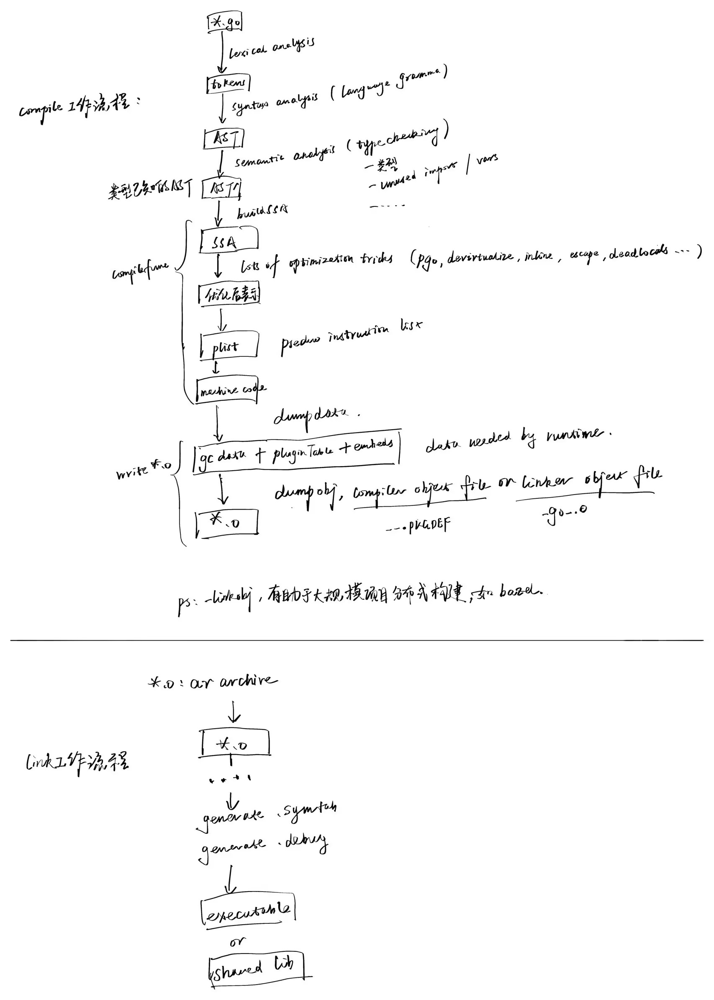

## 符号表和符号

在 "认识ELF文件" 一节中，我们有介绍过ELF文件中常见的一些section及其作用，本节我们重点讲述符号表及符号。

### 生成过程

尽管这部分知识是非常有价值的，但是仍然难免感觉有些枯燥。OK，那我们换个讲解思路，我们先不介绍那些枯燥的符号表格式、符号类型定义，先看看Go编译工具链中符号表是如何生成的吧。

**go编译器的具体工作：**

- 会接受go源文件作为输入，
- 然后读取源文件进行词法分析得到一系列tokens，
- 进而进行语法分析（基于gramma进行规约）得到AST，
- 然后基于AST进行类型检查，
- 类型检查无误后开始执行函数编译（buildssa、代码优化、生成plist、转换为平台特定机器码），
- 最后将结果输出到目标文件中。

这里的*.o文件实际上是一个ar文件（通过 `file \*.o` 可以求证），并不是gcc生成\*.o文件时常用的ELF格式。这种实现思路是go团队借鉴plan9项目的目标文件格式。每个编译单元对应的\*.o文件中包括了两部分，一部分是compiler object file，一部分是linker object file（通过  `ar -t *.o `可以看到内部的 `__.PKGDEF `文件和 `__go__.o `文件）。`-linkobj=???`，分布式构建中为了加速也可以指定只输出compiler object file或者linker object file，比如bazel分布式构建来进行编译加速。
编译器还会在输出的目标文件中记录一些将来由Linker处理的符号信息，这些符号信息实际上就是一个LSym的列表，在前面进行类型检查过程中，编译器会维护这样一个列表，输出到目标文件中。

```go
// An LSym is the sort of symbol that is written to an object file.
// It represents Go symbols in a flat pkg+"."+name namespace.
type LSym struct {
	Name string
	Type objabi.SymKind
	Attribute

	Size   int64
	Gotype *LSym
	P      []byte
	R      []Reloc

	Extra *interface{} // *FuncInfo, *VarInfo, *FileInfo, or *TypeInfo, if present

	Pkg    string
	PkgIdx int32      // <<<=== look，这里还需要记录包名信息
	SymIdx int32
}
```

这些LSym符号信息，从源码视角来看，其实就是编译器处理过程中识别到的各类pkg.name（如变量、常量、类型、别名、值、定义位置、指令数据），这里的符号如果类型为 `symbol.Type=SDWARFXXX`，表示这是一个调试符号，linker要识别并处理。

**go链接器的具体工作：**

- 除了合并来自多个目标文件中的相同sections以外（输入可能还包含其他共享库，这里暂时不做发散），
- linker还需要完成符号解析、重定位，
- 逐渐建立起一个全局符号表，最终写入到构建产物中的符号表.symtab中，用于后续的二次链接，比如产物是个共享库，
- linker可以做一些全局层面的优化，如deadcode移除， see: [Dead Code Elimination: A Linkers Perspective](https://medium.com/p/d098f4b8c6dc)，等等，
- 生成DWARF调试信息，
- 生成最终的可执行程序或者共享库，

OK，这里我们就先不发散太多……前面编译器将LSym列表写入到目标文件之后，Linker就需要读取出来，利用它完成符号解析、重定位相关的工作，一些跨编译单元的导出函数会被最终输出到.symtab符号表中为将来再次链接备用。另外，对那些 `LSym.Type=SDWARFXXX`的符号，linker需要根据DWARF标准与调试器开发者的约定，生成对应的DWARF DIE描述信息写入到.debug_* sections中，方便后续调试器读取。

> go团队设计实现的时候为了更好地进行优化，并没有直接使用ELF格式作为目标文件的格式，而是采用了一种借鉴自plan9目标文件格式的自定义格式。因此go tool compile生成的目标文件，是没法像gcc编译生成的目标文件一样被readelf、nm、objdump等之类的工具直接读取的。尽管go团队并没有公开详细的文档来描述这种目标文件格式，但是go编译工具链提供了go tool nm, go tool objdump等工具来查看这些目标文件中的数据。

为了方便大家理解，我画了下面这个草图，包括了 `go tool compile` 的工作过程，以及与生成符号信息相关的 `go tool link` 的关键步骤。大家如果想查看源码，可以参考此流程来阅读。



OK，前面介绍了编译器、链接器之间的协作，最终在可执行程序或者共享库中生成符号表、DWARF调试信息的过程。这里以go编译工具链为例，也是为了让大家多认识下go的方方面面。其他语言编译工具链的处理流程、目标文件的格式等等存在不同之处，但是整体来看是相近的，我们就不再继续发散了。感兴趣的读者可以带着这些框架去搜索下对应的资料。OK，接下来我们再来介绍下符号表、符号的相关内容，读者认识就更全面了。

### 认识符号表

1）符号表.symtab 存储的是一系列符号，每个符号都描述了它的地址、类型、作用域等信息，用于帮助链接器完成符号解析及重定位相关的工作，当然前面也提到它调试器也可以使用它。

关于符号表，每个可重定位模块都有一张自己的符号表：

- \*.o文件，包含一个符号表.symtab；
- \*.a文件，它是个静态共享库文件，其中可能包含多个\*.o文件，并且每个\*.o文件都独立保留了其自身的符号表(.symtab)。静态链接的时候会拿对应的\*.o文件出来进行链接，链接时符号表会进行合并；
- \*.so文件，包含动态符号表.dynsym，所有合并入这个\*.so文件的\*.o文件的符号表信息合并成了这个.dynsym，\*.so文件中不像静态库那样还存在独立的\*.o文件了。链接器将这些\*.o文件合成\*.so文件时，Merging Not Inclusion；
- 其他不常见的可重定位文件类型，不继续展开；

2）符号symbol，符号表.symtab中的每一个表项都描述了一个符号，符号的名字最终记录在字符串表.strtab中。符号除了有名字还有一些其他属性，下面继续介绍。

3）字符串表.strtab和.shstrtab 存储的是字符串信息，.shstrtab和.strtab 首尾各有1-byte '\0'，其他数据就是 '\0' 结尾的c_string。区别只是，.strtab可以用来存储符号、节的名字，而.shstrtab仅存储节的名字。

如果深究设计实现的话，就是go编译器在编译过程中构建了AST，它知道源码中任意一个符号package.name的相关信息。在此基础上它记录了一个LSym列表，并输出到了目标文件中进一步交给链接器处理。链接器读取并处理后会针对调试类型的LSym生成DWARF调试信息，DWARF调试信息我们将在第八章介绍，其他用于符号解析、重定位后的一些全局符号被记录到最终可执行程序或者共享库的.symtab中，用于后续链接过程。这个.symtab就是一系列 `debug/elf.Sym32 or Sym64`，而 `debug/elf.Symbol`是解析成功之后更容易使用的方式，比如符号名已经从Sym32/64中的字符串索引值转换为了string类型。

### 认识符号

符号表.symtab包含了一系列符号，描述了程序中全局作用域的函数、变量及链接器所需要的相关信息，如符号的地址和类型。自动变量通常不会被包含在符号表中，因为它们的作用域仅限于定义它的函数或块内，不需要全局可见性。然而，静态局部变量会被包含在符号表中，尽管它们没有全局命名空间的访问权限，但具有文件作用域，特别是在多级嵌套代码中，内部嵌套可能引用了外部块中定义的静态局部变量，链接器进行符号解析时依然依赖符号表中存在相应的描述信息。

ELF 符号表主要记录的是具有外部作用范围的对象，包括：

- 全局函数和全局变量
- 静态函数和静态变量（仅对当前源文件或编译单元可见）
- 以及其他需要跨文件或模块访问的符号

我们这里所说的符号，是指的.symtab中的表项，并不是DWARF调试信息，它主要是为了方便链接器进行符号解析和重定位而记录的。但是它记录的这些符号信息也确实会被某些调试器使用，尤其是类似DWARF一样的调试信息标准成为业界标准之前。实际上dlv就完全没有使用.symtab，但是gdb有使用，我们在扩展阅读部分也进行了介绍。

还记得我们的初衷吗，“让大家认识到那些高屋建瓴的设计是如何协调compiler、linker、loader、debugger工作的”，读者不妨大胆多问几个为什么？没多少人能不做一番调研就说他精通这些。

- 编译构建过程中.symtab是如何生成的？本文已介绍
- 链接、加载过程中.symtab有什么作用？链接时符号解析、重定位
- 构建产物中的.symtab为什么要保留？链接时符号解析、重定位，调试等
- 删掉它对gdb、dlv之类调试器有没有影响？对gdb有影响，对dlv应该没影响
- 从共享库中删掉它对依赖它的程序的构建有没有影响？链接时链接失败
- 从共享库中删掉它对依赖它的程序的运行有没有影响？加载时动态链接失败
- gdb早期实现可以借助.symtab实现，为什么还需要DWARF？DWARF标准更胜一筹，但是成为业界标准较晚
- gdb现在为什么不弃用.symtab而完全借助DWARF？兼容老的二进制和工具链

我们的学习过程不应该是快餐式的，而应该是脚踏实地的。正视自己内心疑问的每个瞬间，无疑都是一剂帮助我们自我突破、走向更远方的强心剂。

#### 符号定义

下面是 `man 5 elf` 中列出的32位和64位版本符号对应的类型定义，它们成员相同，仅仅是字段列表定义顺序有所不同。

```c
typedef struct {
    uint32_t      st_name;
    Elf32_Addr    st_value;
    uint32_t      st_size;
    unsigned char st_info;
    unsigned char st_other;
    uint16_t      st_shndx;
} Elf32_Sym;

typedef struct {
    uint32_t      st_name;
    unsigned char st_info;
    unsigned char st_other;
    uint16_t      st_shndx;
    Elf64_Addr    st_value;
    uint64_t      st_size;
} Elf64_Sym;
```

下面来详细了解下各个字段的作用：

- st_name: 符号的名称，是一个字符串表的索引值。非0表示在.strtab中的索引值；为0则表示该符号没有名字（.strtab[0]=='\0')
- st_value: 符号的值，对可重定位模块，value是相对定义该符号的位置的偏移量；对于可执行文件来说，该值是一个虚拟内存地址；
- st_size: 符号指向的对象大小，如果大小未知或者无需指定大小就为0。如符号对应的int变量的字节数；
- st_info: 符号的类型和绑定属性(binding attributes)
  - STT_NOTYPE: 未指定类型
  - STT_OBJECT: 该符号关联的是一个数据对象
  - STT_FUNC: 该符号关联的是一个函数
  - STT_SECTION: 该符号关联的是一个section
  - STT_FILE: 该符号关联的是一个目标文件对应的原文件名
  - STT_LOPROC, STT_HIPROC： 范围[STT_LOPROC, STT_HIPROC]预留给处理器相关的机制
  - STB_LOCAL：符号可见性仅限于当前编译单元（目标文件）内部，多个编译单元中可以存在多个相同的符号名但是为STT_LOCAL类型的符号
  - STB_GLOBAL：全局符号对于所有的编译单元（目标文件）可见，一个编译单元中定义的全局符号，可以在另一个编译单元中引用
  - STB_WEAK: 弱符号，模拟全局符号，但是它的定义拥有更低的优先级
  - STB_LOPROC, STB_HIPROC：范围[STB_LOPROC, STB_HIPROC]预留给处理器相关的机制
  - STT_TLS: 该符号关联的是TLS变量
- st_other: 定义了符号的可见性 (visibility)
  - STV_DEFAULT: 默认可见性规则；全局符号和弱符号对其他模块可见；本地模块中的引用，可以解析为其他模块中的定义；
  - STV_INTERNAL: 处理器特定的隐藏类型；
  - STV_HIDDEN: 符号对其他模块不可见；本地模块中的引用，只能解析为当前模块中的符号；
- st_shndx: 每个符号都是定义在某个section中的，比如变量名、函数名、常量名等，这里表示其从属的section header在节头表中的索引；

### 读取符号表

go标准库中对ELF32 Symbol的定义 `debug/elf.Sym32/64` 如下，go没有位字段，定义上有些许差别，理解即可：

```go
// ELF32 Symbol.
type Sym32 struct {
	Name  uint32
	Value uint32
	Size  uint32
    	Info  uint8	// type:4+binding:4
	Other uint8	// reserved
	Shndx uint16	// section
}
```

关于如何读取符号表，可以参考go源码实现：https://sourcegraph.com/github.com/golang/go/-/blob/src/debug/elf/file.go?L489:16。

现在go工具链已经支持读取符号表，推荐大家优先使用go工具链。Linux binutils也提供了一些类似工具，但是对于go程序而言，有点特殊之处：

- 如果是编译链接完成的可执行程序，通过readelf -s、nm、objdump都可以；
- 但是如果是go目标文件，由于go是自定义的目标文件格式，则只能借助go tool nm、go tool objdump来查看。

可能使用这个类型 `debug/elf.Symbol`会更方便，而且还支持读取动态符号表.dynsym。

```go
// A Symbol represents an entry in an ELF symbol table section.
type Symbol struct {
	Name        string
	Info, Other byte

	// HasVersion reports whether the symbol has any version information.
	// This will only be true for the dynamic symbol table.
	HasVersion bool
	// VersionIndex is the symbol's version index.
	// Use the methods of the [VersionIndex] type to access it.
	// This field is only meaningful if HasVersion is true.
	VersionIndex VersionIndex

	Section     SectionIndex
	Value, Size uint64

	// These fields are present only for the dynamic symbol table.
	Version string
	Library string
}
```

接下来我们来展开了解下如何使用此类工具，以及掌握理解输出的信息。

### 工具演示

大家看完了符号的类型定义后，肯定产生了很多联想，“变量名对应的symbol应该是什么样”，“函数名对应的symbol应该是什么样”，“常量名呢……”，OK，我们接下来就会结合具体示例，给大家展示下程序中的不同程序构造对应的符号是什么样子的。

代码示例如下，**file: main.go**

```go
package main

import "fmt"

func main() {
	fmt.Println("vim-go")
}
```

#### 列出所有的符号

`readelf -s <prog>`，可以显示出程序prog中的所有符号列表，举个例子：

```bash
$ readelf -s main

Symbol table '.symtab' contains 1991 entries:
   Num:    Value          Size Type    Bind   Vis      Ndx Name
     0: 0000000000000000     0 NOTYPE  LOCAL  DEFAULT  UND 
     1: 0000000000000000     0 FILE    LOCAL  DEFAULT  ABS go.go
     2: 0000000000401000     0 FUNC    LOCAL  DEFAULT    1 runtime.text
     3: 0000000000402d00   557 FUNC    LOCAL  DEFAULT    1 cmpbody
     4: 0000000000402f50   339 FUNC    LOCAL  DEFAULT    1 memeqbody
     5: 0000000000403100   297 FUNC    LOCAL  DEFAULT    1 indexbytebody
     6: 000000000045f5c0    64 FUNC    LOCAL  DEFAULT    1 gogo
     7: 000000000045f600    43 FUNC    LOCAL  DEFAULT    1 callRet
     8: 000000000045f640    47 FUNC    LOCAL  DEFAULT    1 gosave_systemsta[...]
     9: 000000000045f680    13 FUNC    LOCAL  DEFAULT    1 setg_gcc
    10: 000000000045f690  1380 FUNC    LOCAL  DEFAULT    1 aeshashbody
    11: 000000000045fc00   205 FUNC    LOCAL  DEFAULT    1 gcWriteBarrier
        ...
```

#### 查看符号的依赖图

示例中的包名main、函数名main.main、导入的外部包名fmt、引用的外部函数fmt.Println，这些都属于符号的范畴。

“vim-go”算不算符号？其本身是一个只读数据，存储在.rodata section中，其本身算不上符号，但可以被符号引用，比如定义一个全局变量 `var s = "vim-go"` 则变量s有对应的符号，其符号名称为s，变量值引用自.rodata中的vim-go。

我们可以通过 `readelf --hex-dump .rodata | grep vim-go`来验证。上述示例中其实会生成一个临时变量，该临时变量的值为"vim_go"，要想查看符号依赖图，可以通过 `go tool link --dumpdep main.o | grep main.main`验证，或者 `go build -ldflags "--dumpdep" main.go | grep main.main` 也可以。

> ```bash
> $ go build -ldflags "--dumpdep" main.go 2>&1 | grep main.main
>
> runtime.main_main·f -> main.main
> main.main -> main..stmp_0
> main.main -> go.itab.*os.File,io.Writer
> main.main -> fmt.Fprintln
> main.main -> gclocals·8658ec02c587fb17d31955e2d572c2ff
> main.main -> main.main.stkobj
> main..stmp_0 -> go.string."vim-go"
> main.main.stkobj -> type.[1]interface {}
> ```

可以看到生成了一个临时变量main..stmp_0，它引用了go.string."vim-go"，并作为fmt.Println的参数。

#### 查看符号表&符号

示例代码不变，来介绍下如何快速查看符号&符号表信息：

`go build -o main main.go` 编译成完整程序，然后可通过readelf、nm、objdump等分析程序main包含的符号列表，虽然我们的示例代码很简单，但是由于go运行时非常庞大，会引入非常多的符号。

我们可以考虑只编译main.go这一个编译单元，`go tool compile main.go`会输出一个文件main.o，这里的main.o是一个可重定位目标文件，但是其文件格式却不能被readelf、nm分析，因为它是go自己设计的一种对象文件格式，在 [proposal: build a better linker](https://docs.google.com/document/d/1D13QhciikbdLtaI67U6Ble5d_1nsI4befEd6_k1z91U/view) 中有提及，要分析main.o只能通过go官方提供的工具。

可以通过 `go tool nm`来查看main.o中定义的符号信息：

```bash
$ go tool compile main.go
$ go tool nm main.o

         U 
         U ""..stmp_0
    1477 ? %22%22..inittask
    1497 R %22%22..stmp_0
    13ed T %22%22.main
    14a7 R %22%22.main.stkobj
         U fmt..inittask
         U fmt.Fprintln
    17af R gclocals·33cdeccccebe80329f1fdbee7f5874cb
    17a6 R gclocals·d4dc2f11db048877dbc0f60a22b4adb3
    17b7 R gclocals·f207267fbf96a0178e8758c6e3e0ce28
    1585 ? go.cuinfo.packagename.
         U go.info.[]interface {}
         U go.info.error
    1589 ? go.info.fmt.Println$abstract
         U go.info.int
    1778 R go.itab.*os.File,io.Writer
    1798 R go.itablink.*os.File,io.Writer
    15b3 R go.string."vim-go"
         U os.(*File).Write
    156b T os.(*File).close
         U os.(*file).close
         U os.Stdout
	....
```

`go tool nm`和Linux下binutils提供的nm，虽然支持的对象文件格式不同，但是其输出格式还是相同的，查看man手册，我们了解到：

- 第一列，symbol value，表示定义符号处的虚拟地址（如变量名对应的变量地址）；
- 第二列，symbol type，用小写字母表示局部符号，大写则为全局符号（uvw例外）；

  运行命令 `man nm`查看nm输出信息：

  ```bash
  "A" The symbol's value is absolute, and will not be changed by further linking.

  "B"
  "b" The symbol is in the uninitialized data section (known as BSS).

  "C" The symbol is common.  Common symbols are uninitialized data.  When linking, multiple common symbols may appear with the same name.  If the symbol is defined anywhere, the common symbols are treated as undefined references.

  "D"
  "d" The symbol is in the initialized data section.

  "G"
  "g" The symbol is in an initialized data section for small objects.  Some object file formats permit more efficient access to small data objects, such as a global int variable as opposed to a large global array.

  "i" For PE format files this indicates that the symbol is in a section specific to the implementation of DLLs.  For ELF format files this indicates that the symbol is an indirect function.  This is a GNU extension to the standard set of ELF symbol types.  It indicates a symbol which if referenced by a relocation does not evaluate to its address, but instead must be invoked at runtime.  The runtime execution will then return the value to be used in the relocation.

  "I" The symbol is an indirect reference to another symbol.

  "N" The symbol is a debugging symbol.

  "p" The symbols is in a stack unwind section.

  "R"
  "r" The symbol is in a read only data section.

  "S"
  "s" The symbol is in an uninitialized data section for small objects.

  "T"
  "t" The symbol is in the text (code) section.

  "U" The symbol is undefined.

  "u" The symbol is a unique global symbol.  This is a GNU extension to the standard set of ELF symbol bindings.  For such a symbol the dynamic linker will make sure that in the entire process there is just one symbol with this name and type in use.

  "V"
  "v" The symbol is a weak object.  When a weak defined symbol is linked with a normal defined symbol, the normal defined symbol is used with no error.  When a weak undefined symbol is linked and the symbol is not defined, the value of the weak symbol becomes zero with no error.  On some systems, uppercase indicates that a default value has been specified.

  "W"
  "w" The symbol is a weak symbol that has not been specifically tagged as a weak object symbol.  When a weak defined symbol is linked with a normal defined symbol, the normal defined symbol is used with no error.  When a weak undefined symbol is linked and the symbol is not defined, the value of the symbol is determined in a system-specific manner without error.  On some systems, uppercase indicates that a default value has been specified.

  "-" The symbol is a stabs symbol in an a.out object file.  In this case, the next values printed are the stabs other field, the stabs desc field, and the stab type.  Stabs symbols are used to hold debugging information.

  "?" The symbol type is unknown, or object file format specific.
  ```
- 第三列，symbol name，符号名在字符串表中索引，对应字符串是存储在字符串表中；

我们回头再看下我们的示例来加深下理解，OK，让我们关注下main函数本身，我们注意到nm输出显示符号 `%22%22.main`是定义在虚地址 `0x13ed`处，并且表示它是一个.text section中定义的符号，那只有一种可能要么是package main，要么是func main.main，其实是main.main。

```bash
$ go tool nm main.o

         U 
         U ""..stmp_0
    1477 ? %22%22..inittask
    1497 R %22%22..stmp_0
    13ed T %22%22.main
    14a7 R %22%22.main.stkobj
         U fmt..inittask
         U fmt.Fprintln
    ....
```

我们可以通过 `go tool objdump -S main.o`反汇编main.o查看虚地址处对应的信息来求证，我们注意到虚地址 `0x13ed`处恰为func main.main的入口地址。

```bash
$ go tool objdump -S main.o
TEXT %22%22.main(SB) gofile../root/debugger101/testdata/xxxx/main.go
func main() {
  0x13ed		64488b0c2500000000	MOVQ FS:0, CX		[5:9]R_TLS_LE
  0x13f6		483b6110		CMPQ 0x10(CX), SP
  0x13fa		7671			JBE 0x146d
  0x13fc		4883ec58		SUBQ $0x58, SP
  0x1400		48896c2450		MOVQ BP, 0x50(SP)
  0x1405		488d6c2450		LEAQ 0x50(SP), BP
	fmt.Println("vim-go")
  0x140a		0f57c0			XORPS X0, X0
  0x140d		0f11442440		MOVUPS X0, 0x40(SP)
  0x1412		488d0500000000		LEAQ 0(IP), AX		[3:7]R_PCREL:type.string
  ......
```

另外我们也注意到示例中有很多符号类型是 `U`，这些符号都是在当前模块main.o中未定义的符号，这些符号是定义在其他模块中的，将来需要链接器来解析这些符号并完成重定位。

> 在[how-go-build-works](./0-how-go-build-works.md)小节中我们介绍过importcfg.link，还记得吧？go程序构建时依赖了标准库、运行时，需要和这些一起链接才可以。

之前我们提到，可重定位文件中，存在一些.rel.text、.rel.data sections来实现重定位，但我们也提到了，go目标文件是自定义的，它参考了plan9目标文件格式（当然现在又调整了 `go tool link --go115newobj`），Linux binutils提供的readelf工具是无法读取的，go提供了工具objdump来查看。

```bash
$ go tool objdump main.o | grep R_
  main.go:5     0x13ed  64488b0c2500000000  MOVQ FS:0, CX  [5:9]R_TLS_LE
  main.go:6     0x1412  488d0500000000      LEAQ 0(IP), AX  [3:7]R_PCREL:type.string
  main.go:6     0x141e  488d0500000000      LEAQ 0(IP), AX  [3:7]R_PCREL:""..stmp_0
  print.go:274  0x142a  488b0500000000      MOVQ 0(IP), AX  [3:7]R_PCREL:os.Stdout
  print.go:274  0x1431  488d0d00000000      LEAQ 0(IP), CX  [3:7]R_PCREL:go.itab.*os.File,io.Writer
  print.go:274  0x145d  e800000000          CALL 0x1462  [1:5]R_CALL:fmt.Fprintln
  main.go:5     0x146d  e800000000          CALL 0x1472  [1:5]R_CALL:runtime.morestack_noctxt
  gofile..<autogenerated>:1  0x1580  e900000000  JMP 0x1585  [1:5]R_CALL:os.(*file).close
```

我们使用 `grep R_`来过滤objdump的输出，现在我们看到的这些操作指令，其中都涉及了一些需要进行重定位的符号，比如类型定义type.string，比如全局变量os.Stdout，比如全局函数fmt.Fprintln、os.(*file).close。

> ps: plan9中汇编指令R_PCREL, R_CALL，表示这里需要进行重定位，后面会介绍。

这些符号将在后续 `go tool link`时进行解析并完成重定位，最终构建出一个完全链接的可执行程序，可以尝试运行 `go tool link main.o`，会生成一个a.out文件，这就是链接完全的可执行程序了。

```bash
$ go tool link main.o
$ ls
./a.out main.o main.go
$ ./a.out
vim-go
```

最后需要注意的是，纯go程序是静态链接的，所以最终构建出的可执行程序中是不存在需要动态符号解析的symbol或section的。但如果是cgo编译的，还是会的。

```
$ ldd -r test1 // 这是一个简单的纯go程序
        not a dynamic executable

$ ldd -r test2 // 这是一个引用了共享库的cgo构建的go程序
ldd -r seasonsvr
        linux-vdso.so.1 (0x00007fff35dec000)
        /$LIB/libonion.so => /lib64/libonion.so (0x00007f7c6f744000)
        libresolv.so.2 => /lib64/libresolv.so.2 (0x00007f7c6f308000)
        libpthread.so.0 => /lib64/libpthread.so.0 (0x00007f7c6f0e8000)
        libc.so.6 => /lib64/libc.so.6 (0x00007f7c6ed12000)
        libdl.so.2 => /lib64/libdl.so.2 (0x00007f7c6eb0e000)
        /lib64/ld-linux-x86-64.so.2 (0x00007f7c6f520000)
```

而对c程序且使用了共享库的，构建出的可执行程序中存在一些这样的符号或section，在后续loader加载程序时会调用动态链接器（如ld-linux）来完成动态符号解析。

### 本节小结

前面我们结合go测试程序详细介绍了：

- 什么是符号&符号表；
- 符号表&符号是如何生成的？
- 如何读取符号&符号表；
- 如何快速查看目标文件中的符号列表&符号依赖关系；
- 如何完成链接生成可执行程序；

至此，相信大家已经对符号&符号表有了比较清晰的认识，我们可以继续后续内容了。

### 参考内容

1. Go: Package objabi, https://golang.org/pkg/cmd/internal/objabi/
2. Go: Object File & Relocations, Vincent Blanchon, https://medium.com/a-journey-with-go/go-object-file-relocations-804438ec379b
3. Golang Internals, Part 3: The Linker, Object Files, and Relocations, https://www.altoros.com/blog/golang-internals-part-3-the-linker-object-files-and-relocations/
4. Computer System: A Programmer's Perspective, Randal E.Bryant, David R. O'Hallaron, p450-p479

   深入理解计算机系统, 龚奕利 雷迎春 译, p450-p479
5. Linker and Libraries Guide, Object File Format, File Format, Symbol Table, https://docs.oracle.com/cd/E19683-01/816-1386/chapter6-79797/index.html
6. Linking, https://slideplayer.com/slide/9505663/
7. proposal: build a better linker, https://docs.google.com/document/d/1D13QhciikbdLtaI67U6Ble5d_1nsI4befEd6_k1z91U/view
