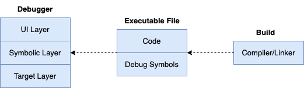

## 符号级调试基础

### 内容回顾

前面我们介绍了指令级调试过程中对tracee的各种控制能力，Attach、跟踪已有线程、自动跟踪新线程、执行到断点、单步执行指令、读写内存、读写寄存器 … 这些其实也是实现符号级调试所必备的控制能力。

前面我们也提到过实现一个符号级调试器至少要做到的3层架构，要实现UI层、符号层、目标层，一起再回顾下吧：

调试器需要包含UI Layer、Symbolic Layer、Target Layer这几层：

- UI层 (UI layer)，主要负责与用户交互，接收用户输入并展示调试信息，如展示变量值、堆栈信息等。分离出UI层便于将用户交互逻辑与核心调试逻辑分离开，便于更改或支持不同的用户界面。
- 符号层 (Symbolic Layer)，主要负责解析和管理符号信息，如变量名、函数名、源码位置与内存地址、数据之间的转换等），它是调试器的核心部分，连接用户操作与目标程序的调试逻辑。分离出符号层，可以更容易地支持不同的编程语言、调试信息格式。
- 目标层 (Target Layer)，目标层直接与被调试程序交互，负责执行调试命令对进程进行控制、数据读写，如设置断点、单步执行、读取内存和寄存器数据等。分离出目标层，可以更方便地支持不同的目标平台，如支持不同的操作系统、硬件架构。

指令级调试器部分的控制能力，这部分实现代码，后面会慢慢沉到目标层（Target Layer），UI层就是我们终端展示、交互部分了，而符号层就是衔接UI层源码相关的数据展示、交互和目标层对进程的精细化控制的部分。

### 面临挑战

符号级调试，依赖于调试信息标准指导下编译器、链接器生成的调试信息。调试信息目前有多种，其中DWARF（（Debugging With Attributed Record Formats）现在被广泛使用。go语言编译工具链也是采用的DWARF，支持go程序调试的gdb、delve也都支持DWARF。我们准备好认识DWARF了吗？恐怕还没有。在详细介绍DWARF对不同编程语言的强大描述能力之前，我需要先假设读者对编译工具链的认识还没有那么充分（事实可能果真如此），我们需要最坏的情况、补充一些必要的知识，以让大部分读者朋友可以在此基础上顺利过渡到DWARF章节，然后我们再一起轻装上阵进入符号级调试器的开发部分。

OK，那我们迅速总结下，实现符号级调试器，除了指令级调试部分我们已掌握的内容，接下来还需要攻克的就是了解清楚go编译器、链接器如何借助DWARF来描述go语言的不同程序构造，这样调试器读取了go程序中的DWARF调试信息后，也可以知道描述的具体是go语言里的什么程序构造。

如果我们从DWARF标准来看，根据描述对象的不同，DWARF调试信息可以细分为下面这些大类：

- 描述数据类型；
- 描述变量；
- 描述函数定义；
- 描述行号表；
- 描述调用栈信息表；
- 描述符号表；
- 描述字符串表；
- 等等。

此外，不同编程语言的工具链会生成上述调试信息，并存储，以Linux下常见的文件格式ELF文件为例，上述调试信息会存储ELF文件的 `.(z)debug_` sections中。但是编译工具链除了生成调试信息，也会考虑语言运行时本身的一些特性支持（添加一些语言独有的sections），还要考虑生成必要的信息来兼容现有二进制的工具（添加一些常见的sections）。

比如go语言编译器、链接器会生成DWARF调试信息（.[z]debug_* sections）供调试器使用，也会生成.symtab供readelf等通用的二进制分析工具使用。另外，它还额外生成.gosymtab、.gopclntab用于go runtime来跟踪调用栈信息，生成.note.go.buildid来保留go buildid信息。

符号级调试的实现，要依赖DWARF，但是能不能完全依赖DWARF也不是100%确定的，这要看编译器、链接器有没有生成足够完备的调试信息，或者调试信息解析效率是否足够高。有些语言的编译工具链没有做到这个程度，或者使用的DWARF版本对数据格式设计解析起来没那么高效，有些调试器就会退而求其次，去读取一些其他的ELF sections来帮助实现调试功能，或者帮助改善调试效率、改善调试体验。

所以说，实现符号级调试器，理论上来说可以借助DWARF来实现，但是工程上要考虑更多现实问题。实现一个高效可用的符号级调试器，需要认识到这个地方是个挑战。

### 本章目标

本章节我准备介绍下Linux下可执行程序常用的ELF文件格式、ELF sections、segments以及编译器、链接器、加载器是如何工作的。我们写的程序，是如何从源码到可执行程序，到被加载到内存地址空间，被操作系统进程调度器调度执行。然后，我们会简单介绍下go语言相关的一些有趣的特性实现，比如协程。这个过程中，我们会介绍编译器、链接器为什么要生成某些sections、segments，以及segments如何被loader加载到进程地址空间，如何完成符号解析、重定位。在本章之后，读者会对编译工具链、ELF文件中的各个部分有个更清晰的认识，会充分认识到这是一个经过了多么精妙设计、协调的生态。

如果我选择跳过这一章，直接介绍DWARF，我总感觉缺失了一些必要知识。一来读者阅读过程中可能会联想到此，然后又去反复搜索确认这方面的知识点，很可能在这里碰壁后失去继续读下去的动力。二来调试器设计实现也确实离不开这部分细节，与其蜻蜓点水只和大家介绍下 `.(z)debug_` sections的作用，还不如系统性地把这个浑水给趟完。三来我们会经常提到一些术语，比如符号，读者在未搞清楚本章内容之前，很可能会晕圈。

> 比如，不管是.symtab中的符号信息，还是.[z]debug\_\*调试符号信息，还是.note\*自定义vendor信息，都使用了“符号”这个术语，明确它们的不同是很重要的：
>
> - .symtab包含了符号的基本信息，如名称、类型、绑定属性、大小和偏移量，主要是用于linker、loader的符号解析；
> - .(z)debug\_\*符号信息包含了符号相关的调试信息，如类型定义、变量、函数参数，是给调试器进行源码级调试使用 (但是有的调试器确实也会利用.symtab来加速符号查询)；
> - .note\*给语言等vendor留作扩展使用的。
>
> 这些不同的sections，其设计目标、要解决的问题是不同的，读者不要混淆。

所以，这一章，最后还是和大家见面了，希望能大家读完能有个更全局的认识。接下来先介绍一些符号级调试必须掌握的基础知识，我们将在第9章进入符号级调试开发。
