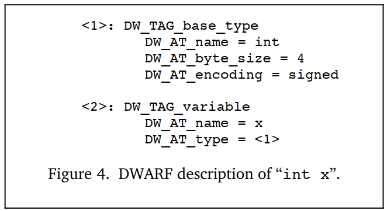
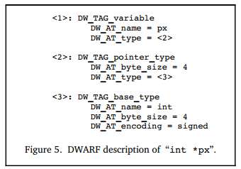
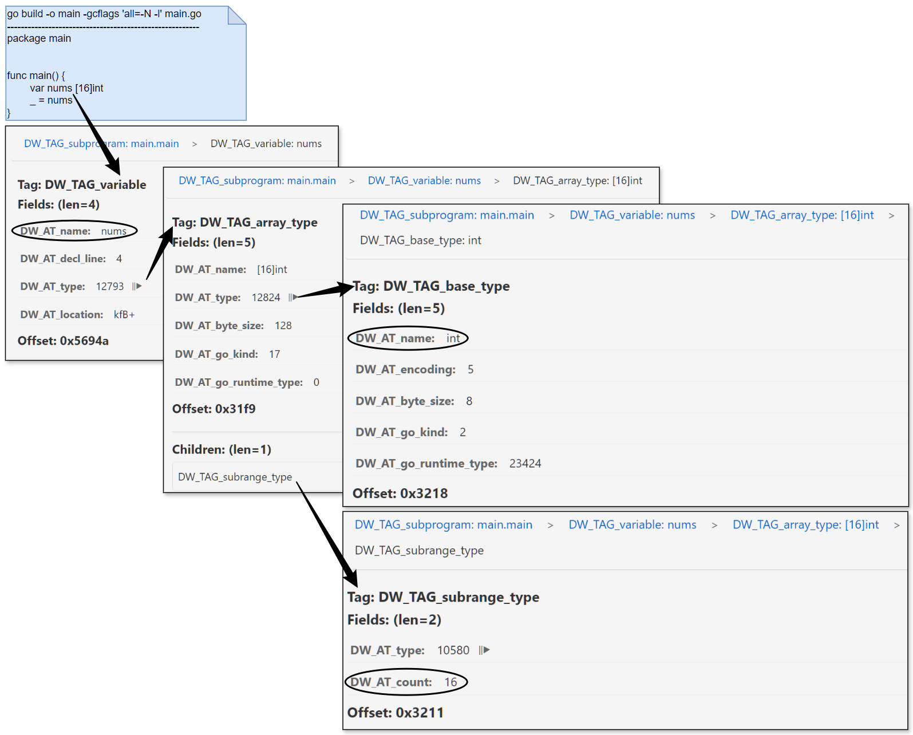
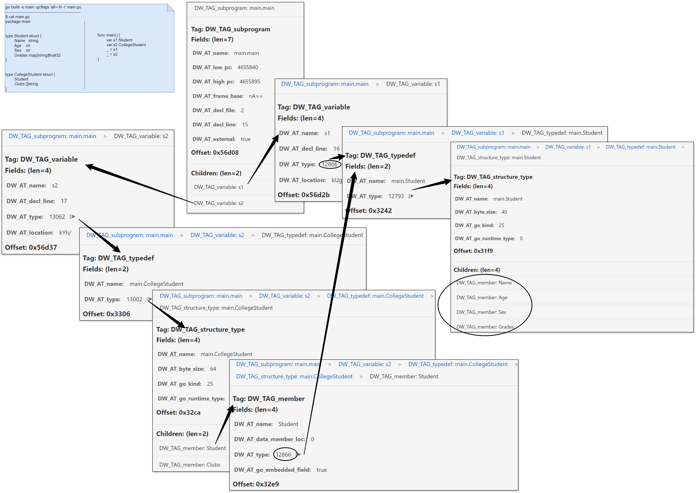
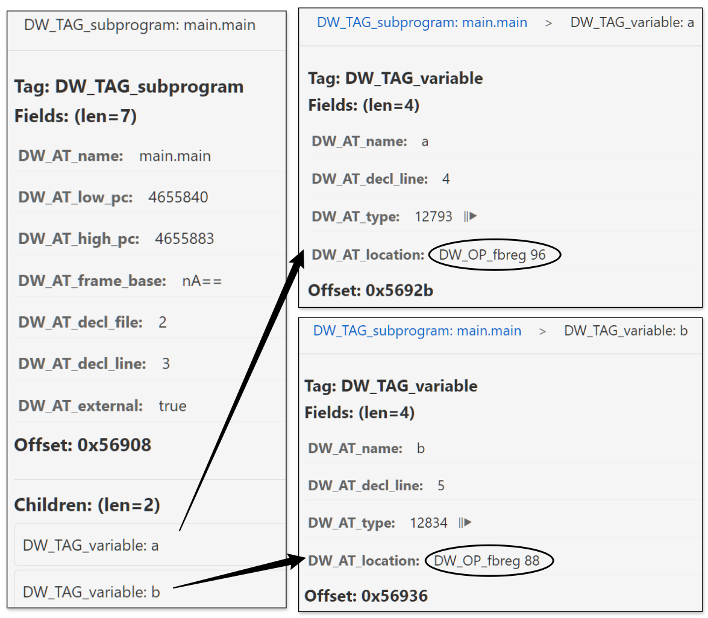
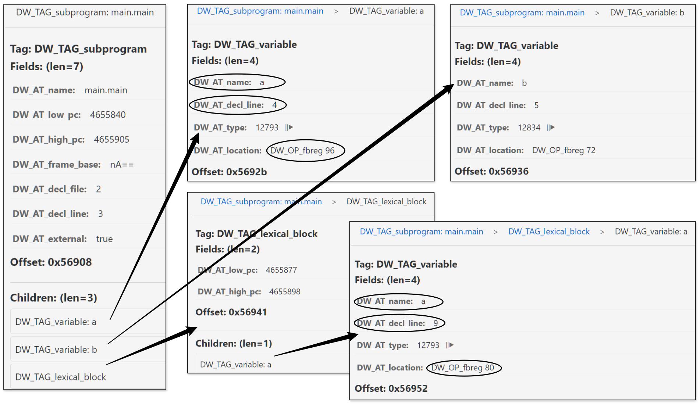

## 描述数据和类型

软件调试期间，我们经常打印变量值、查看变量类型、修改变量值，如dlv的print、whatis、set操作，这些操作的实现就离不开DWARF对数据和数据类型的描述。

不同的编程语言都定义了内置的数据类型，也提供了自定义数据类型的方法。在不同编程语言中，即使是看上去名字一样的基本数据类型，在相同硬件、OS上可能也是不同的，更不用说不同硬件、OS上的情况下了，如int在C和Go中的不同，Go int在32位、64位下的不同。

如果DWARF要对不同编程语言实现精准的低级表示、描述，应该怎么做？DWARF首先根据机器硬件抽象出几种基本类型（数值类型），在此基础上可以通过基本数据类型的组合来构建其他复合数据类型，这些新数据类型也可以进一步用于构建其他自定义的数据类型。

下面我们来看看如何使用DIE来描述数据和数据类型。

### 基本类型

每种编程语言都定义了一些基本数据类型，并内置到语言的类型系统中。例如，C、Go和Java 都定义了 int，Java提供了明确的定义，int在任何平台上都是4字节，但 C、Go 只指定了一些一般特征，允许编译器选择最适合目标平台的实际规格，如Go在32位和64位操作系统上分别是4字节和8字节。有些语言更特殊，如 Pascal 甚至允许定义新的基本类型，例如可以容纳 0 到 100 之间的整数值的整数类型。

```go
// see: src/cmd/compile/internal/types2/sizes.go
var gcArchSizes = map[string]*gcSizes{
    "386":      {4, 4},  // 32-bit
    "amd64":    {8, 8},  // 64-bit
    "amd64p32": {4, 8},  // 32-bit pointers on 64-bit CPU
    // ...
}

type gcSizes struct {
	WordSize int64 // word size in bytes - must be >= 4 (32bits)
	MaxAlign int64 // maximum alignment in bytes - must be >= 1
}
```

简言之，就是不同编程语言、平台存在这样的事实：

- 相同语言在不同硬件平台上，数据类型相同的情况下，其尺寸可能也不同；
- 不同语言在相同的硬件平台上，数据类型相同的情况下，其尺寸也可能不同。

在 DWARF v1及其他调试信息格式中，编译器和调试器应该就 int 究竟多少字节达成一种一致，类似硬编码的方式。但是当同一硬件可以支持不同大小的整数，或者当不同的编译器对同一目标处理器做出不同的实现决策时，这会变得有些尴尬。这些通常没有记录在调试信息中的假设，将使得不同编译器或调试器之间，甚至同一工具的不同版本之间难以实现兼容性。

如何将这些编程语言中的基本类型也能够灵活地映射为不同软硬件平台上的bytesize？C语言还支持位字段，即使存储分配上分配了N字节，但是实际上有可能仅使用一部分bits，这种又如何描述？ DWARF v2解决了此问题，它提供了一种低级映射方案，可以实现“**简单数据类型**”和“**目标软硬件平台上的实现**”之间的灵活映射。

**DW_TAG_base_type**，对应的attributes包括（可以参考DWARFv2-Appendix: Current Attributes by Tag Value)：

| Attributes       | Description                                                                                                           |
| :--------------- | :-------------------------------------------------------------------------------------------------------------------- |
| DW_AT_name       | 类型名称，如 int                                                                                                      |
| DW_AT_encoding   | 指示应该如何编码、解读该数据，如 address、boolean、float、signed、unsigned、signed char、unsigned char、packed、UTF等 |
| DW_AT_byte_size  | 需要占据多少字节                                                                                                      |
| DW_AT_bit_size   | 实际使用多少bits                                                                                                      |
| DW_AT_bit_offset | 实际使用的bitsize个bits在bytesize个字节中的起始偏移量                                                                 |
| DW_AT_sibling    | 指向兄弟DIE，DWARF信息生成时，如果认为有必要快速跳过children而扫描Siblings更重要时，会生成该属性                      |

属性 `DW_AT_encoding` 是不同基本数据类型差异的体现，它指示了不同基本数据类型，应该如何编码、如何解读。下面是几个示例，帮助大家加深理解，对应的语言编译工具链生成DWARF信息的时候参考这个生成即可，调试器读取的时候参考这个读取、解读数据即可。

Figure 2a 定义类型 int 在32位处理器上是4字节有符号数, 图 2b 定义类型 int 在16位处理器上是2字节有符号数。


图 3 定义类型word是16位有符号数值，但该类型实际占用4字节，但只有高位2个字节被使用，低位2个字节全部为0。


注意，上图示例取自DWARF v2的官方示例，在DWARF v4中已经废弃了DW_AT_bit_offset，而是用DW_AT_data_bit_offset代替。在DWARF v2、v3中该属性DW_AT_bit_offset用来表示big endian机器上的位字段，对little endian机器无用有点浪费。

### 复合类型

如Figure 4所示，先来看一个描述有名变量的例子。首先有一个 DW_TAG_variable类型的DIE描述这个变量 x，这个DIE的属性 `DW_AT_name=x` 表示变量名为x，`DW_AT_type=<1>` 则表示该属性是一个类型引用，变量类型由 `<1>`指向的DIE确定。而 `<1>` 这个DIE表示是一个大小为4字节的有符号整数。最终我们可以得知，这里定义了一个类型为4字节有符号整数的变量x。



接下来我们再继续看，通过组合这些基本数据类型，我们可以构造更复杂的复合数据类型。Figure 5中，定义了一个变量px，其类型通过 `DW_AT_type=<2>` 引用另一个编号为 `<2>`的DIE。

编号为 `<2>` 这个DIE的TAG为 `DW_TAG_pointer_type`，说明它是一个指针类型，该DIE内部又通过 `Attribute DW_AT_type=<3>`引用另一个描述数据类型的编号为 `<3>`的DIE，`<3>`这个DIE的TAG为 `DW_TAG_base_type`，表示它是一个基本数据类型，具体为4字节有符号整数。基本数据类型不依赖任何其他类型，分析结束。

这样，一连串分析下来，最终我们可以确定变量px是一个4字节位宽的指针，这个指针指向1个4字节的有符号整数int。



其他数据类型也可以通过链接多个DIE（DW_TAG…+DW_AT_type…）来定义一个新的数据类型，例如可以在DW_TAG_pointer_type基础上扩展来支持描述C++的引用类型，或者在基本类型基础上扩展来支持描述Go uintptr的，进而Unsafe.Pointer。

> ps：**关于引用属性的取值的一点补充？**
>
> 这里为了好理解，引用DIE时使用了一个自然编号，真实DWARF数据存储中，这里不是编号，而是一个偏移量（被引用数据类型的DIE的位置距离包含它的编译单元开头的偏移量）。

### 数组类型

**DW_TAG_array_type，结合一些相关attributes共同来描述数组。**

数组对应的DIE，该DIE包含了这样的一些属性来描述数组元素：

- **DW_AT_ordering**：描述数组是按照“**行主序**”还是按照“**列主序**”存储，如Fortran是按照列主序存储，C和C++是按照行主序存储。如果未指定该属性值，则使用DW_AT_language指定编程语言的默认数组排列规则；
- **DW_AT_type**：描述数组中各个元素的类型信息；
- **DW_AT_byte_stride/DW_AT_bit_stride**：如果数组中每个元素的实际大小和分配的空间大小不同的话，可以通过这两个属性来说明；
- **数组的索引值范围**，DIE中也需要通过指定最小、最大索引值来给出一个有效的索引值区间。这样DWARF就可以既能够描述C风格的数组（用0作为数组起始索引），也能够描述Pascal和Ada的数组（其数组最小索引值、最大索引值是可以变化的）。

  数组维度一般是通过换一个TAG为**DW_TAG_subrange_type**或者**DW_TAG_enumeration_type**的DIE来描述。
- 其他；

通过上述这些属性以及描述数组维度相关的DIE，来共同明确描述一个数组。

举个例子，我们创建一个数组，然后编译构建 `go build -o main -gcflags 'all=-N -l' main.go`, 然后使用作者提供的工具dwarfviewer来可视化文件中DIE之间的依赖关系。

```go
$ cat main.go
package main

func main() {
        var nums [16]int
        _ = nums
}
```

运行 `dwarfviewer -file main -webui`，然后搜索main.main并一级一级展开nums相关的DIE定义，作者已经将array相关的重要信息在截图中进行了标注，结合上述文字描述应该不难理解。



### Struct, Classe, Union, and Interface

大多数编程语言都允许通过组合多种不同的数据类型来定义一个新的数据类型，DWARF中也需要支持对这种能力的描述，因此DWARF中定义了下面的TAG类型：

- **DW_TAG_structure_type**，描述结构体struct；
- **DW_TAG_class_type**，描述类class；
- **DW_TAG_union_type**，描述联合union；
- **DW_TAG_interface_type**，描述interface；

struct允许组合多个不同类型的成员。C语言中联合union也允许这样做，但是不同的成员共享相同的存储空间。C++ struct相比C语言又增加了一些特性，允许添加一些成员函数。C++中class和Java中interface、class有相似之处，但也有不同。另外，不同语言一般都有相似的组合数据类型，只是取的名字可能不同，比如C++中叫class和class members（类和类成员），在Pascal中叫Record和Fields（记录和字段）。DWARF抽象这些描述时也要选个合适的名字，DWARF中采用了C++中的术语。描述class的DIE是描述该class members的诸多DIE的父DIE，每个class都有一个名字和可能的属性（成员）。如果class实例的大小在编译时可以确定，描述class的DIE就会多一个属性DW_AT_byte_size。class及class member的描述与基本数据类型描述的方式并没有太大的不同，可能会增加一些其他的描述信息，如class member的访问修饰符。C\C++中也支持结构体位字段，即struct中多个成员可以共享同一个字节，只是不同的成员可以使用位数不同的相邻的比特。需要通过多个属性来描述，DW_AT_byte_size描述结构体实际占用多少个字节，属性DW_AT_bit_offset和DW_AT_bit_size描述位字段实际占用哪些比特，从第几个bit开始存储，一共占用多少个比特。

由于这几种类型所描述程序构造的差异，DWARf要为其定义对应的一些attributes才能精确地描述不同语言中的这些共性、差异性。由于篇幅原因，就不一一列举和对比了。感兴趣的话，您可以参考DWARF v4的 $5.5章节来详细了解。

这里我们来看一个go中进行类型定义的示例，这里定义了一个结构体类型Student，并且通过匿名嵌套定义了一个CollegeStudent，然后main函数中创建二者的变量。

```go
$ cat main.go
package main

type Student struct {
        Name   string
        Age    int
        Sex    int
        Grades map[string]float32
}

type CollegeStudent struct {
        Student
        Clubs []string
}

func main() {
        var s1 Student
        var s2 CollegeStudent
        _ = s1
        _ = s2
}
```

注意编译构建的时候仍然关掉内联和其他优化，我们来可视化看下生成的DIE信息，作者已经在途中通过图例进行了标注，结合前面的介绍，也是很容易理解的：



### 变量定义

**DW_TAG_variable，用来描述变量**，前面给出的示例中已经多次进行了提及。变量通常非常简单，变量有变量名（DW_AT_name），程序中使用变量名来代指变量在内存或者寄存器中的值。变量的类型描述了值的类型以及访问修饰（如只读const）。另外需要注意的是，DWARF中将variables分成3类：constants（常量）、formal parameters（函数形参）、variables（变量）。这里我们先只关注variables就可以，后续有的是机会遇到constants、formal parameters，那时候再介绍不迟。

对变量进行区分的两个要素是变量的**存储位置**和**作用域：**

- **变量的存储位置**：一个变量可以被存储在全局数据区（.data section）、栈、堆或者寄存器中；
- **变量的作用域**：描述了它在程序中什么时候是可见的，某种程度上，变量作用域是由其声明时的位置确定的。DWARF中通过三元组（文件名，行号，列号）对变量声明位置进行描述；

在我们进行调试时，我们既然能拿到变量在内存中的位置信息，那我们就可以通过PTRACE_PEEKDATA操作读取到对应的数据，要读取多少数据，以及如何解释这些数据，就需要再参考这里变量引用的类型信息。有了数据，有了类型，有反射变成经验的同学，自然就会觉得轻车熟路了，还有啥玩不转的？对吧。

前面给出的demo截图中，眼睛敏锐的读者应该发现问题了，变量地址值显示的更像是乱码？没错，DW_AT_location属性的值是一个byte数组，在dwarfviewer server端回包时会将其先进行base64编码，返回给前端后就直接展示出来了，所以地址值显示为了一个诡异的字符串。那么直接显示这个byte数组可以吗？不行的。这就是接下来要介绍的内容，该byte数组中存储的并不是一个地址值，而是一个位置表达式，是一串地址的计算规则。我们要执行这里的计算规则，才能得到有效地址。我们对dwarfviewer逻辑进行了调整，使得它可以将上述byte数组，转换成可读的位置表达式。

变量位置demo：下面示例及截图中正常展示了变量的位置信息，在我们的例子中，变量的位置表达式是基于fbreg的寻址规则，这里先不展开，介绍完位置表达式内容之后大家自然会明白。

```go
package main

func main() {
        var a string = "helloworld"
        var b int = 100
        _ = a
        _ = b
}
```



变量作用域demo：我们还需要展示一个情况，就是在不同作用域中定义变量的问题，微调下示例代码，再执行下测试。

```go
package main

func main() {
        var a string = "helloworld"
        var b int = 100
        _ = a
        _ = b
        {
                var a string = "helloworld2"
                _ = a
        }
}
```

然后我们再来可视化生成的DIE信息，看下有什么不同，我们注意到作用域的表示是通过 `DW_TAG_lexical_block` 来实现的：



### 位置数据

DWARF提供了一种非常通用的机制描述如何确定变量在内存中的实际位置，就是通过属性**DW_AT_location**，该属性允许指定一个操作序列，来告知调试器如何确定变量的地址。

下面是一个示例，展示如何使用属性DW_AT_location来定位变量的地址，注意变量可以定义在寄存器中、内存中（堆中、栈中、全局存储区），对应的寻址规则也有差异。


Figure 7这个示例中：

- 变量b定义在寄存器中， `DW_AT_location = (DW_OP_reg0)`，直接存储在reg0对应的寄存器中；
- 变量c存储在栈上，`DW_AT_location = (DW_OP_fbreg: -12)`，EA=fbreg-12；
- 变量a存储在固定地址（.data section中），`DW_AT_location = (DW_OP_addr: 0)`，存储在.data端开头；

调试信息必须为调试器提供一种方法，使其能够查找程序变量的位置、确定动态数组和字符串的范围，以及能找到函数栈帧的基地址或函数返回地址的方法。 此外，为了满足最新的计算机体系结构和优化技术的需求，调试信息必须能够描述对象的位置，还需要注意的是，该对象的位置可能会在对象的生命周期内发生变化（如Java GC时会在内存中迁移对象，而Go是非移动式GC）。

通过location来描述程序中某个对象的位置信息，位置描述可以分为两类：

- **位置表达式（Location expressions）**，是与语言无关的寻址规则表示形式，它是由一些基本构建块、操作序列组合而成的任意复杂度的寻址规则。 只要对象的生命周期是静态的（static）或与拥有它的词法块相同，并且在整个生命周期内都不会移动，它们就足以描述任何对象的位置。
- **位置列表（Location lists）**，用于描述生命周期有限的对象或在整个生命周期内可能会更改位置的对象。

#### 位置表达式

位置表达式由0或者多个位置操作组成。位置操作可以划分为两种类型，寄存器名 和 地址操作，下面分别介绍。如果没有位置运算表达式，则表示该对象在源代码中存在，但在目标代码中不存在，如构建期间被编译器给优化掉了。

##### 寄存器名

寄存器名，始终是单独出现的，并指示所引用的对象包含在特定寄存器中。请注意，寄存器号是DWARF中特定的数字到给定体系结构的实际寄存器的映射。`DW_OP_reg${n} (0<=n<=31)` 操作编码了32个寄存器, 该对象地址在寄存器n中. `DW_OP_regx` 操作有一个无符号LEB128编码的操作数，该操作数代表寄存器号。

##### 地址操作

地址操作是存储器地址计算规则。 所有位置操作都被编码为操作码流，每个操作码后跟零个或多个操作数。 操作数的数量由操作码决定。

每个寻址操作都表示**栈架构机器上的后缀操作**。

- 栈上每个元素，是一个目标机器上的地址的值；
- 执行位置表达式之后，栈顶元素的值就是计算结果（对象的地址，或者数组长度，或者字符串长度）。

对于结构体成员地址的计算，在执行位置表达式之前，需要先将包含该成员的结构体的起始地址push到栈上。

**位置表达式中的地址计算方式，主要包括如下几种：**

1. **寄存器寻址**

   寄存器寻址方式， 计算目标寄存器中的值与指定偏移量的和，结果push到栈上：

   - DW_OP_fbreg \$offset, 计算栈基址寄存器 (rbp)中的值 与 偏移量 $offset的和；
   - DW_OP_breg\${n} \${offset}, 计算编号n的寄存器中的值 与 偏移量$offset（LEB128编码）的和；
   - DW_OP_bregx \${n} \${offset}, 计算编号n（LEB128编码）的寄存器中的值 与 偏移量 $offset（LEB128编码）的和；
2. **栈操作**

   以下操作执行后都会push一个值到addressing stack上：

   - DW_OP_lit\${n} (0<=n<=31), 编码一个无符号字面量值\${n}；
   - DW_OP_addr, 编码一个与目标机器匹配的机器地址；
   - DW_OP_const1u/1s/2u/2s/4u/4s/8u/8s, 编码一个1/2/4/8 字节 无符号 or 有符号整数；
   - DW_OP_constu/s, 编码一个 LEB128 无符号 or 有符号整数.

   以下操作会操作location stack，栈顶索引值为0：

   - DW_OP_dup, duplicates the top stack entry and pushes.
   - DW_OP_drop, pops the value at the top of stack.
   - DW_OP_pick, picks the stack entry specified by 1-byte ${index} and pushes.
   - DW_OP_over, duplicate the stack entry with index 2 and pushes.
   - DW_OP_swap, swap two stack entries, which are specified by two operands.
   - DW_OP_rot, rotate the top 3 stack entries.
   - DW_OP_deref, pops the value at the top of stack as address and retrieves data from that address, then pushes the data whose size is the size of address on target machine.
   - DW_OP_deref_size, similar to DW_OP_deref, plus when retrieveing data from address, bytes that’ll be read is specified by 1-byte operand, the read data will be zero-extended to match the size of address on target machine.
   - DW_OP_xderef & DW_OP_xderef_size, similar to DW_OP_deref, plus extended dereference mechanism. When dereferencing, the top stack entry is popped as address, the second top stack entry is popped as an address space identifier. Do some calculation to get the address and retrieve data from it, then push the data to the stack.
3. **算术和逻辑运算**

   DW_OP_abs, DW_OP_and, DW_OP_div, DW_OP_minus, DW_OP_mod, DW_OP_mul, DW_OP_neg, DW_OP_not, DW_OP_or, DW_OP_plus, DW_OP_plus_uconst, DW_OP_shl, DW_OP_shr, DW_OP_shra, DW_OP_xor, 这些操作工作方式类似，都是从栈里面pop操作数然后计算，并将结果push到栈上。
4. **控制流操作**

   以下操作提供对位置表达式流程的简单控制：

   - 关系运算符，这六个运算符分别弹出顶部的两个堆栈元素，并将顶部的第一个与第二个条目进行比较，如果结果为true，则push值1；如果结果为false，则push值0；
   - DW_OP_skip，无条件分支，其操作数是一个2字节常量，表示要从当前位置表达式跳过的位置表达式的字节数，从2字节常量之后开始；
   - DW_OP_bra，条件分支，此操作从栈上pop一个元素，如果弹出的值不为零，则跳过一些字节以跳转到位置表达式。 要跳过的字节数由其操作数指定，该操作数是一个2字节的常量，表示从当前定位表达式开始要跳过的位置表达式的字节数（从2字节常量开始）；
5. **特殊操作**

   DWARF v2中有两种特殊的操作（DWARF v4中是否有新增，暂时先不关注）：

   - DW_OP_piece, 许多编译器将单个变量存储在一组寄存器中，或者部分存储在寄存器中，部分存储在内存中。 DW_OP_piece提供了一种描述特定地址位置所指向变量的哪一部分、该部分有多大的方式；
   - DW_OP_nop, 它是一个占位符，它对位置堆栈或其任何值都没有影响；

##### 操作示例

上面提到的寻址操作都是些常规描述，下面是一些示例。

- 栈操作示例


- 位置表达式示例

  以下是一些有关如何使用位置运算来形成位置表达式的示例。

  

#### 位置列表

如果一个对象的位置在其生命周期内可能会发生改变，就可以使用位置列表代替位置表达式来描述其位置。位置列表包含在单独的目标文件部分 **.debug_loc** 中。

一个对象的位置列表的位置，是由.debug_loc中该对象位置列表的起始字节相对于.debug_loc起始位置的偏移量来指示的。

位置列表中的每一项包括:

- 起始地址，相对于引用此位置列表的编译单元的基址，它标记该位置有效的地址范围的起始位置；
- 结束地址，它还是相对于引用此位置列表的编译单元的基址而言的，它标记了该位置有效的地址范围的结尾；
- 一个位置表达式，它描述对象在起始地址和结束地址指定的范围内的位置；

位置列表以一个特殊的list entry标识列表的结束，该list entry中的起始地址、结束地址都是0，并且没有位置描述。

> DWARF v5会将.debug_loc和.debug_ranges替换为.debug_loclists和.debug_rnglists，从而实现更紧凑的数据表示，并消除重定位。

### 了解更多

- Debugging Using DWARF (2012), https://www.scribd.com/document/403070136/Debugging-Using-DWARF-2012
- Types of Declarations, 请参考 DWARF v2 章节3.2.2.1 和 章节3.2.2.2；
- Accessibility of Declarations, 有些语言提供了对对象或者其他实体的访问控制，可以通过指定属性 DW_AT_accessibility 来实现, 可取值 DW_ACCESS_public, DW_ACCESS_private, DW_ACCESS_protected；
- Visualbility of Declarations, 指定声明的可见性，声明是否在其它模块中可见，还是只在当前声明模块中可见，可以通过指定属性 attribute DW_AT_visualbility 来实现, 可取值 DW_VIS_local, DW_VIS_exported, DW_VIS_qualified；
- Virtuality of Declarations, C++提供了虚函数、纯虚函数支持，可以通过指定属性 DW_AT_virtuality 来实现, 可取值 DW_VIRTUALITY_none, DW_VIRTUALITY_virtual, DW_VIRTUALITY_pure_virtual；
- Artificial Entries, 编译器可能希望为那些不是在程序源码中声明的对象或类型添加调试信息条目，举个例子，C++中类成员函数（非静态成员），每个形式参数都有一个形参描述条目，此外还需要多加一个描述隐式传递的this指针；
- Declaration coordinates, 每个描述对象、模块、函数或者类型的DIE（调试信息条目）都会有下面几个属性 DW_AT_decl_file、DW_AT_decl_line、DW_AT_decl_column，这几个属性描述了声明在源文件中出现的位置；
