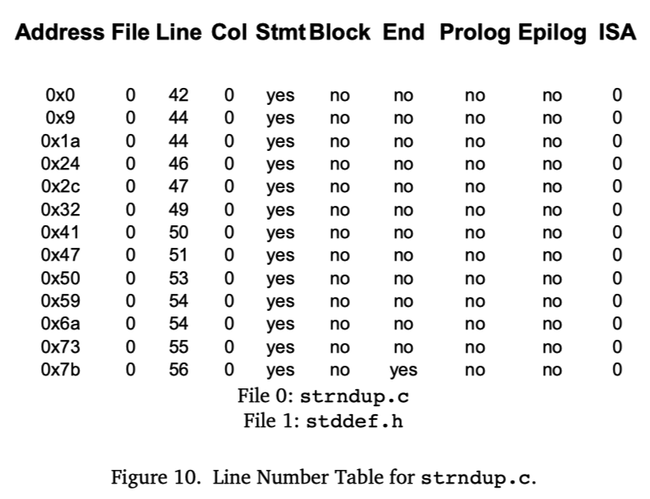
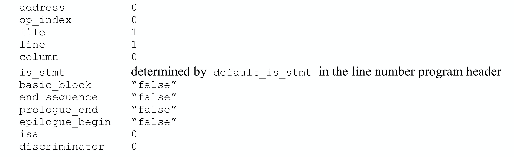
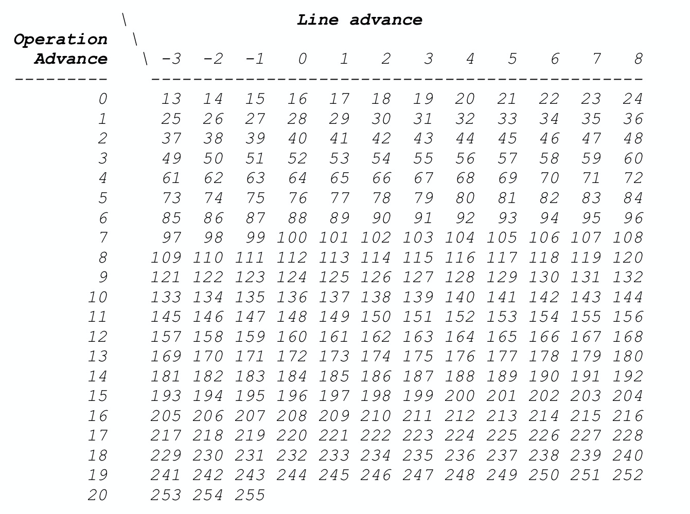
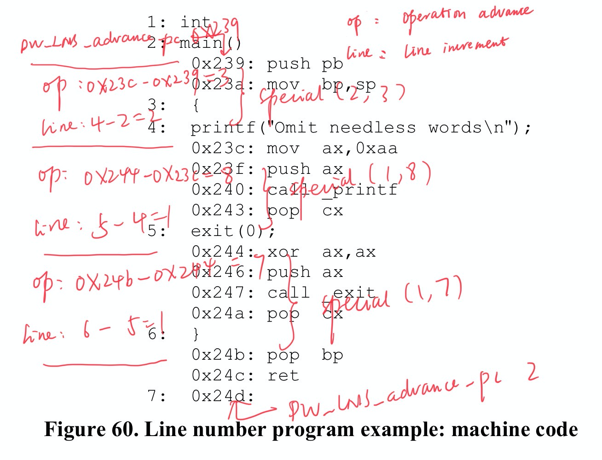

## 行号表（Line Number Table）

### 功能介绍

符号级调试器需要建立源代码位置与机器指令地址之间的映射关系，有了这种映射关系，调试器就可以实现如下操作:

- 将源代码位置(文件名:行号)转换为对应的机器指令地址，从而在该地址处精确地设置断点，或者从该地址处开始反汇编等等；
- 将当前执行的机器指令地址（PC）反向转换为源代码位置，这样调试时不管是逐指令还是逐语句执行都可以显示出当前源码位置；
- 不仅可以实现机器指令级别的逐指令执行，还可以支持源代码级别的逐语句执行，因为很容易就可以确定下一行语句的指令地址；

**行号表，记录了可执行程序机器指令地址和源文件中位置之间的映射关系**，为源码级调试提供了大的便利。每个编译单元都有对应的行号表，存储在目标文件的 **.[z]debug_line** section中。.debug_info section中编译单元对应的DIE会引用这里的.debug_line数据(参见DWARF v4规范3.1.1节)。

### 存储结构

**行号表的结构可以形象地理解为一个矩阵**，其中每一行包含了以下关键信息：



- 指令地址，对应机器指令在内存中的位置
- 源文件名，指令对应的源代码文件
- 源文件行号，指令对应的源文件中的行号
- 源文件列号，指令对应的源文件中的列号
- 语句标识，标记当前指令是否为源码语句的起始指令
- 词法块标识，标记当前指令是否为词法块的起始指令
- 其他辅助信息

这种矩阵结构建立了机器指令与源代码之间的双向映射关系。当调试器需要在某行源码处设置断点时，可以通过查询行号表找到对应的第一条指令地址;当程序执行出现异常时，也可以根据当前的指令地址反查对应的源码位置，帮助开发者快速定位问题。这种双向映射机制为源码级调试提供了重要支撑。

### 数据压缩

**程序中的指令数量通常非常庞大，如果在行号表中为每条指令都单独分配一行来存储映射关系，将会导致行号表的体积急剧膨胀。**

为了有效压缩行号表的大小，DWARF采用了以下几种关键优化策略：

- 对于每条源码语句对应的多条机器指令，**只记录第一条指令的映射关系**，因为这已足够确定源码位置；
- 将行号表数据转换为更紧凑的**字节码指令序列**形式。这种方式可以：
  - 省略相邻指令间相同的列值，避免冗余存储
  - 对行号、列号等使用增量编码，即只存储与前一条记录的差值，这样通常只需要更少的位数
  - 采用特殊的编码方案来处理常见模式

通过这些精心设计的压缩策略，行号表的存储效率得到了显著提升。DWARF最终将压缩后的行号表编码为一系列字节码指令，形成"**行号表程序**"。

调试器在使用时，会通过一个专门设计的**有穷状态机**来解释执行这些字节码指令。随着指令的逐条执行，完整的行号表就被逐步还原出来。这种设计既保证了数据的紧凑存储，又确保了运行时的高效访问。

### 详细设计

#### 常用术语

在介绍行号表之前，我们先来了解几个重要的术语：

- 状态机（State Machine）：一个虚拟的执行器，用于解释执行字节码指令序列。行号表被编码为字节码指令，状态机通过执行这些指令来重建完整的行号表矩阵。
- 行号程序（Line Number Program）：由一系列字节码指令组成的序列，这些指令编码了编译单元的行号表信息。状态机通过执行这些指令来还原行号表的内容。
- 基本块（Basic Block）：一段连续的指令序列，具有以下特点：

  - 只有第一条指令可以作为跳转目标
  - 只有最后一条指令可以进行控制转移
  - 过程调用会导致基本块的结束
    基本块是从控制流角度定义的概念，强调指令执行的连续性和跳转特性。基本块不一定对应着特定的源代码结构。
- 序列（Sequence）：一段连续的目标机器指令集合。需要注意的是，一个编译单元可能会生成多个不连续的指令序列，因此不能假设编译单元中的所有指令都是连续存储的。序列是从内存布局角度定义的概念，强调指令在内存中的存储位置。

一个基本块必定是一个连续的指令序列，但一个连续的指令序列不一定构成一个基本块（不一定满足基本块的条件）。基本块更强调控制流的特性，而序列更关注指令的物理存储特性。

> ps: 不需要刻意去理解、区分???

#### 状态机寄存器

行号表信息状态机包含以下寄存器：

- address: 程序计数器(PC)值,存储编译器生成的机器指令地址
- op_index: 无符号整数,表示操作的索引值。address和op_index组合构成操作指针,可引用指令序列中的任意操作
- file、line、column: 源代码位置的三元组,包含文件名、行号和列号
- is_stmt: 布尔值,标识当前指令是否为建议的断点位置(如语句的第一条指令)
- basic_block: 布尔值,标识当前指令是否为词法块的起始位置
- end_sequence: 布尔值,标识当前地址是否为指令序列结束后的第一个字节。当end_sequence为true时,同一行的其他信息无意义
- prologue_end: 布尔值,标识函数序言中应该暂停执行的位置，当前位置是否适合设置函数入口断点
- epilogue_begin: 布尔值,标识函数结尾中应该暂停执行的位置，当前位置是否适合设置函数退出前断点
- isa: 无符号整数,标识当前指令所属的指令集架构
- discriminator: 无符号整数,由编译器分配,用于区分同一源码位置的多个代码块。若源码位置只对应单个块,则值为0

行号表程序开始执行时,状态机寄存器的初始状态如下:



#### 字节码指令

行号程序中的字节码指令分为以下三类：

1. 特殊操作码（Special Opcodes）

   - 由单个ubyte（无符号字节）表示操作码
   - 不包含任何操作数
   - 构成了行号表程序中的绝大多数指令
   - 设计紧凑，执行效率高
2. 标准操作码（Standard Opcodes）

   - 以一个ubyte表示基本操作码
   - 后面可跟随0个或多个LEB128编码的操作数
   - 操作码本身决定了操作数的数量和含义
   - 行号表程序头部会显式指明每个标准操作码的操作数数量，便于解析
3. 扩展操作码（Extended Opcodes）

   - 采用多字节操作码设计
   - 第一个字节固定为0，用于标识扩展操作码
   - 随后是LEB128编码的长度值，表示指令的总字节数（不含标识字节）
   - 最后是指令数据，其中首字节为ubyte类型的扩展操作码
   - 支持更复杂的指令编码，具有良好的扩展性

#### 行号程序头

行号信息的最佳编码方式在一定程度上取决于目标机器的体系结构。行号程序头包含了调试器解码和执行行号程序指令时所需的关键信息。

每个编译单元的行号程序都以一个header开头，其包含以下字段：

- unit_length（initial length）：该编译单元的行号信息总字节数（不包含当前字段本身）
- version（uhalf）：版本号，这是行号信息特有的版本号，与DWARF版本号相互独立
- header_length：从该字段结束到行号程序第一个字节的偏移量。在32位DWARF中为4字节无符号整数，在64位DWARF中为8字节无符号整数
- minimum_instruction_length（ubyte）：目标机器指令的最小字节长度。在修改address和op_index寄存器时，与maximum_operations_per_instruction一起参与计算
- maximum_operations_per_instruction（ubyte）：单条指令可编码的最大操作数。在修改address和op_index寄存器时，与minimum_instruction_length一起参与计算
- default_is_stmt（ubyte）：状态机寄存器is_stmt的初始值。对于源码语句对应的多条机器指令，至少要有一条指令的is_stmt为true，作为推荐的断点位置
- line_base（sbyte）：用于特殊操作码的计算，详见下文
- line_range（sbyte）：用于特殊操作码的计算，详见下文
- opcode_base（ubyte）：第一个特殊操作码的值，通常比最大标准操作码值大1。如果该值小于最大标准操作码值，则大于opcode_base的标准操作码在当前编译单元中将被视为特殊操作码；如果该值大于最大标准操作码值，则中间的空隙可用于第三方扩展
- standard_opcode_lengths（ubyte数组）：每个标准操作码对应的LEB128编码操作数的数量
- include_directories（路径名序列）：编译单元包含的其他文件的搜索路径列表
- file_names（文件条目序列）：与当前行号表相关的所有源文件名，包括主源文件和被包含文件

#### 行号表程序

行号程序的主要目标是构建一个矩阵，用于表示编译单元中生成的目标机器指令序列。在每个指令序列中，地址（操作指针）通常只会递增（但由于流水线调度或其他优化，行号可能会减少）。

行号程序由三类操作码组成：特殊操作码、标准操作码和扩展操作码。这里我们重点介绍特殊操作码的工作原理。如果您想了解标准操作码或扩展操作码的详细信息，请参考DWARF v4标准的6.2.5.2和6.2.5.3章节。

每个特殊操作码（以单个ubyte表示）执行时，会对状态机产生以下七个影响：

1. 给行寄存器(line)增加一个有符号数值
2. 通过增加address和op_index寄存器的值来更新操作指针
3. 根据当前状态机寄存器的值在矩阵中添加新的一行
4. 将basic_block寄存器置为"false"
5. 将prologue_end寄存器置为"false"
6. 将epilogue_begin寄存器置为"false"
7. 将discriminator寄存器置为0

所有特殊操作码都执行这七个相同的操作，它们的区别仅在于对line、address和op_index寄存器的增量值不同。

特殊操作码的值是根据需要添加到line、address和op_index寄存器的具体数值来选择的。行号增量的最大值由行号程序头中的line_base和line_range字段决定，计算公式为：line_base + line_range - 1。如果所需的行号增量超过了这个最大值，就必须改用标准操作码。operation advance表示操作指针前进时要跳过的操作数数量。

**计算特殊操作码公式如下**：

```
opcode = (desired line increment - line_base) + (line_range * operation advance) + opcode_base
```

如果结果操作码大于255，则必须改用标准操作码。

当*maximum_operations_per_instruction*为1时，*operation advance*就是地址增量除以*minimum_instruction_length*。

**要解码特殊操作码公式如下**，要从操作码本身中减去opcode_base以提供调整后的操作码。*operation advance*是调整后的操作码除以*line_range*的结果。new address和 new op_index值由下式给出：

```
adjusted opcode = opcode – opcode_base 
operation advance = adjusted opcode / line_range

new address = address + 
			minimum_instruction_length *
			((op_index + operation advance)/maximum_operations_per_instruction) 

new op_index = (op_index + operation advance) % maximum_operations_per_instruction
```

当*maximum_operations_per_instruction*字段为1时，*op_index*始终为0，这些计算将简化为DWARF版本v3中为地址提供的计算。 line increment的数值是line_base加上以调整后操作码除以line_range的模的和。 就是：

```
line increment = line_base + (adjusted opcode % line_range)
```

例如，当**假设opcode_base为13，line_base为-3，line_range为12，minimum_instruction_length为1，maximum_operations_per_instruction为1** ，下表中列出了当前假设下，当源码行相差[-3,8]范围内时、指令地址相差[0,20]时计算得到的特殊操作码值。



### 示例演示

#### 生成行号程序

Figure 60中给出了简单的源文件和Intel 8086处理器的最终机器代码，在此基础上让我们来模拟行号表生成过程。


现在，让我们逐步构建"行号表程序"。 实际上，我们需要先将源代码编译为汇编代码，然后计算每个连续语句的指令地址和行号的增量，根据 "指令地址增量(operation advance)" 以及 "行号增量(line increment)" 来计算操作码，这些操作码构成一个sequence，属于行号程序的一个部分。

例如, `2: main()` and `4: printf`, 这两条语句各自第一条指令的地址的增量为 `0x23c-0x239=3`, 两条源语句的行号增量为 `4-2=2`. 然后我们可以通过函数 `Special(lineIncr,operationAdvance)` 来计算对应的特殊操作码，即 `Special(2, 3)`。



回想一下上面提及的特殊操作码的计算公式：

```
opcode = (desired line increment - line_base) + (line_range * operation advance) + opcode_base
```

假设行号程序头包括以下内容（以下不需要的头字段未显示）：


然后代入上述计算公式，Special(2, 3)的计算如下:

```
opcode = (2 - 1) + (15 * 3) + 10 = 56 = 0x38
```

这样就计算得到了构建行号表从 `2: main()`到 `4: printf`对应的行所需要的特殊操作码0x38。然后逐一处理所有相邻的源语句：

1. 第2行才生成指令，所以需要一个 `DW_LNS_advance_pc 0x239`，对应bytes为0x2,0xb9,0x04；
2. 源码第0行~第2行，源码增加2行，PC增加0，使用 `SPECIAL(2,0) = (2-1) + (15*0) + 10 = 11 = 0xb`，对应bytes为0xb；
3. 源码第2行~第4行，源码增加2行，PC增加0x23c-0x239=3，使用 `SPECIAL(2,3) = (2-1) + (15*3) + 10 = 0x38`，对应bytes为0x38；
4. 源码第4行~第5行，源码增加1行，PC增肌0x244-0x23c=8，使用 `SPECIAL(1,8) = (1-1) + (15*8) + 10 = 0x82`，对应bytes为0x82;
5. 源码第5行~第6行，源码增加1行，PC增加0x24b-0x244=7，使用 `SPECIAL(1,7) = (1-1) + (15*7) + 10 = 0x73`，对应bytes为0x73;
6. 已经没有源码行了，最后结束指令地址是0x24d，比之前源码第6行处指令地址0x244多了2，使用 `DW_LNS_advance_pc 0x2`，对应bytes为0x2,0x2；
7. 此时已经到了指令的结束，使用 `DW_LNE_end_sequence` 结束，对应bytes为0x0,0x1,0x1；

最终，我们就得到了如下行号表程序，最终这个ByteStream，会被写入.debug_line section:


#### 执行行号程序

构建完整的行号表，我们需要先从目标程序中读取DWARF数据，然后再读取出行号表程序，就可以用准备好的行号表状态机来执行：

- 读取到行号表程序的header，获取某些设置字段值；
- 遍历行号表程序中的字节码指令，逐一执行
  - 解码出opcode、address、pc advance、line advance、op_index
  - 对行号表进行更新或者追加
- 最终构建出我们期望中的行号表矩阵

假如使用Go开发调试器的话，Go标准库在读取ELF文件中的DWARF数据时，已经自动完成了每个编译单元中的行号表数据的解析，dwarf.LineReader中读取出来的LineEntries已经是解码、执行字节码指令之后得到的最终的行号表矩阵中的Rows相关的数据了。我们直接拿来进行查询即可。

[hitzhangjie/dwarfviewer](https://github.com/hitzhangjie/dwarfviewer) 就是在Go 标准库基础上实现了行号表信息的查看逻辑：


#### 查询行号程序

查询的情景有两种：根据源码位置查询PC，根据PC查询源码位置，我们简单说下查询的逻辑。

1）根据源码位置查询PC：

- 我们知道了源码位置的三元组文件名、行号、列号，通过文件名我们可以知道对应的编译单元信息
- 找到编译单元对应的DIE，找到其行号表
- 查表 `entry.file==$sourcefile && entry.line==$lineno`，找到对应记录行的PC
- 结束

2）根据PC查找源码位置：

- 遍历所有的类型为编译单元的DIEs，查询[lowpc,highpc]包含了该PC的DIE，确定所属的编译单元DIE
- 从该DIE中找到其行号表
- 查表 `entry.PC<=$PC && nextEntry.PC>$PC`，找到对应记录行，得到其file, line, col信息
- 结束

### 本文总结

行号表是DWARF调试信息中的核心组件，它通过建立源代码位置与机器指令地址之间的映射关系，为源码级调试提供了基础支持。本文从行号表的功能、存储结构、数据编码、详细设计到实际应用，全面介绍了行号表的工作原理。通过精心设计的压缩策略和状态机机制，行号表既保证了数据的紧凑存储，又确保了调试器能够高效地访问这些信息，使得开发者能够更方便地进行程序调试和问题定位。

ps：由于篇幅原因，本文也跳过了一些DWARF v4行号表细节，感兴趣想进一步精进的读者可以自行了解，学习时也可以使用 [hitzhangjie/dwarfviewer](https://github.com/hitzhangjie/dwarfviewer) 来查看编译单元的行号表程序。

### 参考资料

* DWARFv4, https://dwarfstd.org/doc/DWARF4.pdf
* Introduction to the DWARF Debugging Format, https://dwarfstd.org/doc/Debugging-using-DWARF-2012.pdf
* dwarfviewer, https://github.com/hitzhangjie/dwarfviewer
