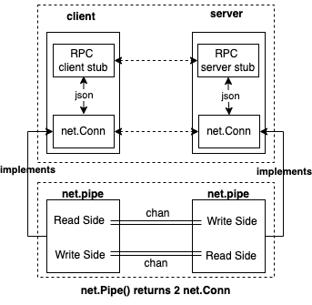

## Service层设计

调试器前后端分离式架构，调试器的前端和后端需要通过service层进行通信。尽管调试器调试存在本地调试、远程调试两种类型，但是从架构设计上来看，后端都是希望以API调用的方式来处理请求、响应。

远程调试场景下，前端、后端是以C/S协议请求方式来交互，后端自然是以API调用的方式来提供服务的；对于本地调试场景下，为了实现架构上的优雅统一，此时进程内逻辑会一分为二，一部分是前端逻辑，一部分是后端逻辑，它们之间通过net.Pipe进行协议通信。

- 远程调试，通过真正的C/S网络通信来完成调试请求发送、处理、响应，为了简化收包、解包、编解码、序列化的问题，我们可以直接使用go标准库提供的JSON-RPC实现来完成调试器前后端的网络通信；
- 本地调试，在net.Pipe基础上实现一个 `preConnectedListener`，它实现了net.Listener接口，这样可以通过统一的Accept操作来完成前端、后端连接的建立；

这样整个service层的通信接口就可以统一用网络层的通信接口来完成连接建立，进而统一通过API调用的方式来完成请求发送、处理、响应，整体代码处理逻辑就非常优雅，接下来会详细介绍。

### 远程调试：JSON-RPC over network

概要设计中提到了远程调试情况下，调试器前后端需要通过网络进行通信，我们采用json-rpc的方式来实现前后端的通讯。远程调试情况下，调试器前后端service层的设计如下。


RPC是client/server架构设计中常见的一种通讯模式，它的理念是让client端能够像本地方法调用一样来完成对服务端同名接口处理函数的请求，底层的服务发现、频控、熔断、序列化、编解码、网络通讯等细节全部在桩代码以及更底层的框架中予以解决。

我们希望让调试器前后端通过RPC方式来通讯，这对以后我们扩展协议、简化编码复杂度很有价值，而我们又不希望额外引入GRPC等这么种重的框架，该怎么办呢？go标准库对http、json-rpc提供了很好的支持，我们在标准库基础上完成json-rpc通讯。

> 在本书配套的调试器实现demo中，网络通讯、RPC是实现前后端分离式架构的基础，但是并不是实现go符号级调试器最困难的部分。
>
> 作者假定读者朋友已经掌握了RPC相关的知识，因此不会在本书正文部分对相关内容进行大篇幅的介绍。如您对相关内容感兴趣，可以自行从网络上检索相关资料。

### 本地调试：JSON-RPC over net.Pipe

本地调试时调试器前后端该如何通讯呢？我们熟知的进程间通信手段有很多，比如pipe、fifo、shm等。而在go程序中，goroutines之间通讯广泛采用通信串行处理的思想（Communicating Sequential Processes，简称CSP），即通过chan通信。

go标准库在chan的基础上封装了net.pipe，net.pipe内部包含了两个chan，分别用于读操作（readonly）和写操作（writeonly）：

- rdRx，只可读的chan，用来读取管道另一端发送的数据；
- rdTx，只可写的chan，用来向管道另一端发送数据；

```go
type pipe struct {
	wrMu sync.Mutex // Serialize Write operations

	// Used by local Read to interact with remote Write.
	// Successful receive on rdRx is always followed by send on rdTx.
	rdRx <-chan []byte
	rdTx chan<- int

	// Used by local Write to interact with remote Read.
	// Successful send on wrTx is always followed by receive on wrRx.
	wrTx chan<- []byte
	wrRx <-chan int

	once       sync.Once // Protects closing localDone
	localDone  chan struct{}
	remoteDone <-chan struct{}

	readDeadline  pipeDeadline
	writeDeadline pipeDeadline
}
```

`net.Pipe() (Conn, Conn)`个函数，则会为我们准备好这样一条全双工的管道，并返回两个net.Conn实例，其实就是net.pipe，然后我们就可以通过net.Conn的Read、Write函数像进行网络操作一样实现同一进程内的全双工通信了。

```go
// Pipe creates a synchronous, in-memory, full duplex
// network connection; both ends implement the Conn interface.
// Reads on one end are matched with writes on the other,
// copying data directly between the two; there is no internal
// buffering.
func Pipe() (Conn, Conn) {
	cb1 := make(chan []byte)
	cb2 := make(chan []byte)
	cn1 := make(chan int)
	cn2 := make(chan int)
	done1 := make(chan struct{})
	done2 := make(chan struct{})

	p1 := &pipe{
		rdRx: cb1, rdTx: cn1,
		wrTx: cb2, wrRx: cn2,
		localDone: done1, remoteDone: done2,
		readDeadline:  makePipeDeadline(),
		writeDeadline: makePipeDeadline(),
	}
	p2 := &pipe{
		rdRx: cb2, rdTx: cn2,
		wrTx: cb1, wrRx: cn1,
		localDone: done2, remoteDone: done1,
		readDeadline:  makePipeDeadline(),
		writeDeadline: makePipeDeadline(),
	}
	return p1, p2
}
```

所以设计图上来看，通过net.Pipe进行通信，与通过json-rpc通讯时的差异并不是很明显。具体差异主要体现在，它不走网络，也不需要走http协议。这样统一于net.Conn的通信操作，使得我们在编码实现调试器前后端通讯时会更清晰简洁。



然后，我们需要再考虑下面几个问题，net.Pipe()虽然返回了net.Conn供我们进行全双工通信，但是：

- 服务端往往是先创建net.Listener然后Accept客户端连接请求才能创建net.Conn；

  我们可以创建一个实现了net.Listener接口的新类型preconnectedListener，其内部保存 `net.Pipe() (Conn, Conn)`返回的一个net.Conn，每当调用Accept的时候直接返回该保存的net.Conn即可。
- 客户端往往是通过net.Dial然后才能创建net.Conn；

  `net.Pipe() (Conn, Conn)`，其返回的另一个Conn作为client的net.Dial的net.Conn，client就不用net.Dial来创建连接了。

这样，当本地调试时，我们就不通过 `net.Listen(network, address)`而是通过 `net.ListenerPipe()`来返回preconnectedListener来作为net.Listener即可。

### 有哪些RPC要支持

概要设计中我们列出了要支持的系列调试命令，这些调试命令背后对被调试进程施加的操作不同，但是有些也会有共同之处。这里我们要梳理每个调试器命令（调试器前端支持），都对应着调试器后端的哪些能力（以json-rpc服务接口形式暴露），调试器前端实现某个调试器命令的功能时，就需要通过请求调试器后端的一个或者多个接口来完成调试动作。

下面是调试器前端Service层Client接口定义，其中描述了我们需要支持的RPC接口列表：

```go
// Client represents a client of a debugger service. All client methods are synchronous.
type Client interface {
	// ProcessPid Returns the pid of the process we are debugging.
	ProcessPid() int

	// LastModified returns the time that the process' executable was modified.
	LastModified() time.Time

	// Detach detaches the debugger, optionally killing the process.
	Detach(killProcess bool) error

	// Restarts program. Set true if you want to rebuild the process we are debugging.
	Restart(rebuild bool) ([]api.DiscardedBreakpoint, error)

	// GetState returns the current debugger state.
	GetState() (*api.DebuggerState, error)
	// GetStateNonBlocking returns the current debugger state, returning immediately if the target is already running.
	GetStateNonBlocking() (*api.DebuggerState, error)

	// Continue resumes process execution.
	Continue() <-chan *api.DebuggerState
	// DirectionCongruentContinue resumes process execution, if a next, step or stepout operation is in progress it will resume execution.
	DirectionCongruentContinue() <-chan *api.DebuggerState
	// Next continues to the next source line, not entering function calls.
	Next() (*api.DebuggerState, error)
	// Step continues to the next source line, entering function calls.
	Step() (*api.DebuggerState, error)
	// StepOut continues to the return address of the current function.
	StepOut() (*api.DebuggerState, error)
	// Call resumes process execution while making a function call.
	Call(goroutineID int, expr string, unsafe bool) (*api.DebuggerState, error)

	// SingleStep will step a single cpu instruction.
	StepInstruction() (*api.DebuggerState, error)
	// SwitchThread switches the current thread context.
	SwitchThread(threadID int) (*api.DebuggerState, error)
	// SwitchGoroutine switches the current goroutine (and the current thread as well)
	SwitchGoroutine(goroutineID int) (*api.DebuggerState, error)
	// Halt suspends the process.
	Halt() (*api.DebuggerState, error)

	// GetBreakpoint gets a breakpoint by ID.
	GetBreakpoint(id int) (*api.Breakpoint, error)
	// GetBreakpointByName gets a breakpoint by name.
	GetBreakpointByName(name string) (*api.Breakpoint, error)
	// CreateBreakpoint creates a new breakpoint.
	CreateBreakpoint(*api.Breakpoint) (*api.Breakpoint, error)
	// CreateWatchpoint creates a new watchpoint.
	CreateWatchpoint(api.EvalScope, string, api.WatchType) (*api.Breakpoint, error)
	// ListBreakpoints gets all breakpoints.
	ListBreakpoints(bool) ([]*api.Breakpoint, error)
	// ClearBreakpoint deletes a breakpoint by ID.
	ClearBreakpoint(id int) (*api.Breakpoint, error)
	// ClearBreakpointByName deletes a breakpoint by name
	ClearBreakpointByName(name string) (*api.Breakpoint, error)
	// ToggleBreakpoint toggles on or off a breakpoint by ID.
	ToggleBreakpoint(id int) (*api.Breakpoint, error)
	// ToggleBreakpointByName toggles on or off a breakpoint by name.
	ToggleBreakpointByName(name string) (*api.Breakpoint, error)
	// Allows user to update an existing breakpoint for example to change the information
	// retrieved when the breakpoint is hit or to change, add or remove the break condition
	AmendBreakpoint(*api.Breakpoint) error
	// Cancels a Next or Step call that was interrupted by a manual stop or by another breakpoint
	CancelNext() error

	// ListThreads lists all threads.
	ListThreads() ([]*api.Thread, error)
	// GetThread gets a thread by its ID.
	GetThread(id int) (*api.Thread, error)

	// ListPackageVariables lists all package variables in the context of the current thread.
	ListPackageVariables(filter string, cfg api.LoadConfig) ([]api.Variable, error)
	// EvalVariable returns a variable in the context of the current thread.
	EvalVariable(scope api.EvalScope, symbol string, cfg api.LoadConfig) (*api.Variable, error)

	// SetVariable sets the value of a variable
	SetVariable(scope api.EvalScope, symbol, value string) error

	// ListSources lists all source files in the process matching filter.
	ListSources(filter string) ([]string, error)
	// ListFunctions lists all functions in the process matching filter.
	ListFunctions(filter string) ([]string, error)
	// ListTypes lists all types in the process matching filter.
	ListTypes(filter string) ([]string, error)
	// ListLocals lists all local variables in scope.
	ListLocalVariables(scope api.EvalScope, cfg api.LoadConfig) ([]api.Variable, error)
	// ListFunctionArgs lists all arguments to the current function.
	ListFunctionArgs(scope api.EvalScope, cfg api.LoadConfig) ([]api.Variable, error)
	// ListThreadRegisters lists registers and their values, for the given thread.
	ListThreadRegisters(threadID int, includeFp bool) (api.Registers, error)
	// ListScopeRegisters lists registers and their values, for the given scope.
	ListScopeRegisters(scope api.EvalScope, includeFp bool) (api.Registers, error)

	// ListGoroutines lists all goroutines.
	ListGoroutines(start, count int) ([]*api.Goroutine, int, error)
	// ListGoroutinesWithFilter lists goroutines matching the filters
	ListGoroutinesWithFilter(start, count int, filters []api.ListGoroutinesFilter, group *api.GoroutineGroupingOptions) ([]*api.Goroutine, []api.GoroutineGroup, int, bool, error)

	// Returns stacktrace
	Stacktrace(goroutineID int, depth int, opts api.StacktraceOptions, cfg *api.LoadConfig) ([]api.Stackframe, error)

	// Returns ancestor stacktraces
	Ancestors(goroutineID int, numAncestors int, depth int) ([]api.Ancestor, error)

	// Returns whether we attached to a running process or not
	AttachedToExistingProcess() bool

	// Returns concrete location information described by a location expression
	// loc ::= <filename>:<line> | <function>[:<line>] | /<regex>/ | (+|-)<offset> | <line> | *<address>
	// * <filename> can be the full path of a file or just a suffix
	// * <function> ::= <package>.<receiver type>.<name> | <package>.(*<receiver type>).<name> | <receiver type>.<name> | <package>.<name> | (*<receiver type>).<name> | <name>
	// * <function> must be unambiguous
	// * /<regex>/ will return a location for each function matched by regex
	// * +<offset> returns a location for the line that is <offset> lines after the current line
	// * -<offset> returns a location for the line that is <offset> lines before the current line
	// * <line> returns a location for a line in the current file
	// * *<address> returns the location corresponding to the specified address
	// NOTE: this function does not actually set breakpoints.
	// If findInstruction is true FindLocation will only return locations that correspond to instructions.
	FindLocation(scope api.EvalScope, loc string, findInstruction bool, substitutePathRules [][2]string) ([]api.Location, error)

	// Disassemble code between startPC and endPC
	DisassembleRange(scope api.EvalScope, startPC, endPC uint64, flavour api.AssemblyFlavour) (api.AsmInstructions, error)
	// Disassemble code of the function containing PC
	DisassemblePC(scope api.EvalScope, pc uint64, flavour api.AssemblyFlavour) (api.AsmInstructions, error)

	// SetReturnValuesLoadConfig sets the load configuration for return values.
	SetReturnValuesLoadConfig(*api.LoadConfig)

	// FunctionReturnLocations return locations when function `fnName` returns
	FunctionReturnLocations(fnName string) ([]uint64, error)

	// IsMulticlien returns true if the headless instance is multiclient.
	IsMulticlient() bool

	// ListDynamicLibraries returns a list of loaded dynamic libraries.
	ListDynamicLibraries() ([]api.Image, error)

	// ExamineMemory returns the raw memory stored at the given address.
	// The amount of data to be read is specified by length which must be less than or equal to 1000.
	// This function will return an error if it reads less than `length` bytes.
	ExamineMemory(address uint64, length int) ([]byte, bool, error)

	// CoreDumpStart starts creating a core dump to the specified file
	CoreDumpStart(dest string) (api.DumpState, error)
	// CoreDumpWait waits for the core dump to finish, or for the specified amount of milliseconds
	CoreDumpWait(msec int) api.DumpState
	// CoreDumpCancel cancels a core dump in progress
	CoreDumpCancel() error

	// Disconnect closes the connection to the server without sending a Detach request first.
	// If cont is true a continue command will be sent instead.
	Disconnect(cont bool) error

	// CallAPI allows calling an arbitrary rpcv2 method (used by starlark bindings)
	CallAPI(method string, args, reply interface{}) error
}
```

您现在开始感到了惊讶，怎么需要这么多接口？如果我们是做个玩具，那它会相对来说比较简单；如果我们是做个工程，要想能达到可用水准，它一定会变得很复杂。作者当然想尽可能简单地叙述完，但是那样很明显是在应付读者，但我不想那样 :)

### 本节小结

本节介绍了调试器前后端分离式架构下Service层的设计，包括了远程调试、本地调试时的的详细设计说明，最后也给出了我们要支持的RPC接口列表，换言之我们接下来的任务就是围绕着在前后端去实现这些RPC接口列表。

>ps: 与调试器进行交互，除了通过调试器前端显示输入调试命令，还需要一些更友好的方式，比如希望将当前调试会话进行保存，后面从这里继续进行调试。或者希望将一个完整的调试过程分享给其他人一起协助定位问题。go-delve/delve 允许用户通过编写starlark脚本的方式来完成这个操作，调试器会话内通过 `source /path-to/your.star` 来自动执行脚本中的调试操作，这个是非常方便的。starlark脚本中可以执行dlv预先支持好的一些函数，如 `dlv_command("会话中的调试命令")` 来执行调试命令，最终还是会转换成通过API调用的方式去调用调试器后端中的实现逻辑。作为调试器交互逻辑的补充，这里我们简单提一下，我们后面会对此进行详细介绍。
