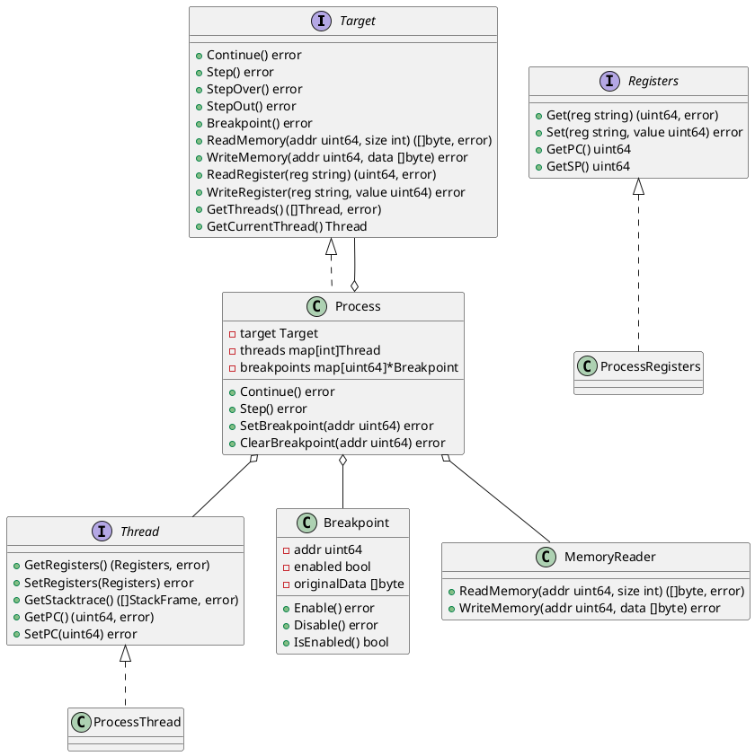

## 后端目标层设计

调试器后端目标层是调试器架构中最底层的一层，它直接与被调试进程（tracee）交互，负责执行最基础的控制和数据操作。这一层的主要职责包括：

### 1. 执行控制
- 进程控制：启动、停止、继续执行被调试进程
- 断点管理：设置、清除、启用、禁用断点
- 单步执行：支持单步执行（step over）、单步进入（step into）、单步跳出（step out）
- 执行状态查询：获取当前执行状态、PC值等

### 2. 数据访问
- 内存操作：读取和写入进程内存空间
- 寄存器操作：读取和写入CPU寄存器
- 线程操作：获取线程列表、切换当前线程
- 栈操作：读取调用栈信息

### 3. 原始数据处理
目标层处理的是最原始的二进制数据，它不关心数据的语义和类型。例如：
- 读取内存时返回的是原始字节序列
- 读取寄存器时返回的是原始数值
- 这些原始数据需要传递给符号层进行解析和类型转换

### 4. 与符号层的协作
目标层与符号层紧密协作：
- 目标层提供原始数据访问能力
- 符号层负责解析DWARF调试信息
- 符号层将原始数据转换为有意义的类型化数据
- 两者配合实现源码级调试功能

### 5. 平台适配
目标层需要适配不同的操作系统和硬件架构：
- 支持不同的操作系统（Linux、Windows、macOS等）
- 支持不同的CPU架构（x86、ARM等）
- 处理平台特定的调试接口（如ptrace、debugger API等）

### 类图设计

这个类图展示了目标层的主要组件和它们之间的关系：

1. `Target` 接口定义了目标层需要实现的核心功能
2. `Thread` 接口定义了线程相关的操作
3. `Registers` 接口定义了寄存器访问操作
4. `Process` 类作为主要实现类，管理进程状态和调试操作
5. `Breakpoint` 类处理断点相关的操作
6. `MemoryReader` 类处理内存读写操作

这种设计使得目标层能够：
- 提供统一的调试接口
- 支持多平台实现
- 方便扩展新的功能
- 清晰地分离关注点

