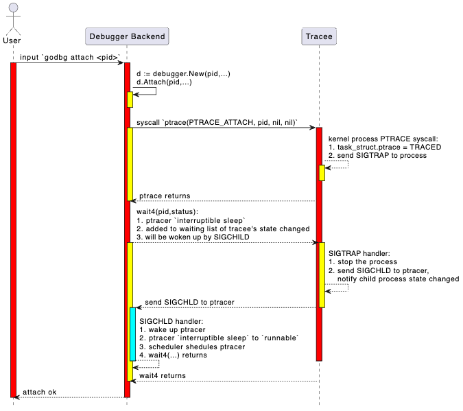

## Attach

### 实现目标：`tinydbg attach <pid>`

本节介绍attach这个启动调试的命令：`tinydbg attach <pid> [executable] [flags]`，attach操作将挂住目标进程、让目标进程停下来。

与指令级调试器godbg attach相比，这里的符号级调试器实现tinydbg attach增加了更多选项，来支持更加友好地调试。

```bash
$ tinydbg help attach
Attach to an already running process and begin debugging it.

This command will cause Delve to take control of an already running process, and
begin a new debug session.  When exiting the debug session you will have the
option to let the process continue or kill it.

Usage:
  tinydbg attach pid [executable] [flags]

Flags:
      --continue                 Continue the debugged process on start.
  -h, --help                     help for attach
      --waitfor string           Wait for a process with a name beginning with this prefix
      --waitfor-duration float   Total time to wait for a process
      --waitfor-interval float   Interval between checks of the process list, in millisecond (default 1)

Global Flags:
      --accept-multiclient               Allows a headless server to accept multiple client connections via JSON-RPC.
      --allow-non-terminal-interactive   Allows interactive sessions of Delve that don't have a terminal as stdin, stdout and stderr
      --headless                         Run debug server only, in headless mode. Server will accept JSON-RPC client connections.
      --init string                      Init file, executed by the terminal client.
  -l, --listen string                    Debugging server listen address. Prefix with 'unix:' to use a unix domain socket. (default "127.0.0.1:0")
      --log                              Enable debugging server logging.
      --log-dest string                  Writes logs to the specified file or file descriptor (see 'dlv help log').
      --log-output string                Comma separated list of components that should produce debug output (see 'dlv help log')
```

我们解释下上面的attach命令选项：

1. tinydbg attach pid，这个没有什么疑问，挂住正在执行的进程id==pid的进程；
2. --waitfor, --waitfor-duration, --waitfor-interval，等一个进程名前缀为xxx的进程起来、然后挂住，详见 [waitfor设计](./1-tinydbg_attach_waitfor.md)。
3. --accept-multiclient，这个是为了允许同一个debugger backend可以服务于多个debugger client，可以同时调试，或者先后调试，详见 [multiclient设计](../3-高级功能扩展/108-howto_accept_multiclient.md)。
4. --allow-non-terminal-interactive，如果您想在CI/CD或者自动化调试流程中执行上述非基于控制终端的调试；
5. --headless，启动一个debugger backend并作为服务器模式运行；
6. --listen，启动debugger backend并作为服务器模式运行，同时指定服务器的监听地址；
7. --log, --log-output，--log-dest, 是否启用服务端日志，启动哪些层次的日志，日志输出到哪里，详见 [日志系统设计](../1-架构设计/6-日志系统设计)。

OK，我们一起来看看Attach的详细设计实现。

### 基础知识

在第六章指令级调试器开发过程中，我们结合Linux内核源码非常详细地介绍了syscall.PtraceAttach(...)的处理过程，如果您已经忘记了这里的细节，可以回去再看看相应内容。这里我们仅通过一张时序图对关键处理逻辑进行总结。

FIXME: 这个图有问题，参考第6章start+attach的put it together部分总结。

<p align="center">

</p>

大致处理过程：

- 用户在前端输入 `attach <pid>` 命令。
- 前端通过 json-rpc（远程）或 net.Pipe（本地）将 attach 请求发送给后端。
- 后端解析请求，调用系统API（如 ptrace 或等效机制）附加到目标进程。
- 后端初始化调试上下文（如符号表、断点、线程信息等）。
- 返回 attach 结果，前端进入调试会话。

### 代码实现

attach操作作为我们第一个介绍的调试命令实现，我们有必要在此详细地把调试器前后端交互的全流程介绍一遍，介绍后续调试命令的时候，我们就不会再这么重复地、详细地介绍了。所以请读者朋友们耐心。

#### Shell中执行 `tinydbg attach <pid>`

首先，用户执行命令 `tinydbg attach <pid>`，tinydbg主程序是一个基于spf13/cobra的命令行程序：

file: path-to/tinydbg/main.go

```go
package main

import (
  ...

	"github.com/hitzhangjie/tinydbg/cmds"
	"github.com/hitzhangjie/tinydbg/pkg/logflags"
	"github.com/hitzhangjie/tinydbg/pkg/version"
)

// Build is the git sha of this binaries build.
//
// note: we can pass -ldflags "-X main.Build=v0.0.1" to set the build version when building.
var Build string = "v0.0.1"

func main() {
	// current demo only supports linux/amd64
	if runtime.GOOS != "linux" || runtime.GOARCH != "amd64" {
		fmt.Fprintf(os.Stderr, "WARNING: tinydbg only supports linux/amd64")
		os.Exit(1)
	}

	// this build version will be dumped when generating the core file
	if Build != "" {
		version.DelveVersion.Build = Build
	}

	// if cgo used, pass "-O0 -g" to disable optimization and enable debugging symbols
	const cgoCflagsEnv = "CGO_CFLAGS"
	if os.Getenv(cgoCflagsEnv) == "" {
		os.Setenv(cgoCflagsEnv, "-O0 -g")
	} else {
		logflags.WriteCgoFlagsWarning()
	}

	cmds.New().Execute()
}

```

既然是spf13/cobra管理的命令行程序，那它的子命令注册逻辑是大同小异的，它应该有个对应的attach subcmd。

see: path-to/tinydbg/cmds/cmd_root.go

```go
// New returns an initialized command tree.
func New() *cobra.Command {
	// Config setup and load.
	//
	// Delay reporting errors about configuration loading delayed until after the
	// server is started so that the "server listening at" message is always
	// the first thing emitted. Also, logflags hasn't been set up yet at this point.
	conf, loadConfErr = config.LoadConfig()
	buildFlagsDefault := ""

	// Main dlv root command.
	rootCommand = &cobra.Command{
		Use:   "tinydbg",
		Short: "tinydbg is a lightweight debugger trimmed from Delve (Dlv) for the Go programming language.",
		Long:  longDesc,
	}
  ...
  rootCommand.AddCommand(attachCommand)
	rootCommand.AddCommand(connectCommand)
  ...
}
```

我们看到了这里的attachCommand的注册，当执行 `tinydbg attach` 时实际上执行的句式attachCommand.Run方法。

see: path-to/tinydbg/cmds/cmd_attach.go

```go
// 'attach' subcommand.
var attachCommand = &cobra.Command{
	Use:   "attach pid [executable]",
	Short: "Attach to running process and begin debugging.",
	Long: `Attach to an already running process and begin debugging it.

This command will cause Delve to take control of an already running process, and
begin a new debug session.  When exiting the debug session you will have the
option to let the process continue or kill it.
`,
	PersistentPreRunE: func(cmd *cobra.Command, args []string) error {
		if len(args) == 0 && attachWaitFor == "" {
			return errors.New("you must provide a PID")
		}
		return nil
	},
	Run: attachCmd,
	ValidArgsFunction: func(cmd *cobra.Command, args []string, toComplete string) ([]string, cobra.ShellCompDirective) {
		if len(args) != 1 {
			return nil, cobra.ShellCompDirectiveNoFileComp
		}
		return nil, cobra.ShellCompDirectiveDefault
	},
}

...

func attachCmd(_ *cobra.Command, args []string) {
	var pid int
	if len(args) > 0 {
		var err error
		pid, err = strconv.Atoi(args[0])
		if err != nil {
			fmt.Fprintf(os.Stderr, "Invalid pid: %s\n", args[0])
			os.Exit(1)
		}
		args = args[1:]
	}
	os.Exit(execute(pid, args, conf, "", debugger.ExecutingOther, args, buildFlags))
}
```

这里 `attachCommand.Run()` -> `attachCmd(...)` -> `execute(pid, args, conf, ....)` ，调试器前端用于前后端通信的RPC client在execute中进行初始化，并完成对server的调用。

ps：在9.1 架构设计中Service层设计时，我们提到过，对于本地调试其实是通过 preConnectedListener+net.Pipe 来模拟真实了网络连接通信过程。本质上还是按照C/S架构进行请求、处理的。

#### attach操作前后端扮演的职责

执行到execute方法时，才开始体现出前后端分离式架构下前后端的不同职责。对于本地调试模式，execute方法中既有初始化前端JSON-RPC client、调试会话的逻辑，也有初始化后端网络IO和debugger核心功能的逻辑。在远程调试模式下，execute方法主要是后端网络IO和debugger核心功能初始化，前端初始化要通过connect操作来完成，初始化JSON-RPC client和调试会话。

调试会话的初始化以及工作工程，我们前一节介绍过了。这个小节，我们来看下attach操作，不管是本地调试模式，还是远程调试模式，其实在已经介绍了调试会话的基础上，我们只需要关心attach操作涉及到的调试器后端的debugger核心功能初始化即可。

实际上，如果是远程调试模式，attach操作其实主要是调试器后端的操作，基本没前端什么事，attach操作并不需要前端发JSON-RPC请求，只需要后端做下网络IO初始化、debugger初始化，然后让debugger attach到目标进程就算结束了。如果是本地调试模式，在调试器后端完成上述初始化之后，调试器前端建立个调试会话就算准备就绪了，后续与后端的通信通过net.Pipe。

see: path-to/tinydbg/cmds/cmd_root.go

```go
func execute(attachPid int, processArgs []string, conf *config.Config, coreFile string, kind debugger.ExecuteKind, dlvArgs []string, buildFlags string) int {
  	...

	var listener net.Listener
	var clientConn net.Conn
	if headless {
		listener, err = netListen(addr)               // remote debug mode via TCP network
	} else {
		listener, clientConn = service.ListenerPipe() // local debug mode via net.Pipe
	}

	...

	// debugger backend: create and start a debugger server
	server := rpccommon.NewServer(&service.Config{
		Listener:       listener,
		ProcessArgs:    processArgs,
		AcceptMulti:    acceptMulti,
		DisconnectChan: disconnectChan,
		Debugger: debugger.Config{
			AttachPid:             attachPid,
			。。。
		},
	})

	if err := server.Run(); err != nil {
		。。。
	}
  	...

	// debugger frontend: connect to debugger server and init debug session
	return connect(listener.Addr().String(), clientConn, conf)
}
```

#### 调试器后端初始化并接受请求

调试器后端启动，网络初始化方式有两种方式：
1、一种是通过--headless模式启动，net.Listen创建一个TCPListener or UnixListener，然后等待入连接请求；
2、一种是本地模式启动，通过preConnectedListener+net.Pipe，来模拟网络监听、连接操作；

see: path-to/tinydbg/cmds/cmd_root.go

```go
func execute(attachPid int, processArgs []string, conf *config.Config, coreFile string, kind debugger.ExecuteKind, dlvArgs []string, buildFlags string) int {
  	...
	var listener net.Listener
	if headless {
		listener, err = netListen(addr)               // remote debug mode via TCP network
	} else {
		listener, clientConn = service.ListenerPipe() // local debug mode via net.Pipe
	}
  	...

	// debugger backend: create and start a debugger server
	server := rpccommon.NewServer(&service.Config{
		Listener:       listener,
		ProcessArgs:    processArgs,
		AcceptMulti:    acceptMulti,
		DisconnectChan: disconnectChan,
		Debugger: debugger.Config{
			AttachPid:             attachPid,
			...
		},
	})

	// debugger backend: run the server
	if err := server.Run(); err != nil {
		...
	}

	...
}
```

在 `server.Run()` 中开始执行后，会创建一个ptracer并attach到目标进程，然后会开始接受入连接请求并处理RPC请求。

```go
// Run starts a debugger and exposes it with an JSON-RPC server. The debugger
// itself can be stopped with the `detach` API.
func (s *ServerImpl) Run() error {
	var err error

	// Create and start the debugger
	config := s.config.Debugger
	if s.debugger, err = debugger.New(&config, s.config.ProcessArgs); err != nil {
		return err
	}

	s.s2 = rpc2.NewServer(s.config, s.debugger)
	s.methodMap = make(map[string]*methodType)

	// register RPC methods and relevant handlers
	registerMethods(s.s2, s.methodMap)

	// accept incoming connections and serves the RPC requests
	go func() {
		defer s.listener.Close()
		for {
			c, err := s.listener.Accept()
      ...
			go s.serveConnection(c)
			if !s.config.AcceptMulti {
				break
			}
		}
	}()
	return nil
}
```

那么，attach操作是什么时候执行的呢？调试器前端不是应该发送一个attach请求给调试器后台吗？理论上确实可以这么干，但是实际上没必要再多一轮RPC了，试想：
1、如果是远程调试，--headless启动server时我肯定知道要attach哪个tracee了，哪还需要客户端显示发RPC请求；
2、如果是本地调试，pid参数也已经通过命令行选项传递给进程了，本地调试中直接引用这个选项值即可，没必要再走一遍RPC；

确实如此，所以实际上是没有这个主动Attach的RPC的，不信你可以看看rpc2.Client的接口定义。

see: path-to/tinydbg/service/rpc2c/client.go

#### 调试器后端attach到进程

OK，那紧接前面内容，调试器后端除了网络（listener、accept、serve）相关的初始化，还涉及到建立一个真正的调试器tracer来对目标进程tracee进行控制。其实attach操作就是在这个时候完成的。

see: path-to/tinydbg/service/debugger/debugger.go

```go
package debugger

// New creates a new Debugger. ProcessArgs specify the commandline arguments for the
// new process.
func New(config *Config, processArgs []string) (*Debugger, error) {
  ...
	d := &Debugger{
		config:      config,
		processArgs: processArgs,
		log:         logger,
	}

	// Create the process by either attaching or launching.
	switch {
	case d.config.AttachPid > 0 || d.config.AttachWaitFor != "":
		d.log.Infof("attaching to pid %d", d.config.AttachPid)

		path := ""
		if len(d.processArgs) > 0 {
			path = d.processArgs[0]
		}

		var waitFor *proc.WaitFor
		if d.config.AttachWaitFor != "" {
			waitFor = &proc.WaitFor{
				Name:     d.config.AttachWaitFor,
				Interval: time.Duration(d.config.AttachWaitForInterval * float64(time.Millisecond)),
				Duration: time.Duration(d.config.AttachWaitForDuration * float64(time.Millisecond)),
			}
		}

    // attach the target tracee
		var err error
		d.target, err = d.Attach(d.config.AttachPid, path, waitFor)
		if err != nil {
			err = go11DecodeErrorCheck(err)
			err = noDebugErrorWarning(err)
			return nil, attachErrorMessage(d.config.AttachPid, err)
		}

	case d.config.CoreFile != "":
    ...
  default:
    ...
	}

	return d, nil
}

// Attach will attach to the process specified by 'pid'.
func (d *Debugger) Attach(pid int, path string, waitFor *proc.WaitFor) (*proc.TargetGroup, error) {
	return native.Attach(pid, waitFor)
}
```

我们这里的debugger backend只有native一种实现，我们去掉了gdb、lldb、mozilla rr，你应该支持如果希望扩展应该在这里做做文章。

```go
// Attach to an existing process with the given PID. Once attached, if
// the DWARF information cannot be found in the binary, Delve will look
// for external debug files in the directories passed in.
//
// note: we remove the support of reading separate dwarfdata.
func Attach(pid int, waitFor *proc.WaitFor) (*proc.TargetGroup, error) {
  // 如果指定了waitfor的方式attach，需要先等进程起来获取到pid
	if waitFor.Valid() {
		pid, err = WaitFor(waitFor)
    ...
	}

	dbp := newProcess(pid)

  // 执行实际的ptrace attach操作
	var err error
	dbp.execPtraceFunc(func() { err = ptraceAttach(dbp.pid) })
  ...

  // 执行wait操作获取tracee停止状态
	_, _, err = dbp.wait(dbp.pid, 0)
	...

  // tracee停下来后，这里尝试读取tracee的信息，并完成必要设置
	tgt, err := dbp.initialize(findExecutable("", dbp.pid))
  ...

	// ElfUpdateSharedObjects can only be done after we initialize because it
	// needs an initialized BinaryInfo object to work.
	err = linutil.ElfUpdateSharedObjects(dbp)
	...
	return tgt, nil
}
```

到这里为止，调试器后端就已经与tracee正确建立了ptrace link关系了，后续前端就可以通过debug.Session发送交互式调试命令，debug.Session内部将其转换为对RPC调用debug.Session.client.Call(...)。

然后调试器后端就通过net.Conn不断接受请求，并按照JSON-RPC进行解码，根据请求参数，找到对应的服务端接口进行处理，接口内部又会调用debugger native中的各种操作来完成对目标进程的实际控制，并逐级返回结果，最终给到前端展示。

#### 调试器后端attach到进程后干了什么

see path-to/tinydbg/pkg/proc/native/proc.go

```go
// initialize will ensure that all relevant information is loaded
// so the process is ready to be debugged.
func (dbp *nativeProcess) initialize(path string) (*proc.TargetGroup, error) {
	cmdline, err := dbp.initializeBasic()
	if err != nil {
		return nil, err
	}

	stopReason := proc.StopLaunched
	if !dbp.childProcess {
		stopReason = proc.StopAttached
	}

	procgrp := &processGroup{}
	grp, addTarget := proc.NewGroup(procgrp, proc.NewTargetGroupConfig{
		DisableAsyncPreempt: false,
		StopReason: stopReason,
		CanDump:    true,
	})
	procgrp.addTarget = addTarget
	tgt, err := procgrp.add(dbp, dbp.pid, dbp.memthread, path, stopReason, cmdline)
	if err != nil {
		return nil, err
	}
	return grp, nil
}

func (dbp *nativeProcess) initializeBasic() (string, error) {
	cmdline, err := initialize(dbp)
	if err != nil {
		return "", err
	}
	if err := dbp.updateThreadList(); err != nil {
		return "", err
	}
	return cmdline, nil
}
```

see path-to/tinydbg/pkg/proc/native/proc_linux.go

```go
func initialize(dbp *nativeProcess) (string, error) {
	comm, err := os.ReadFile(fmt.Sprintf("/proc/%d/comm", dbp.pid))
	if err == nil {
		// removes newline character
		comm = bytes.TrimSuffix(comm, []byte("\n"))
	}

	if comm == nil || len(comm) <= 0 {
		stat, err := os.ReadFile(fmt.Sprintf("/proc/%d/stat", dbp.pid))
		if err != nil {
			return "", fmt.Errorf("could not read proc stat: %v", err)
		}
		expr := fmt.Sprintf("%d\\s*\\((.*)\\)", dbp.pid)
		rexp, err := regexp.Compile(expr)
		if err != nil {
			return "", fmt.Errorf("regexp compile error: %v", err)
		}
		match := rexp.FindSubmatch(stat)
		if match == nil {
			return "", fmt.Errorf("no match found using regexp '%s' in /proc/%d/stat", expr, dbp.pid)
		}
		comm = match[1]
	}
	dbp.os.comm = strings.ReplaceAll(string(comm), "%", "%%")

	return getCmdLine(dbp.pid), nil  ...
}

func (dbp *nativeProcess) updateThreadList() error {
	tids, _ := filepath.Glob(fmt.Sprintf("/proc/%d/task/*", dbp.pid))
	for _, tidpath := range tids {
		tidstr := filepath.Base(tidpath)
		tid, err := strconv.Atoi(tidstr)
		if err != nil {
			return err
		}
		if _, err := dbp.addThread(tid, tid != dbp.pid); err != nil {
			return err
		}
	}
	return linutil.ElfUpdateSharedObjects(dbp)
}
```

看上去attach到目标进程后，就开始读取目标进程的一些信息，包括pid、cmdline、exec、线程列表等等。

这里需要注意，进程内可能已有多线程被创建，也可能将来会创建新的线程。对于更友好地多线程调试，这些都要被管控起来：

```go
const (
	ptraceOptionsNormal     = syscall.PTRACE_O_TRACECLONE
	ptraceOptionsFollowExec = syscall.PTRACE_O_TRACECLONE | syscall.PTRACE_O_TRACEVFORK | syscall.PTRACE_O_TRACEEXEC
)

// Attach to a newly created thread, and store that thread in our list of
// known threads.
func (dbp *nativeProcess) addThread(tid int, attach bool) (*nativeThread, error) {
	if thread, ok := dbp.threads[tid]; ok {
		return thread, nil
	}

	ptraceOptions := ptraceOptionsNormal
	if dbp.followExec {
		ptraceOptions = ptraceOptionsFollowExec
	}

	var err error
	if attach {
		dbp.execPtraceFunc(func() { err = sys.PtraceAttach(tid) })
		if err != nil && err != sys.EPERM {
			// Do not return err if err == EPERM,
			// we may already be tracing this thread due to
			// PTRACE_O_TRACECLONE. We will surely blow up later
			// if we truly don't have permissions.
			return nil, fmt.Errorf("could not attach to new thread %d %s", tid, err)
		}
		pid, status, err := dbp.waitFast(tid)
		if err != nil {
			return nil, err
		}
		if status.Exited() {
			return nil, fmt.Errorf("thread already exited %d", pid)
		}
	}

	dbp.execPtraceFunc(func() { err = syscall.PtraceSetOptions(tid, ptraceOptions) })
	if err == syscall.ESRCH {
		if _, _, err = dbp.waitFast(tid); err != nil {
			return nil, fmt.Errorf("error while waiting after adding thread: %d %s", tid, err)
		}
		dbp.execPtraceFunc(func() { err = syscall.PtraceSetOptions(tid, ptraceOptions) })
		if err == syscall.ESRCH {
			return nil, err
		}
		if err != nil {
			return nil, fmt.Errorf("could not set options for new traced thread %d %s", tid, err)
		}
	}

	dbp.threads[tid] = &nativeThread{
		ID:  tid,
		dbp: dbp,
		os:  new(osSpecificDetails),
	}
	if dbp.memthread == nil {
		dbp.memthread = dbp.threads[tid]
	}
	for _, bp := range dbp.Breakpoints().M {
		if bp.WatchType != 0 {
			err := dbp.threads[tid].writeHardwareBreakpoint(bp.Addr, bp.WatchType, bp.HWBreakIndex)
			if err != nil {
				return nil, err
			}
		}
	}
	return dbp.threads[tid], nil
}
```

这样就把目标进程中当前已有、将来可能会有的所有线程全部纳入到调试器管控逻辑中来了，调试器可以将它们作为一个组，控制它们全部执行或者暂停。

#### 接受入连接请求并处理请求

调试器后端收到入连接请求后，就开始对连接上的交互式调试请求进行处理：`s.serveConnection(c)`。这部分我们在前一节调试会话中，已经详细介绍过了，这里就不再赘述了。

至此，attach操作执行完成。如果是本地调试模式的话，通过前端提供的调试会话就直接可以开始交互式的调试了；如果是远程调试模式，则还需要通过connect操作与服务端建立连接、创建一个调试会话才能开始调试。

#### attach操作不涉及到RPC

对于attach操作，它是不涉及到前后端之间的JSON-RPC调用的，这个我们已经介绍过了，这里特别提一下。当你想查看attach操作的详细代码时，你可以搜索attachCmd，但是不要在rpc2/client.go中搜索响应的RPC方法，因为没有对应的RPC方法。

### 执行测试

TODO:
1. 一开始就是单线程程序
2. 一开始就是多线程程序
3. 执行期间创建出新线程的程序

要观察他们是不是都attach住了，其中1、2都可以验证，3不行，因为attach后全部已有线程都暂停执行了。但是我们还没办法验证3、这点，因为我们还没有实现continue、disconnect等操作来恢复执行。

### 本文总结

本文详细介绍了tinydbg的attach命令实现，主要包括以下几个方面：

1. attach命令的选项设计，包括基本的pid附加、waitfor等待进程、多客户端支持等高级特性；

2. attach的基础原理，通过时序图展示了从用户输入命令到最终完成进程附加的整个流程；

3. 代码实现细节：
   - 调试器前端如何解析和处理attach命令
   - 调试器后端如何实现进程附加
   - 如何处理目标进程的多线程情况
   - 如何维护线程状态和硬件断点

4. 测试场景设计，包括单线程程序、多线程程序以及运行时创建新线程的程序的attach测试。

通过本文的学习，读者应该能够理解调试器是如何实现进程附加功能的，以及在实现过程中需要考虑的各种细节问题。后续章节将在此基础上继续介绍其他调试功能的实现。


