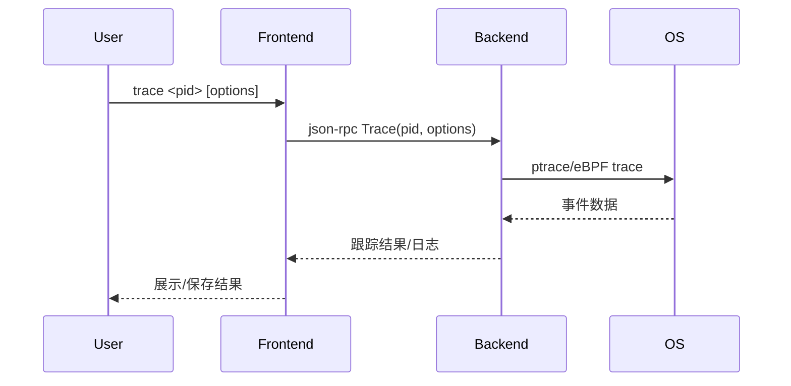

## Trace

### 实现目标

trace命令用于对目标进程进行系统调用、信号或特定事件的跟踪，适合性能分析、异常检测和安全审计等场景。本节介绍 `trace` 命令的实现。

```bash
$ tinydbg help trace
Trace program execution.

The trace sub command will set a tracepoint on every function matching the
provided regular expression and output information when tracepoint is hit.  This
is useful if you do not want to begin an entire debug session, but merely want
to know what functions your process is executing.

The output of the trace sub command is printed to stderr, so if you would like to
only see the output of the trace operations you can redirect stdout.

Usage:
  tinydbg trace [package] regexp [flags]

Flags:
  -e, --exec string        Binary file to exec and trace.
      --follow-calls int   Trace all children of the function to the required depth
  -p, --pid int            Pid to attach to.
      --output string      Output path for the binary.
  -s, --stack int          Show stack trace with given depth. (Ignored with --ebpf)
  -t, --test               Trace a test binary.
      --timestamp          Show timestamp in the output

  ...
```

简单介绍下：
- --exec，启动并跟踪一个可执行程序
- --follow-calls，默认无限跟踪，加上后限制函数调用fanout函数调用的深度
- --pid，跟踪已经在运行的进程
- --output，如果是需要对目标的main module、test package、go源文件进行编译，这里指定输出二进制产物名
- --stack，trace命令在regexp匹配的各个函数名的入口地址、发你地址都设置了断点，每次执行到这里时，打印堆栈
- --test，对某个test package进行 `go test -c` 构建并进行测试；

### 基础知识

实现前后端交互命令，这里前后端的大致执行步骤如下：

1. 用户在前端输入 `tinydbg trace <pid> [regexp]` 命令。
2. 前端通过 json-rpc（远程）或 net.Pipe（本地）将 trace 请求发送给后端。
3. 后端调用系统API（如 ptrace、eBPF 等）对目标进程进行事件跟踪。
4. 后端实时收集并上报跟踪事件数据。
5. 前端展示跟踪结果或保存日志。

这个逻辑很清晰，一起来看看代码是如何实现的。

#### 流程图



### 代码实现

#### 客户端发出去Trace请求

```go
godbg trace [flags] [args]
    \--> traceCommand.Run(..)
            \--> traceCmd(...)
                    \--> client.ListFunctions(regexp, traceFollowCalls)
                         wait response
                    \--> print the functions ilst

            \--> breakpointCmd(...)
                    \--> for each fn in functions, create entry/finish breakpoint with loadargs set
```

下面看下traceCmd源码：

```go
func traceCmd(cmd *cobra.Command, args []string, conf *config.Config) int {
	status := func() int {
        ...
		var regexp string
		var processArgs []string

		dbgArgs, targetArgs := splitArgs(cmd, args)
        ...

		// Make a local in-memory connection that client and server use to communicate
		listener, clientConn := service.ListenerPipe()
        ...

		client := rpc2.NewClientFromConn(clientConn)
        ...

		funcs, err := client.ListFunctions(regexp, traceFollowCalls)
		if err != nil {
			fmt.Fprintln(os.Stderr, err)
			return 1
		}
		success := false
		for i := range funcs {
			// Fall back to breakpoint based tracing if we get an error.
			var stackdepth int
			// Default size of stackdepth to trace function calls and descendants=20
			stackdepth = traceStackDepth
			if traceFollowCalls > 0 && stackdepth == 0 {
				stackdepth = 20
			}
			_, err = client.CreateBreakpoint(&api.Breakpoint{
				FunctionName:     funcs[i],
				Tracepoint:       true,
				Line:             -1,
				Stacktrace:       stackdepth,
				LoadArgs:         &debug.ShortLoadConfig,
				TraceFollowCalls: traceFollowCalls,
				RootFuncName:     regexp,
			})

            ...
            // create breakpoint at the return address
			addrs, err := client.FunctionReturnLocations(funcs[i])
			if err != nil {
				fmt.Fprintf(os.Stderr, "unable to set tracepoint on function %s: %#v\n", funcs[i], err)
				continue
			}
			for i := range addrs {
				_, err = client.CreateBreakpoint(&api.Breakpoint{
					Addr:             addrs[i],
					TraceReturn:      true,
					Stacktrace:       stackdepth,
					Line:             -1,
					LoadArgs:         &debug.ShortLoadConfig,
					TraceFollowCalls: traceFollowCalls,
					RootFuncName:     regexp,
				})
                ...
			}
		}
        ...

        // set terminal to non-interactive
		cmds := debug.NewDebugCommands(client)
		cfg := &config.Config{
			TraceShowTimestamp: traceShowTimestamp,
		}
		t := debug.New(client, cfg)
		t.SetTraceNonInteractive()
		t.RedirectTo(os.Stderr)
		defer t.Close()

        // resume ptracee
		err = cmds.Call("continue", t)
		if err != nil {
			fmt.Fprintln(os.Stderr, err)
			if !strings.Contains(err.Error(), "exited") {
				return 1
			}
		}
		return 0
	}()
	return status
}
```

#### 服务器接收、处理逻辑

然后再来看看服务器端的处理逻辑。

```bash
godbg listenAndServe(conn)
    \--> rpc2.(*RPCServer).ListFunctions(..)
            \--> debugger.(*Debugger).ListFunctions(..)
                    \--> traverse(f, followCalls)
                    \--> uniq = sort + compact, return uniq funcs

    \--> rpc2.(*RPCServer).CreateBreakpoint

    \--> rpc2.(*RPCServer).Continue
       \--> excuete `continue` to resume process
       \--> when any breakpoint hit, ptracer print current `file:lineno:pc` 
            if loadargs set, then print `args` and `locals`
```

展开看的话，关键代码如下：

```go
// ListFunctions lists all functions in the process matching filter.
func (s *RPCServer) ListFunctions(arg ListFunctionsIn, out *ListFunctionsOut) error {
	fns, err := s.debugger.Functions(arg.Filter, arg.FollowCalls)
	if err != nil {
		return err
	}
	out.Funcs = fns
	return nil
}

```

关于CreateBreakpoint和Continue，我们还是等到介绍相关内容时再进行介绍吧，这里先选择性跳过，免得重复进行描述。


### 本文小结

trace 命令通过集成系统级跟踪能力，为性能分析和异常检测提供了强大工具，支持多种事件类型和灵活的输出方式。 