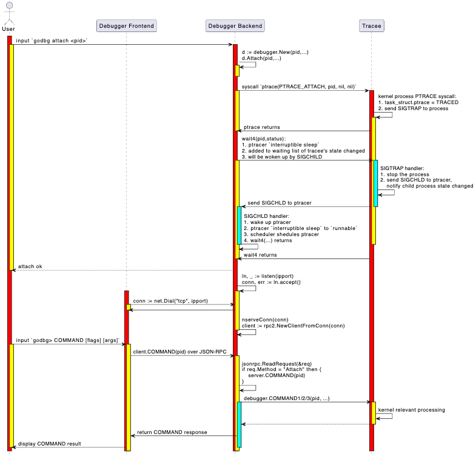

## Debug Session

### 实现目标

前面的attach、exec、debug、core、connect，这几个命令本质上都是启动一个debugger backend，然后让debugger frontend和debugger backend建立连接的操作。

在建立连接之后，debugger frontend就需要建立一个调试会话了，调试会话中我们可以键入调试命令 `godbg> COMMAND [flags] [args]` 进行调试。

在第6章介绍指令级调试器时，我们已经介绍过如何实现一个调试会话了。这里，其实大同小异，尤其是我们对 go-delve/delve 进行了大幅简化之后：

- 移除了分页输出操作，尽管它在输出大量数据时比较有用（比如print一个数据比较多的变量、bt打印一个比较深的调用栈、goroutines显示所有goroutines列表等）；
- 移除了starlark支持，尽管repl的方式交互式执行starlark命令、或者source执行starlark脚本很酷、能进一步增强调试器能力；
- 移除了语法高亮支持，尽管list展示源码时、bt打印堆栈时、whatis查看类型定义时可以让可读性更好；

OK，你们肯定知道我们移除的原因，我们想最大程度简化我们的demo tinydbg。其实对于上述每个特性，我们都在 “9.3 高级功能扩展中” 章节进行了介绍，但是不希望tinydbg中保留相关的代码，因为代码很复杂、读者容易淹没在代码洪流中。

这里简化后的调试会话，与第6章中的调试会话对比，有哪些区别呢？主要是实现了前后端分离式架构，然后前后端基于JSON-RPC进行通信，当我们在调试会话中执行一个调试命令时，调试会话会解析调试命令、选项、参数，然后会转换为对应的client方法调用，client本地方法桩代码会转化为对debugger backend的接口方法调用，debugger backend再执行对tracee的控制。我们主要是介绍这个不分的实现细节。

### 基础知识

下图展示了 `godbg attach <pid>` 启动一个一个调试器backend，以及在调试会话中执行命令 `godbg> COMMAND [flags] [args]` 过程中的详细交互过程、关键处理逻辑。



1. 第1部分启动一个调试器backend的操作，在前面介绍attach操作时，已经介绍过，这里不赘述；
2. 第2部分调试会话中执行调试命令的操作，是本节介绍的重点；

简单讲调试会话就是一个交互式调试窗口，允许你输入调试命令，并展示调试结果，如此反复直到结束调试。默认情况下调试会话就是一个交互式的命令行窗口，从stdin读取调试命令，然后在stdout、stderr输出调试结果。除非你想以非交互式的方式进行调试，此时需要指定参数 `--allow-non-terminal-interactive` 并设置正确的IO重定向。

```bash
Global Flags:
    --allow-non-terminal-interactive   Allows interactive sessions of Delve that don't have a terminal as stdin, stdout and stderr
```

OK，下面我们介绍下这块的调试会话初始化、输入调试命令进行调试的主流程，可能有些cornercases我们就跳过了。

### 代码实现

#### 调试器前端初始化调试会话

什么情况下会启动一个调试会话呢？
- 本地调试时总是会创建一个调试会话，不管是执行attach、debug、exec、core，此时调试器前端、后端位于同一个调试器进程中，它们通过net.Pipe进行通信；
- 远程调试时调试器前后端分离，后端单独一个进程且没有控制终端，调试器前端通过connect命令连接到调试器后端，前后端通过net.TCPConn进行通信。调试器前端会初始化一个调试会话，用户通过这个调试会话进行交互。

如果咱们是本地调试，执行的是attach命令，那么建立调试会话的代码路径是：

```bash
main.go:main.main
    \--> cmds.New(false).Execute()
            \--> attachCommand.Run()
                    \--> attachCmd(...)
                            \--> execute(pid, args, conf, "", debugger.ExecutingOther, args, buildFlags)
                                    \--> client/server communicate via preConnectedListener+net.Pipe
```

如果咱们是本地调试，执行的是debug命令，那么建立调试会话的代码路径是：

```bash
main.go:main.main
    \--> cmds.New(false).Execute()
            \--> debugCommand.Run()
                    \--> debugCmd(...)
                            \--> execute(0, processArgs, conf, "", debugger.ExecutingGeneratedFile, dlvArgs, buildFlags)
                                    \--> client/server communicate via preConnectedListener+net.Pipe
```

如果咱们是是本地调试，执行的是core命令，那么建立调试会话的代码路径是：

```bash
main.go:main.main
    \--> cmds.New(false).Execute()
            \--> coreCommand.Run()
                    \--> coreCmd(...)
                            \--> execute(0, []string{args[0]}, conf, args[1], debugger.ExecutingOther, args, buildFlags)
                                    \--> client/server communicate via preConnectedListener+net.Pipe
```

如果咱们是远程调试，执行的是connect命令，那么建立调试会话的代码路径是：

```bash
main.go:main.main
    \--> cmds.New(false).Execute()
            \--> connectCommand.Run()
                    \--> connectCmd(...)
                            \--> connect(addr, nil, conf)
                                    \--> client/server communicate via net.TCPListener+net.TCPConn
```

这里讲的是调试器前后端如何连接起来，我们还需要看看调试前端如何输出 "godbg> " 以及如何解析命令、解析为本地client方法调用。

本地调试过程中的execute方法，和这里远程调试中的connect方法，都涉及到初始化调试会话的动作：

```go
func execute(attachPid int, processArgs []string, ...) int {
    ...

	var listener net.Listener
	var clientConn net.Conn

	// Make a TCP listener
	if headless {
		listener, _ = netListen(addr)
	} else {
		listener, clientConn = service.ListenerPipe()
	}
	defer listener.Close()

    ...

	return connect(listener.Addr().String(), clientConn, conf)
}

// 如果远程调试模式，则addr有效、clientConn无效，net.Dial即可
// 如果本地调试模式，则addr无效、clientConn有效，直接使用net.Pipe的一端clientConn即可
func connect(addr string, clientConn net.Conn, conf *config.Config) int {
	// Create and start a terminal - attach to running instance
	var client *rpc2.RPCClient
	if clientConn == nil {
		if clientConn = netDial(addr); clientConn == nil {
			return 1 // already logged
		}
	}
	client = rpc2.NewClientFromConn(clientConn)
    ...

    // 初始化调试会话
	session := debug.New(client, conf)
	session.InitFile = initFile
	status, err := session.Run()
	if err != nil {
		fmt.Println(err)
	}
	return status
}
```

再connect中最终完成了调试会话的创建:

```go
session := debug.New(client, conf)
status, err := session.Run()
```

那调试会话是如何Run的呢？

#### 调试会话如何运行的

这个方法 `debug.(*Session).Run()` 函数有点长，但是逻辑相对比较清晰：
- 记录target定义的函数列表，方便后续在函数位置添加断点、执行到函数、创建tracepoint时，能够自动补全函数名；
- 记录当前调试器支持的调试命令和别名，方便后续在输入命令时自动补全，并且输入命令参数时，能够做到自动补全参数
    - 如果输入命令是break、continue、trace，则自动补全函数名
    - 如果输入命令是nullcmd、nocmd，无特殊操作，此时是复用上一条调试命令；
    - 如果输入是print、whatis，则自动补全局部变量名；
- 记录上一条执行的命令lastCmd；
- 进入调试会话主循环，输入调试命令、执行调试命令，重点关注执行调试命令 `t.cmds.Call(cmdstr, t)`；


先来看看上述调试会话的函数：

```go
// Run begins running the debugging session in the terminal.
func (t *Session) Run() (int, error) {
	defer t.Close()

	multiClient := t.client.IsMulticlient()

	// Send the debugger a halt command on SIGINT
	ch := make(chan os.Signal, 1)
	signal.Notify(ch, syscall.SIGINT)
	go t.sigintGuard(ch, multiClient)

	// Record which functions are defined in the target
	fns := trie.New()
	// Record which debug commands and command aliases are supported by the current debugger
	cmds := trie.New()

	funcs, _ := t.client.ListFunctions("", 0)
	for _, fn := range funcs {
		fns.Add(fn, nil)
	}
	for _, cmd := range t.cmds.cmds {
		for _, alias := range cmd.aliases {
			cmds.Add(alias, nil)
		}
	}

	var locs *trie.Trie

	// Read current input, auto-complete command parameters based on input debug commands and incomplete command parameters
	t.line.SetCompleter(func(line string) (c []string) {
		cmd := t.cmds.Find(strings.Split(line, " ")[0], noPrefix)
		switch cmd.aliases[0] {
		// For breakpoint-related operations, complete function names
		case "break", "trace", "continue":
			if spc := strings.LastIndex(line, " "); spc > 0 {
				prefix := line[:spc] + " "
				funcs := fns.FuzzySearch(line[spc+1:])
				for _, f := range funcs {
					c = append(c, prefix+f)
				}
			}
		// If no command is entered
		case "nullcmd", "nocmd":
			commands := cmds.FuzzySearch(strings.ToLower(line))
			c = append(c, commands...)
		// If it's print or whatis, complete variable names
		case "print", "whatis":
			if locs == nil {
				localVars, err := t.client.ListLocalVariables(
					api.EvalScope{GoroutineID: -1, Frame: t.cmds.frame, DeferredCall: 0},
					api.LoadConfig{},
				)
				if err != nil {
					fmt.Fprintf(os.Stderr, "Unable to get local variables: %s\n", err)
					break
				}

				locs = trie.New()
				for _, loc := range localVars {
					locs.Add(loc.Name, nil)
				}
			}

			if spc := strings.LastIndex(line, " "); spc > 0 {
				prefix := line[:spc] + " "
				locals := locs.FuzzySearch(line[spc+1:])
				for _, l := range locals {
					c = append(c, prefix+l)
				}
			}
		}
		return
	})

	// Read historical debug commands to quickly execute the previous command or repeat the last command via up/enter
	fullHistoryFile, err := config.GetConfigFilePath(historyFile)
	if err != nil {
		fmt.Printf("Unable to load history file: %v.", err)
	}

	t.historyFile, err = os.OpenFile(fullHistoryFile, os.O_RDWR|os.O_CREATE, 0600)
	if err != nil {
		fmt.Printf("Unable to open history file: %v. History will not be saved for this session.", err)
	}
	if _, err := t.line.ReadHistory(t.historyFile); err != nil {
		fmt.Printf("Unable to read history file %s: %v\n", fullHistoryFile, err)
	}

	fmt.Println("Type 'help' for list of commands.")

	if t.InitFile != "" {
		err := t.cmds.executeFile(t, t.InitFile)
		if err != nil {
			if _, ok := err.(ExitRequestError); ok {
				return t.handleExit()
			}
			fmt.Fprintf(os.Stderr, "Error executing init file: %s\n", err)
		}
	}

	// Record the last executed command
	var lastCmd string

	// Ensure that the target process is neither running nor recording by
	// making a blocking call.
	_, _ = t.client.GetState()

	// Enter the main loop of the debugger
	for {
		locs = nil

		// Read the user's input
		cmdstr, err := t.promptForInput()
		if err != nil {
			if err == io.EOF {
				fmt.Fprintln(t.stdout, "exit")
				return t.handleExit()
			}
			return 1, errors.New("Prompt for input failed.\n")
		}
		fmt.Fprintf(t.stdout, t.prompt+cmdstr+"\n")

		if strings.TrimSpace(cmdstr) == "" {
			cmdstr = lastCmd
		}

		// Record the last executed command
		lastCmd = cmdstr

		// Execute the debugging command
		if err := t.cmds.Call(cmdstr, t); err != nil {
			if _, ok := err.(ExitRequestError); ok {
				return t.handleExit()
			}
			// The type information gets lost in serialization / de-serialization,
			// so we do a string compare on the error message to see if the process
			// has exited, or if the command actually failed.
			if strings.Contains(err.Error(), "exited") {
				fmt.Fprintln(os.Stderr, err.Error())
			} else {
				t.quittingMutex.Lock()
				quitting := t.quitting
				t.quittingMutex.Unlock()
				if quitting {
					return t.handleExit()
				}
				fmt.Fprintf(os.Stderr, "Command failed: %s\n", err)
			}
		}
	}
}
```

再来看看执行命令的 `t.cmds.Call(cmdstr, t)`：

```go
// Call takes a command to execute.
func (s *DebugCommands) Call(cmdstr string, t *Session) error {
	ctx := callContext{Prefix: noPrefix, Scope: api.EvalScope{GoroutineID: -1, Frame: s.frame, DeferredCall: 0}}
	return s.CallWithContext(cmdstr, t, ctx)
}

// callContext represents the context of a command.
type callContext struct {
	Prefix     cmdPrefix
	Scope      api.EvalScope
	Breakpoint *api.Breakpoint
}


type cmdfunc func(t *Session, ctx callContext, args string) error

type command struct {
	aliases         []string
	builtinAliases  []string
	group           commandGroup
	allowedPrefixes cmdPrefix
	helpMsg         string
	cmdFn           cmdfunc
}

type DebugCommands struct {
	cmds   []*command
	client service.Client
	frame  int // Current frame as set by frame/up/down commands.
}

// CallWithContext takes a command and a context that command should be executed in.
func (s *DebugCommands) CallWithContext(cmdstr string, t *Session, ctx callContext) error {
	vals := strings.SplitN(strings.TrimSpace(cmdstr), " ", 2)
	cmdname := vals[0]
	var args string
	if len(vals) > 1 {
		args = strings.TrimSpace(vals[1])
	}
	return s.Find(cmdname, ctx.Prefix).cmdFn(t, ctx, args)
}
```

DebugCommands相当于是对调试会话中的调试命令的管理，这里的调试命令需要的参数，就没有attach、debug、exec、connect、core这种那么简单几个参数了，每个调试命令需要的参数有很大不同，spf13/corbra `Command.Run(flagsset, args)` 如果还是使用flagset、args这么俩固定的参数，所有调试命令执行时都传这两个参数，就很不方便了。

ps: 但是也不是不行，之前我们第6章指令级调试章节，就是完全基于spf13/corbra Command管理机制实现的。

```go
type command struct {
	aliases         []string
	builtinAliases  []string
	group           commandGroup
	allowedPrefixes cmdPrefix
	helpMsg         string
	cmdFn           cmdfunc
}
```

DebugCommands相当于自己维护所有的调试会话中的命令：

1. 每个命令的内置别名、自定义别名；
2. 每个命令的所属分组；           
3. 每个命令允许的cmdprefix；
4. 每个命令的帮助信息；
5. 每个命令对应的执行函数；

spf13/cobra的命令补全机制依赖生成的shell completion文件，spf13/cobra支持通过annotation机制来对命令分组、可以定制帮助信息，但是每个命令的执行函数还是固定只有`flagset *pflag.FlagSet`和`args []string`，如果函数中希望用到一些JSON-RPC client或者其他东西，就需要通过全局变量的形式来定义。可能不够灵活、传参也不方便、可读性和可维护性也不够好。

OK，所以dlv这里是通过自定义的方式来对调试会话中的命令进行管理，当找到对应的调试命令后，就执行对应命令的 `cmdFn()`。所以每个调试命令的核心，是这个cmdFn内的实现逻辑，它往往涉及到对远程调试器backend的请求（拼接请求参数、序列化数据、网络交互、数据展示），涉及到的RPC请求可能也不止一个，比如`print varNam<tab>` 可能涉及到 `client.ListLocalVariables(...)`，`client.ExamineMemory(...)`, 等等。

OK，下面我们先看看JSON-RPC这里的代码逻辑，然后结合一个具体的例子看看。

#### 调试器前端发送 json-rpc请求给后端

#### 调试器后端初始化并接受请求

#### 调试器后端启动并attach进程

#### 调试器后端返回结果给前端

### 执行测试

### 本文总结
