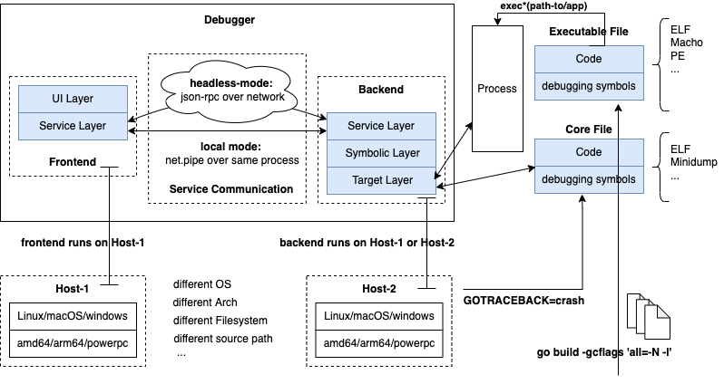

## 整体架构

设计的符号级调试器的整体架构如下图所示，下面首先解释下这么设计的一些考量。

### 前后端分离

调试器的功能，主要包括UI层与用户的交互、符号层的解析、目标层对被调试进程的控制这3大部分组成。如果这几部分功能可以在一个调试器运行实例中完成，为什么我们要将其拆分成前端、后端两个调试器运行实例呢？

一种大家比较熟悉的调试场景是，通过gdb、lldb、dlv或者IDE自带调试器对本地程序进行调试。本地调试场景下，通常运行一个调试器实例就足够了，这样UI交互、符号解析、进程控制都在同一个调试器运行实例中实现，这种方式是读者朋友很容易接受和理解的。

接下来我们看一些其其他的调试场景，对调试器架构提出了新的要求。

#### **被调试进程所在主机没有源码**

那大家有没有想过这样的情况呢？

- 待调试的目标进程，它运行在另一台机器Host-2上，而我现在的机器是Host-1；

  或者，待调试的程序，它位于另一台机器Host-2上；

- Host-2上没有源代码；

这种情况下，读者会想，既然被调试进程在另一台机器，调试肯定需要源代码，那我传一份源代码到Host-2机器，然后我登录Host-2机器不就可以了吗？

> dlv需要上传源码到被调试进程所在主机，只是说路径可能会不同，需要考虑路径替换问题。其实如果在前后端分离架构下，只利用调试器前端所在主机上的源码进行调试、而无需上传源码到被调试进程所在主机，这种方式是最简单不过的了。

#### **无法拷贝源码或源码路径不一致**

好，我们继续抛新的问题吧：

- Host-2机器不能通过人工进行登录，仅对外暴露了服务端口、调试端口、管理端端口；

- Host-2机器上有足够的磁盘空间，但是程序编译时源代码位于项目/data目录下，而Host-2根目录下没有/data，或者没有写入权限；

  或者，Host-2机器上没有足够的磁盘空间，无法上传源代码文件；

- Host-2上封禁了sz/rz端口，不允许私自上传文件；

这意味着我们不能上传源代码上去了，而且也不能在目标机器上运行调试器进行调试。

这个时候大家可能又想到，我不能把源代码传上去，那我把Host-2上待调试进程的二进制程序下载到本机（Host-1），我在本机调试总可以了吧？

#### **被调试程序二进制不兼容**

比较遗憾的是：

- 本机Host-1操作系统可能是Linux，但是Host-2操作系统可能是Windows或者Darwin；
- 或者Host-1是Linux，Host-2也是Linux，但是Host-1架构是amd64，但是Host-2却是arm64；

这意味着Host-2上的二进制程序在Host-1上是无法正常运行的。即使在本机Host-1上已经安装好了调试器，也有完整的源代码，且源代码路径与当初二进制程序构建时的源码路径完全一致，我们也无法发起一次有效的调试。

#### 总结

问题1、2、3就是导致我们考虑实现前、后端分离式架构的主要原因，只有这样做了，我们才能将调试器的用户界面逻辑与调试器的不同平台实现进行很好地解耦。

结合架构图来看，我们将Debugger拆分为了Frontend和Backend两部分：

- 其中Frontend主要负责与用户交互的调试动作，如获取用户调试命令、显示最新的调试结果等；
- 其中Backend主要负责不同平台上的具体实现，如针对Linux/amd64平台下的ELF可执行程序进行调试，它要解析负责解析存在ELF文件中的DWARF调试信息格式，并通过Linux平台的系统调用对被调试器进程进行控制；
- Frontend和Backend二者之间需要结合通讯，Frontend将用户调试动作转换为对Backend对进程的控制，并将Backend返回的数据进行数据格式转换后展示给用户；

### 通信模式

调试器的前后端分离式架构离不开前、后端之间的通讯，那这里的通讯应该考虑些什么呢？

#### 不同进程：json-rpc over network

如果前后端运行在不同的机器，那么没什么可选择的，只能通过网络通信。在go标准库中提供了json-rpc的能力，我们可以借助go标准库轻松实现前、后端的通信。

一旦我们实现了前后端json-rpc通信的能力，其实如果前后端运行在相同主机上的问题，也可以解决了，只不过这个时候的网络地址变成了本地回环地址localhost/lo而已。

针对运行在相同主机这种情况，我们还需要考虑地更细致些，对使用方更友好一些，设计上更优雅一些。

#### 同进程内：ListenerPipe

如果前后端都运行在本机，那似乎直接UI层、符号层、目标层就足够了，这种形式下用户调试动作转换为目标层进程控制就是简单的上层调用下层封装的函数。但是我们已经拆分成前后端分离式架构了，且明确了前、后端之间要借助service通讯来完成交互。如果仅仅是因为本机，就直接绕过service层对target层进行函数调用，会让各层之间的边界不清不楚、不优雅、徒增复杂性。

那我们是不是可以选择json-rpc，完全通过网络方式来进行呢？我们可以和操作系统申请一个端口并用这个端口来完成通信，以避免固定一个端口与其他调试器实例或者其他本机进程出现端口占用冲突。

这个方案是一个可行的方案，但是我们再仔细斟酌下：

- 在同一台机器上运行两个前端、后端两个调试器实例，它们之间通过json-rpc通信，但是这种多进程架构、本机却还通过网络通信，这种不够优雅。以Linux为例，为什么父子进程不借助pipe、fifo、共享内存等高效率的通信方式呢？

- 假设仍采用前后端两个调试器实例，首次启动的调试器实例为父进程，它应该作为前端进程，它还需要启动一个子进程，然后在二者之间建立一个pipe用来完成进程间通信？这种多进程+pipe的方式多出现在c/c++单进程单线程程序中，而go本身是协程并发，直接一个进程+pipe就可以搞定类似的功能？而且标准库确实也提供了net.Pipe来返回这样的pipe供goroutines间进行通信。

- 搞明白这些，现在要考虑下如何对service层的通信进行设计。service层涉及到的无非是网络通信，前端涉及到的是net.Dial(...)建立连接net.Conn，而后端涉及到的是net.Listen(...)获取listener并通过listener.Accept(...)获取新建立的连接net.Conn，然后frontend、backend通过各自建立的net.Conn进行通信。

  对于json-rpc而言本身就是走的go的网络库，这些操作自然是没问题的。但是如果我们想在同一个进程里面让前后端的service层通过net.Pipe通信，还要向网络通信接口看齐，那我们可以自定义实现net.Listener，如ListenerPipe，它内部包括了一个net.Pipe，后端通过ListenerPipe.Accept返回一个net.Conn实现（本质是net.Pipe的一端），而前端也可以拿到与之关联的net.Conn实现（本质也是net.Pipe的一端）与后端进行通信。

#### 总结

这样我们就实现了调试器在相同主机、跨不同主机下运行的service层通信问题，当跨不同主机时，可以用json-rpc完成通信，当在相同主机时也可以用json-rpc通信，也可以用单进程+ListenerPipe来实现。

后面我们会讲述调试器运行时如何决定自己运行在前后端单一进程模式下，还是前后端分离模式下。

### 平台可扩展性

讲述前后端分离式架构时，我们提到了前端、后端可能运行在不同类型的主机上，这些主机的操作系统、硬件架构可能都有明显的差异。这些差异性可能会导致我们的调试器在一种操作系统、硬件平台组合下运行良好，但是在另一种组合下可能会直接crash或者根本无法运行。

调试动作相对来说是可枚举的，如设置断点、读写内存、读写寄存器、单步执行等，我们需要将其转换为目标层的操作集合，而在不同操作系统、硬件平台实现这些目标层的操作时，就需要考虑不同平台的差异性。

这里就需要对目标层的操作集合进行必要的抽象，如提炼出一个Target interface{}，它包含了对目标进程所有的操作，然后不同的操作系统、硬件平台提供对应的Target interface{}的实现。

### 调试对象扩展性

我们要调试的可能是一个运行中的进程，也可能是一个已经消亡的进程生成的core文件（也习惯称coredump文件）。

运行中的进程，只要它还在运行期间，你几乎可以通过操作系统拿到它所有的状态信息，但是一旦它挂掉了仅仅通过其挂掉前生成的core文件是不可能还原出进程运行时所有的状态信息的。core文件中通常只记录了进程挂掉之前的调用栈信息，以方便开发人员了解程序最终在这里出现了致命的、不可恢复的错误。

我们前面提到Target interface{}是对目标进程进行控制，这里当然也就少不了对进程状态的读写，这里就需要考虑对真是的进程和进程core文件状态读写的差异性，就需要考虑提炼出一个Process interface{}，而进程、core文件提供对应的实现。

### 文件可扩展性

不同操作系统上生成的可执行文件、core文件的格式是有差异的，如Linux多是采用ELF，Darwin多是采用Macho，Windows是采用PE，而对于core文件呢，Linux是采用的ELF，Windows是采用的PE，Darwin不详。

这些文件格式的差异，注定了我们在读取文件时、读取调试信息时会存在一定的差异性，比如：

- 它们的文件头都不一样的；
- 调试信息存储的section名可能也不一样，如有的开启了zlib压缩放在了.zdebug\_* sections下，有的没压缩放在了.debug\_* sections下；
- 甚至它们都不将调试信息数据放在二进制程序文件中，如Darwin可能将调试信息放在与二进制程序同级的.dSYM目录下；
- 更有甚者它们都不一定使用DWARF调试信息格式；

因此，对可执行文件的描述需要进行适当的抽象，以屏蔽不同平台可执行文件的差异。

### 调试信息格式可扩展

调试信息格式也是可能不同的，DWARF是后起之秀，且采用DWARF来作为调试信息格式的语言、工具链越来越多，比如go工具链就是采用DWARF作为其调试信息格式。

因为本书主要是介绍go符号级调试器的设计实现，而go编译工具链本身也是采用的DWARF，所以我们本来没有必要提及调试信息的可扩展性。但是谁也不能保证后续会不会出现一个描述性更强、效率更高、占用空间更少的调试信息标准，即便不会出现，DWARF本身也是一个不断演进中的标准，从其广泛接受的版本v4到现如今的v5，也还是有些差异的，那当我们调试携带有不同版本DWARF数据的二进制程序时，也要面临这个差异性的问题。

为此我们可以考虑在调试信息格式的加载、读取、解析时进行一定的抽象，从而屏蔽DWARF不同版本、甚至是不同调试格式的差异。

DWARF作为后期之秀，其前辈们（如Stabs、COFF、PE/Coff、OMF、IEEE-695等）是不可能再战胜它了，如果读者对这些过去曾名噪一时的标准感兴趣，可以参考：[Debugging Information Format](https://en.wikipedia.org/wiki/Debugging_data_format#:~:text=A%20debugging%20data%20format%20is,to%20allow%20source%2Dlevel%20debugging)。

### 应用场景扩展

调试器实现了前后端分离式架构之后，也给了我们更大的灵活性，不禁要问，我们实现的调试器除了运行在本地机器、远程机器上调试目标程序之外，还可以干什么呢？

当前我们只讨论了把我们自己实现的调试器前端和调试器后端结合起来，但是：

- 我们没有讨论如何将我们的调试器前端与其他的调试器后端结合起来；
- 我们也没有讨论如何将我们的调试器后端给其他的调试器前端使用；

读者此时可能会产生疑问了，为什么还有这样的场景呢？我来给大家举几个例子吧。

#### 复用其他调试器的能力

假设我们实现的调试器后端部分缺少一个功能，比如dlv没有ptype打印类型信息的能力，但是gdb有这个能力，那我能不能用dlv的前端连接gdb的后端来实现ptype功能呢？

再比如，我现在想实现反向调试功能，但是dlv没有这个能力，但我知道mozilla rr（record and play）可以实现反向调试，那我能不能用dlv的前端连接rr实现反向调试功能呢？

为了能够让我们的后端支持dlv backend、gdb backend、rr，我们也可以进行必要的抽象设计，这样当我们调试时可以指定--backend参数来启动不同的backend实现。

#### 输出调试能力与IDE等集成

假设我们的调试器后端实现的非常完善，我们想提供给其他的调试器前端使用，这里的前端当然不只是命令行工具，所有可以通过json-rpc访问我们调试器后端的客户端都可以看做是我们能支持的调试器前端，比如一些集成开发环境VSCode、Goland。

理论上只要VSCode、Goland通过我们提供的接口来访问就可以了，但是现实情况下需要考虑的更多。VSCode、Goland作为明显有大公司背书的产品，怎么可能会来适应我们这样的个人开发者开发的调试器后端呢？除非我们是业界翘楚。

那应该怎么做呢？以VSCode为例，VSCode作为开源的集成开发工具，调试功能是很重要的一项能力，但是扩展支持一门新的编程语言后，调试器肯定也要随之扩展，但是显然这不能由微软来支持吧？微软为其设计了调试器适配器协议（Debugger Adapter Protocol，简称DAP），只要第三方调试器实现实现了DAP中定义的所有接口，就可以实现与VSCode调试器的无缝集成。

#### 总结

如果我们希望进一步扩展调试器前端可连接的调试器后端，就需要进行必要的抽象，能通过--backend参数指定要启动的调试器后端；如果我们希望把实现的调试器后端与其他的IDE集成，就要尽可能考虑通过标准的DAP对外暴露服务。

### 本节小结

本节我们介绍了设计的go符号级调试器的整体架构，并由浅入深地解释了前后端分离架构的原因、本地及远程调试时的通信模式、平台可扩展性、调试对象的多样性、文件格式多样性、调试信息格式的多样性、更广泛的应用场景。

读者现在应该对我们接下来要实现的go符号级调试器有了一个整体性的认识了。