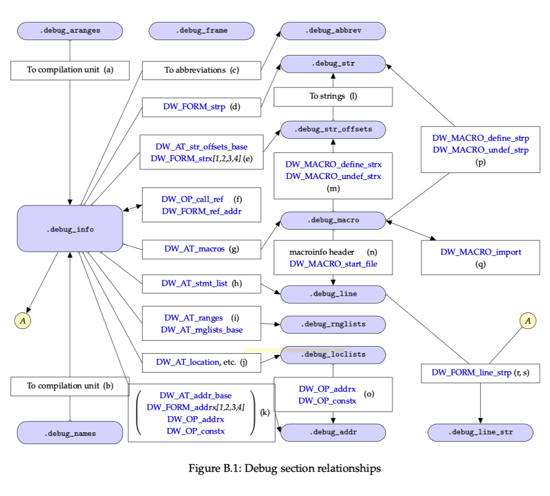
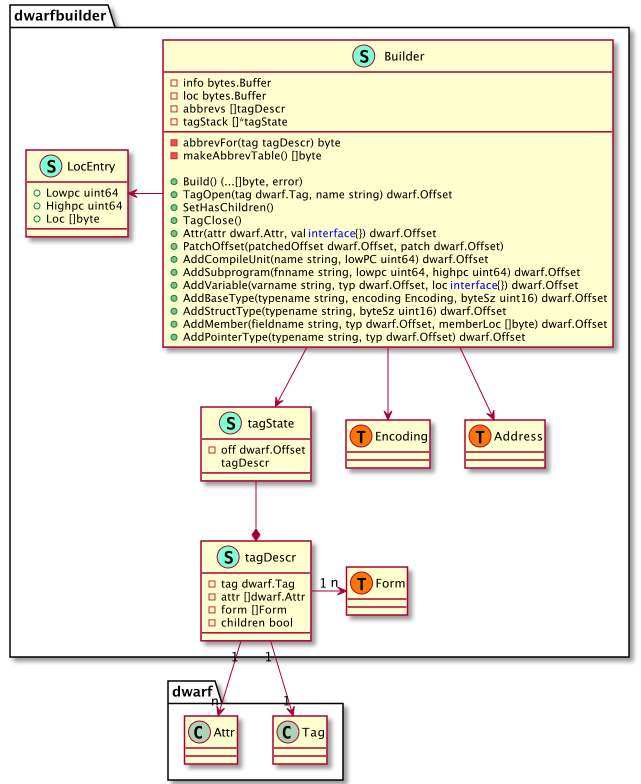
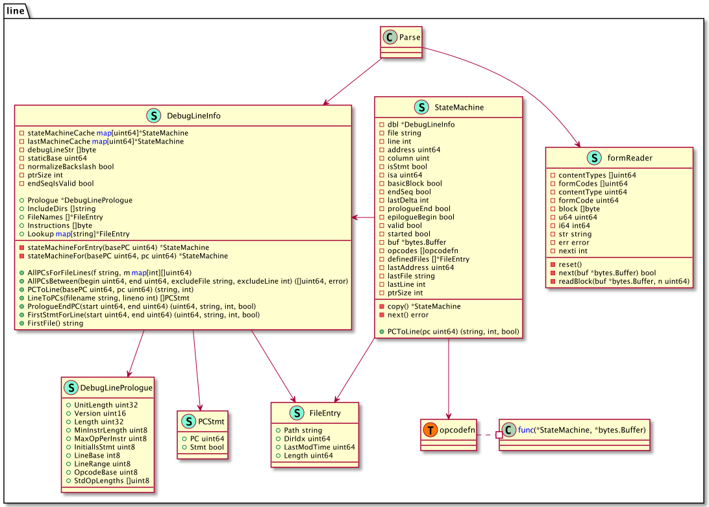
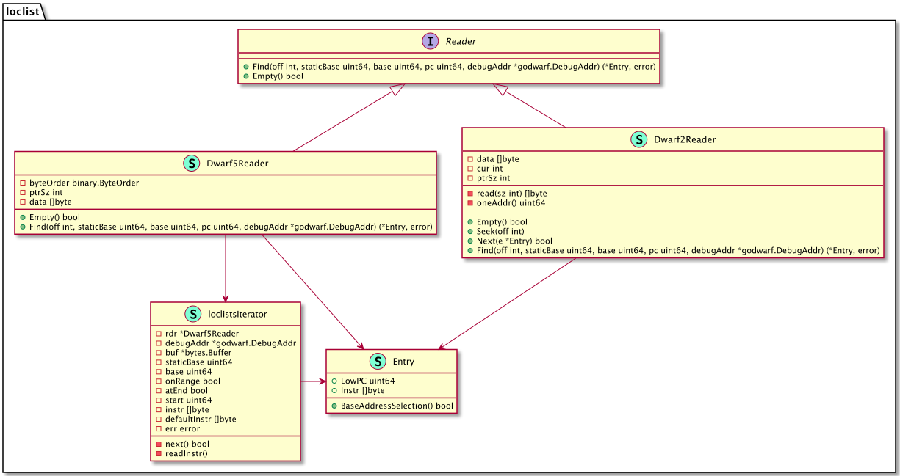
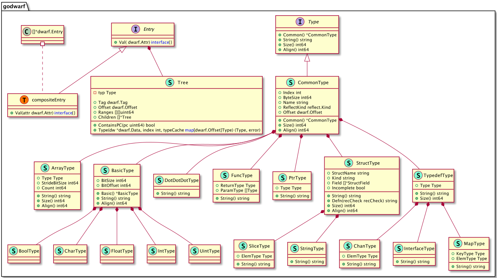
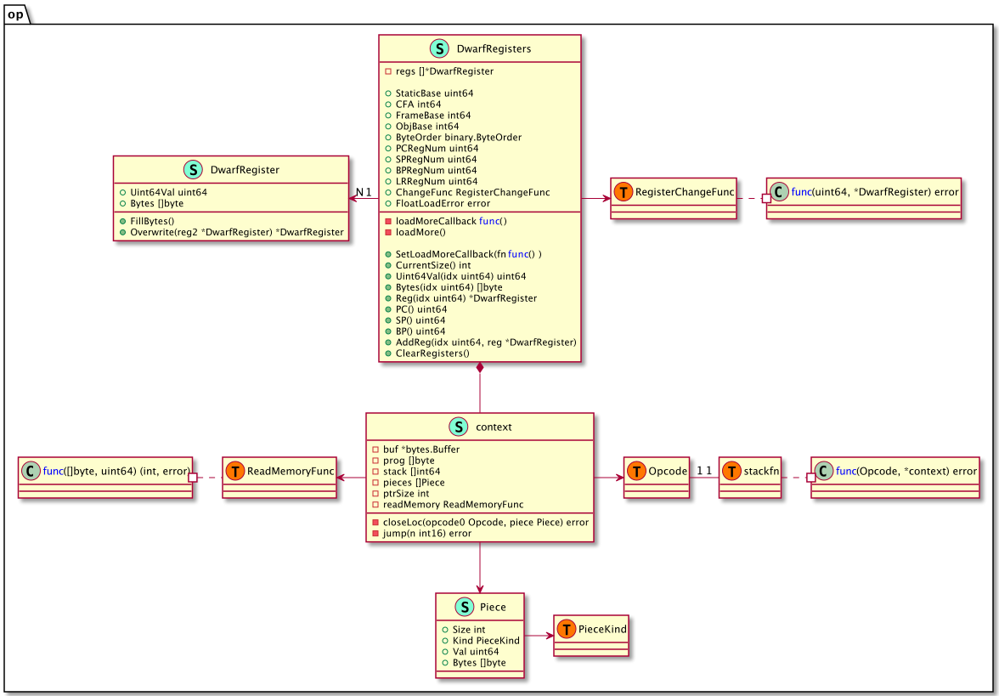
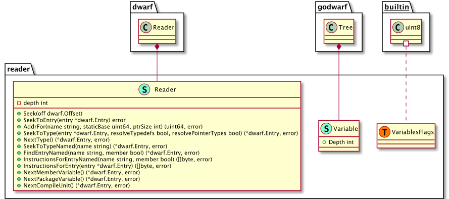

## 后端符号层设计

本节我们来介绍下调试器后端的符号层设计，这里的符号层指的就是DWARF调试信息，在第8章中我们介绍了DWARF调试信息标准，也结合go-delve/delve中DWARF相关的实现，提供了一些关于读取并利用DWARF数据读取类型、函数、变量、调用栈等操作的测试用例。大家应该对DWARF是什么、怎么用有了一个基本的认识。

由于DWARF调试信息标准本身的复杂性、以及go编译工具链生成调试信息的复杂性，如果我们从0到1重新实现一遍DWARF调试信息的读取、解析，对我们的工作量来说实在太大了。要知道，迄今为止，go-delve/delve已经是一款诞生超过8年的调试器了，但是对于DWARF的完善仍在不间断进行中。

### DWARF sections之间的关系

下面这张图展示了DWARF相关的sections之间的联系，我们来说下这里的联系，然后来解释下go-delve/delve中DWARF相关的设计。



这张图显示了DWARF主要的sections之间的联系，这些sections之间的引用场景、引用方式，看这张图基本能看个大概（只要您还记得各个section是干什么的），详情可以参考DWARF standard v5 Appendix B。

您可以结合下表来回顾各个DWARF section的作用：

| section           | description                                             |
| :---------------- | :------------------------------------------------------ |
| .debug_abbrev     | Abbreviations used in the .debug_info section           |
| `.debug_aranges`  | Lookup table for mapping addresses to compilation units |
| `.debug_frame`    | Call frame information                                  |
| `.debug_info`     | Core DWARF information section                          |
| `.debug_line`     | Line number information                                 |
| `.debug_loc`      | Location lists used in the `DW_AT_location` attributes  |
| `.debug_macinfo`  | Macro information                                       |
| `.debug_pubnames` | Lookup table for global objects and functions           |
| `.debug_pubtypes` | Lookup table for global types                           |
| `.debug_ranges`   | Address ranges used in the `DW_AT_ranges` attributes    |
| `.debug_str`      | String table used in `.debug_info`                      |
| `.debug_types`    | Type descriptions                                       |

> 您可以写个go程序编译后，然后利用aarzilli写的这个小工具diexplorer来浏览.[z]debug_info、.[z]debug_frame中的调试信息，非常有助于加深理解，diexplorer工具地址：https://github.com/aarzilli/diexplorer，您可以通过`go get`安装。
>
> - go中每个package（而非每个源文件）作为一个.[z]debug_info中的一个compile unit DIE；

### pkg/dwarf设计

#### dwarfbuilder

package dwarfbuilder主要是用来生成DWARF调试信息的，我们什么时候会需要生成DWARF调试信息呢？我们希望能让运行中的go程序生成core文件。我们通常会在go程序crash时得到一个core文件（启动时要加环境变量GOTRACEBACK=crash），其实也可以在程序运行期间动态地让其生成一个core文件。

core文件在Linux下也是ELF格式的，我们要在这个文件里面写入一些可以用于调试的信息，这里就需要能够显示构造DWARF sections，dwarfbuilder就需要用来生成这里的DWARF sections中的数据，主要是生成.[z]debug_info中的数据。



#### frame

.[z]debug_frame中的数据可以用来构建调用栈信息表，当在程序执行期间可以用来构建调用栈，并能允许我们在调用栈上往前往后选择栈帧，并查看处于这个栈帧中的变量信息。当然也可以通过bt打印当前的调用栈信息。

.[z]debug_frame中的信息主要由一系列CIE（每个编译单元一个）以及一系列的FDE（每个编译单元中有很多的FDE）构成。实际解析完这里的数据后就能得到一个FrameDescriptionEntries，并在其上面封装了几个常用方法，如FDEForPC，当我们指定了一个指令地址时，它能够返回对应的栈帧。

当我们指定了一个PC值，执行它的EstablishFrame将执行调用栈信息表中的指令，完成之后就可以构建出一个FrameContext，其中就记录了此时的CFA、Regs、RetAddrReg数据，有了这些数据就可以算出当前函数的返回地址，从而进一步计算出调用函数对应的栈帧……重复这个过程就能够计算出调用栈。


#### line

.[z]debug_line中记录着指令地址与源码文件的行号表信息，这张表中的数据将协助我们完成源码地址与指令地址之间的相互转换。

这个package的设计大致如下所示，`line.Parse(*DebugLineInfo, *bytes.Buffer)`，.[z]debug_info中的数据即为第二个参数，解析完后*DebugLineInfo中的数据将被填充好。

解析的过程中，需要用到formReader来从*bytes.Buffer中读取并解析数据，这张表在建立过程中需要用到这里的StateMachine来执行其中的字节码指令来完成表的重建。

最终，我们可以通过DebugLineInfo中的导出方法来实现一些常用操作，如PCToLine将PC地址转换为源文件地址，LineToPC将源文件地址转换为指令地址PC等。



#### loclist

.[z]debug_loc、.[z]debug_loclist中存储了一些地址相关的信息，前者是DWARF standard v2中定义的，后者是DWARF standard v5中定义的，后者比前者更节省存储空间、效率也更高。



这部分数据描述了对象的地址，当要描述一个对象的地址时，如果在其整个生命周期内它的地址可能会改变的话，就需要通过loclists来描述。什么情况下会出现这种情况呢？

这里的位置改变并不是说对象会迁移（类似GC那样），它的意思是说随着程序执行，PC值一直在变化，此时为了更快速的计算出对象地址，可能会在loclists中生成新的一条loc entry，这样通过查找对应的entry就可以快速计算出其地址。

比如有段这样的程序：

```c
void delay(int num)
{
   volatile int i;
   for(i=0; i<num; i++);
}
```

执行编译`gcc -g -O1 -o delay.o delay.c`会生成一个delay.go文件，反汇编：

```asm
00000000 <delay>:
   0:   e24dd008    sub sp, sp, #8
   4:   e3a03000    mov r3, #0
   8:   e58d3004    str r3, [sp, #4]
   c:   e59d3004    ldr r3, [sp, #4]
  10:   e1500003    cmp r0, r3
  14:   da000005    ble 30 <delay+0x30>
  18:   e59d3004    ldr r3, [sp, #4]
  1c:   e2833001    add r3, r3, #1
  20:   e58d3004    str r3, [sp, #4]
  24:   e59d3004    ldr r3, [sp, #4]
  28:   e1530000    cmp r3, r0
  2c:   bafffff9    blt 18 <delay+0x18>
  30:   e28dd008    add sp, sp, #8
  34:   e12fff1e    bx  lr
```

我们可以看到指令地址范围，现在我们继续看下对应的DWARF数据：

```bash
<1><25>: Abbrev Number: 2 (DW_TAG_subprogram)
   <26>   DW_AT_external    : 1
   <27>   DW_AT_name        : (indirect string, offset: 0x19): delay
   <2b>   DW_AT_decl_file   : 1
   <2c>   DW_AT_decl_line   : 1
   <2d>   DW_AT_prototyped  : 1
   <2e>   DW_AT_low_pc      : 0x0
   <32>   DW_AT_high_pc     : 0x38
   <36>   DW_AT_frame_base  : 0x0      (location list)
   <3a>   DW_AT_sibling     : <0x59>
...
<2><4b>: Abbrev Number: 4 (DW_TAG_variable)
   <4c>   DW_AT_name        : i
   <4e>   DW_AT_decl_file   : 1
   <4f>   DW_AT_decl_line   : 3
   <50>   DW_AT_type        : <0x60>
   <54>   DW_AT_location    : 0x20     (location list)
```

我们看到了变量i的定义，从其属性DW_AT_location中看到其位置在location list中描述，因此也继续输出下其.debug_loc：

```bash
Offset   Begin    End      Expression
00000000 00000000 00000004 (DW_OP_breg13 (r13): 0)
00000000 00000004 00000038 (DW_OP_breg13 (r13): 8)
00000000 <End of list>
00000020 0000000c 00000020 (DW_OP_fbreg: -12)
00000020 00000024 00000028 (DW_OP_reg3 (r3))
00000020 00000028 00000038 (DW_OP_fbreg: -12)
00000020 <End of list>
```

我们可以看到当指令地址从4到38时其位置的计算表达式为r13+8，当其地址为c到20时其地址为fbreg-12，当地址为24到28时其地址为r3，当地址为28到38时其地址为fbreg-12。可见这里的位置改变是说的随着指令地址PC值的改变，其位置计算的表达式发生了改变，而之所以发生改变，是因为随着指令执行过程中，某些寄存器被使用了不能再按照之前的表达式进行计算，所以才在.debug_loc或者.debug_loclists中生成了新的loclists entry。

> 该demo取自stackoverflow问答：https://stackoverflow.com/q/47359841。

#### godwarf

.[z]debug_info中通过DIE Tree来描述定义的类型、变量、函数、编译单元等信息，DIE通过Tag、Attr来描述具体的对象，这些DIE可以构成一个Tree。

package godwarf提供了导出函数来简化DIE Tree的加载、解析逻辑。



#### op

package op中最重要的一个导出函数，`op.ExecuteStackProgram(...)`执行一个DWARF位置表达式并返回计算出的低质值int64，或者返回一个[]Piece，每个Piece描述了一个位置，这里的位置可能是在内存（地址为Piece.Val）、寄存器（编号在Piece.Val）、立即数（Piece.Val或Piece.Bytes）。

op.DwarfRegisters、op.DwarfRegister这两个类型比较重要，它定义了stack program所需要用到的寄存器。相关的函数、方法逻辑也比较简单。



#### reader

这里定义了DWARF读取解析.debug_info的一个更方便的reader，它建立在go标准库实现dwarf.Reader基础上。这个reader能够很方便地seek，读取变量、类型、函数、编译单元等程序要素。



#### regnum

定义了一些寄存器号和对应的寄存器名。

#### util

定义了一些常用的工具函数、解码DWARF数据的buf。

### 本节小结

本节介绍了与DWARF相关的一些设计细节。

TODO 这部分数据再稍微润色下吧，部头太大感觉不是很方便与所有内容串接起来。
