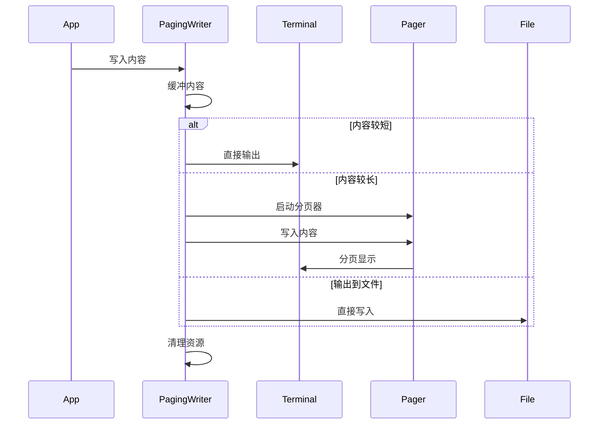

## 分页输出的设计与实现

### 功能概述

分页输出（Paging Output）是调试器中的一个重要功能，它能够智能地处理大量输出内容，通过分页器（如 less、more 等）来展示输出，提升用户体验。这个功能在查看大量调试信息、堆栈跟踪或变量内容时特别有用。

### 核心设计

分页输出的核心是 `pagingWriter` 结构体，它实现了 `io.Writer` 接口，可以动态决定是否使用分页器来展示输出。主要设计特点包括：

1. 支持多种输出模式：

   - 直接输出到终端
   - 通过分页器输出
   - 输出到文件
2. 智能判断：

   - 根据输出内容长度决定是否使用分页
   - 考虑终端窗口大小
   - 支持用户配置

### 关键实现

```go
type pagingWriter struct {
    mode     pagingWriterMode    // 输出模式
    w        io.Writer          // 基础输出流
    buf      []byte             // 输出缓冲区
    cmd      *exec.Cmd          // 分页器命令
    cmdStdin io.WriteCloser     // 分页器输入流
    pager    string            // 分页器程序名，如环境变量设置PAGER=less or PAGER=more
    lastnl   bool              // 上次输出是否以换行结束
    cancel   func()            // 取消函数

    lines, columns int         // 终端窗口大小
}
```

#### 输出流程

1. 初始化阶段：

   - 检测终端大小
   - 确定输出模式
   - 准备分页器（如果需要）
2. 写入阶段：

   - 缓冲输出内容
   - 根据内容长度和终端大小决定是否启用分页
   - 将内容写入到目标（终端/分页器/文件）
3. 清理阶段：

   - 关闭分页器
   - 清理缓冲区
   - 重置状态

### 流程图



### 使用场景

1. 调试会话记录：

   - 使用 transcript 命令时，可以选择是否启用分页
   - 大量输出时自动切换到分页模式
2. 变量查看：

   - 查看大型数据结构时自动分页
   - 支持在分页模式下搜索和导航
3. 堆栈跟踪：

   - 长堆栈信息自动分页
   - 便于逐页查看调用链

### 小结

分页输出功能通过智能的内容管理和展示方式，显著提升了调试器的可用性。它能够：

1. 自动适应不同的输出场景
2. 提供更好的用户体验
3. 有效处理大量输出内容
4. 保持输出的一致性和可读性

这个功能的设计充分考虑了实际使用场景，是调试器输出系统的重要组成部分。
