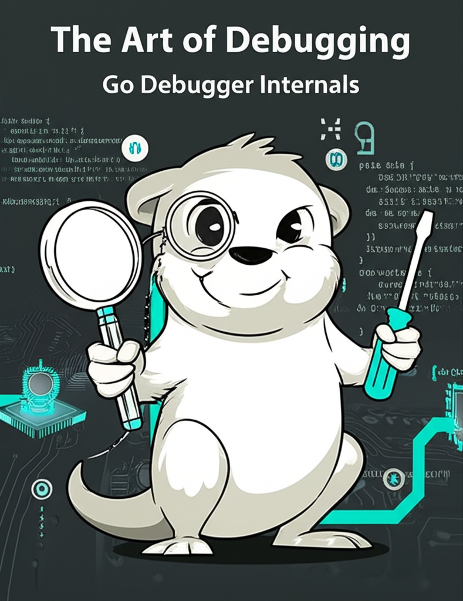

# 1 Go语言调试器开发

## 1.1 作者简介

Hi，我是张杰，目前就职于腾讯（深圳）科技有限公司，后台开发高级工程师。在腾讯工作期间，曾先后从事Now直播后台、看点后台、信息流内容处理系统方面的建设，也作为核心开发先后参与了微服务框架goneat、trpc的设计、开发，以及公司代码规范的制定、职级晋升、实习生留用等代码评审工作。

从高中毕业开始接触编程，到大学系统性学习，再到毕业参加工作至今，一转眼十年过去。计算机技术的发展始终吸引着我去学习、去思考、去探索更广阔的应用场景来丰富我们的现实生活。

开源让我接触了更大的世界，在开源中学习，在开源中贡献。我很欣赏那种技术精湛、乐于分享甚至连指尖都洋溢着才华与天赋的工程师，并将这类人作为我的榜样，在工作学习实践中也经常总结与分享，本书就是其中一个例子。

## 1.2 关于本书

计算机是个系统性工程，比如“一个程序是如何运行的”，看似简单的问题牵扯到了编程语言、编译器、链接器、操作系统、处理器、内存、总线控制等方方面面的内容，要掌握这些内容需要长时间的学习与实践。

我是从2016年开始了解go语言，2018年开始正式将其作为主力开发语言，期间还经历了些小插曲——对go的抵触。在深入了解c、cpp、java第三方协程库支持以及开发实践之后，最终认识到了go的优雅并决定掌握go。

学习go时，新手难免会遇到通过调试来认识语言细节的情况。delve是一款针对go语言的符号级调试器，在使用delve的过程中联想到可以从调试器角度切入来窥探计算机世界的秘密。不管是什么编程语言，只要有调试信息支持，总能借助调试器来窥探进程的运行过程。形象点的话可以联想下FPS游戏，一倍镜窥探代码执行，二倍镜窥探变量，三倍镜窥探类型系统，四倍镜窥探硬件特性……有什么能逃过调试器的法眼呢？

本书希望能从go调试器角度出发让开发者更好地理解go编程语言、编译器、链接器、操作系统、调试器、硬件之间的联系，这会比割裂似的课程教学更容易让读者认识到它们各自的价值以及彼此间密切的协作。开发者也将掌握调试器开发能力，从而可以开发一些针对语言级别的运行时分析、调试能力。

## 1.3 本书内容

调试过程，并不只是调试器的工作，也涉及到到了源码、编译器、链接器、调试信息标准，因此从（本书）调试器视角来看，它看到的是一连串的协作过程，可以给开发者更宏观的视角来审视软件开发的位置。

调试标准，调试信息格式有多种标准，在了解调试信息标准的过程中，可以更好地理解处理器、操作系统、编程语言等的设计思想。结合调试器实现还可以了解、验证某些语言特性的设计实现。

调试需要与操作系统交互来实现，调试给了一个更加直接、快速的途径让我们一窥操作系统的工作原理，如任务调度、信号处理、虚拟内存管理等。操作系统离我们那么近但是在认识上离我们又那么远，调试器依赖操作系统支持，也是个加深对操作系统认识的很好的契机。

此外，调试器是开发常用工具，本书除剖析调试器常用功能的设计实现、调试技巧，也能带读者领略调试信息标准的高屋建瓴的设计思想，站在巨人的肩膀上体验标准的美的一面。

当然在业界已经有针对go语言的调试器了，如gdb、dlv等等，我们从头再开发一款调试器的初衷并非只是为了新而新，而是希望以调试器为切入点，将相关知识进行融会贯通，这里的技术点涉及go语言本身（类型系统、协程调度）、编译器与调试器的协作（DWARF）、操作系统内核（虚拟内存、任务调度、系统调用、指令patch）以及处理器相关指令等等。

简言之，从开发一个go语言调试器作为入口切入，初学者不仅可以从实际工程中学习上手go语言开发，也能在循序渐进、拔高过程中慢慢体会操作系统、编译器、链接器、调试器、处理器之间的协作过程，从而加深对计算机系统全局的认识。

## 1.4 示例代码

本书对应的示例代码，您可以通过以下两种方式获得：

1. [**golang-debugger-lessons**](https://github.com/hitzhangjie/golang-debugger-lessons)，读者可以按照章节对应关系来查看示例代码，目录 [**/0-godbg**](https://github.com/hitzhangjie/golang-debugger-lessons) 中提供了一个相对完整的go语言符号级调试器实现。
2. [**godbg**](https://github.com/hitzhangjie/godbg)，迁移自上述配套示例代码中的/0-godbg，读者如果希望快速体验完整功能，也可以直接体验该项目或查看源码；

   > ps: 项目中提供了vscode的devcontainer配置，采用的是centos+go1.13。如果您升级go版本则可能导致程序出现问题，比如go1.14引入抢占问题，意味着调试器必须解决抢占问题，这可能导致调试器工作不符合预期。
   >
   > 另外，如果您使用其他版本，书中内容描述可能与真实情况有差异，比如go1.13编译后会将DWARF信息写入.zdebug_ sections，但是go1.19则会将不会写入.zdebug_ sections（写入的事.debug_ sections）。
   >
   > 强烈建议您先试用提供的开发容器进行测试、学习，当您掌握了一些基础之后，再按需升级go版本不迟。
   >
3. [**hitzhangjie/delve**](https://github.com/hitzhangjie/tinydbg)，该项目由go-delve/delve裁剪而来，为了方便讲述与符号级调试器最核心的部分，项目中剔除了与linux/amd64无关的一些扩展实现。本书有关符号级调试器实现部分会借鉴此项目中的代码。

## 1.5 联系方式

如果您有任何建议，请提[Issues](https://github.com/hitzhangjie/golang-debugger-book/issues)，或邮件联系 `hit.zhangjie@gmail.com`，标题中注明来意 `GoDebugger交流`。

希望该书及相关示例，能顺利完成，也算是我磨练心性、自我提高的一种方式，如果能对大家确实起到帮助的作用那是再好不过了。

如果喜欢本书，别忘了 [Star](https://github.com/hitzhangjie/golang-debugger-book) 一下对作者予以支持 :)
