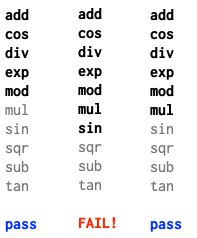
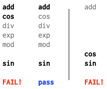
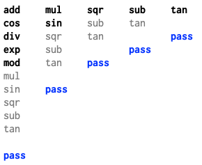
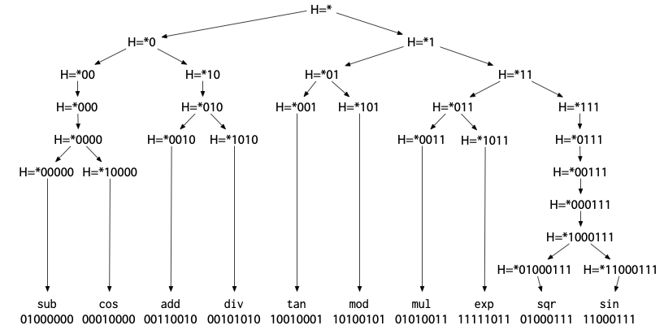
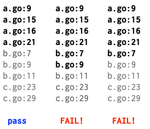

## Go编译器+运行时DEBUG：基于哈希的二分调试技术

【注】本文翻译自 Russ Cox 于2024-07-18 发表的一篇文章[《Hash-Based Bisect Debugging in Compilers and Runtimes》](https://research.swtch.com/bisect)。为了本章bisect reduce调试技术的内容完整性，特别引用并翻译该文章来介绍bisect reduce的算法逻辑。

### [背景介绍](https://research.swtch.com/bisect#setting_the_stage)

这样的场景是否似曾相识？你对某个库进行修改以优化性能、清理技术债务或修复bug，结果却收到一份错误报告：某个庞大而复杂的测试用例现在失败了。或者你添加了一个新的编译器优化，结果也大同小异。现在你不得不在一个完全陌生的代码库中进行大量的调试工作。

如果我告诉你，存在一种"魔法棒"可以精确定位那个陌生代码库中的相关代码行或调用栈，你会作何感想？这种工具确实存在。这是一个真实可用的工具，我将向你展示它的神奇之处。这个描述可能听起来有些夸张，但每次我使用这个工具时，它确实给我带来魔法般的感觉。这不是普通的魔法，而是最棒的魔法：即使你完全了解它的工作原理，观看它的运行过程仍然令人赏心悦目。[](https://research.swtch.com/bisect#binary_search_and_bisecting_data)

### [二分搜索与数据二分](https://research.swtch.com/bisect#binary_search_and_bisecting_data)

在介绍新技巧之前，让我们先回顾一些更简单、更基础的技术。每个优秀的魔术师都从掌握基本功开始。在我们的场景中，这个基本功就是二分搜索。大多数二分搜索的演示都专注于在有序列表中查找元素，但实际上它有着更加有趣的应用。这是我很久以前为Go的[`sort.Search`](https://go.dev/pkg/sort/#Search)文档编写的一个例子：

```go
func GuessingGame() {
    var s string
    fmt.Printf("Pick an integer from 0 to 100.\n")
    answer := sort.Search(100, func(i int) bool {
        fmt.Printf("Is your number <= %d? ", i)
        fmt.Scanf("%s", &s)
        return s != "" && s[0] == 'y'
    })
    fmt.Printf("Your number is %d.\n", answer)
}
```

如果我们运行这段代码，它会和我们玩一个猜数字游戏：

```bash
% go run guess.go
Pick an integer from 0 to 100.
Is your number <= 50? y
Is your number <= 25? n
Is your number <= 38? y
Is your number <= 32? y
Is your number <= 29? n
Is your number <= 31? n
Your number is 32.
%
```

同样的猜数字游戏原理也可以应用到调试中。Jon Bentley在他1983年9月发表于《ACM通讯》的《编程珠玑》专栏"Aha! Algorithms"中，将二分搜索称为"寻找问题的解决方案"。这是他给出的一个经典例子：

> Roy Weil在清理大约一千张包含一张坏卡片的穿孔卡片时应用了[二分搜索]技术。不幸的是，坏卡片无法通过视觉识别；只能通过将卡片的某个子集运行程序并观察严重错误的答案来识别——这个过程需要几分钟。他的前任们试图通过一次运行几张卡片来解决这个问题，并朝着解决方案稳步（但缓慢）前进。Weil是如何在仅十次程序运行中找到罪魁祸首的？

显然，Weil使用了二分搜索的猜数字游戏策略。坏卡片在前500张中吗？是的。前250张中吗？不是。以此类推。这是我能够找到的关于通过二分搜索进行调试的最早发表描述。在这种情况下，它是用于调试数据的。[](https://research.swtch.com/bisect#bisecting_version_history)

### [基于提交历史的二分搜索](https://research.swtch.com/bisect#bisecting_version_history)

我们可以将二分搜索应用到程序的版本历史上，而不仅仅是数据上。每当我们发现旧程序中出现新错误时，我们就会玩猜数字游戏："这个程序最后一次正常工作是什么时候？"

* 50天前它工作正常吗？是的。
* 25天前它工作正常吗？不是。
* 38天前它工作正常吗？是的。

以此类推，直到我们发现程序最后一次正确工作是在32天前，这意味着错误是在31天前引入的。

通过时间进行二分搜索调试是一个非常古老的技巧，被许多人独立发现了很多次。例如，我们可以使用像`cvs checkout -D '31 days ago'`这样的命令或Plan 9的[更音乐化的](https://9fans.github.io/plan9port/man/man1/yesterday.html)`yesterday -n 31`来玩猜数字游戏。对于一些程序员来说，使用二分搜索来调试数据或通过时间调试的技术似乎"[如此基础，以至于没有必要写下来](https://groups.google.com/g/comp.compilers/c/vGh4s3HBQ-s/m/qmrVKmF5AgAJ)"。但记录这些技巧是确保每个人都能掌握的第一步：魔术技巧可以是基础的，但不一定是显而易见的。在软件中，记录技巧也是自动化它和构建优秀工具的第一步。

在1990年代后期，版本历史二分搜索的想法[至少被记录过两次](https://groups.google.com/g/comp.compilers/c/vGh4s3HBQ-s/m/Chvpu7vTAgAJ)。Brian Ness和Viet Ngo在COMPSAC '97（1997年8月）发表了"[通过源代码变更隔离进行回归控制](https://ieeexplore.ieee.org/abstract/document/625082)"，描述了他们在Cray Research构建的一个系统，用于交付更频繁的非回归编译器版本。独立地，Larry McVoy在Linux 1.3.73版本（1996年3月）中发布了一个文件"[Documentation/BUG-HUNTING](https://elixir.bootlin.com/linux/1.3.73/source/Documentation/BUG-HUNTING)"。他捕捉到了这个技巧的神奇之处：即使你对被测试的代码没有特别的专业知识，它也能发挥作用：

> 如果你对内核黑客一无所知，这就是如何追踪错误的方法。这是一种蛮力方法，但效果很好。
>
> 你需要：
>
> * 一个可重现的错误 - 它必须可预测地发生（抱歉）
> * 从工作版本到不工作版本的所有内核tar文件
>
> 然后你将：
>
> * 重新构建一个你认为工作的版本，安装并验证它。
> * 在内核上进行二分搜索，找出哪个版本引入了错误。即，假设1.3.28没有错误，但你知道1.3.69有。选择一个中间的内核并构建它，比如1.3.50。构建和测试；如果它工作，选择.50和.69之间的中点，否则选择.28和.50之间的中点。
> * 你将缩小到引入错误的内核。你可能可以做得比这更好，但这变得棘手。
>
> . . .
>
> 我为向Linus和其他内核黑客描述这种蛮力方法而道歉，这几乎不是内核黑客会做的事情。然而，它确实有效，它让非黑客帮助修复错误。这很酷，因为Linux快照让你可以这样做 - 这是你无法用供应商提供的版本做的事情。

后来，Larry McVoy创建了Bitkeeper，Linux将其用作第一个源代码控制系统。Bitkeeper提供了一种通过提交的有向无环图打印最长直线变更的方法，为二分搜索提供了更细粒度的时间线。当Linus Torvalds创建Git时，他将这个想法进一步发展，推出了[`git rev-list --bisect`](https://github.com/git/git/commit/8b3a1e056f2107deedfdada86046971c9ad7bb87)，这启用了相同类型的手动二分搜索。在添加该功能几天后，他在Linux内核邮件列表上[解释了如何使用它](https://groups.google.com/g/fa.linux.kernel/c/N4CqlNCvFCY/m/ItQoFhVZyJgJ)：

> 嗯..既然你似乎是git用户，也许你可以尝试git的"bisect"功能来帮助缩小确切发生的位置（并帮助测试那个东西；）。
>
> 你基本上可以使用git找到一组"已知良好"点和"已知错误"点之间的中点（"二分"提交集），只做几次这些应该给我们一个更好的视图，了解事情开始出错的地方。
>
> 例如，既然你知道2.6.12-rc3是好的，而2.6.12是坏的，你会这样做
>
> git-rev-list --bisect v2.6.12 ^v2.6.12-rc3
>
> 其中"v2.6.12 ^v2.6.12-rc3"基本上意味着"v2.6.12中的所有内容但_不是_v2.6.12-rc3中的内容"（这就是^标记的含义），而"--bisect"标志只是要求git-rev-list列出最中间的提交，而不是那些内核版本之间的所有提交。

这个回应引发了一场[关于简化过程的单独讨论](https://groups.google.com/g/fa.linux.kernel/c/cp6abJnEN5U/m/5Z5s14LkzR4J)，最终催生了今天广泛使用的[`git bisect`](https://git-scm.com/docs/git-bisect)工具。

这里有一个实际例子。我们尝试更新到Go的更新版本，发现一个测试失败了。我们可以使用`git bisect`来精确定位导致失败的特定提交：

```bash
% git bisect start master go1.21.0
Previous HEAD position was 3b8b550a35 doc: document run..
Switched to branch 'master'
Your branch is ahead of 'origin/master' by 5 commits.
Bisecting: a merge base must be tested
[2639a17f146cc7df0778298c6039156d7ca68202] doc: run rel...
% git bisect run sh -c '
    git clean -df
    cd src
    ./make.bash || exit 125
    cd $HOME/src/rsc.io/tmp/timertest/retry
    go list || exit 0
    go test -count=5
'
```

编写正确的`git bisect`调用需要一些注意，但一旦配置正确，你就可以放手让它自动运行，让`git bisect`施展它的魔法。在这种情况下，我们传递给`git bisect run`的脚本会清理任何过时的文件，然后构建Go工具链（`./make.bash`）。如果那一步失败，它以代码125退出，这是`git bisect`的特殊不确定答案：这个提交有其他问题，我们不能确定我们正在寻找的错误是否存在。否则它切换到失败测试的目录。如果`go list`失败，这在bisect使用太旧的Go版本时会发生，脚本成功退出，表示错误不存在。否则脚本运行`go test`并以该命令的状态退出。`-count=5`在那里是因为这是一个不稳定的失败，不总是发生：运行五次足以确保我们观察到错误（如果它存在的话）。

当我们运行这个命令时，`git bisect`打印大量输出，以及我们测试脚本的输出，以确保我们可以看到进度：

```bash
% git bisect run ...
...
go: download go1.23 for darwin/arm64: toolchain not available
Bisecting: 1360 revisions left to test after this (roughly 10 steps)
[752379113b7c3e2170f790ec8b26d590defc71d1]
    runtime/race: update race syso for PPC64LE
...
go: download go1.23 for darwin/arm64: toolchain not available
Bisecting: 680 revisions left to test after this (roughly 9 steps)
[ff8a2c0ad982ed96aeac42f0c825219752e5d2f6]
    go/types: generate mono.go from types2 source
...
ok      rsc.io/tmp/timertest/retry  10.142s
Bisecting: 340 revisions left to test after this (roughly 8 steps)
[97f1b76b4ba3072ab50d0d248fdce56e73b45baf]
    runtime: optimize timers.cleanHead
...
FAIL    rsc.io/tmp/timertest/retry  22.136s
Bisecting: 169 revisions left to test after this (roughly 7 steps)
[80157f4cff014abb418004c0892f4fe48ee8db2e]
    io: close PipeReader in test
...
ok      rsc.io/tmp/timertest/retry  10.145s
Bisecting: 84 revisions left to test after this (roughly 6 steps)
[8f7df2256e271c8d8d170791c6cd90ba9cc69f5e]
    internal/asan: match runtime.asan{read,write} len parameter type
...
FAIL    rsc.io/tmp/timertest/retry  20.148s
Bisecting: 42 revisions left to test after this (roughly 5 steps)
[c9ed561db438ba413ba8cfac0c292a615bda45a8]
    debug/elf: avoid using binary.Read() in NewFile()
...
FAIL    rsc.io/tmp/timertest/retry  14.146s
Bisecting: 20 revisions left to test after this (roughly 4 steps)
[2965dc989530e1f52d80408503be24ad2582871b]
    runtime: fix lost sleep causing TestZeroTimer flakes
...
FAIL    rsc.io/tmp/timertest/retry  18.152s
Bisecting: 10 revisions left to test after this (roughly 3 steps)
[b2e9221089f37400f309637b205f21af7dcb063b]
    runtime: fix another lock ordering problem
...
ok      rsc.io/tmp/timertest/retry  10.142s
Bisecting: 5 revisions left to test after this (roughly 3 steps)
[418e6d559e80e9d53e4a4c94656e8fb4bf72b343]
    os,internal/godebugs: add missing IncNonDefault calls
...
ok      rsc.io/tmp/timertest/retry  10.163s
Bisecting: 2 revisions left to test after this (roughly 2 steps)
[6133c1e4e202af2b2a6d4873d5a28ea3438e5554]
    internal/trace/v2: support old trace format
...
FAIL    rsc.io/tmp/timertest/retry  22.164s
Bisecting: 0 revisions left to test after this (roughly 1 step)
[508bb17edd04479622fad263cd702deac1c49157]
    time: garbage collect unstopped Tickers and Timers
...
FAIL    rsc.io/tmp/timertest/retry  16.159s
Bisecting: 0 revisions left to test after this (roughly 0 steps)
[74a0e3160d969fac27a65cd79a76214f6d1abbf5]
    time: clean up benchmarks
...
ok      rsc.io/tmp/timertest/retry  10.147s
508bb17edd04479622fad263cd702deac1c49157 is the first bad commit
commit 508bb17edd04479622fad263cd702deac1c49157
Author:     Russ Cox <rsc@golang.org>
AuthorDate: Wed Feb 14 20:36:47 2024 -0500
Commit:     Russ Cox <rsc@golang.org>
CommitDate: Wed Mar 13 21:36:04 2024 +0000

    time: garbage collect unstopped Tickers and Timers
    ...
    This CL adds an undocumented GODEBUG asynctimerchan=1
    that will disable the change. The documentation happens in
    the CL 568341.
    ...

bisect found first bad commit
%
```

这个错误似乎是由我的新的垃圾回收友好的定时器实现引起的，它将在Go 1.23中发布。*变魔术！*[](https://research.swtch.com/bisect#new_trick)

### [基于程序位置的二分搜索](https://research.swtch.com/bisect#new_trick)

#### 寻找更高效的方法

`git bisect`定位到的有问题的提交，正是定时器实现的一次重大变更。考虑到这次改动可能会引发一些隐晦的测试失败，我特意加入了一个[GODEBUG设置](https://go.dev/doc/godebug)，以便能够在新旧实现之间灵活切换。实际验证时，切换回旧实现后，相关错误果然消失了：

```bash
% GODEBUG=asynctimerchan=1 go test -count=5 # old
PASS
ok      rsc.io/tmp/timertest/retry  10.117s
% GODEBUG=asynctimerchan=0 go test -count=5 # new
--- FAIL: TestDo (4.00s)
    ...
--- FAIL: TestDo (6.00s)
    ...
--- FAIL: TestDo (4.00s)
    ...
FAIL    rsc.io/tmp/timertest/retry  18.133s
%
```

知道哪个提交导致了错误，以及关于失败的表现信息，通常足以帮助识别错误了。但如果不是呢？如果测试很大很复杂，完全是你从未见过的代码，它以某种难以理解的方式失败，似乎与你的更改无关怎么办？当你从事编译器或低级库的工作时，这种情况经常发生。为此，我们有一个新的魔法技巧：**基于程序位置的二分搜索**。

换句话说，我们**可以在不同的“维度”上进行二分搜索**：**不仅仅是在代码的版本历史上，还可以直接在程序的代码路径上进行**。我们将这种能力集成到了一个名为 `bisect` 的新工具中。当面对像定时器实现这样影响库函数行为的变更时，`bisect` 能够遍历所有可能触发新代码的调用堆栈，对部分堆栈启用新实现，对其他堆栈保持旧实现。通过多次迭代，工具最终可以将问题定位到只在特定堆栈启用新代码时才会出现失败。

```bash
% go install golang.org/x/tools/cmd/bisect@latest
% bisect -godebug asynctimerchan=1 go test -count=5
...
bisect: FOUND failing change set
--- change set #1 (disabling changes causes failure)
internal/godebug.(*Setting).Value()
    /Users/rsc/go/src/internal/godebug/godebug.go:165
time.syncTimer()
    /Users/rsc/go/src/time/sleep.go:25
time.NewTimer()
    /Users/rsc/go/src/time/sleep.go:145
time.After()
    /Users/rsc/go/src/time/sleep.go:203
rsc.io/tmp/timertest/retry.Do()
    /Users/rsc/src/rsc.io/tmp/timertest/retry/retry.go:37
rsc.io/tmp/timertest/retry.TestDo()
    /Users/rsc/src/rsc.io/tmp/timertest/retry/retry_test.go:63
```

在这里，`bisect` 工具报告，仅需在这个特定调用堆栈上禁用 `asynctimerchan=1`（即启用新实现），就能复现测试失败。

调试时最棘手的问题之一，是逆向追踪程序的执行路径：当你发现某个数据结构出现异常值，或控制流偏离预期，往往很难还原它是如何一步步走到这一步的。而 `bisect` 工具的独特之处在于，它直接展示了问题发生*之前*的完整堆栈信息——也就是决定测试成败的关键分叉点。与其在茫茫代码中盲目向前推测，不如借助 `bisect` 精确定位到那些真正影响结果的几行代码。这样，我们可以聚焦于分析特定调用序列背后的实现逻辑，深入理解为何新定时器实现会引发行为变化。

对于在编译器或运行时等底层系统工作的人来说，若在庞大且陌生的代码库中引入了测试失败，`bisect` 能将原因缩小到几行关键代码，这种体验无疑令人惊叹。

接下来的内容将详细介绍 `bisect` 工具的内部原理。这一工具是 Keith Randall、David Chase 和我在过去十年 Go 语言开发过程中不断完善的成果。虽然类似的二分定位思想也被其他人和项目采用过，但我们在方法论和系统化实现上做了进一步拓展和总结。本文希望将这些经验分享出来，帮助更多人站在我们的基础上继续前进，而无需重复造轮子。[](https://research.swtch.com/bisect#example)

#### [示例：查找函数优化引入的BUG](https://research.swtch.com/bisect#example)

我们先来看一个简单的例子，再回到堆栈跟踪的问题。假设你正在开发一个编译器，并且发现某个测试程序只有在开启优化编译时才会失败。此时，你可以列出程序中所有的函数，然后逐个尝试禁用某个函数的优化，直到找到一个最小的函数集合（有时甚至只有一个函数），只要优化这些函数就会触发错误。显然，二分搜索可以极大地加快这个定位过程：

1. 首先，修改编译器，让它输出所有被考虑优化的函数列表。
2. 然后，调整编译器，使其可以接收一个允许优化的函数列表。传递空列表（即不优化任何函数）时，测试应当通过；传递完整列表（优化所有函数）时，测试应当失败。
3. 利用二分搜索，找出能让测试失败的最短函数列表前缀。这个前缀的最后一个函数，是导致失败的必要优化目标之一（但可能不止一个）。
4. 将该函数始终设为优化，再重复上述过程，继续查找其他必须优化才能引发错误的函数。

举个例子，假设程序里有十个函数，我们依次进行三轮二分搜索实验：



当只优化前5个函数时，测试通过；优化前7个时，测试失败；优化前6个时，测试依然通过。这说明第7个函数`sin`是导致失败的关键之一。更具体地说，优化`sin`后，列表中后面的函数无需优化，但前面的函数是否也必须优化还不确定。为了进一步确认，我们可以在剩下的前六个函数中继续二分搜索，每次都加上`sin`：



这次，优化前两个（加上`sin`）会失败，优化第一个（加上`sin`）则通过，说明`cos`同样是必须优化的函数。最后只剩下`add`函数需要验证，结果发现即使去掉`add`，测试依然失败。

最终，我们得出结论：导致测试失败的一个局部最小函数集是`cos`和`sin`。只要从这个集合中去掉任何一个函数，测试就会通过。当然，这个集合未必是全局最小的，也许只优化`tan`会引发另一种失败（也可能不会）。但至少我们已经掌握了一组能够复现问题的最小优化组合。

#### 误区：可能的二分搜索认识误区

有些人可能会下意识地采用传统二分查找的方式：每次都把列表一分为二，先测试前半部分是否会导致错误。如果前半部分通过，就直接把它排除掉，接着只在后半部分继续查找。用在我们的例子中，这种算法的流程大致如下：



第一次试验通过后，我们可能会以为问题出在列表的后半部分，于是直接舍弃了前半部分。然而，这样做的结果是，像 `cos` 这样的函数被排除在优化之外，后续的所有试验也都顺利通过，反而让我们无法再复现原本的失败。这其实暴露了一个核心问题：只有在确信某一部分对结果没有影响时，才能安全地将其移除。这个前提仅在错误由单一函数的优化引发时才成立，但实际情况往往更复杂——有时只有多个函数同时被优化才会触发问题。如果贸然丢弃一半列表，可能就把导致失败的组合也一并丢掉了。因此，二分搜索在这里应当以列表前缀的长度为基础，而不是简单地将列表一分为二。[](https://research.swtch.com/bisect#bisect-reduce)

### [Bisect-Reduce算法](https://research.swtch.com/bisect#bisect-reduce)

#### 算法核心思想简介

前面提到的“重复二分搜索”虽然能够解决问题，但其实质是对传统二分查找的多次迭代，效率并不理想。为此，我们引入一种更为简洁高效的方案——“bisect-reduce”算法。这是一种以二分为基础、结合归约思想的策略，能够更直接地缩小问题范围，提升定位效率。

为了便于说明，我们假设有一个全局函数 `buggy`，用于判断当在指定的位置列表启用更改时，是否会触发错误：

```go
// buggy reports whether the bug is triggered
// by enabling the change at the listed locations.
func buggy(locations []string) bool
```

`BisectReduce`函数接收一个输入列表`targets`，在`buggy(targets)`为真的前提下，返回一个局部最小的子集`x`，使得`buggy(x)`依然为真。其实现依赖于一个更通用的辅助函数`bisect`，该函数多了一个参数`forced`，用于在归约过程中始终保持启用的目标位置列表。

```go
// BisectReduce returns a locally minimal subset x of targets
// where buggy(x) is true, assuming that buggy(targets) is true.
func BisectReduce(targets []string) []string {
    return bisect(targets, []string{})
}

// bisect returns a locally minimal subset x of targets
// where buggy(x+forced) is true, assuming that
// buggy(targets+forced) is true.
//
// Precondition: buggy(targets+forced) = true.
//
// Postcondition: buggy(result+forced) = true,
// and buggy(x+forced) = false for any x ⊂ result.
func bisect(targets []string, forced []string) []string {
    if len(targets) == 0 || buggy(forced) {
        // Targets are not needed at all.
        return []string{}
    }
    if len(targets) == 1 {
        // Reduced list to a single required entry.
        return []string{targets[0]}
    }

    // Split targets in half and reduce each side separately.
    m := len(targets)/2
    left, right := targets[:m], targets[m:]
    leftReduced := bisect(left, slices.Concat(right, forced))
    rightReduced := bisect(right, slices.Concat(leftReduced, forced))
    return slices.Concat(leftReduced, rightReduced)
}
```

正如优秀的分治算法所展现的那样，这几行代码实际上蕴含了丰富的逻辑：

* 当目标列表被缩减为空，或者`buggy(forced)`（即即使没有任何目标也会触发错误）返回真时，说明目标列表中的元素都不是必需的，此时可以直接返回空列表。反之，则意味着目标列表中至少有部分元素是不可或缺的。
* 若目标列表只剩下一个元素，则该元素必然是必要的，直接返回仅包含该元素的列表即可。
* 其他情况下，算法进入递归阶段：将目标列表一分为二，分别对左右两部分进行归约。这里有一个关键点：归约左半部分（left）时，强制保留的是 right+forced；归约右半部分时，强制保留的是已经归约得到的左半部分（`leftReduced`）加上 forced，而不是原始的 left。这一细节对于算法的正确性至关重要。

应用于函数优化例子，`BisectReduce`最终会调用

```go
bisect([add cos div exp mod mul sin sqr sub tan], [])
```

这将把目标列表分成

```go
left = [add cos div exp mod]
right = [mul sin sqr sub tan]
```

递归调用计算：

```go
bisect([add cos div exp mod], [mul sin sqr sub tan]) = [cos]
bisect([mul sin sqr sub tan], [cos]) = [sin]
```

然后`return`将两半放在一起：`[cos sin]`，这就是一个导致出现BUG的函数优化组合。

我们前面讨论的`BisectReduce`实现，是我见过的最为简洁的版本，可以称为“简单版本”。与之相对，还有一种实现方式更为详细复杂：它会优先处理当错误仅出现在一半目标中的情况，若无法满足，则进入必须组合两半目标的情形。我们可以将这种实现称为“精细版本”。

```go
// BisectReduce returns a locally minimal subset x of targets
// where buggy(x) is true, assuming that buggy(targets) is true.
func BisectReduce(targets []string) []string {
    if len(targets) == 0 || buggy(nil) {
        return nil
    }
    return bisect(targets, []string{})
}

// bisect returns a locally minimal subset x of targets
// where buggy(x+forced) is true, assuming that
// buggy(targets+forced) is true.
//
// Precondition: buggy(targets+forced) = true,
// and buggy(forced) = false.
//
// Postcondition: buggy(result+forced) = true,
// and buggy(x+forced) = false for any x ⊂ result.
// Also, if there are any valid single-element results,
// then bisect returns one of them.
func bisect(targets []string, forced []string) []string {
    if len(targets) == 1 {
        // Reduced list to a single required entry.
        return []string{targets[0]}
    }

    // Split targets in half.
    m := len(targets)/2
    left, right := targets[:m], targets[m:]

    // If either half is sufficient by itself, focus there.
    if buggy(slices.Concat(left, forced)) {
        return bisect(left, forced)
    }
    if buggy(slices.Concat(right, forced)) {
        return bisect(right, forced)
    }

    // Otherwise need parts of both halves.
    leftReduced := bisect(left, slices.Concat(right, forced))
    rightReduced := bisect(right, slices.Concat(leftReduced, forced))
    return slices.Concat(leftReduced, rightReduced)
}
```

与简单版本算法相比，这个精细版本算法有两个主要优点：

- 该算法更贴合我们对二分查找的直观理解：先尝试一边，再尝试另一边，如果都不行，再考虑两边的组合。这种分步处理方式让算法逻辑更加清晰易懂，而简洁版则始终依赖于通用情形，理解起来相对抽象。
- 该算法能够在存在单一罪魁祸首时，确保找到该唯一问题点。由于大多数实际错误最终都可以归结为单一原因，这一特性极大提升了调试效率。

例如，如果某次优化`tan`导致测试失败，该版本算法会优先定位到该单一问题点，从而简化调试过程。

```go
buggy([add cos div exp mod]) = false // left
buggy([mul sin sqr sub tan]) = true  // right
```

然后会丢弃左侧，专注于右侧，最终找到`[tan]`，而不是`[sin cos]`。

那么缺点是什么呢？缺点就是没有找到`[sin cos]`吧 :)

#### [基于列表的Bisect-Reduce](https://research.swtch.com/bisect#list-based_bisect-reduce)

在算法已经确立的基础上，接下来我们关注如何将其与编译器实际对接。具体来说，就是如何获取源代码中的位置列表，并将这些信息反馈给编译器以控制优化行为。

最直接的实现方式，是为编译器增加调试模式：一方面输出所有相关优化的位置列表，另一方面支持通过调试参数输入一个允许优化的位置列表。例如，Meta的Python Cinder JIT（2021年发布，详见[相关博客](https://bernsteinbear.com/blog/cinder-jit-bisect/)）就采用了这种机制来决定哪些函数采用JIT编译。它的[`Tools/scripts/jitlist_bisect.py`](https://github.com/facebookincubator/cinder/blob/cinder/3.10/Tools/scripts/jitlist_bisect.py)脚本，是我所知最早正确实现bisect-reduce算法（精细版本算法）的开源实例。

这种方案的主要局限在于列表可能非常庞大，尤其是在需要对大型程序进行二分调试时，数据量会迅速膨胀。如果能减少每轮迭代需要传递给编译器的数据量，将极大提升效率。在复杂的构建系统中，函数列表可能大到无法通过命令行或环境变量传递，甚至难以为每次编译调用安排新的输入文件。因此，能够通过简短命令行参数指定目标列表的机制，在实际工程中会更加实用。[](https://research.swtch.com/bisect#counter-based_bisect-reduce)

#### [基于计数器的Bisect-Reduce](https://research.swtch.com/bisect#counter-based_bisect-reduce)

Java的HotSpot C2即时（JIT）编译器提供了一套调试机制，用于控制哪些函数会被JIT编译。与Cinder采用显式函数列表不同，HotSpot通过为待编译函数分配编号来实现管理。开发者可以通过编译器参数`-XX:CIStart`和`-XX:CIStop`来指定允许JIT编译的函数编号区间。这些参数[至今仍在调试版本中保留](https://github.com/openjdk/jdk/blob/151ef5d4d261c9fc740d3ccd64a70d3b9ccc1ab5/src/hotspot/share/compiler/compileBroker.cpp#L1569)，其用法甚至可以在[2000年初的Java问题报告](https://bugs.java.com/bugdatabase/view_bug?bug_id=4311720)中找到踪迹。

然而，基于函数编号的方案存在至少两个局限：

首先，这种方式只支持对单一连续编号区间进行二分查找，因此仅适用于定位单一罪魁祸首的场景，无法直接支持多个问题点的通用bisect-reduce。如果要实现更通用的bisect-reduce，只需让参数支持多个编号区间即可，例如`-XX:CIAllow=1-5,7-10,12,15`。

其次，更为棘手的问题在于，函数编号在不同运行之间难以保持稳定。比如，采用并行编译时，线程间的调度顺序可能导致函数被赋予不同的编号；在JIT场景下，甚至运行时的线程行为也会影响函数的编号顺序。二十多年前，线程用得较少，这一问题影响有限；但在今天，依赖编号一致性已成为实际应用中的一大障碍。[](https://research.swtch.com/bisect#hash-based_bisect-reduce)

#### [New!!!: 基于哈希的Bisect-Reduce](https://research.swtch.com/bisect#hash-based_bisect-reduce)

在前文中，我们依次介绍了基于列表、计数器的 bisect-reduce 算法及其在实际工程中的应用与局限。可以看到，随着程序规模的扩大和并发编译的普及，传统的列表或编号方式在可扩展性和稳定性上都面临挑战。为此，下一节将聚焦于一种更为通用且健壮的方案——基于哈希的 bisect-reduce 方法。该方法通过哈希映射实现对位置集合的高效、无序管理，极大提升了算法在复杂系统中的适用性。

接下来，我们将详细解析其原理与实现细节，并探讨其在现代编译器和调试工具中的实际价值。

### [基于哈希的Bisect-Reduce详解](https://research.swtch.com/bisect#hash-based_bisect-reduce)

在前述基于列表和编号的 bisect-reduce 方法基础上，我们进一步引入了一种更为灵活和健壮的实现思路——基于哈希的隐式位置表示。具体做法是，将每个目标位置通过哈希函数映射为一个（近似随机的）整数，再利用二进制后缀来描述和筛选一组位置。由于哈希值的生成与源代码遍历顺序无关，这种方式天然适合并行编译、多线程等复杂场景，极大提升了算法的可扩展性和稳定性。

借助哈希映射，所有函数或位置实际上被组织成一棵二叉树，为后续的高效定位和归约操作奠定了基础：



定位单一问题点时，只需沿着这棵树逐步下探即可。而更通用的bisect-reduce算法，也可以很自然地迁移到哈希后缀的框架下。为此，我们需要稍作调整`buggy`的定义：它不仅要判断当前后缀对应的位置集是否会触发bug，还要返回该后缀实际匹配的位置数量，这样才能判断是否已经归约到最小单元：

```go
// buggy reports whether the bug is triggered
// by enabling the change at the locations with
// hashes ending in suffix or any of the extra suffixes.
// It also returns the number of locations found that
// end in suffix (only suffix, ignoring extra).
func buggy(suffix string, extra []string) (fail bool, n int)
```

现在我们可以直译一下精细版本的算法实现，大致是这样：

```go
// BisectReduce returns a locally minimal list of hash suffixes,
// each of which uniquely identifies a single location hash,
// such that buggy(list) is true.
func BisectReduce() []string {
    if fail, _ := buggy("none", nil); fail {
        return nil
    }
    return bisect("", []string{})
}

// bisect returns a locally minimal list of hash suffixes,
// each of which uniquely identifies a single location hash,
// and all of which end in suffix,
// such that buggy(result+forced) = true.
//
// Precondition: buggy(suffix, forced) = true, _.
// and buggy("none", forced) = false, 0.
//
// Postcondition: buggy("none", result+forced) = true, 0;
// each suffix in result matches a single location hash;
// and buggy("none", x+forced) = false for any x ⊂ result.
// Also, if there are any valid single-element results,
// then bisect returns one of them.
func bisect(suffix string, forced []string) []string {
    if _, n := buggy(suffix, forced); n == 1 {
        // Suffix identifies a single location.
        return []string{suffix}
    }

    // If either of 0suffix or 1suffix is sufficient
    // by itself, focus there.
    if fail, _ := buggy("0"+suffix, forced); fail {
        return bisect("0"+suffix, forced)
    }
    if fail, _ := buggy("1"+suffix, forced); fail {
        return bisect("1"+suffix, forced)
    }

    // Matches from both extensions are needed.
    // Otherwise need parts of both halves.
    leftReduced := bisect("0"+suffix, slices.Concat([]string{"1"+suffix}, forced))
    rightReduced := bisect("1"+suffix, slices.Concat(leftReduced, forced))
    return slices.Concat(leftReduce, rightReduce)
}
```

细心的读者可能已经注意到，在简单场景下，`bisect`的递归调用往往会重复执行与调用者相同的`buggy`检测，以统计当前后缀匹配的数量。为了提升效率，理想的做法是将已有的检测结果直接传递给递归调用，避免重复试验。

此外，这个版本的`bisect`并不保证每次递归都能将搜索空间严格对半分。实际上，由于哈希的随机性，平均而言搜索空间会被大致平分。当潜在的罪魁祸首数量较少时，这种方式依然能够实现对数级别的查找效率。如果后缀用于匹配有序编号而非哈希，算法同样适用，唯一的难点在于如何为元素分配编号。

值得一提的是，哈希后缀与函数编号的长度相当，因此非常适合在命令行参数中传递。例如，假设某个Java编译器可以通过`-XX:CIAllowHash=000,10,111`这样的参数来指定。[](https://research.swtch.com/bisect#use_case)

### Go编译器+运行时中的DEBUG实践

本节介绍了 bisect 算法在 Go 编译器及运行时中的实际应用和工程实践。通过前面的分析，我们已经理解了 bisect-reduce 的基本原理及其在定位复杂问题时的高效性。接下来，我们将结合具体的用例，详细剖析 bisect 技术如何在真实项目中帮助开发者快速定位和解决难以复现的 bug，并探讨其在不同场景下的灵活变体与演进过程。

#### [用例：函数选择](https://research.swtch.com/bisect#use_case)

Go中基于哈希的bisect-reduce最早的实际应用场景，就是用于函数选择，这也是我们前文反复讨论的典型例子。2015年，Keith Randall在为Go编译器开发全新的SSA后端时，面临新旧后端并存、可针对任意函数灵活切换的问题。为此，Keith设计了一个[环境变量GOSSAHASH](https://go.googlesource.com/go/+/e3869a6b65bb0f95dac7eca3d86055160b12589f)，用于指定哪些函数应采用新后端。具体做法是：GOSSAHASH的值为一串二进制位（如GOSSAHASH=0110），表示“仅对函数名哈希值末4位为0110的函数使用新后端”。当新后端导致测试失败时，调试者可以先尝试GOSSAHASH=0和GOSSAHASH=1，然后通过二分法逐步细化匹配模式，最终定位到唯一一个用新后端编译的函数，从而精准锁定问题根源。这种方法在面对庞大、复杂且并非自己编写的真实世界测试（如库或生产代码测试）时，极大提升了调试效率。需要注意的是，这一策略假设每次失败都能归因于某个特定的函数。

有趣的是，HotSpot、Cinder和Go三大项目都独立采用了二分搜索来定位编译器中的错误编译函数，但各自实现的选择机制却各不相同：HotSpot用计数器，Cinder用函数列表，Go则采用哈希后缀。[](https://research.swtch.com/bisect#use_case)

#### [用例：SSA重写选择](https://research.swtch.com/bisect#use_case)

2016年底，David Chase在调试一条新的优化器重写规则时，遇到了本应正确却引发神秘测试失败的情况。为了解决这个问题，他[沿用了之前的二分定位技术](https://go-review.googlesource.com/29273)，但将控制粒度进一步细化：通过位模式来限定哪些函数可以应用该重写规则。

此外，David还开发了[工具`gossahash`的初版](https://github.com/dr2chase/gossahash/tree/e0bba144af8b1cc8325650ea8fbe3a5c946eb138)，专门用于自动化二分查找过程。尽管`gossahash`最初只能定位单一的失败点，但它在实际调试中表现出极高的实用价值，并被沿用多年，最终演化为今天的`bisect`工具。[](https://research.swtch.com/bisect#use_case)

#### [用例：融合乘加](https://research.swtch.com/bisect#use_case)

有了自动化的工具，我们无需再手动进行二分查找，能够持续高效地定位各种问题。2022年，团队在为Go编译器引入新架构下的浮点融合乘加（FMA）指令时，遇到了一些测试失败的情况。为此，我们让FMA相关的重写逻辑依赖于当前文件名和行号的哈希后缀，从而借助bisect-reduce方法，精准定位到导致测试失败的具体源代码行。

例如，借助该二分查找工具，最终定位到`b.go:7`这一行是问题根源：



FMA指令并非大多数程序员日常会接触的内容，但一旦因其引发测试失败，能够自动识别出具体出错行的工具就显得尤为宝贵。[](https://research.swtch.com/bisect#use_case)

#### [用例：语言特性变更](https://research.swtch.com/bisect#use_case)

另一个典型应用场景是语言特性的变更。以Go为例，和C#、JavaScript等语言一样，Go在发展过程中逐渐意识到“循环作用域下的循环变量”与闭包、并发等特性结合时容易引发问题。为了解决这一历史遗留问题，Go近期也采用了[迭代作用域循环变量](https://go.dev/blog/loopvar-preview)的方案，从而修正了许多原本存在缺陷的程序。

然而，现实中有些测试用例其实是在无意中依赖了原本的错误行为。当我们在大型代码库中推广循环变量的语义变更时，常常会在陌生且复杂的代码中遇到难以解释的失败。此时，如果将循环变量的行为变更与源文件名和行号的哈希后缀绑定，就可以借助bisect-reduce方法，精准定位到导致测试失败的具体循环或循环组合。实践中我们甚至发现，有些情况下单独更改任意一个循环并不会导致失败，只有特定的循环组合被同时更改时才会触发问题，因此支持定位多个“罪魁祸首”也非常重要。

如果没有自动化诊断工具，类似的循环变量语义变更将变得更加棘手和低效。[](https://research.swtch.com/bisect#use_case)

#### [用例：库更改](https://research.swtch.com/bisect#use_case)

Bisect-reduce 同样非常适合用于库的变更场景：我们可以对调用者，或者更准确地说，对调用堆栈进行哈希，然后根据哈希后缀，在新旧实现之间动态切换。

举个例子，假设你为一个大型程序引入了新的排序实现，结果程序出现了失败。即便新排序算法本身没有问题，失败往往也源于新旧排序在处理相等元素时的顺序差异。当然，也不排除排序实现本身存在缺陷。无论是哪种情况，大型程序中排序函数可能被多处调用。此时，基于调用堆栈哈希运行 bisect-reduce，就能精准定位到因采用新排序而导致失败的具体调用堆栈。这正如本文开头的例子所示，只不过当时是定时器实现的切换，而非排序。

调用堆栈的这种用法只适合哈希，不适合顺序编号。前面提到的其他例子中，我们可以为程序中的所有函数或源代码行分配编号，然后用 bisect-reduce 针对编号的二进制后缀进行筛查。但对于调用堆栈，几乎不可能为所有可能出现的堆栈分配密集的顺序编号，而对程序计数器列表进行哈希却非常简单高效。

我们是在引入 [GODEBUG 机制](https://go.dev/doc/godebug) 时意识到 bisect-reduce 对库变更同样适用的。GODEBUG 提供了一个框架，用于跟踪和切换这些兼容但可能破坏性的更改。我们也让该框架自动为所有 GODEBUG 设置集成了 `bisect` 支持。

以 Go 1.23 为例，我们重写了 [time.Timer](https://go.dev/pkg/time/#Timer) 的实现，并对其语义做了微调，消除了原有 API 中的一些竞争条件，同时让垃圾回收在某些常见场景下能更早发生。新实现的一个显著效果是极短定时器的触发变得更加可靠。以往 0ns 或 1ns 的定时器（常见于测试）可能需要数微秒才能触发，而现在能准时响应。当然，这也暴露出一些原本隐藏的代码缺陷（主要出现在测试中）：当定时器按预期时间触发时，反而导致测试失败。我们在 Google 的代码库中调试了十几个类似的问题——这些问题都很复杂且陌生——而 `bisect` 工具让整个定位过程变得轻松甚至有趣。

有一次，我在排查一个失败的测试用例时犯了个错误。这个测试看起来很简单，似乎可以直接通过代码阅读找出原因，于是我花了半小时反复琢磨唯一的定时器——一个硬编码为一分钟的定时器——怎么会受到新实现的影响。最终我选择放弃，转而运行 `bisect`。结果堆栈跟踪立刻揭示，原来有一层测试中间件会把一分钟的超时重写为 1ns，以加快测试速度。工具能发现人眼难以察觉的细节。[](https://research.swtch.com/bisect#interesting_lessons_learned)

### [学到的有趣经验](https://research.swtch.com/bisect#interesting_lessons_learned)

在开发 `bisect` 工具的过程中，我们有两个值得分享的经验体会。

首先，检测测试用例的不稳定性至关重要。早期在调试循环相关的失败时，`bisect` 曾经定位到加密包中一个本应完全正确、毫无问题的循环。最初我们非常紧张，担心编译器出现了严重的隐藏错误。深入分析后才发现，根本原因在于测试本身存在随机性——测试偶尔失败，导致 `bisect` 在代码中“随机游走”，最终指向了无辜的代码。为此，我们为 `bisect` 增加了 `-count=N` 选项，让每次试验自动重复 N 次，若结果不一致则直接终止。默认值设为 `-count=2`，以确保每次都能做基本的不稳定性检测。

```bash
% cat bin/allpass
##!/bin/sh
n=$1
shift
for i in $(seq $n); do
    "$@" || exit 1
done
```

然后可以这样调用`bisect`：

```bash
% bisect -godebug=timer allpass 5 ./flakytest
```

现在bisect只看到`./flakytest`连续通过五次作为成功运行。

类似地，如果测试从不可靠地通过变为一直失败，可以使用`anypass`变体：

```bash
% cat bin/anypass
##!/bin/sh
n=$1
shift
for i in $(seq $n); do
    "$@" && exit 0
done
exit 1
```

如果更改导致测试一直运行而不是直接失败，此时可以借助 [`timeout` 命令](https://man7.org/linux/man-pages/man1/timeout.1.html)来辅助控制测试超时时间，避免测试陷入无休止的等待。

虽然通过外部工具来应对测试不稳定性在实际中效果不错，但这并非终极方案。如果能在 `bisect` 工具内部引入更系统、更有原则的机制，将会更加理想。我们目前仍在探索更完善的实现方式。

另一个有趣的经验是：在对运行时行为进行二分调试时，哈希决策的频率极高。如果在 bisect-reduce 的每个阶段都输出完整的堆栈跟踪，开销会非常大（尤其是在初始阶段，所有哈希后缀都匹配时）。因此，bisect 的哈希模式默认采用“安静”模式，仅输出每次决策的哈希位，这已经足够支撑 bisect 的搜索和定位过程。当 bisect 最终确定了最小相关堆栈集合后，会切换到“详细”模式重新运行测试，此时 bisect 库会输出哈希位及对应的堆栈跟踪，最终这些信息会被 bisect 工具收集并展示在报告中。[](https://research.swtch.com/bisect#try_bisect)

### [尝试工具Bisect](https://research.swtch.com/bisect#try_bisect)

[`bisect`工具](https://pkg.go.dev/golang.org/x/tools/cmd/bisect)，您可以这样安装bisect工具：

```bash
% go install golang.org/x/tools/cmd/bisect@latest
```

如果你正在调试Go 1.22中的[循环变量问题](https://go.dev/wiki/LoopvarExperiment)，你可以使用这样的命令：

```bash
% bisect -compile=loopvar go test
```

如果你正在调试[Go 1.23中的定时器问题](https://go.dev/change/966609ad9e82ba173bcc8f57f4bfc35a86a62c8a)，你可以使用：

```bash
% bisect -godebug asynctimerchan=1 go test
```

`-compile`和`-godebug`标志是便利功能。命令的一般形式是

```bash
% bisect [KEY=value...] cmd [args...]
```

在命令行中，前置的 `KEY=value` 参数会在执行后续命令前设置相应的环境变量。`bisect` 工具要求在命令行参数中包含字面量字符串 `PATTERN`，每次运行时会将其替换为当前的哈希模式。

你可以利用 `bisect` 来调试自己编写的编译器或库，只需让你的程序支持通过环境变量或命令行参数接收哈希模式，并在标准输出或标准错误中输出特定格式的信息供 `bisect` 解析。最便捷的做法是直接使用 [bisect 包](https://pkg.go.dev/golang.org/x/tools/internal/bisect)。目前该包尚未正式纳入 Go 标准库（参见[相关提案](https://go.dev/issue/67140)），但它本身只是一个[无依赖的单文件实现](https://cs.opensource.google/go/x/tools/+/master:internal/bisect/bisect.go)，可以轻松复制到你的项目中，甚至移植到其他语言。包文档中还详细说明了哈希模式的语法及所需的输出格式。

如果你在开发编译器或库时，遇到“明明做了正确修改却导致复杂程序出错”的棘手问题，不妨试试 `bisect`。它的调试体验总能带来意想不到的惊喜。

### 本节小结

本节围绕编译器和运行时中的哈希二分调试技术展开，梳理了二分搜索在调试领域的历史演变，从最初的版本回溯二分到针对程序内部位置的哈希二分。重点解析了 bisect-reduce 算法的核心原理、实现方式及其在定位复杂问题时的高效性。并且通过与基于列表、基于计数器的二分调试技术进行对比，阐明了基于哈希的二分调试技术的优势，并且展示了它如何使用、如何显著提升调试效率，尤其是在大规模代码和难以复现的错误场景下。然后介绍了该方法在 Go 语言编译器、标准库等项目中进行问题定位的真实案例，表明了哈希二分调试方法的价值。

需要特别关注的是，该哈希二分调试技术，已经沉淀为了工具、公共库，如果你也想为你的项目开启哈希二分调试支持，也可以通过集成相关操作来予以实现。感兴趣的话可以了解下下面工具和库的使用：

- 配套的命令行工具，https://github.com/golang/tools/tree/master/cmd/bisect
- 代码添加开关位置，https://github.com/golang/tools/tree/master/internal/bisect

### 参考内容

1. hash-based bisect debugging in compilers and runtimes, https://research.swtch.com/bisect
2. vscode extension bisect, https://code.visualstudio.com/blogs/2021/02/16/extension-bisect
3. git bisect, https://git-scm.com/docs/git-bisect
