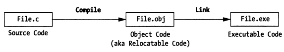

## 4.2 依赖（支持）

### 4.2.1 调试符号信息

编译器、链接器根据源代码构建可执行程序，可执行程序中的数据是面向机器的，而非面向人类的。调试器如何理解可执行程序中的数据，并在机器表示和人类可读形式之间进行转换呢？这就需要调试信息的支持了。

当编译器将源代码转换成目标文件的时候，编译器会生成一些调试信息并将其存储到可执行程序中特殊的section中。当链接器将多个目标对象文件链接成一个完整的可执行程序的时候，链接器会将分散在不同目标文件中的调试信息进行合并后存储。



这里的调试信息如何生成、编解码、存储等是有相应的调试信息标准（如DWARF）指导的，调试信息标准指导编译器、链接器、调试器之间如何进行协作。编译器、链接器生成这些调试信息并将其存储到可执行程序的sections中，调试器会从中提取、解析与调试相关的信息，然后就可以构建起源码层面的视图。进而，调试器可以完成内存地址、指令地址、源码之间的相互映射。

不同的目标文件格式，调试符号信息可能会存储在不同的地方，一般可能有两种存储方式：

##### 存储在目标文件自身

例如，[ELF](https://en.wikipedia.org/wiki/Executable_and_Linkable_Format) 文件格式包含了DWARF调试信息对应的section，一般以".debug”或”.zdebug”开头。.debug前缀开头的section表示数据未压缩，.zdebug前缀开头的section表示数据经过了压缩。

> 这里给个实例，__debug_bin是一个由 `dlv debug`生成的可执行程序，包含了调试符号信息，`readelf`可以用来读取ELF文件中的section header，下面我们看一下ELF文件中包含的调试信息相关的 section。
>
> go build可以通过指定连接器选项“**-ldflags=-compressdwarf=false**”来禁用压缩，提前了解这点，方便以后通过dwarfdump等工具分析理解dwarf调试信息如何组织非常有用。
>
> ```bash
> [root@centos ~]# readelf -a __debug_bin | grep debug
> [12] .zdebug_abbrev    PROGBITS         0000000000599000  0017b000
> [13] .zdebug_line      PROGBITS         0000000000599114  0017b114
> [14] .zdebug_frame     PROGBITS         00000000005a9f37  0018bf37
> [15] .zdebug_pubnames  PROGBITS         00000000005b11a8  001931a8
> [16] .zdebug_pubtypes  PROGBITS         00000000005b2fa0  00194fa0
> [17] .debug_gdb_script PROGBITS         00000000005b624b  0019824b
> [18] .zdebug_info      PROGBITS         00000000005b6273  00198273
> [19] .zdebug_loc       PROGBITS         00000000005dcfe2  001befe2
> [20] .zdebug_ranges    PROGBITS         00000000005e982d  001cb82d
> ```
>

> ps: 作者开始写这本电子书的时候非常早，当时2018年还是用的1.13，现在这么多年过去，发生了很多变化。
>
> - 首先，go1.13中确实是这样的，zlib压缩后写入.zdebug_ sections (see: https://github.com/golang/go/issues/11799#issuecomment-399564050)；
> - 由于没有一次性完成该电子书，后续go1.19中作者再次尝试运行已有代码、校对内容时，发现已经不会写入.zdebug_ sections了 （上述linker flag失效了）；
> - 截止到今天2025.2.14再次续写本书内容，继续求证后发现，go1.22中已经明确废弃了 `.zdebug_` sections，而是以 `.debug_` section中内容是否带有 SHM_COMPRESSED flag来确定是否开启了压缩。
>   see: https://github.com/golang/go/issues/58254#issuecomment-1421624004
>   see: https://sourcegraph.com/github.com/golang/go/-/commit/75136fc14c0d3ec64a2f6728e96fc86066d853c9
>
> 所以，还是要尽快完成，很有可能go后续会从DWARF v4升级到v5，到时候又会引入更多变化。

##### 存储在独立的文件中

例如，Microsoft Visual C++ 2.0生成的调试信息存储在独立的**.PDB（Program Database）**文件中，macOS平台上构建的调试符号信息一般存储在独立的**.dSYM/Resources/DWARF/**目录中。

> 这里给个示例，在macOS 10.15上，通过“**gcc -g**”构建一个包含调试符号的可执行程序，我们看下它生成的调试信息是如何存储的：
>
> **file: main.c**
>
> ```cpp
> #include <stdio.h>
> #include <stdlib.h>
>
> int main(int argc, char *argv[])
> {
>   return 0;
> }
>
> ```
>
> ```bash
> $ gcc -g -o main main.c
> $ ls
> main main.c main.dSYM/
> $ tree main.dSYM
> main.dSYM/
> └── Contents
> ├── Info.plist
> └── Resources
>      └── DWARF
>            └── main|
> ```

可以看到，macOS 10.15上，gcc将调试信息也存储到了独立的main.dSYM/目录。可以借助 `dwarfdump or splitdwarf`工具进行分析，可以参考这篇文章：https://blog.golang.org/debug-opt。

##### 调试信息有什么用呢

调试器利用调试信息能够将源码中的函数、变量映射为内存中的地址，也就意味着开发者可以直接对源码中函数、变量进行操作而不用关心具体的内存地址，这也是符号级调试器相比于指令级调试器的优势。

借助源码到内存地址的映射，符号级调试器就可以直接显示变量的值，如何做到的呢？因为变量标识符可以映射成程序的内存地址，此外，调试信息中还记录了该变量的数据类型信息，这里的类型信息告诉调试器该变量一共占用多少个字节、实际用了多少比特、应该解读成哪种数据类型，调试器就可正确解析内存数据，进而显示变量值。


这里的映射关系也包含从源代码语句与内存中代码段指令地址范围的映射，这个也是符号级调试器的优势。当希望单步执行一条语句的时候，调试器可以根据该语句对应的地址范围决定应该执行多少条指令后停下来。

### 4.2.2 调试支持

除了调试符号信息，调试器还需要其他的一些支持，即调试基础设施，包括：调试中断、系统调用、解释器、调试用户界面（GUI或者命令行）。

#### 4.2.2.1 调试中断

所有的商用操作系统都提供了调试相关的hook机制，这里的hook机制通常是通过内核系统调用的形式实现。为什么要通过系统调用实现呢？调试器调试应用程序的时候，需要读、写程序的数据、指令，就涉及到访问系统内存中一些受保护的特殊数据结构，普通用户进程是无权访问的，只能借助内核提供的系统调用来代表用户进程操作。

相比之下有个例外，DOS操作系统是实模式操作系统，由于没有对内存做保护，你可以直接做任何事情。

#### 4.2.2.2 系统调用

现在，绝大多数操作系统都实现了内存保护模式，内存保护模式是多用户、多任务操作系统的根基。如果没有保护模式，根本就不存在所谓的安全。关于内存保护模式如何实现的，可以参考X86系列处理器的发展史。

与DOS相反，Windows、Linux以及BSD都实现了内存保护模式，这意味着如果你想在这些平台上开发一个调试器，就需要通过平台提供的系统调用来实现。

以Linux系统调用为例，调试器进程（tracer）可以通过 `ptrace(PTRACE_ATTACH…)` attach到一个被调试进程（tracee），然后操作系统内核会给tracee进程发送一个信号SIGSTOP，tracee进程就会停下来，tracer进程就可以通过 `waitpid(pid)`来等待tracee停止事件。当tracer进程感知到tracee进程停止执行之后，tracer进程就可以进一步通过 `ptrace`系统调用、配合其他ptrace参数 `PTRACE_GETREGS、PTRACE_SETREGS、PTRACE_PEEKDATA、PTRACE_POKEDATA等`来读写寄存器、内存数据、控制代码的执行路径等。

ps: 对与进程、线程的表示，建议了解下操作系统进程控制块PCB的概念以及Linux下taskstruct、GDT、LDT相关的知识。

> Linux平台对SIGSTOP信号的处理，可以参考：[How does SIGSTOP work in Linux kernel?](https://stackoverflow.com/questions/31946854/how-does-sigstop-work-in-linux-kernel)

> **ps：简单提下内存保护模式的实现，这样有助于理解为什么现在调试器一般通过操作系统系统调用来实现，比如Linux ptrace。**
>
> **实模式大致原理：**
>
> 这里以x86处理器发展史来简单说明下，8086处理器是实模式寻址，意味着你可以写个程序通过CS:IP来跳到任意指令地址执行指令，或者DS:Offset读写任意内存地址数据，这样就很不安全。
>
> 在Intel后续处理器上为了建立起内存保护模式，首先引入了特权级的概念，ring0~ring3（ring0权限最高），Linux中仅使用ring0、ring3这两个（区分内核态和用户态够用了）。然后又引入了GDT、LDT的概念，这个什么用呢，它们是个表结构，记录了一系列的内存区间以及访问这些内存位置所需要的特权级。在访问真正的内存区域之前，需要先查表检查特权级是否足够。
>
> **阻止执行任意位置指令：**
>
> 实模式下的CS:IP直接可以计算后用来寻址，保护模式下不行，CS的含义已经变了，不再是代码段起始地址，它（CS部分位字段）变成了一个指向GDT、LDT中的索引，查GDT、LDT可以知道访问对应的内存区所需要的特权级信息。如果当前特权级（CS部分位字段）低于CS对应的GDT描表项中的特权级，则不能访问对应内存区。这样执行指令的时候，就不能够随意指定个地址去执行该位置的指令了。
>
> **阻止读写任意位置数据：**
>
> 对于如何阻止读写任意位置的数据，这个问题应该可以通过类似的方式来做到，就不进一步展开了，感兴趣读者可以自己查阅资料。
>
> 关于80286实现内存保护模式的更多信息，可参考[protected mode basics by Robert Collins](http://www.rcollins.org/articles/pmbasics/tspec_a1_doc.html)，我是基于《Linux源码情景分析》中关于保护模式的内容回忆来补充这部分信息的，Robert Collins还额外描述了中断情况下如何保证保护模式。
>
> 那保护模式下当我们希望执行tracee的指令、读写tracee的数据时，利用系统调用来搞定这些不就行了？是的，也只能这么做。

#### 4.2.2.3 解释器

如果是调试一门解释型的语言，那就比通过系统调用的方式直接多了，因为所有的调试基础设施都可以直接内建在解释器中。通过一个解释器，就可以无限制地访问执行引擎。所有的调试操作及其依赖的能力都是运行在用户空间而非内核空间，也就不需要借助系统调用了。没有什么东西是被隐藏的。所要做的就是增加扩展来处理断点、单步执行等操作。

#### 4.2.2.4 内核调试器

操作系统构建起严格的内存保护模式之后，要想调试内核本身，就得通过一种特殊类型的调试器。传统的用户模式下的调试器是不行的，因为内存保护模式（如段、页式管理的相关逻辑）阻止了用户态程序操作内核映像。

你需要一个内核调试器！

内核调试器，能够指挥、控制中央处理器（CPU），这样就可以通过单步执行、断点等操作对内核代码进行调试、检查。这意味着内核调试器必须能够避开内存保护模式机制，通常内核级调试器都是与操作内核镜像打包在一起的。有些厂商要实现自己的内核级调试器，也会考虑将调试器作为设备驱动、可加载的内核模块的方式来设计、开发。

> **ps：内核调试和用户程序调试有着明显不同。**
>
> 举个例子，比如我们打印一个内存变量，不巧这个内存页面被操作系统换出到交换区了，如果我们在用户级调试器里面通过系统调用的形式ptrace(PTRACE_PEEKDATA...)操作系统会自动把这个换出的页面加回来，然后帮把数据读回来，很简单，我们甚至都没有感觉到这背后一连串的缺页处理发生过。
>
> 但是如果是内核级调试的话，内核级调试器需要调试内核的代码，一步步地，这样缺页处理这些问题也要一步步过，如果我们直接打印变量地址很可能是看不到值的，可能这只会触发一个缺页异常。
>
> 这两种调试器适合的问题场景、对开发人员对底层技术细节的掌握程度都是不同的。
>
> 实现内核级调试，内核肯定是要提供必要的调试能力支持，至于使用内置的调试器工具还是使用外部调试器工具，这个选择就简单了。
>
> 其他，关于内核级调试器，感兴趣可以参考：
>
> - [kernel space debuggers in Linux](https://sysplay.github.io/books/LinuxDrivers/book/Content/Part10.html)
> - [user mode debugging vs kernel mode debugging](https://stackoverflow.com/questions/32998218/is-there-ever-an-advantage-to-user-mode-debug-over-kernel-mode-debug#:~:text=in%20kernel%20mode.-,User%20mode%20debugging,you%20need%20to%20have%20really%20professional%20comprehension%20of%20all%20those%20topics.,-Conclusion)
> - [kernel debugger internals](https://www.kernel.org/doc/html/v4.18/dev-tools/kgdb.html#kernel-debugger-internals)

#### 4.2.2.5 调试器界面

调试关心的是程序的状态，不同的调试器为用户提供了不同的方式来查看程序的运行状态。某些调试器（如gdb）提供简单但一致的命令行界面，其他调试器可能会与GUI环境集成。

GUI调试器能够同时呈现和访问更多的机器状态信息，使用GUI调试器，您可以轻松地同时监视数十个程序元素。

另一方面，如果你正在开发跨平台的应用程序，则可能很难找到在所有平台上都能运行的GUI IDE，这个时候跨平台的命令行调试器相比GUI调试器来说就有优势了。命令行调试器可能没有精美的GUI接口，但在任何平台上其命令行操作和行为都是一样的。命令行调试器相比GUI调试器拥有更陡峭的学习曲线，但一旦掌握了，你就可以在不同平台以一致的方式调试你的应用程序。

### 4.2.3 符号调试器扩展

#### 4.2.3.1 程序断点

程序断点（breakpoint），指的是程序中的一个位置，当程序执行到该位置时能够停下来，以便调试人员观察程序状态。程序断点根据其生成销毁方式、生命周期的不同，可以分为静态断点和动态断点。

> ps：从实现手段而言，调试断点可以分为“软件断点”和“硬件断点”，前者是通过机器指令来实现，后者是借助处理器提供的调试寄存器来实现。本书先讨论软件断点，有需要再介绍硬件断点。

X86平台上创建软件断点可以通过指令 `int 3`来生成**0xCC**这个一字节机器指令来创建，处理器执行完0xCC之后会暂停当前正在执行的进程。

具体是如何执行的呢？int 3表示会触发3号中断，对应机器指令是0xCC，处理器执行完该指令后就会触发3号中断，对应的中断服务程序就在IDT[3]中（IDT，Interrupt Descriptor Table，中断描述表或中断向量表）。BIOS中提供的中断服务程序是16位的，了解过Linux如何构建32位、64位内存保护模式的话，就会明白Linux启动后，IDT[3]指向的其实是Linux内核提供的中断处理程序（Linux初始化会覆盖BIOS提供的16位中断服务程序的中断向量表），这里就是暂停执行当前tracee进程，并通知tracer进程tracee已暂停执行。

> ps: 严格意义上来说，中断更倾向于表示外设产生的事件，而异常则指处理器执行指令时生成的一些事件，比如除零exception、缺页fault、陷阱trap等，详见：https://linux-kernel-labs.github.io/refs/heads/master/lectures/interrupts.html。我们文中将中断作为了一个更宽泛的术语来使用，希望读者能明确这一点。

好，现在理解了0xCC机器指令的用途之后，我们继续讨论静态断点和动态断点的区别：

##### 静态断点

静态断点指的是这样的断点，它是在程序中的某些位置通过硬编码的方式来创建的，如在程序中通过 `int 0x3`汇编指令创建断点。静态断点的生命周期与进程的生命周期是相同的。我们可以在程序中插入一些分支判断逻辑，来决定是否创建特定的静态断点。

一些获取、设置内存、寄存器的汇编指令也可以按需在代码中硬编码。

比较好的解决方法是，上述创建静态断点、读写内存、读写寄存器等的操作封装成库的形式，这样就方便其他程序以共享库、静态库的方式来访问，用起来会方便点。

静态断点不够灵活，定位一个问题，可能需要反复修改源码、调试，动态断点相比之下优势明显。

##### 动态断点

动态断点指的是程序在运行时调试人员按需动态创建的断点，后面你会看到，动态断点使得符号调试器在源码中能够单步执行，可以联想下gdb next, step, finish, continue等操作。

与静态断点不同，静态断点生命周期是进程生命周期，符号级调试器通常是通过动态断点来控制调试，动态断点的插入、移除一般是按照如下流程实现的：

- 调试器识别出语句statement的第一条指令的操作码；
- 调试器保存上述操作码的第一个字节，并将操作码的第一个字节替换成0xCC；
- 调试进程tracee执行完到上述指令位置，执行完0xCC之后将触发断点并暂停执行（此时可以执行些检查寄存器、变量等的操作）；
- 调试进程tracer将tracee的PC-1位置处的1字节数据由0xCC替换为原来的操作码数据，并将PC值减1；
- 调试器通知内核恢复tracee运行，并继续执行到下一个断点位置处；

我们通过下面的C语言语句进行下简单的说明：

> ```c
> total = total +value;
> ```

假定上述语句对应的汇编指令为：


给上述语句设置一个动态断点，调试器首先获取statement对应的第一条指令的操作码的第一个字节0x8B，并将其替换为0xCC。当调试器遇到这个断点的时候，它执行完0xCC后就会停下来。等清除这个断点时，它会将这里的0xCC替换为原来的操作码数据0x8b，并将PC值从00007调整为0006，然后通知tracee恢复执行，tracee就可以执行statement `total = total + value` 对应的完整3条指令。

一旦上述语句对应的指令被执行了之后，调试器可以考虑是否要再次为该语句设置动态断点，如果不可能执行到上述语句了，就可以不设置了，但是如果还是会执行到就会设置动态断点，比如for循环体中语句设置断点，当你调试完一轮之后，还希望下次循环进入时再次让断点生效，调试器这种情况下就应该再次插入断点。

#### 4.2.3.2 单步执行

对指令级调试器（也称机器级调试器）而言，单步执行很简单：处理器只需执行下一条机器指令，然后将程序控制权返回给调试器。 对于符号调试器，此过程并不那么简单，因为高级编程语言中的单个语句通常会转换为多个机器级指令。 不能简单地让调试器执行固定数量的机器指令，因为源代码语句对应的机器指令数量会有所不同。

符号调试器如何插入动态断点呢？这将取决于单步执行的动作的类型，可分三种类型。

##### 单步执行进入 (下一条语句)

当符号调试器单步执行一条源代码语句 `function(value)` 时，它将扫描前几条机器指令，以查看该语句是否为函数调用。 如果下一条指令的第一个操作码不是函数调用的一部分，则调试器仅需保存该操作码并将其替换为断点。 否则，调试器将确定函数调用在内存中跳转到的位置，并用断点替换函数体指令的第一个操作码，以便在调用函数后暂停执行。


##### 单步执行跳出 (一个函数)

当符号级调试器退出函数（或例程）时，它将在函数的活动记录（调用栈信息）中查找返回地址。 然后，它将返回地址处机器指令的操作码保存，并用断点替换。 当程序恢复执行时，该例程将执行完剩余语句，并跳转到其返回地址。 然后回到返回地址处的下一条指令后，将命中断点，程序控制权将交还给调试器。 这样做的结果是，您可以使调试器从被调函数返回到调用该函数的代码上。

##### 单步执行跳过 (下一条语句)

当符号级调试器单步执行一条语句时，它将查询程序的调试信息以确定该语句在内存中的地址范围，一旦调试器确定了该语句的结束位置，它将保存该语句后的第一条机器指令的操作码，并将其替换为断点。 加断点的语句，tracee执行完该语句对应的所有机器指令之后，调试器才能重新获得程序控制。


### 4.2.4 本节小结

本节简单介绍了下调试信息的生成、存储、解析操作，介绍了各种类型调试器的各自特点，介绍了断点的工作原理，并以单步步进一条语句为例，介绍了单步执行进入、单步执行跳出、单步执行跳过时的一些断点设置过程。
