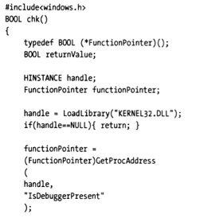
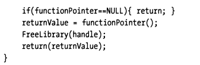
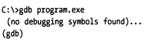
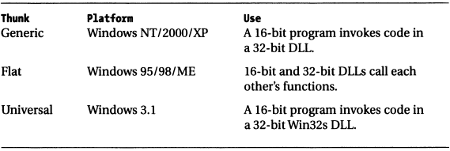

## 4.3 反调试技术

只要付出足够的时间和精力，可以说任何程序都能被逆向。调试器使得理解程序逻辑更加方便了，对心怀恶意的软件逆向人员也不例外。防人之心不可无，君子也要采取战术给软件逆向增加点难度，使恶意工程师越痛苦越好以阻止或者延缓他们弄清程序的工作逻辑。

鉴于此，可以采取一些步骤，将使恶意工程师很难通过调试器窥视您的程序。

### 4.3.1 系统调用

#### 4.3.1.1 Windows
某些操作系统提供了特殊的系统调用，能指示当前进程是否正在调试器的调试模式下执行。 例如，Windows KERNEL32.DLL导出了一个名为`IsDebuggerPresent()`的函数。 您可以包装一个chk()函数，函数体内使用该系统调用进行检查。





该窍门是程序启动后立即调用chk()，让检查逻辑在逆向人员设置并执行到断点前先执行。


如果观测到调试器正在调试当前进程，则可以强制程序运行异常、做些诡异的逻辑，把正在调试的人绕晕。 调试器是个独特的工具，因为它使用户可以从中立的角度来观察程序。 通过插入类似chk的代码，可以迫使用户进入一个扭曲的量子宇宙，在该宇宙中，精心构造的诡异行为、输出，可以有效保护您的程序，避免或者延缓被逆向。

#### 4.3.1.2 Linux

在Linux下，也有类似的方式，通常可以借助“`/proc/self/status`”中的“`TracePid`”属性来判断是否有调试器正在调试当前进程。

下面是个示例，检查当前进程是否正在被调试。

> 被调试程序：
>
> ```go
> package main
> 
> import "fmt"
> import "os"
> 
> func main() {
> fmt.Println("vim-go, pid: %d", os.Getpid())
> }
> ```
>
> 执行调试操作：
>
> ```bash
> $ dlv debug main.go
> dlv> b main.main
> dlv> c
> dlv> n
> dlv> n
> dlv> vim-go, pid: 746
> ```
>
> 检查TracePid：
>
> ```bash
> >cat /proc/746/status | grep TracePid
> TracePid: 688
> > cat /proc/688/cmdline
> dlv debug main.go
> ```
>
> 现在我们可以判断出当前进程正在被pid=688的调试器进程调试，并且该调试器是dlv。

如果不希望程序被调试，就可以在检测到 `TracePid != 0` 时直接退出，同样的这个过程要尽可能快的执行。

#### 4.3.1.3 其他平台

其他平台下，应该也有对应的解决方法，读者感兴趣可以自行查阅相关资料。

值得一提的是，前面Windows、Linux平台下的例子，都提及了反调试检查要尽快执行，实际上不一定总能达成效果。后面的示例大家可以看到，调试器启动被调试进程，进程会停在第一条指令处，就是说并没有立即执行完检查并退出。调试人员如果逆向分析能力很强，仍然有机会跳过反调试的检查逻辑。

### 4.3.2 移除调试信息

使调试更加困难的一种简单方法是从程序中删除调试信息。可以通过剥离调试信息（使用GNU的strip实用工具等）或通过设置开发工具来生成发行版（release版本）来完成。

一些商业软件公司更喜欢剥离调试信息，并能接受后续诊断过程中额外加载调试信息的性能影响，因为它允许销售工程师执行现场诊断。 当售后工程师进行内部咨询时，他们要做的就是插入调试信息并启动调试器。

gcc编译器使用选项”**-g**“在其生成的目标代码中插入调试符号信息。不指定该选项，则不输出任何调试信息。

如果尝试使用gdb调试它，gdb将提示找不到调试符号“no debugging symbols found”，将使调试人员很难看明白程序的状态、工作方式。



缺少调试符号并不能阻止所有人，一些反编译器可以获取机器代码并将其重铸为高级源代码。好消息是这些工具倾向于生成可读性较差的代码。

### 4.3.3 代码加盐

如果内存占用不是大问题，并且您不介意对性能造成轻微影响，则阻止调试器的一种方法是定期在代码中添加不必要的语句。可以这么说，这使得尝试进行逆向工程的人更容易迷失。

这样，即使您在程序中附带了调试符号，也很难弄清正在发生的事情（尤其是如果您认为每个语句都有合法目的）。

这样，我们就达到了相对安全的目的。

### 4.3.4 混合内存模型

有一些强大的调试器，例如SoftICE，可以在用户模式和内核模式之间轻松切换。但是，很少有调试器可以在两个不同的内存模型之间进行跳转。比较特殊地，Windows下就允许发生这种行为。在Windows上，这种现象通常称为“thunking”，它允许16位代码和32位代码进行混合。

以下描述了Windows中使用的改进技术：



这种混合内存模型也给调试器调试增加了难度。

### 4.3.5 本节小结

调试器确实是一个定位分析问题的好帮手，但是用在“坏人”手里也可能成为他们攻击正常程序的工具。因此，本节也重点对反调试技术进行了介绍。反调试技术也是一种重要的阻止逆向分析、提高安全性的手段。

