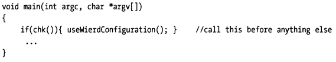

## 4.3 反调试技术

只要付出足够的时间和精力，可以说任何程序都能被逆向。调试器使得理解程序逻辑更加方便了，对心怀恶意的软件逆向人员也不例外。防人之心不可无，君子也要采取战术给软件逆向增加点难度，使恶意工程师越痛苦越好以阻止或者延缓他们弄清程序的工作逻辑。

鉴于此，可以采取一些步骤，将使恶意工程师很难通过调试器窥视您的程序。

### 4.3.1 系统调用

#### 4.3.1.1 Windows
某些操作系统提供了特殊的系统调用，能指示当前进程是否正在调试器的调试模式下执行。 例如，Windows KERNEL32.DLL导出了一个名为`IsDebuggerPresent()`的函数。 您可以包装一个chk()函数，函数体内使用该系统调用进行检查。


该窍门是程序启动后立即调用chk()，让检查逻辑在逆向人员设置并执行到断点前先执行。



如果观测到调试器正在调试当前进程，则可以强制程序运行异常、做些诡异的逻辑，把正在调试的人绕晕。 调试器是个独特的工具，因为它使用户可以从中立的角度来观察程序。 通过插入类似chk的代码，可以迫使用户进入一个扭曲的量子宇宙，在该宇宙中，精心构造的诡异行为、输出，可以有效保护您的程序，避免或者延缓被逆向。

对调试器使用有经验的读者，很快就可以发现上述方法，并不总是可靠，有经验的调试人员可以通过gdb启动进程并在main、chk位置添加断点，待chk返回前篡改寄存器EAX中的值来绕过该检查。所以这个方法并不总是奏效，有可能将chk()低调行事隐藏在一堆看似正常的代码中，反而有助于戏弄调试人员。有没有更靠谱的做法呢？

我们也可以使用 `NtQueryInformationProcess` 系统调用来判断当前进程是否正在被调试，这是一个内核态的系统调用，可以获取进程的详细信息，包括是否正在被调试。这个检查逻辑可以在整个生命周期内持续进行，不容易被绕过，一旦检测到正在被调试，就可以立即退出程序。

```
__kernel_entry NTSTATUS NtQueryInformationProcess(
  [in]            HANDLE           ProcessHandle,
  [in]            PROCESSINFOCLASS ProcessInformationClass,
  [out]           PVOID            ProcessInformation,
  [in]            ULONG            ProcessInformationLength,
  [out, optional] PULONG           ReturnLength
);
```

可以指定PROCESSINFOCLASS ProcessInformationClass = ProcessBasicInformation，此时会返回一个PEB结构来描述当前进程是否正在被调试器调试。

see: https://learn.microsoft.com/en-us/windows/win32/api/winternl/nf-winternl-ntqueryinformationprocess

#### 4.3.1.2 Linux

在Linux下，也有类似Windows的方式，通常可以借助“`/proc/self/status`”中的“`TracePid`”属性来判断是否有调试器正在调试当前进程。

下面是个示例，检查当前进程是否正在被调试。

**被调试程序：**

```go
package main

import "fmt"
import "os"

func main() {
    fmt.Println("vim-go, pid: %d", os.Getpid())
}
```

**执行调试操作：**

```bash
$ dlv debug main.go
dlv> b main.main
dlv> c
dlv> n
dlv> n
dlv> vim-go, pid: 746
```

**检查TracePid：**

```bash
cat /proc/746/status | grep TracePid
TracePid: 688
cat /proc/688/cmdline
dlv debug main.go
```

现在我们可以判断出当前进程正在被pid=688的调试器进程调试，并且该调试器是dlv。

如果不希望程序被调试，就可以在检测到 `TracePid != 0` 时直接退出。我们可以将检查逻辑隐藏在一堆看似正常的代码中，并尽量在程序启动后立即执行，或者在整个生命周期内持续进行。这样就不容易被绕过。

#### 4.3.1.3 其他平台

其他平台下，应该也有对应的解决方法，读者感兴趣可以自行查阅相关资料。

### 4.3.2 移除调试信息

使调试更加困难的一种简单方法是从程序中删除调试信息：
- 通过设置集成开发环境、编译构建工具链来生成release版本而非debug版本，比如C/C++ 通过gcc/g++构建时需要显示 `-g` 选项来生成调试信息，生成release版本时可以去掉 `-g` 选项，必要时还可以开 `-O` 优化。
- 对于有些编程语言的编译器默认生成调试信息，比如Go，对于已经包含了调试信息的二进制，也可以通过后期剥离调试信息来达成，比如使用GNU的 `strip` 工具从ELF文件中删除.debug_ sections。

一些商业软件公司更喜欢这种做法，并能接受后续诊断过程中额外加载调试信息以及加载调试信息带来的性能影响，它允许销售工程师执行现场诊断。当售后工程师进行内部咨询时，他们要做的就是插入调试信息并启动调试器。

对于移除了调试信息的程序，如果尝试使用调试器调试它，因为没有源码相关的信息展示，调试人员将很难明白程序的状态、工作方式。往往看到gdb提示找不到调试符号“no debugging symbols found”，此时就会让很多调试人员望而却步、放弃调试。


但是，缺少调试符号并不能阻止所有人，一些反编译器可以将机器指令重铸为高级源代码，好消息是这些工具倾向于生成可读性较差的代码。

>ps: 但是现如今借助于AI的力量，情况可能有所变化。现在AI有能力抽取这些源代码来推断更合适的函数名，让代码更容易被理解。这个方向也值得关注和研究。

### 4.3.3 代码加盐

如果内存占用不是大问题，并且您不介意对性能造成轻微影响，则阻止调试器的一种方法是定期在代码中添加不必要的语句。可以这么说，这使得尝试进行逆向工程的人更容易迷失。

这样，即使您在程序中附带了调试符号，也很难弄清正在发生的事情（尤其是如果您认为每个语句都有合法目的）。扰乱视听，让调试人员摸不着头脑，这样，我们就相对更安全。

>ps: 俗话说“道高一尺魔高一丈”，在真正的高手面前，“茅、盾、机、巧” 你知道、我也知道，经验和高敏感性能让高手察觉这部分代码的意图，排除掉它或者通过其他逐个击破的策略收敛到更少的关键代码。

### 4.3.4 混合内存模型

有一些强大的调试器，例如SoftICE，可以在用户模式和内核模式之间轻松切换。但是，很少有调试器可以在两个不同的内存模型之间进行跳转。比较特殊地，Windows下就允许发生这种行为。在Windows上，这种现象通常称为“thunking”，它允许16位代码和32位代码进行混合。

以下描述了Windows中使用的改进技术：


这种混合内存模型也给调试器调试增加了难度。

### 4.3.5 本节小结

调试器确实是一个定位分析问题的好帮手，但是用在“坏人”手里也可能成为他们攻击正常程序的工具。因此，本节对反调试技术进行了介绍。反调试技术也是一种重要的阻止逆向分析、提高安全性的手段。反调试技术大大增加了逆向分析的难度，降低了逆向分析的成功率。尽管不能100%杜绝攻击者的调试行为，但是增加其难度，也是降低攻击成功率的一种手段。
