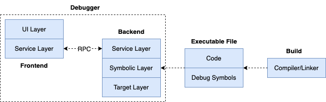

## 调试器概貌

在开始各调试动作的具体实现之前，有必要先搭建一个实现框架，后续调试动作的实现过程，我们只需要添加调试命令及对应的处理逻辑即可。

大家在理解了这个框架之后，在阅读到相关调试动作的具体实现章节时，会自然联想到如何定位工程中对应的代码。这对我们后续章节中组织内容、方便读者理解都是比较重要的。

### 功能性需求

调试器的功能性需求，大家联想下常见调试器的使用经历，这个是比较直观的：

-   允许调试可执行程序、调试运行中进程、调试coredump文件；
-   允许对golang代码自动编译构建、调试完成后清理临时构建产物；
-   允许查看源码信息 **list**；
-   允许对二进制文件进行反汇编 **disass**；
-   允许在源码中添加断点 **breakpoint `file:lineno`**；
-   允许在源码中添加条件断点 **breakpoint `file:lineno` if `expr`**；
-   允许逐语句执行 **next**；
-   允许逐指令执行（也能允许进入函数）**step**；
-   允许从function退出 **finish**；
-   允许显示变量信息、寄存器信息 **print、display**；
-   允许更新变量、寄存器信息 **set**；
-   允许打印变量类型 **ptype**；
-   允许对函数进行临时调用 **call**；
-   允许查看调用堆栈信息 **bt**；
-   允许选择调用栈中的特定栈帧 **frame**；
-   允许查看goroutines列表、切换goroutine执行；
-   允许查看threads列表、切换thread执行；
-   其他；

调试器的功能性需求，相对来说是比较直观的，需求会变化，功能也会进行调整。

比如，调试过程中经常不小心错过一个非常关键的事件，想退回几步语句继续调试。通常，我们只能**restart**调试会话，然后在事件发生位置加断点，然后**continue**，在代码规模比较大的时候，或者不是很容易复现事件的时候，这种方式也不一定能胜任。

为了进一步提升调试的便利性，就可以为调试器添加 **record and replay** 的功能，该功能能够对调试过程进行跟踪记录，并能在需要的时候进行回放，就方便多了。

> ps：在实现了指令级调试、符号级调试的主体内容后，我们将介绍下 record and replay 在调试领域的具体实现项目，[mozilla/rr](https://github.com/rr-debugger/rr): You record a failure once, then debug the recording, deterministically, as many times as you want ...

### 非功能性需求

做一个产品需要注重用户体验，做一个调试器也一样，需要站在开发者角度考虑如何让开发者用的方便、调试的顺利。

对于一个调试器而言，因为我们会在各种任务间穿插切换，要灵活运行调试命令是必要的。但是一个基于命令行实现的调试器，要想实现命令的输入并不是一件轻松的事情。

-   首先调试器有很多调试命令，如何记忆这些命令是有一定的学习成本的，而基于命令行的调试器会比基于GUI的调试器学习曲线更陡；
-   基于命令行的调试器，其UI基于终端的文本模式进行显示，而非图形模式，这意味着它不能像GUI界面一样非常灵活方便地展示多种信息，如同时显示源码、断点、变量、寄存器、调用栈信息等；
-   基于命令行的调试器需考虑调试命令输入效率的问题，比如输入命令以及对应的参数。GUI调试器在源码某行处添加一个断点通常是很简单的事情，鼠标点一下即可，但基于命令行的调试器则需要用户显示提供一个源码位置，如"break main.go:15"，或者"break main.main"；
-   调试器诸多调试命令，需要考虑自动补全命令、自动补全参数，如果支持别名，将会是一个不错的选项。调试器还需要记忆上次刚使用过的调试命令，以方便重复使用，例如频繁地逐语句执行命令序列 <next, next, next>，可以通过命令序列 <next, enter, enter> 代替，回车键默认使用上次的命令，这样对用户来说更方便；
-   调试器有多种启动方式，对应多个启动命令，如`godbg exec <prog>`、`godbg debug <module>`、`godbg attach <pid>`、`godbg core <coredump>`，各自有不同的参数。此外调试器也有多种交互式的调试命令，如`break <locspec>`、`break <locspec> cond <expression>`等，各自也有不同的参数。如何高效、合理地管理这些命令是一个需要考虑的事情；
-   好的产品塑造用户习惯，但是更好的习惯应该只有用户自己知道，一个可配置化的调试器是比较合适的，如允许用户自定义命令的别名信息，等等；
-   调试器本身，可能需要考虑未来的应用情况，其是否具备足够的适应性以在各种应用场景中使用，如能否在GoLand、VSCode等IDE中使用，或者可能的远程调试场景等。这些也对调试器本身的软件架构设计提出了要求；
-   可扩展性，除了使用的便利性，也要考虑其未来的扩展性，如何支持一门新的编程语言，如何支持采用不同调试信息标准的程序调试，如何便利地与其他开发工具集成；
-   健壮性、正确性，如何保证调试器本身的健壮性、正确性，可以借助测试覆盖来改进；
-   其他非功能性需求。

### 技术方案

这里的技术方案，暂时先主要聚焦在如下几个点。

#### 扩展性设计

调试器应该具备良好的扩展性设计，以支持在不同应用场景中的交互，如在命令中调试、在IDE中调试、远程调试。

这也要求调试器的“**frontend**”和“**backend**”要实现分离式架构，因为我们可能在一台macOS机器上调试运行在Linux机器上的进程，frontend、backend运行环境在操作系统、硬件平台上可能是完全不同的。

这里简单提下一个设计良好的符号级调试器的大致架构，如下所示：


调试器需要包含UI Layer、Symbolic Layer、Target Layer这几层：

-   UI层 (UI layer)，主要负责与用户交互，接收用户输入并展示调试信息，如展示变量值、堆栈信息等。分离出UI层便于将用户交互逻辑与核心调试逻辑分离开，便于更改或支持不同的用户界面。
-   符号层 (Symbolic Layer)，主要负责解析和管理符号信息，如变量名、函数名、源码位置与内存地址、数据之间的转换等），它是调试器的核心部分，连接用户操作与目标程序的调试逻辑。分离出符号层，可以更容易地支持不同的编程语言、调试信息格式。
-   目标层 (Target Layer)，目标层直接与被调试程序交互，负责执行调试命令对进程进行控制、数据读写，如设置断点、单步执行、读取内存和寄存器数据等。分离出目标层，可以更方便地支持不同的目标平台，如支持不同的操作系统、硬件架构。

考虑到调试器的未来应用场景，可能会对设计进行进一步调整，比如引入Service Layer，如下所示：



我们将调试器架构进一步划分，分为frontend、backend。

-   frontend聚焦于与用户的交互逻辑，完成调试动作的触发、结果的展示；
-   backend聚焦于目标进程、平台特性相关的底层实现，接收frontend的调试命令，并返回对应的结果，以在frontend进行展示；
-   frontend和backend之间的桥梁就是新引入的服务层，frontend、backend之间可以通过RPC进行通信。

#### 调试命令管理

[spf13/cobra](https://github.com/spf13/cobra)是一个基于golang的开源的命令行程序开发框架，它具有如下特点：

- 支持快速添加cmd；
- 支持为指定cmd添加subcmd；
- 支持帮助信息汇总展示；
- 支持POSIX风格的参数解析；
- 支持常见数据类型的参数解析；
- 支持为cmd指定必要参数；
- 支持生成shell自动补全脚本；
- 等等；

可以说，cobra是一个非常优秀的命令行程序开发框架，在诸多大型开源项目中得以应用，如kubernetes、hugo、github-cli gh，等等。在我的个人项目中，也有不少是采用了cobra来对命令、子命令进行管理。

使用cobra对调试命令进行管理，将给我们带来很大的便利。对于`godbg exec <proc>`、`godbg attach <pid>`类似的命令及选项管理，cobra绰绰有余，使用默认的设置就可以提供很好的支持。

凡事总有例外，调试器除了上述“启动调试”相关的命令以外，也有很多调试会话中使用的调试命令，如断点相关的，调用栈相关的，查看源码、变量、寄存器等相关的。为了方便开发人员查看感兴趣的调试命令及其帮助信息，我们不能将所有调试命令简单排序后予以展示，必要的分组是非常有帮助的。

比如我们将break、clear这两个增删断点相关的操作全部归类到分组“**[breakpoint]**”，将print、display、list等查看相关的全部归类到分组“**[show]**”分组，将backtrace、frame等栈帧相关的全部归类到“**[frames]**”分组，等等。

cobra为每个命令提供了一个属性cobra.Command.Annotations，它是一个map类型，可以为每个命令添加一些kv属性信息，然后基于此可以对其进行一些分组等自定义的操作：

```go
breakCmd.Annotation["group"] = "breakpoint"
clearCmd.Annotation["group"] = "breakpoint"
printCmd.Annotation["group"] = "show"
frameCmd.Annotation["group"] = "frames"
```

上面我们对几个命令根据功能进行了分组，假如我们用debugRootCmd表示最顶层的命令，那么我们可以自定义debugRootCmd的Use方法，方法内部我们遍历所有的子命令，并根据它们的属性Annotation["group"]进行分组后，再显示帮助信息。

查看帮助信息时将得到如下分组后的展示样式（而非默认列表样式），更便利、更有条理：

```bash
[breakpoint]
break : break <locspec>，添加断点
clear : clear <n>，清除断点

[show]
print : print <variable>，显示变量信息

[frames]
frame : frame <n>，选择对应的栈帧
```

综上不管是调试器启动时的命令，还是调试会话中需要交互式键入的调试命令，都可以安心地使用cobra来完成，cobra能很好地满足我们的开发需求。

#### 输入自动补全

前面列出了很多的功能性需求，每个需求基本都对应着一个或几个调试命令，每个命令又有不同的选项，在调试过程中，我们很可能会遗忘命令的使用方式。

当我们遗忘时，就会中断调试会话，这是一个很低效的过程。试想下，我们不得不执行help命令查看帮助信息，帮助信息将污染我们的调试会话，使得我们注意力被分散。所以作为一个调试器产品的设计者、开发者，应该对“查看帮助”信息的需求进行进一步挖掘。

用户是需要查看帮助信息，但是并不一定是通过help的形式，我们可以在他输入命令的同时就给予辅助输入的提示信息，自动补全就是不错的方法。

自动补全大家并不陌生，我们在shell里面使用的很多命令有自动补全的功能，包括cobra开发的命令行应用程序本身也支持生成shell的自动完成脚本（导入即可实现自动补全功能）。

[go-prompt](https://github.com/c-bata/go-prompt)是一个不错的自动补全的库，它能够在程序运行期间根据用户输入自动给出自动补全的候选列表，并且支持多种选项设置，如候选列表的颜色、选中列表项的颜色等等。可以说，go-prompt是一个非常不错的选择，但是我们想要的更多。

前面我们有提到，如果要对调试会话中的调试命令进行管理的话，我们更希望通过cobra的方式来管理，并且经过一番思考发现是可行的。如果为了自动补全直接使用go-prompt的话，那我们可能将不得不自己管理这些命令。

或者，我们可以将二者的优点结合起来，[cobra-prompt](https://github.com/stromland/cobra-prompt)就是来解决这个问题的，它将go-prompt和cobra进行了一个比较好的集成，既能利用cobra的命令管理，也能发挥go-prompt的自动补全优势。cobra-prompt的实现原理很简单，将go-prompt获得的用户输入适当处理后，转给cobra debugRootCmd进行处理就可以。

> 本书提供的调试器实现，最初采用了cobra-prompt进行开发，但是由于某些原因，最终使用了liner进行代替，因为cobra-prompt的自动补全功能有时也会干扰调试会话，不一定真的有实质性的帮助。
>
> 最后，使用liner读取用户键入的调试命令，并通过cobra的命令管理来执行调试动作。简言之，我们仍然具备自动补全能力，只是放弃了go-prompt似的自动补全方式。

### 代码实现

对于业界主流的调试器实现，一般都会将其分为frontend、backend，二者通过service层进行通信，gdb、delve等等，无一例外。

本书提供的调试器实现，是从普及调试器知识角度出发，因此我们更关注调试器底层逻辑的设计实现，我们实际上提供了两个版本的调试器实现。

- 指令级调试器实现：它是一个基于UI层、符号层、目标层3层架构的简易调试器实现，实现思路已体现在了本节各部分描述中。本书提供的配套的完整版指令级调试器实现的源码地址为[hitzhangjie/godbg](https://github.com/hitzhangjie/godbg)。为了方便大家按照章节循序渐进地学习，本书也提供了按照章节组织、循序渐进地开发调试器的代码示例，其源码地址为[hitzhangjie/golang-debugger-lessons](https://github.com/debugger101/golang-debugger-lessons)。
- 符号级调试器实现：最初希望从头编写一个符号级调试器，但是开发工作量有点大，所以最后倾向于裁剪go-delve/delve以用更少的代码、更少的时间来尽快完成符号级调试部分，把最核心的设计实现要点呈现给大家。对应的源码地址为 [hitzhangjie/tinydbg](https://github.com/hitzhangjie/tinydbg)。

欢迎读者朋友们下载体验，如您发现有问题，或者有更好的建议，欢迎请在本书项目issues中留言 :) 。


> ps：本电子书的更新断断停停，这几年中发生了很多事情，2023.8.6开始恢复更新。今年必须完成，:muscle:
> ps: shit! 这flag都不知立了多少次了，今天2025.2.18，过去1年《三角洲行动》上线攻坚，实在没有时间续更，今年上半年能完成吧！
>     我准备用AI帮我翻译成英文版，也许可以吸引到一些同样感兴趣的贡献者。
