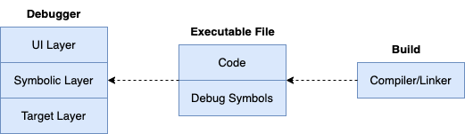
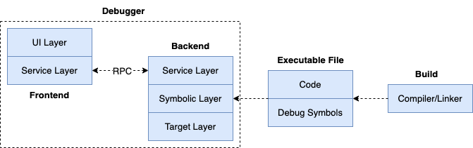

## 调试器架构设计

调试器应该具备良好的扩展性设计，以支持在不同应用场景中的应用，如在命令行中调试，在Goland、VSCode等IDE中调试，调试本地程序，调试远程甚至不同平台下的程序。要能支持到这些，调试器在架构设计上就必须实现前后端分离式架构。

我们先介绍调试器最基础的三层架构，然后再介绍前后端分离式架构。

### 最基础的三层架构

对于一个符号级调试器，架构上通常至少需要包含以下三层：

- **UI层 (UI layer)**：负责与用户交互，接收用户输入、展示调试信息（如变量、堆栈等）。将UI层单独分离，可以让用户交互逻辑与核心调试逻辑解耦，便于后续更换或支持不同的用户界面（如命令行、GUI、IDE插件等）。
- **符号层 (Symbolic Layer)**：负责解析和管理符号信息（如变量名、函数名、源码位置与内存地址的映射等），是调试器的核心桥梁，连接用户操作与底层调试逻辑。设计上分离出符号层有助于支持不同编程语言、调试信息格式。
- **目标层 (Target Layer)**：直接与被调试程序（target）交互，负责进程控制、数据读写、断点设置、单步执行、内存和寄存器访问等。设计上分离出目标层，使得调试器可以更容易适配不同的操作系统和硬件架构。

> ps：第6章《指令级调试器开发》将采用最基础的三层架构，先建立起调试器最基础最核心的设计实现。

### 前后端分离式架构

上述三层架构设计是调试器不可或缺的核心部分，但是考虑到实际应用场景的多样性和复杂性，三层架构设计还远远不够。比如，如何支持前后端分离、远程调试、服务化、分布式调试等高级需求？还需要引入更细腻的架构层面的设计来满足这些扩展性和灵活性需求。

这里在三层架构的基础上，引入 **服务层（Service Layer）**，以实现调试器的前后端分离架构，如下所示：

- **前端 (frontend)**: 聚焦于与用户的交互逻辑，完成调试动作的触发、结果的展示；
- **后端 (backend)**: 聚焦于目标进程、平台特性相关的底层实现，接收frontend的调试命令，并返回对应的结果，以在frontend进行展示；
- **服务层 (service layer)**: 服务层是frontend和backend之间通信的桥梁，可以通过 **RPC (Remote Procedure Call)** 进行通信。

通过引入服务层，调试器的前后端可以实现解耦，前端专注于用户交互和命令管理，后端专注于与被调试进程的底层交互。服务层则负责命令的转发、数据的序列化与反序列化、状态同步等工作。这样一来，调试器不仅可以支持本地调试，还可以很容易地扩展为远程调试、分布式调试等场景。这样，前端可以是命令行工具、IDE插件，甚至是Web界面，而后端则可以部署在本地或远程服务器上，二者可以通过RPC（如gRPC、JSON-RPC、DAP）进行通信。

这种架构设计极大提升了调试器的灵活性和可扩展性。无论是支持多种用户界面，还是适配不同的操作系统和硬件平台，亦或是实现多用户协作调试、云端调试等高级功能，都变得更加容易。同时，前后端分离也有助于团队协作开发，前端和后端可以并行开发、独立演进。

前后端分离式架构是现代调试器实现的主流趋势，也是满足复杂应用场景和未来扩展需求的坚实基础。

> ps：第9章《符号级调试器开发》，我们将采用这里的前后端分离式架构，以帮助读者掌握现代调试器架构设计及实现。

### 本节小结

本节介绍了调试器最基础的三层架构（UI层、符号层、目标层），以及在三层架构基础上引入服务层后形成的前后端分离式架构。三层架构是调试器不可或缺的核心，前后端分离则让调试器能够灵活应对本地调试、远程调试、分布式调试等多种应用场景，是现代调试器实现的主流趋势。而面对种类繁多的启动命令、调试会话命令，如何对它们进行有效管理，同样是一个不小的挑战。下一节我们将探讨调试命令的管理方式。
