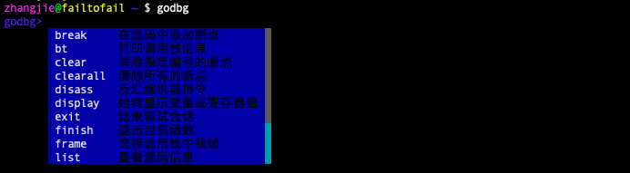
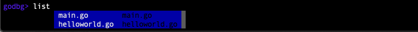

## 调试器雏形

结合前面的思考，我们初步实现了一个调试器的雏形 `godbg`，它大致包含了我们需要的交互能力。后面我们将在此基础上一步步实现指令级调试器、符号级调试器。

先看下godbg的执行效果，然后大致介绍下源码的组织方式，方便读者了解讲解的功能点对应代码的哪一部分，后续新增章节的内容、源码就很容易对应上了。

### 运行效果

#### 调试器帮助信息

`godbg help`用于展示启动调试器时的使用帮助信息。我们可以看到它有几个子命令，attach、core、exec分别对应不同的启动调试器的方式，help用于查看godbg及上述几个调试命令的使用帮助信息。

```bash
$ godbg help

godbg是一个go程序符号级调试器，它是以学习为目的驱动开发的调试器，
希望我们的工作可以为更多人打开一个认识计算机世界的大门，不谢！

Usage:
  godbg [flags]
  godbg [command]

Available Commands:
  attach      调试运行中进程
  core        调试内核转储
  exec        调试可执行程序
  help        Help about any command

Flags:
      --config string   config file (default is $HOME/.godbg.yaml)
  -h, --help            help for godbg

Use "godbg [command] --help" for more information about a command.
```

#### 调试器调试会话界面

当启动godbg之后，默认会以弹出提示列表的方式来列出调试器支持的命令信息，这个只会在godbg启动时展示一次，期间为了保证调试会话不被污染，在没有用户输入时是不会显示任何提示信息的。

调试器启动成功后，会通过“**godbg>**”来表示当前创建好的调试会话，我们在此调试会话中输入调试命令来完成对应的调试动作。



以清除断点操作为例，clear是清除单个断点，clearall是清除所有的断点，当我们输入 `cl`时，可以匹配到 `clear`、`clearall`两个命令，开发人员可以通过 `tab`按键或者 `arrow-down`来在候选列表中移动，`enter`选中列表项。


再看一个命令参数层面自动补全的例子，以list查看源码命令为例，此时会返回进程中涉及到的源码信息，如此处有main.go helloworld.go，方便用户选择，调试时就更简单了。



这是关于调试会话界面的运行效果展示。

> NOTE: 有必要提及的是，当前小节在撰写时是基于cobra-prompt实现的调试器版本进行描述的，在后续开发中，我们移除了cobra-prompt的自动补全方式，转而采用对用户干扰更小的自动补全方式，文档中的描述暂未来得及更新。
>
> 读者也不用过于担心，这点不一致还不至于给上手学习带来负担。后续，我们会基于最新版实现更新这里的交互界面。

#### 会话中显示帮助信息

调试器调试会话中支持多个调试命令，各调试命令的功能是什么，又如何使用呢？

在调试器内部运行帮助命令“**godbg> help**”，就可以列出调试器已经支持的所有命令及其功能说明，并且对这些命令按照功能进行了归类，如断点相关的命令break、clear、clearall全部放置在了分组“**[breakpoint]**”下面，代码相关的有list、disass全部放置在了“**[code]**”分组下面，控制流相关的有next、step、finish全部放在了“**[ctrlflow]**”下面，还有其他一些调试命令。

```bash
godbg> help
interactive debugging commands

[breakpoint]
break <locspec> :	在源码中添加断点
clear <n>       :	清除指定编号的断点
clearall <n>    :	清除所有的断点

[code]
disass <locspec>:	反汇编机器指令
list <linespec> :	查看源码信息

[ctrlflow]
finish          :	退出当前函数
next            :	执行一条语句
step            :	执行一条指令

[information]
bt              :	打印调用栈信息
display <var|reg>:	始终显示变量或寄存器值
frame           :	选择调用栈中栈帧
print <var|reg> :	打印变量或寄存器值
ptypes <variable>:	打印变量类型信息
set <var|reg>=<value>:	设置变量或寄存器值

[other]
exit            :	结束调试会话
help [command]  :	Help about any command
```

如果想详细了解某一个调试命令如何使用，可以运行“**godbg> help `cmd`**”，如想查看break命令的使用运行“**godbg> help break**”。

#### 会话中执行调试命令

这里以显示源码信息为例，来演示如何在调试会话中执行调试动作。调试会话中执行调试命令“**godbg> list main.go**”来显示main.go中的源码信息。

```bash
godbg> list main.go
list codes in file
```

我们试运行命令 `list main.go`发现输出了一行语句，并没有实际打印源代码出来。

别急，这就是我们提到过的，目前这还只是一个调试器的雏形，我们确实已经把该搭的架子搭起来了，接下来的章节，我们将一步步实现这里的各个命令，实现指令级调试器，再实现符号级调试器。

### 代码实现

该调试器代码，详见：[golang-debugger-lessons/0_godbg](https://github.com/debugger101/golang-debugger-lessons/tree/master/0_godbg)，现在大致看下实现。

#### 目录结构

godbg的源码目录结构如下所示，为了节省篇幅省略了部分文件条目：

```bash
tree godbg
godbg                         : 项目根目录
├── LICENSE                   ：版权信息
├── cmd                       ：调试器启动调试的命令
│   ├── root.go               : rootCmd绑定了子命令core、exec、attach
│   ├── attach.go
│   ├── core.go
│   ├── exec.go
│   ├── debug                 ：调试会话中可使用的调试命令
│   │   ├── root_debug.go	  : debugRootCmd绑定了众多调试会话调试命令
│   │   ├── backtrace.go
│   │   ├── break.go
│   │   ├── clear.go
│   │   ├── clearall.go
│   │   ├── disass.go
│   │   ├── display.go
│   │   ├── exit.go
....
├── go.mod
├── go.sum
├── main.go                  ：程序入口main.main
├── syms                     ：符号层，用于实现指令地址和源码的映射、符号查询等等
└── target                   ：target层，用于实现低级操作，如指令patch设置断点等等
    ├── backtrace.go
    ├── breakpoint.go
    ├── call.go
    ├── continue.go
    ├── disassemble.go
    ....

```

可见我们已经将大部分调试需要的命令给纳入进来了，只不过还没有实现，后续我们将一步步实现各个调试命令。命令实现的功能逻辑，可能会涉及到对应的 `${命令}.go`文件，以及符号层syms package、target层target package下的相关代码。

介绍完代码组织，后面讲解一个调试命令或者功能的实现时，读者应该可以方便快速地找到对应的实现代码。

#### 源码解析：命令管理逻辑

熟悉cobra编程的看完main.go就会知道该调试器是基于cobra进行命令管理的。

```go
package main

import "godbg/cmd"

func main() {
	cmd.Execute()
}
```

godbg下各个子命令exec、debug、core分别对应cmd/exec.go、cmd/debug.go、cmd/core.go，它们都是cmd/root.go中定义的rootCmd的子命令。

```go
var rootCmd = &cobra.Command{
	Use:   "godbg",
	Short: "godbg是一个面向go语言的符号级调试器",
	Long: `
godbg是一个go程序符号级调试器，它是以学习为目的驱动开发的调试器，
希望我们的工作可以为更多人打开一个认识计算机世界的大门，不谢！`,
	// Uncomment the following line if your bare application
	// has an action associated with it:
	Run: func(cmd *cobra.Command, args []string) {
		// TODO comment out this, this should be enabled only in debugging phase
		debug.NewDebugShell().Run()
	},
}
```

当我们执行godbg的时候，执行的 `rootCmd.Run()`逻辑，当我们执行 `godbg exec`的时候执行的则是 `execCmd.Run()`逻辑，这个很好理解，也很容易上手。

```go
var execCmd = &cobra.Command{
	Use:   "exec <prog>",
	Short: "调试可执行程序",
	Long:  `调试可执行程序`,
	Run: func(cmd *cobra.Command, args []string) {
        // TODO start process and attach
		fmt.Printf("exec %s\n", strings.Join(args, ""))
      
		debug.NewDebugShell().Run()
	},
}

func init() {
	rootCmd.AddCommand(execCmd)
}
```

以上是 `godbg exec <prog>`时要执行的exec命令，它首先启动进程并attach到进程，准备就绪后，再启动一个调试会话，我们在调试会话中继续输入调试命令来进行调试。

#### 源码解析：调试会话调试命令管理

godbg/cmd/debug/root_debug.go中是使用cobra-prompt构建的一个命令管理器，它结合了cobra命令管理以及go-prompt的自动提示补全能力，非常适合管理命令多、命令选项多、命令候选参数多、命令使用频繁的场景，比如调试器会话中。

只需要执行 `debug.NewDebugShell().Run()`即可快速模拟一个调试会话的用户输入、执行处理、完成调试信息展示的逻辑。

```go
// NewDebugShell 创建一个debug专用的交互管理器
func NewDebugShell() *cobraprompt.CobraPrompt {

	fn := func() func(cmd *cobra.Command) error {
		return func(cmd *cobra.Command) error {
			usage := groupDebugCommands(cmd)
			fmt.Println(usage)
			return nil
		}
	}
	debugRootCmd.SetUsageFunc(fn())

	return &cobraprompt.CobraPrompt{
		RootCmd:                debugRootCmd,
		DynamicSuggestionsFunc: dynamicSuggestions,
		ResetFlagsFlag:         true,
		GoPromptOptions: []prompt.Option{
			prompt.OptionTitle(description),
			prompt.OptionPrefix(prefix),
			prompt.OptionSuggestionBGColor(prompt.DarkBlue),
			prompt.OptionDescriptionBGColor(prompt.DarkBlue),
			prompt.OptionSelectedSuggestionBGColor(prompt.Red),
			prompt.OptionSelectedDescriptionBGColor(prompt.Red),
			// here, hide prompt dropdown list
			// TODO do we have a better way to show/hide the prompt dropdown list?
			prompt.OptionMaxSuggestion(10),
			prompt.OptionShowCompletionAtStart(),
		},
		EnableSilentPrompt: true,
		EnableShowAtStart:  true,
	}
}
```

关于自定义自动提示信息的实现，可以参考函数实现 `dynamicSuggestions(string, prompt.Document)`。

```go
func dynamicSuggestions(annotation string, _ prompt.Document) []prompt.Suggest {
   switch annotation {
   case suggestionListSourceFiles:
      return GetSourceFiles()
   default:
      return []prompt.Suggest{}
   }
}

// list 输入list时返回候选源文件名作为提示补全信息
func GetSourceFiles() []prompt.Suggest {
	return []prompt.Suggest{
		{Text: "main.go", Description: "main.go"},
		{Text: "helloworld.go", Description: "helloworld.go"},
	}
}
```

需要注意的是cobra-prompt规定了cobra command只有添加了 `<cobraprompt.CALLBACK_ANNOTATION,"value">`的annotation项之后才会激发命令参数的自动补全逻辑。以list命令将源文件列表作为补全信息为例，list命令在Annotations这个map字段中添加了CALLBACK_ANNOTATION的kvpair。

```go
var listCmd = &cobra.Command{
   Use:     "list <linespec>",
   Short:   "查看源码信息",
   Aliases: []string{"l"},
   Annotations: map[string]string{
      cmdGroupKey:                     cmdGroupSource,
      cobraprompt.CALLBACK_ANNOTATION: suggestionListSourceFiles,
   },
   Run: func(cmd *cobra.Command, args []string) {
      fmt.Println("list codes in file")
   },
}
```

调试会话中运行 `list main.go`

```bash
godbg> list main.go
list codes in file
```

我们试运行命令 `list main.go`发现输出了一行语句，代表命令已经顺利执行了，我们后面会实现真实的展示源代码的功能。

现在，我们大致介绍了godbg的一个相对完整的骨架，相信读者朋友们已经跃跃欲试想进入下一步的开发了 :) 。

> Note：在该调试器demo的完整版实现中，详见 [hitzhangjie/godbg](https://github.com/hitzhangjie/godbg) 中，我们已经彻底移除了cobraprompt，动态提示对调试会话干扰性有点大，在其他的非高频输入的命令行程序中使用更合适。
