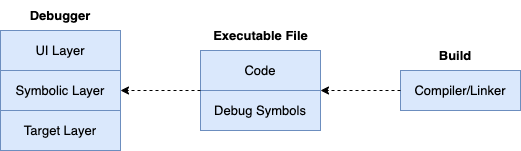

## 调试器雏形：技术方案

这里的技术方案，暂时先主要聚焦在如下几个点。

### 扩展性设计

调试器应该具备良好的扩展性设计，以支持在不同应用场景中的交互，如在命令行中调试、在IDE中调试、远程调试。

这也要求调试器的“**frontend**”和“**backend**”要实现分离式架构，因为我们可能在一台macOS机器上调试运行在Linux机器上的进程，frontend、backend运行环境在操作系统、硬件平台上可能是完全不同的。

这里简单提下一个设计良好的符号级调试器的大致架构，如下所示：



调试器需要包含UI Layer、Symbolic Layer、Target Layer这几层：

-   UI层 (UI layer)，主要负责与用户交互，接收用户输入并展示调试信息，如展示变量值、堆栈信息等。分离出UI层便于将用户交互逻辑与核心调试逻辑分离开，便于更改或支持不同的用户界面。
-   符号层 (Symbolic Layer)，主要负责解析和管理符号信息，如变量名、函数名、源码位置与内存地址、数据之间的转换等），它是调试器的核心部分，连接用户操作与目标程序的调试逻辑。分离出符号层，可以更容易地支持不同的编程语言、调试信息格式。
-   目标层 (Target Layer)，目标层直接与被调试程序交互，负责执行调试命令对进程进行控制、数据读写，如设置断点、单步执行、读取内存和寄存器数据等。分离出目标层，可以更方便地支持不同的目标平台，如支持不同的操作系统、硬件架构。

考虑到调试器的未来应用场景，可能会对设计进行进一步调整，比如引入Service Layer，如下所示：


我们将调试器架构进一步划分，分为frontend、backend。

-   frontend聚焦于与用户的交互逻辑，完成调试动作的触发、结果的展示；
-   backend聚焦于目标进程、平台特性相关的底层实现，接收frontend的调试命令，并返回对应的结果，以在frontend进行展示；
-   frontend和backend之间的桥梁就是新引入的服务层，frontend、backend之间可以通过RPC进行通信。

### 调试命令管理

[spf13/cobra](https://github.com/spf13/cobra)是一个基于golang的开源的命令行程序开发框架，它具有如下特点：

- 支持快速添加cmd；
- 支持为指定cmd添加subcmd；
- 支持帮助信息汇总展示；
- 支持POSIX风格的参数解析；
- 支持常见数据类型的参数解析；
- 支持为cmd指定必要参数；
- 支持生成shell自动补全脚本；
- 等等；

可以说，cobra是一个非常优秀的命令行程序开发框架，在诸多大型开源项目中得以应用，如kubernetes、hugo、github-cli gh，等等。在我的个人项目中，也有不少是采用了cobra来对命令、子命令进行管理。

使用cobra对调试命令进行管理，将给我们带来很大的便利。对于`godbg exec <proc>`、`godbg attach <pid>`类似的命令及选项管理，cobra绰绰有余，使用默认的设置就可以提供很好的支持。

凡事总有例外，调试器除了上述“启动调试”相关的命令以外，也有很多调试会话中使用的调试命令，如断点相关的，调用栈相关的，查看源码、变量、寄存器等相关的。为了方便开发人员查看感兴趣的调试命令及其帮助信息，我们不能将所有调试命令简单排序后予以展示，必要的分组是非常有帮助的。

比如我们将break、clear这两个增删断点相关的操作全部归类到分组“**[breakpoint]**”，将print、display、list等查看相关的全部归类到分组“**[show]**”分组，将backtrace、frame等栈帧相关的全部归类到“**[frames]**”分组，等等。

cobra为每个命令提供了一个属性cobra.Command.Annotations，它是一个map类型，可以为每个命令添加一些kv属性信息，然后基于此可以对其进行一些分组等自定义的操作：

```go
breakCmd.Annotation["group"] = "breakpoint"
clearCmd.Annotation["group"] = "breakpoint"
printCmd.Annotation["group"] = "show"
frameCmd.Annotation["group"] = "frames"
```

上面我们对几个命令根据功能进行了分组，假如我们用debugRootCmd表示最顶层的命令，那么我们可以自定义debugRootCmd的Use方法，方法内部我们遍历所有的子命令，并根据它们的属性Annotation["group"]进行分组后，再显示帮助信息。

查看帮助信息时将得到如下分组后的展示样式（而非默认列表样式），更便利、更有条理：

```bash
[breakpoint]
break : break <locspec>，添加断点
clear : clear <n>，清除断点

[show]
print : print <variable>，显示变量信息

[frames]
frame : frame <n>，选择对应的栈帧
```

综上不管是调试器启动时的命令，还是调试会话中需要交互式键入的调试命令，都可以安心地使用cobra来完成，cobra能很好地满足我们的开发需求。

### 输入自动补全

前面列出了很多的功能性需求，每个需求基本都对应着一个或几个调试命令，每个命令又有不同的选项，在调试过程中，我们很可能会遗忘命令的使用方式。

当我们遗忘时，就会中断调试会话，这是一个很低效的过程。试想下，我们不得不执行help命令查看帮助信息，帮助信息将污染我们的调试会话，使得我们注意力被分散。所以作为一个调试器产品的设计者、开发者，应该对“查看帮助”信息的需求进行进一步挖掘。

用户是需要查看帮助信息，但是并不一定是通过help的形式，我们可以在他输入命令的同时就给予辅助输入的提示信息，自动补全就是不错的方法。

自动补全大家并不陌生，我们在shell里面使用的很多命令有自动补全的功能，包括cobra开发的命令行应用程序本身也支持生成shell的自动完成脚本（导入即可实现自动补全功能）。

[go-prompt](https://github.com/c-bata/go-prompt)是一个不错的自动补全的库，它能够在程序运行期间根据用户输入自动给出自动补全的候选列表，并且支持多种选项设置，如候选列表的颜色、选中列表项的颜色等等。可以说，go-prompt是一个非常不错的选择，但是我们想要的更多。

前面我们有提到，如果要对调试会话中的调试命令进行管理的话，我们更希望通过cobra的方式来管理，并且经过一番思考发现是可行的。如果为了自动补全直接使用go-prompt的话，那我们可能将不得不自己管理这些命令。

或者，我们可以将二者的优点结合起来，[cobra-prompt](https://github.com/stromland/cobra-prompt)就是来解决这个问题的，它将go-prompt和cobra进行了一个比较好的集成，既能利用cobra的命令管理，也能发挥go-prompt的自动补全优势。cobra-prompt的实现原理很简单，将go-prompt获得的用户输入适当处理后，转给cobra debugRootCmd进行处理就可以。

> 本书提供的调试器实现，最初采用了cobra-prompt进行开发，但是由于某些原因，最终使用了liner进行代替，因为cobra-prompt的自动补全功能有时也会干扰调试会话，不一定真的有实质性的帮助。
>
> 最后，使用liner读取用户键入的调试命令，并通过cobra的命令管理来执行调试动作。简言之，我们仍然具备自动补全能力，只是放弃了go-prompt似的自动补全方式。

