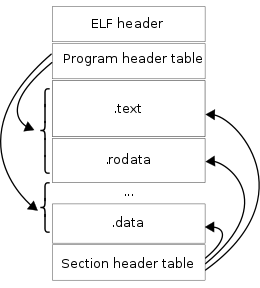

## 反汇编

### 实现目标：实现反汇编

反汇编是指令级调试过程中不可缺少的环节，对于符号级调试需要展示源码信息，对于指令级调试而言就是要展示汇编指令了。

汇编指令是和硬件强相关的，其实汇编指令不过是些助记符，一条汇编指令的操作码、操作数通过规定的编码方式进行编码，就得到了机器指令。不同指令的操作码占用字节数可能是相同的，也可能是不同的，操作数占用字节数也可能相同或不同。

不同硬件平台、指令集架构、诸多的汇编指令以及指令的定长编码、变长编码等等因素都给反汇编带来了一定的难度，要想凭一人之力实现反汇编还真的不是一件容易的事情。

幸好已经有反汇编框架[Capstone](http://www.capstone-engine.org/)来专门解决这个问题，对于go语言而言可以考虑使用go版本的[Gapstone](https://github.com/bnagy/gapstone)。或者，我们使用go官方提供的反汇编工具类[arch/x86/x86asm](https://golang.org/x/arch/x86/x86asm)，注意到在流行的go语言调试器dlv里面也是使用x86asm进行反汇编操作的。

为了简单起见，我们也将使用arch/x86/x86asm来完成反汇编任务，当然使用Capstone、Gapstone也并非不可以，如果读者感兴趣可以自行实验。

### 代码实现

实现反汇编操作，主要是要掌握这几个操作：

- 如何读取指定进程的完整指令数据；
- 如何对一个完整的程序进行反汇编操作；
- 如何对断点处指令进行反汇编操作。

#### 根据pid找到可执行程序

tracer对tracee的控制，很多操作都依赖tracee的pid，如果要读取pid对应的可执行程序的完整指令数据，那就必须先通过pid找到对应的可执行程序路径，怎么做呢？

> 直接读取pid对应进程实例的内存数据是没用的，因为里面的指令数据可能不全。进程的指令数据也是按需加载的，详细可了解下Linux PageFault相关内容。

在Linux系统下，虚拟文件系统路径 `/proc/<pid>/exe`是一个符号链接，它指向了进程 `pid`对应的可执行程序的绝对路径。go程序里读取该符号链接信息即可获知程序路径。

比如这样操作：

```go
package main

// GetExecutable 根据pid获取可执行程序路径
func GetExecutable(pid int) (string, error) {
	exeLink := fmt.Sprintf("/proc/%d/exe", pid)
	exePath, err := os.Readlink(exeLink)
	if err != nil {
    	return "", fmt.Errorf("find executable by pid err: %w", err)
	}
	return exePath, nil
}
```

#### 实现对完整程序反汇编

根据pid找到可执行程序文件路径之后，可以尝试读取文件内容，为接下来反汇编做准备。但要注意的是，Linux二进制可执行程序文件内容是按照 `ELF (Executable and Linkable Format)`格式进行组织的，其大致的结构如下所示。要读取、解析ELF文件数据，可以借助标准库 `debug/elf` 来完成。



我们看到一个ELF文件包含了ELF Header、Program Header Table、Section Header Table以及一系列的Sections，Program Header Table、Section Header Table中引用Sections。

Program Header Table和Section Header Table，是为构建两种不同视图特意设计的：

- Program Header Table构造了segments视图，它描述了程序加载时loader如何通过mmap将引用的sections映射到内存空间；
- Section Header Table构造了sections视图，描述了二进制程序中sections的顺序位置，以及指导linker如何进行链接；

这两种视图互不干扰，分别用于指导loader、linker的设计实现。

> **What You Need To Know About ELF for CS452**
>
> **Two views of the world**
>
> There are two views of an ELF file. 1) The *section view* sees the file as a bunch of sections, which are to be linked or loaded in some manner. 2) The *program view* sees the file as a bunch of *ELF segments* (not to be confused with Intel segments) which are to be loaded into memory in order to execute the program.
>
> This split is designed to allow someone writing a linker to easily get the information they need (using the section view) and someone writing a loader (that's you) easily get the information they need without worrying about a lot of the complications of linking (using the program view).
>
> Because you are writing a loader, not a linker, **you can completely ignore the section view**. You only care about the program view. This throws away around 80% of the ELF spec. Doesn't that make you feel good?
>
> see: https://student.cs.uwaterloo.ca/~cs452/W18/elf/elf.html

现在我们要想实现反汇编操作的话，就必须先将可执行程序（Linux下是ELF格式）按照ELF格式正常解析，再从.text segment读取出机器指令。

下面我们就来做这个事情：

```go
package main

import (
	"debug/elf"
	"fmt"
	"os"
	"strconv"

	"golang.org/x/arch/x86/x86asm"
)

func main() {

    // go run main.go <pid>
	if len(os.Args) != 2 {
		panic("invalid params")
	}

	// pid
	pid, err := strconv.Atoi(os.Args[1])
	if err != nil {
		panic(err)
	}

	// 通过pid找到可执行程序路径
	exePath, err := GetExecutable(pid)
	if err != nil {
		panic(err)
	}
	fmt.Println(exePath)

	// 读取指令信息并反汇编
	elfFile, err := elf.Open(exePath)
	if err != nil {
		panic(err)
	}
	section := elfFile.Section(".text")
	buf, err := section.Data()
	if err != nil {
		panic(err)
	}

	// 逐语句解析机器指令并反汇编，然后打印出来
	offset := 0
	for {
        // 使用64位模式
		inst, err := x86asm.Decode(buf[offset:], 64)
		if err != nil {
			panic(err)
		}
		fmt.Printf("%8x %s\n", offset, inst.String())
		offset += inst.Len
	}
}
```

这里的代码逻辑比较完整，它接收一个pid，然后获取对应的可执行文件路径，然后通过标准库提供的elf package来读取文件并按ELF文件进行解析。从中读取.text section的数据。众所周知，.text section内部数据即为程序的指令。

拿到指令之后，我们就可以通过 `golang.org/x/arch/x86/x86asm`来进行反汇编操作了，因为指令是变长编码，反汇编成功后，返回的信息中包含了当前指令数据的字节数，我们借此调整偏移量后可以对后续指令继续反汇编。

#### 对断点位置进行反汇编

对断点位置进行反汇编，首要任务就是获得当前断点的位置。

动态断点，往往是通过指令patch来实现的，即将任意完整机器指令的第一字节数据保存，然后将其替换成 `0xCC (int 3)`指令，处理器执行完0xCC之后自身就会停下来，这就是断点的效果。

断点通过指令patch来实现必须覆盖指令的第一字节，不能覆盖其他字节，原因很简单，指令为了提高解码效率、支持更多操作类型，往往都是采用的变长编码。如果不写第一字节，那么处理器执行时可能会产生错误。比如一条指令操作码有多个字节，结果因为覆盖的原因导致变成了一个错误的操作码，执行时就会有异常。再比如一条指令只有一个字节，我们非要写到第二个字节存起来，那就起不到断点的作用，因为执行到这个断点时，前面本不应该执行的一字节指令却执行了。

前面我们有系统性地介绍过指令patch的概念、应用场景等（比如调试器、mock测试框架gomonkey等等），如您还感到不熟悉，请回头查看相关章节。

假如说当前我们的断点位于offset处，现在要执行反汇编动作，大致有如下步骤：

```bash
断点添加之前：
offset:  0x0 0x1 0x2 0x3 0x4

断点添加之后：
offset: 0xcc 0x1 0x2 0x3 0x4   | orig: <offset,0x0>
```

- 首先，要知道0xCC执行后会暂停执行，执行后，意味着此时PC=offset+1
- 再次，要知道PC-1处的指令不是完整指令，第一字节指令被patch了，需要还原；
- 最后，要知道PC值是特殊寄存器值，指向待执行指令的位置，当前PC=offset+1，是原指令起始字节的下个字节位置，要从 PC-1 这个内存位置开始读取完整指令，再反汇编；

这大概就是断点位置处执行反汇编所需要的操作，如果对应位置处不是断点就不需要执行 `pc=pc-1`。

#### Put It Together

经过上面一番讨论之后，反汇编命令disassCmd实现如下：

```go
package debug

import (
	"fmt"
	"os"
	"syscall"

	"github.com/spf13/cobra"
	"golang.org/x/arch/x86/x86asm"
)

var disassCmd = &cobra.Command{
	Use:   "disass <locspec>",
	Short: "反汇编机器指令",
	Annotations: map[string]string{
		cmdGroupKey: cmdGroupSource,
	},
	RunE: func(cmd *cobra.Command, args []string) error {

		// 读取PC值
		regs := syscall.PtraceRegs{}
		err := syscall.PtraceGetRegs(TraceePID, &regs)
		if err != nil {
			return err
		}

		buf := make([]byte, 1)
		n, err := syscall.PtracePeekText(TraceePID, uintptr(regs.PC()-1), buf)
		if err != nil || n != 1 {
			return fmt.Errorf("peek text error: %v, bytes: %d", err, n)
		}
		fmt.Printf("read %d bytes, value of %x\n", n, buf[0])
		// PC前一字节为0xCC表示当前PC应回退1字节才能读取到完整指令数据
		if buf[0] == 0xCC {
			regs.SetPC(regs.PC() - 1)
		}

		// 查找，如果之前设置过断点，将恢复
		dat := make([]byte, 1024)
		n, err = syscall.PtracePeekText(TraceePID, uintptr(regs.PC()), dat)
		if err != nil {
			return fmt.Errorf("peek text error: %v, bytes: %d", err, n)
		}
		fmt.Printf("size of text: %d\n", n)
  
		// TODO 在实现了断点功能之后，需注意读取到的dat[0]为0xCC，此时需注意还原指令数据，
		// 否则反汇编操作是有错误的。

		// 反汇编这里的指令数据
		offset := 0
		for offset < n {
            // 使用64位模式
			inst, err := x86asm.Decode(dat[offset:], 64)
			if err != nil {
				return fmt.Errorf("x86asm decode error: %v", err)
			}
			fmt.Printf("%8x %s\n", offset, inst.String())
			offset += inst.Len
		}
	},
}

func init() {
	debugRootCmd.AddCommand(disassCmd)
}

// GetExecutable 根据pid获取可执行pa程序路径
func GetExecutable(pid int) (string, error) {
	exeLink := fmt.Sprintf("/proc/%d/exe", pid)
	exePath, err := os.Readlink(exeLink)
	if err != nil {
    	return "", fmt.Errorf("find executable by pid err: %w", err)
	}
	return exePath, nil
}
```

### 代码测试

我们随便写一个go程序，让其运行起来，查看其pid为2507，随后执行 `godbg attach 2507`开始对目标进程进行调试。

调试会话启动之后，我们直接输入disass命令进行反汇编，可以看到所有指令的反汇编数据。我们当前还没有实现 `breakpoint` 功能，所以此处先不演示对断点处进行反汇编的效果，示例代码中也已经进行了说明，如果PC-1处为断点，需要注意将对应位置的0xCC给还原。

> TODO 这里需要在实现了断点功能之后，再补充一个小节继续完善下断点处反汇编功能的实现。涉及到从断点位置读取指令数据的部分、指令patch数据的备份还原、反汇编。

```bash
$ godbg attach 2507
process 2507 attached succ
process 2507 stopped: true

godbg> disass
read 1 bytes, value of 89
size of text: 1024
       0 MOV [RSP+Reg(0)+0x20], EAX
       4 RET
       5 INT 0x3
      ..........
      1e INT 0x3
      1f INT 0x3
      20 MOV EDI, [RSP+Reg(0)+0x8]
      24 MOV RSI, 0x2
      2b MOV RDX, 0x1
      32 MOV EAX, 0x48
      37 SYSCALL
      39 RET
      ..........
     100 CMP [RAX+0x8], RCX
     104 JE .+60
     106 XOR ECX, ECX
     108 TEST CL, CL
     10a JNE .+16
     10c XOR EAX, EAX
     10e MOV [RSP+Reg(0)+0x40], AL
     112 MOV RBP, [RSP+Reg(0)+0x20]
     117 ADD RSP, 0x28
     11b RET
     11c LEA RCX, [RDX+0x18]
     120 MOV [RSP+Reg(0)], RCX
     124 ADD RAX, 0x18
      ..........
     3fd INT 0x3
     3fe INT 0x3
     3ff INT 0x3
     Error: x86asm decode error: truncated instruction
```

我们也注意到最后一行有错误信息，提示“truncated instruction”，这是因为我们固定了读取指令的buffer是1024 bytes，可能有一条最后的指令没有完全读取过来，所以进行decode的时候这条指令失败了。

这里的失败是符合预期的、无害的，我们调试过程中，不会显示这么多汇编指令，只会显示断点附近的几十条指令而已，对于decode失败的buffer末尾几条指令简单忽略就可以。

现在我们已经实现了反汇编的功能，下一节，我们将通过指令patch来实现动态断点的添加、移除。

> ps: 在我们的示例程序 ``golang-debugger-lessons/5_disassemble `中提供了一个可以独立运行的程序，运行 `path-to/5_disassemble `<pid>`` 可以反汇编程序中包含的所有指令，程序也对可能遇到的错误进行了处理，包括不认识的指令、越界问题。

### 更多相关内容

汇编指令有go、intel、gnu 3种常见风格，gnu风格的俗称at&t风格。

为了方便不同习惯的开发者能顺畅地阅读相关反汇编出来的指令，我们后续又为disass命令添加了选项 `disass -s <syntax>`来指定汇编指指令的风格，如果您倾向于阅读at&t格式汇编，则可以通过 `disass -s gnu`来查看对应风格的汇编指令。

函数 `instSyntax(inst x86asm.Inst, syntax string) (string, error)`实现了对不同汇编风格的转换支持：

```go
func instSyntax(inst x86asm.Inst, syntax string) (string, error) {
	asm := ""
	switch syntax {
	case "go":
		asm = x86asm.GoSyntax(inst, uint64(inst.PCRel), nil)
	case "gnu":
		asm = x86asm.GNUSyntax(inst, uint64(inst.PCRel), nil)
	case "intel":
		asm = x86asm.IntelSyntax(inst, uint64(inst.PCRel), nil)
	default:
		return "", fmt.Errorf("invalid asm syntax error")
	}
	return asm, nil
}
```

另外我们也添加了选项 `disass -n <num>`来指定一次反汇编操作要decode的指令条数，因为调试会话中往往更关心当前待执行的指令，所以没必要一次反汇编成千上万行指令，那仅会分散调试人员的注意力而已。

您可以在项目 `hitzhangjie/godbg` 源文件 `godbg/cmd/debug/disass.go`中查看完整反汇编实现。

### 参考文献

1. What You Need To Know About ELF, https://student.cs.uwaterloo.ca/~cs452/W18/elf/elf.html
2. dissecting go binaries, https://www.grant.pizza/blog/dissecting-go-binaries/
3. how many x86-64 instructions are there anyway, https://stefanheule.com/blog/how-many-x86-64-instructions-are-there-anyway/
