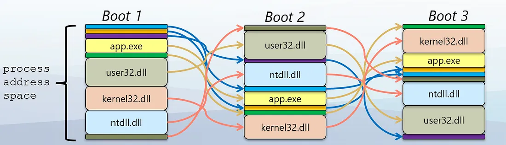

## 扩展阅读：地址空间布局随机化

### ASLR是什么



ASLR是一种操作系统级别的安全技术，主要作用是通过随机化程序在内存中的加载位置来增加攻击者预测目标地址、利用软件漏洞进行恶意操作的难度。其核心机制包括动态随机分配进程地址空间中各个部分的位置，例如基址、库文件、堆和栈等。

### 它有什么价值

ASLR的核心价值在于提高系统的安全性，具体体现在以下几个方面：

1. **增强系统防御能力** ：通过引入不可预测性，使得攻击者无法准确地预知内存中的关键函数或数据的位置。这对于依赖于固定地址的缓冲区溢出等漏洞利用方式而言尤其重要。
2. **缓解特定类型的攻击** ：ASLR能够有效地对抗诸如堆栈喷射(stack spray)、返回导向编程(ROP, Return-Oriented Programming)及直接控制程序执行流的其他技术，这些通常需要确切了解目标地址的信息。
3. **提高整体安全性框架的有效性** ：与数据执行保护(DEP)等其他安全机制结合使用时，ASLR可以显著提升整个系统的防护能力。例如，在DEP阻止代码在堆栈或堆内存中执行的情况下，如果攻击者仍试图通过缓冲区溢出来控制程序的流程，则必须知道某些特定位置的确切地址，而ASLR的存在则使这种情况变得更加困难。

### 它的实现原理

以Linux系统为例，下列ASLR内核参数配置项及其含义：

```bash
$ cat /proc/sys/kernel/randomize_va_space
2
```

- 0: 禁用ASLR (不安全，不推荐禁用).
- 1: 有限保守的随机化支持 (仅支持 stack、heap、libraries)；
- 2: 完整的随机化支持 (包括 stack、heap、libraries 以及 executable).

操作系统上述内核配置项是2，意味着内核开启了完整的随机化支持，但是对于可执行程序的随机化支持，要求可执行程序构建必须开启了PIE模式。

随机化是如何实现的：

- Stack: The stack pointer (RSP or ESP) is initialized to a random offset within a predefined range.
- Heap: The starting address for dynamic memory allocation (brk or mmap) is randomized.
- Shared Libraries: The loader uses mmap to load libraries at random addresses.
- Executable: If compiled with PIE, the code’s base address is also randomized.

executable地址是如何被随机化的呢? 这里是指代码段(text segment)的加载地址被随机化：

- 如果可执行程序禁用了PIE模式，那么代码段的加载地址 `VirtAddress` 是固定的
- 如果可执行程序启用了PIE模式，那么 `VirtAddress` 只是一个偏移量，加载器会选择一个随机地址，
  再加上这个偏移量，最终计算出实际的加载地址。

### 对调试的影响

我们为什么要介绍ALSR呢？因为它对调试过程还是有影响的。`go build` 构建出来的可执行程序，每次启动后同一个函数的指令地址是固定不变的，但是同一个栈变量的地址在每次启动后却是变化的 …… 我们知道有些读者会对此产生困惑，所以要介绍下。

造成这个问题的原因，现在Linux发行版一般都是默认打开完全随机化支持的，意味着即使go程序编译时没有开启PIE模式，栈、堆、共享库地址还是会被随机化处理的，所以我们观察到了多次启动后同一个栈变量地址不同。而对可执行程序代码的随机化则要求必须要开启PIE模式构建才能支持，所以我们观察到了多次启动后代码段地址是固定的。如果我们使用 `go build -buildmode=pie` 之后，重新测试就会发现代码段的地址也被随机化了。

有些调试器支持将一些调试过程记录下来作为脚本的形式，下次重启调试器时可以直接加载，如果上次调试时脚本里记录了一些指令地址、变量地址，那么下次重启被调试进程调试时ASLR的影响会导致地址不再有效。

OK，我们先笼统介绍到这里，大家知道ASLR对调试过程可能产生的影响即可。如果想了解更多可以看下相关资料。

> ps: 您可以通过pmap, /proc/<pid>/maps来查看进程内的代码段、栈、堆、共享库在进程地址空间内的分布和位置，您也可以借助调试器能力来印证。

### 参考文献

- [https://en.wikipedia.org/wiki/Address_space_layout_randomization](https://en.wikipedia.org/wiki/Address_space_layout_randomization)
- [Early Security Stories — ASLR](https://medium.com/@johnlatwc/early-security-stories-aslr-4c6bafe0dda1)
- [Demystifying ASLR: Understanding, Exploiting, and Defending Against Memory Randomization](https://securitymaven.medium.com/demystifying-aslr-understanding-exploiting-and-defending-against-memory-randomization-4dd8fe648345)
- [ASLR: Address Space Layout Randomization](https://medium.com/@syedishrarali/aslr-address-space-layout-randomization-eb94203a0e7d)
- [Introduction to x64 Linux Binary Exploitation (Part 5)- ASLR](https://valsamaras.medium.com/introduction-to-x64-linux-binary-exploitation-part-5-aslr-394d0dc8e4fb)
