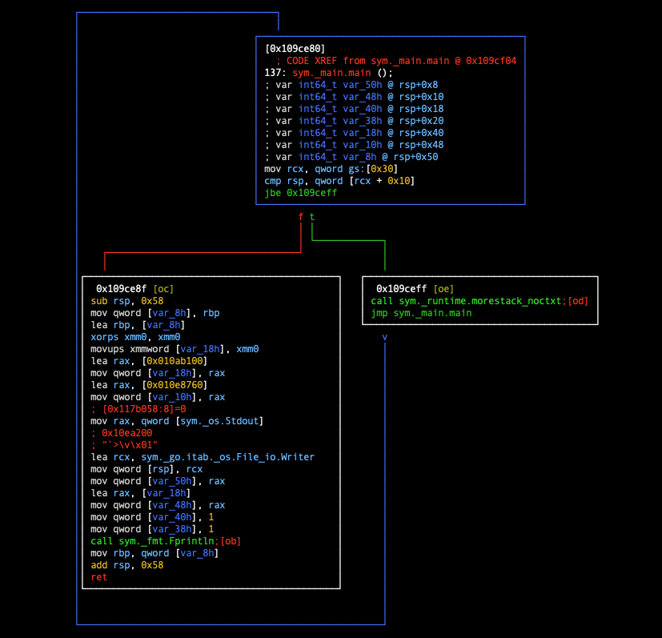

## 指令级调试器开发

本章开始进入指令级调试器开发，我们将一步步实现指令级调试相关操作。

### 指令级调试 VS. 符号级调试

指令级调试是相对符号级调试而言的。它只关心机器指令级别的调试，不依赖调试符号、源程序信息。缺少了调试符号信息，会让调试变得有些困难，难以理解调试代码的含义。

但是指令级调试技术是符号级调试技术的基石，可以说符号级调试相关的操作是在指令级调试基础上的完善。大家在软件开发过程中接触到的大多数调试器，是符号级调试器，如gdb、lldb、dlv等，但是它们也具备指令级调试能力。当然也有一些专门的指令级调试器，如radare2、IDA Pro、OllyDbg、Hopper等。

### 指令级调试器功能一览

指令级调试技术，在软件逆向工程中的应用是非常广泛的。当然这里要求调试器具备更加强大的能力，绝不仅仅是只支持step逐指令执行、读写内存、读写寄存器这么简单，下面就以作者经常使用的radare2为例演示下其有多强大。

以如下程序main.go为例：

```go
package main
import "fmt"

func main() {
  fmt.Println("vim-go")
}
```

执行`go build -o main main.go`编译完成，然后执行`radare2 main`：

```bash
$ go build -o main main.go
$ 
$ r2 main
[0x0105cba0]> s sym._main.main             ; 注意先定位到函数main.main
[0x0109ce80]> af                           ; 对当前函数进行分析
[0x0109ce80]> pdf                          ; 反汇编当前函数并打印
            ; CODE XREF from sym._main.main @ 0x109cf04
┌ 137: sym._main.main ();
│           ; var int64_t var_50h @ rsp+0x8
│           ; var int64_t var_48h @ rsp+0x10
│           ; var int64_t var_40h @ rsp+0x18
│           ; var int64_t var_38h @ rsp+0x20
│           ; var int64_t var_18h @ rsp+0x40
│           ; var int64_t var_10h @ rsp+0x48
│           ; var int64_t var_8h @ rsp+0x50
│       ┌─> 0x0109ce80      65488b0c2530.  mov rcx, qword gs:[0x30]
│       ╎   0x0109ce89      483b6110       cmp rsp, qword [rcx + 0x10]
│      ┌──< 0x0109ce8d      7670           jbe 0x109ceff
│      │╎   0x0109ce8f      4883ec58       sub rsp, 0x58
│      │╎   0x0109ce93      48896c2450     mov qword [var_8h], rbp
│      │╎   0x0109ce98      488d6c2450     lea rbp, [var_8h]
│      │╎   0x0109ce9d      0f57c0         xorps xmm0, xmm0
│      │╎   0x0109cea0      0f11442440     movups xmmword [var_18h], xmm0
│      │╎   0x0109cea5      488d0554e200.  lea rax, [0x010ab100]
│      │╎   0x0109ceac      4889442440     mov qword [var_18h], rax
│      │╎   0x0109ceb1      488d05a8b804.  lea rax, [0x010e8760]
│      │╎   0x0109ceb8      4889442448     mov qword [var_10h], rax
│      │╎   0x0109cebd      488b0594e10d.  mov rax, qword [sym._os.Stdout] ; [0x117b058:8]=0
│      │╎   0x0109cec4      488d0d35d304.  lea rcx, sym._go.itab._os.File_io.Writer ; 0x10ea200 ; "`>\v\x01"
│      │╎   0x0109cecb      48890c24       mov qword [rsp], rcx
│      │╎   0x0109cecf      4889442408     mov qword [var_50h], rax
│      │╎   0x0109ced4      488d442440     lea rax, [var_18h]
│      │╎   0x0109ced9      4889442410     mov qword [var_48h], rax
│      │╎   0x0109cede      48c744241801.  mov qword [var_40h], 1
│      │╎   0x0109cee7      48c744242001.  mov qword [var_38h], 1
│      │╎   0x0109cef0      e87b99ffff     call sym._fmt.Fprintln
│      │╎   0x0109cef5      488b6c2450     mov rbp, qword [var_8h]
│      │╎   0x0109cefa      4883c458       add rsp, 0x58
│      │╎   0x0109cefe      c3             ret
│      └──> 0x0109ceff      e87cc4fbff     call sym._runtime.morestack_noctxt
└       └─< 0x0109cf04      e977ffffff     jmp sym._main.main
[0x0109ce80]> 
```

我们在radare2调试会话里面执行了3个命令：

- s sym._main.main，定位到main.main函数；
- af，对当前函数进行分析；
- pdf，对当前函数进行反汇编并打印出来；

大家可以看到，与普通符号级调试器disass命令不同的是，radare2不仅展示了汇编信息，还将函数调用关系的起止点通过箭头的形式给标识了出来。对于调试时只能查看指令列表，而看不到符号级函数调用的情景来说，这个功能就非常便利了。

甚至可以执行命令`vV`将汇编指令转换成调用图（callgraph）的形式：



是不是有点神奇，是不是很强大？当读者理解了像ABI、function prologue、function epilogue之后就明白如何实现此类功能了。

radare2的功能之强大远不只是这些，从其支持的命令及选项可见一斑，其学习曲线也异常陡峭，逆向工程师、安全从业人员、对二进制分析感兴趣的人都对其青睐有加。

```bash
[0x0109ce80]> ?
Usage: [.][times][cmd][~grep][@[@iter]addr!size][|>pipe] ; ...   
Append '?' to any char command to get detailed help
Prefix with number to repeat command N times (f.ex: 3x)
| %var=value              alias for 'env' command
| *[?] off[=[0x]value]    pointer read/write data/values (see ?v, wx, wv)
| (macro arg0 arg1)       manage scripting macros
| .[?] [-|(m)|f|!sh|cmd]  Define macro or load r2, cparse or rlang file
| _[?]                    Print last output
| =[?] [cmd]              send/listen for remote commands (rap://, raps://, udp://, http://, <fd>)
| <[...]                  push escaped string into the RCons.readChar buffer
| /[?]                    search for bytes, regexps, patterns, ..
| ![?] [cmd]              run given command as in system(3)
| #[?] !lang [..]         Hashbang to run an rlang script
| a[?]                    analysis commands
| b[?]                    display or change the block size
| c[?] [arg]              compare block with given data
| C[?]                    code metadata (comments, format, hints, ..)
| d[?]                    debugger commands
| e[?] [a[=b]]            list/get/set config evaluable vars
| f[?] [name][sz][at]     add flag at current address
| g[?] [arg]              generate shellcodes with r_egg
| i[?] [file]             get info about opened file from r_bin
| k[?] [sdb-query]        run sdb-query. see k? for help, 'k *', 'k **' ...
| l [filepattern]         list files and directories
| L[?] [-] [plugin]       list, unload load r2 plugins
| m[?]                    mountpoints commands
| o[?] [file] ([offset])  open file at optional address
| p[?] [len]              print current block with format and length
| P[?]                    project management utilities
| q[?] [ret]              quit program with a return value
| r[?] [len]              resize file
| s[?] [addr]             seek to address (also for '0x', '0x1' == 's 0x1')
| t[?]                    types, noreturn, signatures, C parser and more
| T[?] [-] [num|msg]      Text log utility (used to chat, sync, log, ...)
| u[?]                    uname/undo seek/write
| v                       visual mode (v! = panels, vv = fcnview, vV = fcngraph, vVV = callgraph)
| w[?] [str]              multiple write operations
| x[?] [len]              alias for 'px' (print hexadecimal)
| y[?] [len] [[[@]addr    Yank/paste bytes from/to memory
| z[?]                    zignatures management
| ?[??][expr]             Help or evaluate math expression
| ?$?                     show available '$' variables and aliases
| ?@?                     misc help for '@' (seek), '~' (grep) (see ~??)
| ?>?                     output redirection
| ?|?                     help for '|' (pipe)
[0x0109ce80]> 
```

如果读者进一步了解下rafare2的详细功能，它功能之强大一定会让你感到惊叹。

ps: 如果读者想了解radare2的使用，可以先看下我之前写过的一偏实践文章：[monkey patching in golang](https://www.hitzhangjie.pro/blog/2020-08-23-monkey_patching_in_go/)，描述了指令patch技术在golang mock测试中 的应用，以及如何借助radare2来演示指令patching的过程。

### 以不变应万变的神兵利器

虽然指令级调试器在使用体验上可能没有符号级调试器那样直观友好，比如无法直接显示变量名、源码行号等高级信息，但它的强大之处恰恰在于“底层通用性”和“无限可能”。指令级调试器并不依赖于任何特定的编程语言或编译器生成的符号信息，无论是Assembly、C、C++、Go、Rust，还是其他任何能够编译为机器码的语言，只要你了解目标平台的指令集和操作系统机制，就可以用同样的方式进行调试和分析。

对于真正精通底层原理、熟悉指令集和操作系统的开发者来说，指令级调试器就是一把无往不利的“神兵利器”。它能够帮助你跨越语言和平台的壁垒，深入理解和掌控程序的每一条指令执行过程。正如掌握了强大通用命令行工具后，可以在不同平台上游刃有余地解决问题一样 (嗯...比如编辑器Vim)，精通指令级调试器也能让你在各种环境下都能以不变应万变，解决最棘手的底层问题。

总之，指令级调试器虽然门槛较高，但一旦掌握，其灵活性和强大能力远超想象，是每一个追求极致掌控力的开发者不可或缺的工具。

大名鼎鼎的radare2第一个版本是2011年10月12日发布的v0.8.6，现在已经是2025年8月26日，14年过去了，而它的前身radare从github上可查的第一次commit，更是有18年的历史了。18年的历史，18年的不断淬炼，18年的智慧沉淀与经验传承，👍

### 本节小结

本章主要介绍指令级调试的相关功能，旨在帮助读者理解底层调试的实现原理。我们以学习和分享为出发点，聚焦于核心机制的讲解，而非追求工程上功能的全面覆盖。如果时间篇幅允许，也会适当与其他指令级调试器进行对比，探讨不同特性的实现方式。让我们一起开始本章知识的学习吧。
