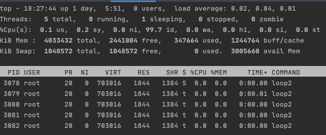

## Bugfix: 解决多线程调试问题

### 问题回顾

前面我们遇到过一个问题，“如果被调试程序是一个多线程程序，只通过进程pid来attach，只能attach住主线程，其他线程还是可以正常执行”。

这个问题会对调试过程带来很多干扰，非常不方便，本小节，我们着手解决这个问题。

### 设计实现

#### tracer & tracee

首先，重申一下，tracer、tracee指的是线程，对于一个多线程程序，想对哪些线程进行调试，就要分别对这些线程进行attach操作，然后才能其他发送PTRACE请求进一步进行调试。另外，tracer、tracee彼此之间的链接关系建立之后，tracee就只接受来自相同tracer（线程）的PTRACE请求，其他线程发送的请求一概不处理。

> 关于tracer、tracee（线程）的绑定约束，我们可以这样实现：
>
> - 方法1：可以考虑针对所有tracer对tracee的PTRACE请求，统一使用一个相同的goroutine进行处理，并且将该goroutine绑定到一个物理线程上；
> - 方法2：每次准备attach一个新的线程时，启动一个专门的goroutine来处理当前一级后续的与该线程的PTRACE交互，并且该goroutine也要绑定到一个物理线程上；
>
> 两种方式实现起来都比较简单。

这些都是由ptrace设计决定的，开发人员要谨记在心。

接下来我们区分下发起调试的两种场景：

- 多线程程序还未运行，由调试器启动后自动attach；
- 多线程程序已运行，由调试器attach已启动的线程；

#### launch多线程程序

调试器启动程序时，为了能够让进程及时停下来被调试，调试器会在启动程序时设置PTRACEME，内核会在进程准备就绪（代码段、数据段、栈段等）后，发送SIGTRAP信号给被调试线程（tracee），比较特殊的是该信号是由内核来处理的，会暂停线程执行。同时内核也会通知父进程（tracer）子进程状态变化。

尽管被调试程序是多线程程序，但是在当前这个阶段，除了主线程以外的其他线程还没有创建出来，因为主线程的代码都没开始执行就停止了，还没有走到创建其他线程的逻辑。

假如我们现在恢复主线程执行，其他线程被创建出来以后，该如何及时跟踪这些线程呢？

以Linux操作系统为例，Linux v2.5.46 引入了ptrace设置选项PTRACE_O_TRACECLONE，如果为tracee设置了该选项，后续tracee执行过程中若创建了新的线程，那么新线程也将自动被tracer跟踪。

```bash
       PTRACE_SETOPTIONS (since Linux 2.4.6; see BUGS for caveats)
              Set ptrace options from data.  (addr is ignored.)  data is
              interpreted as a bit mask of options, which are specified
              by the following flags:
			  ...

              PTRACE_O_TRACECLONE (since Linux 2.5.46)
                     Stop the tracee at the next clone(2) and
                     automatically start tracing the newly cloned
                     process, which will start with a SIGSTOP, or
                     PTRACE_EVENT_STOP if PTRACE_SEIZE was used.
```

所以，这种情景下主要注意两点即可：

- 创建并启动进程时，设置PTRACEME，对go而言就是将ProcAttrs.Ptraced设为true；
- 进程启动并暂停执行后，为tracee添加ptrace选项PTRACE_O_TRACECLONE；

#### attach多线程程序

如果一个多线程程序已经在运行，现在要对其进行调试，这种情景又该注意些什么呢？

首先，我们attach的时机不确定，进程中可能已经创建了多个线程。另外，并且这些线程也有自己的生命周期，随时可能创建或被销毁。

以Linux为例，/proc/pid/tasks/下的每一个目录名都是一个线程id，对应的线程都归属于进程pid。通过枚举/proc/pid/task/下的目录名，也就可以获得所有的线程id。tracer需要attach这里所有的线程。

除了这一点，还需要考虑tracee后续创建新线程的情况，关于这里的解决办法，我们在前面介绍了PTRACE_O_TRACECLONE选项，同样适用于这里的情况。

所以，处理这里的问题注意一下两点即可：

- 枚举/proc/pid/tasks/下的目录名，获得当前的线程id列表，并attach这些线程；
- 对每一个attach并暂停执行的线程，设置ptrace选项PTRACE_O_TRACECLONE；

### 代码示例

可以参考 [hitzhangjie/godbg/target/process.go](https://github.com/hitzhangjie/godbg/blob/master/target/process.go) 下的代码实现。

#### launch多线程程序

```go
// NewTargetProcess 创建一个待调试进程
func NewTargetProcess(cmd string, args ...string) (*TargetProcess, error) {
	target := TargetProcess{
		Process:     nil,
		Command:     cmd,
		Args:        args,
		Threads:     map[int]*Thread{},
		Breakpoints: Breakpoints{},
	}

	// start and trace
	p, err := launchCommand(cmd, args...)
	if err != nil {
		return nil, err
	}
	target.Process = p

	// trace newly created thread
	err = syscall.PtraceSetOptions(p.Pid, syscall.PTRACE_O_TRACECLONE)
	if err != nil {
		return nil, err
	}

	return &target, nil
}
```

#### attach多线程程序

```go
// AttachTargetProcess trace一个目标进程（准确地说是线程）
func AttachTargetProcess(pid int) (*TargetProcess, error) {
	target := TargetProcess{
		Process:     nil,
		Command:     "",
		Args:        nil,
		Threads:     map[int]*Thread{},
		Breakpoints: Breakpoints{},
	}

	// attach to running process (thread)
	err := attach(pid)
	if err != nil {
		return nil, err
	}

	p, err := os.FindProcess(pid)
	if err != nil {
		return nil, err
	}
	target.Process = p

	// initialize the command and arguments,
	// after then, we could support restart command.
	target.Command, err = readProcComm(pid)
	if err != nil {
		return nil, err
	}

	target.Args, err = readProcCommArgs(pid)
	if err != nil {
		return nil, err
	}

	// attach to other threads, and prepare to trace newly created thread
	target.updateThreadList()

	return &target, nil
}
```

篇幅原因，上述有些代码实现就不一一列举了，可以查看上述源码了解更多。

### 代码测试

#### 测试：启动多线程程序

以 hitzhangjie/godbg/testdata/loop2.go 作为测试实例，在testdata目录下，执行命令`godbg debug`，会自动编译、启动调试进程，并设置线程的ptrace选项。

```bash
$ godbg debug
build ok
process 3354 stopped: true
godbg> 
```

被调试进程的pid为3354，运行`top -p 3354 -H`来看下该进程下的线程列表。


此时只有一个线程被创建出来，也就是主线程，并且其状态一栏为`t`，表示其正在被调试器跟踪。

接下来我们在调试会话中执行 `continue` 命令，恢复主线程执行，因为go程序天然是多线程程序，我们预期会有多个线程创建出来。并且由于设置了PTRACE_O_TRACECLONE选项，这些线程应该自动被调试器跟踪。

所以top中显示的新创建线程列表状态一栏应该全被为状态`t`，我们在调试会话中执行 `continue`看下实际结果，发现新创建的3357、3358、3359状态全部为`t`，处于被调试器跟踪状态。测试结果符合预期。


> 这里有意思的是我们执行continue命令时，3354线程并没有从`t`转换为`S`，而是继续处于`t`被跟踪的状态。这是为什么呢？PTRACE_O_TRACECLONE，跟该选项有关。
>
> 3354线程肯定是执行了，其执行到clone系统调用时，创建的新线程会暂停执行并通知tracer，此时不光新线程处于被跟踪的状态，调用clone的线程也处于被跟踪的状态。
>
> 所以它们当前的状态都是 `t`，就好理解了。

当尝试继续执行continue命令时，发现线程3354恢复执行了，状态从 `t` 变成了 `s`。


#### 测试：attach多线程程序

我们还是以 hitzhangjie/godbg/testdata/loop2.go 作为测试实例，首先执行该程序 `loop2`，该程序会在一个循环里循环打印一些信息，包括进程pid，测试时pid为3078。

因为是多线程程序，我们先看下有多少个线程 `top -p 3078 -H`，选项`-H`将显示进程中包含的所有轻量级进程列表，也就是线程列表。此时的线程状态一栏均为值`S`，表示线程处于休眠状态，其实这里的线程并非一直休眠，只是top输出信息有更新间隔，可能刚好没观察到其运行状态。

此时我们继续执行 `godbg attach 3078`，然后观察top输出情况，此时线程状态一栏均为值`t`，表示这几个线程全部被调试器跟踪了。


此时我们在调试会话中，执行调试命令 `continue`，然后继续观察top输出情况，发现有一个线程状态从`t`变为了`S`，表示其已经由traced状态变为可运行状态了。



上述测试基本体现了我们本文前面提到的一些问题，也验证了解决方案的有效性。