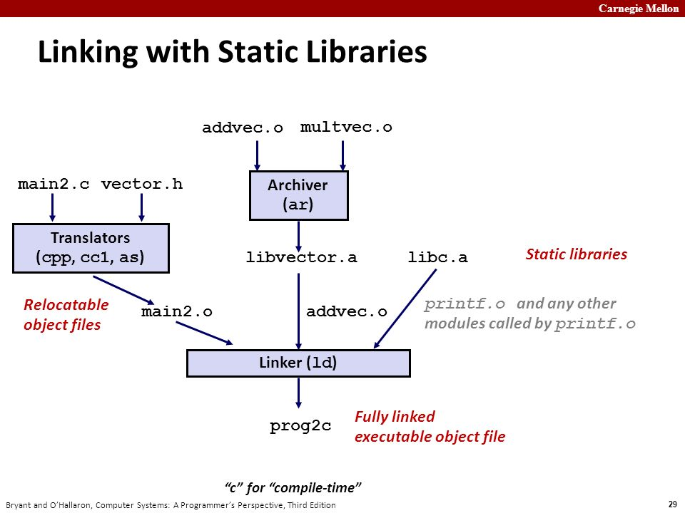
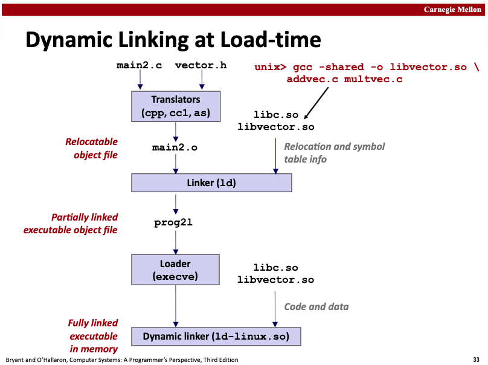

## 符号解析 & 重定位

前面详细介绍了符号和符号表的基础知识，这里我们继续介绍下符号解析（symbol resolution）和重定位（relocation）相关内容。

### 内容概览

每个可重定位目标模块m都有一个符号表，它包含m所定义和引用的符号的信息，在链接器上下文中，有3种不同的符号：

- 由m定义并能够被其他模块引用的全局符号；
- 由其他模块定义并能被当前模块m引用的全局符号；
- 只被模块定义和引用的本地符号（如c语言static修饰的全局函数或全局变量）；

> 不管是\*.o文件，还是\*.a文件，还是\*.so文件 ……，\*.o文件包含了.symtab，\*.a文件中的每个\*.o文件都包含了.symtab，\*.so文件包含了.dynsym，这些section里面记录了定义了哪些符号。

**符号解析**，指的是对于每个被引用的符号，链接器需要找到这个符号的定义，从哪里找？从所输入的可重定位目标文件列表中，逐一检查各个重定位目标文件的符号表，找到与该引用对应的符号定义。对于仅引用了\*.o和\*.a文件中的符号定义，静态链接器符号解析完立即可以重定位；对于引用了\*.so中的符号定义的情况，静态链接器的处理有所不同，此时静态链接器仅仅是在 `.rel.dyn` section中记录一些重定位条目，用来指导后续的动态链接器完成解析、重定位，也称为lazy binding。

**重定位**，指的是编译器为每个编译单元生成指令、数据sections后，1) 静态链接器需要合并相同sections并为它们安排地址(relocating sections)，也为定义的每个符号分配地址 (relocating symbol definitions)，2) 当链接器将引用解析到对应的符号定义后，要将引用处替换为符号定义的相对地址或者绝对地址 (relocating symbol references within sections)。对于仅引用\*.o和\*.a中的符号定义的情况，和引用了\*.so中的符号定义的情况，重定位有有所不同。对于前者，静态链接器直接将引用位置替换成相对地址或者绝对地址即可；对于后者，是在loader加载程序时，调用动态链接器来将对应的\*.so文件加载，并在引用定义在\*.so文件中的变量或者函数访问时，才会触发符号解析，此时会在相关的so文件的.dynsym中搜索对应的符号定义，搜索到了后就准备进行重定位，此时要根据.rel.dyn section中的重定位条目的描述（比如重定位类型)完成重定位并更新到.got或者.got.plt对应的地址中去。

符号解析、重定位是一整个工具链协作的过程。通常计算机书籍考虑到篇幅原因，会将其拆开来讲。但是考虑到符号解析和重定位是紧密相关的两个步骤，本来这部分工作原理就没那么直观，不恰当的内容分割（符号解析 与 重定位，静态库 与 动态库的不同处理方式），会让读者理解起来更费劲。所以我反其道而行之，将符号解析和重定位在一篇文章里说透。下面开始详细介绍，如果你感觉上面的总结已经让你“悟"了，您也可以选择性跳过。

### 解析符号类型

#### 本地符号解析

对那些引用当前模块中定义的本地符号的情况，符号解析是非常简单明了的。编译器只允许每个模块中每个本地符号只有一个定义。编译器还能确保，静态局部变量也会有本地链接符号，且拥有唯一的名字。本地符号解析比较简单。

#### 全局符号解析

但是，对于解析全局符号就棘手多了：

1. 当编译器遇到一个不是在当前模块中定义的符号的时候（可能是变量名或者函数名），它会假设该符号是在其它某个模块中定义的，编译器将为这样的每个符号都生成一个链接器符号表条目，并把它交给链接器进行处理。
2. 链接器连接的时候会读取这个待重定位符号表，然后从所有的输入模块中查找对应的符号定义，如果某个引用符号没有找到其定义，链接器就会输出一个错误。
3. 如果链接器找到了一个引用符号的多次重复定义（多重定义），是直接抛出错误？还是有办法知道该选择哪一个呢？这就涉及到符号的强弱规则问题。

在编译时，编译器向汇编器输出每个全局符号，或者是强（strong）或者是弱（weak），而汇编器把这个信息记录在当前这个可重定位目标文件的符号表里，准确地说是记录在对应符号的字段 `Elf_symbol.binding`字段中。

- 强符号：`(binding & global != 0) && (binding & weak == 0)`
- 弱符号：`binding & weak == 1`

根据强弱符号的定义，Unix链接器使用下面的规则来处理多重定义的符号：

- 规则1：不允许有多个强符号
- 规则2：如果有一个强符号和多个弱符号，那么选择强符号；
- 规则3：如果有多个弱符号，那么从这些弱符号中任意选择一个；

严格遵循这些规则，就可以正确完成全局符号的解析任务。

### 符号多重定义

在编译和链接过程中，**强符号（Strong Symbol）**和**弱符号（Weak Symbol）**的区分主要由编译器和链接器的规则决定，具体规则如下。

#### 强符号&弱符号

- **强符号**：
  - 由普通的全局变量或函数定义（未显式标记为弱符号，有初始化或非 `extern`声明）。
    ```c
    int global_var = 42;  // 强符号
    void func() { ... }   // 强符号
    ```
- **弱符号**：
  - 通过编译器选项显式标记为弱（如 GCC 的 `__attribute__((weak))`）。
    ```c
    __attribute__((weak)) int y;  // 弱符号
    __attribute__((weak)) void bar() {}  // 弱符号
    ```
  - 未初始化的全局变量（在 C 中，未初始化的全局变量默认是强符号，但在某些编译器中可能被视为弱符号，需具体分析）。
  - 某些特殊情况下（如 C++ 的模板实例化冲突时可能生成弱符号）。

#### 链接器的行为

- **强符号优先**：若强符号和弱符号同名，链接器选择强符号。
- **多个弱符号**：若只有弱符号同名，链接器可任选一个（通常报错，除非使用 `--allow-shlib-undefined` 等选项）。

下面是一个示例：

```c
  // 文件1.c
  __attribute__((weak)) int global = 1;  // 弱符号

  // 文件2.c
  int global = 2;                        // 强符号（覆盖弱符号）
```

  链接后 `global` 的值为 `2`。

#### 应用场景及验证

- **动态库（.so/.dll）**：弱符号允许动态库覆盖主程序的符号（如插件机制）。
- **避免重复定义**：弱符号可用于提供默认实现，允许用户通过强符号覆盖。
- **兼容性处理**：弱符号可用于解决不同库中的符号冲突（如旧版 API 的兼容层）。

使用 `nm` 查看符号类型：

```bash
nm your_object_file.o | grep ' T '  # T 表示强符号（函数）
nm your_object_file.o | grep ' W '  # W 表示弱符号
```

编译器通过语法（是否显式标记 `weak`）和上下文（如初始化状态）决定符号强弱，链接器则依据强弱规则处理符号冲突。弱符号的核心用途是提供灵活的符号覆盖机制。

### 符号解析&重定位 (静态库)

#### 静态库介绍

迄今为止，我们都是假设链接器读取一组可重定位的目标文件，并把它们链接起来，成为一个可执行文件。实际上，所有的编译系统都提供一种机制，允许将所有相关的目标模块打包成为一个单独的文件，称为**静态共享库**（static shared library），简称静态库，它也可以作为链接器的输入。


静态库，一种称为存档（archive）的特殊文件格式存储在磁盘中。存档文件是一组连接起来的可重定位目标文件的集合，其中每一个模块文件都有一个头部来描述其大小和位置。存档文件名由后缀.a标识。我们可以通过 `ar`命令来创建静态库。如果您是用go工具对目标模块创建静态库，可通过 `go tool pack`来创建。

当链接器链接输出一个可执行文件时，它只拷贝静态库里被应用程序引用的目标模块。静态库提高了常用代码的复用性，一定程度上节省了每个应用程序因为拷贝待复用模块*.o文件所带来的磁盘存储空间的浪费。

下面是一个静态链接过程的示意图：



main2.c里面调用了vector.h中的函数，这个函数的实现在静态库文件libvector.a中，addvec实现在addvec.o中，multvec实现在multvec.o中，同时main2.c中还使用了libc的io函数，实现包含在libc.a中。现在通过静态链接 `gcc -static -o prog2c main2.o ./libvector.a` 构造一个完整链接的可执行程序，程序加载和运行时无需再执行动态链接。

链接器会检测到该函数调用addvec是在addvec.o中实现的，所以从libvector.a中只提取addvec.o来进行最后的链接，而不是也将multvec.o也链接过来，这种方式也可以节省存储空间占用。

#### 符号解析过程

**链接器如何使用静态库来符号解析呢？**其实这个过程很简单。

在符号解析阶段，链接器从左到右扫描在编译命令上输入的可重定位目标文件和静态库存档文件（命令上列出的.c文件会被转换为对应的.o文件），在这次扫描中，链接器维持一个可重定位目标文件的集合E（这个集合中的文件会被合并起来形成可执行文件），一个未解析的符号（引用了但是尚未定义的符号）集合U，以及一个在前面输入文件中已经定义的符号集合D。初始时，E、U、D都是空集。

- 对于命令上的每个输入文件f，链接器会判断f是一个目标文件，还是一个存档文件，如果f是一个目标文件，那么链接器会把f添加到E，修改U、D来反映f中的符号定义和引用，并继续处理下一个文件；
- 如果f是一个静态库存档文件，那么链接器就尝试匹配U中未解析的符号，看看能否在存档文件中找到对应的定义的符号。如果某个存档文件成员m，定义了一个符号来解析U中的一个符号引用，那么就将m加到E中，并且链接器修改U和D来反映m中的符号定义和引用。对存档文件中所有的成员目标文件都反复执行这个过程，直到U和D不再发生变化。在此时，任何不包含在E中的成员目标文件都简单地被丢弃，而链接器将继续处理下一个输入文件；
- 如果当链接器完成对命令上输入文件的扫描后，U是非空的，表明存在未解析成功的符号，链接器就会输出一个错误并终止。否则，它会合并并重定位E中的目标文件，从而构出完整的可执行程序文件。

这种处理方式需注意命令行上的库、目标文件的顺序，否则可能会导致符号解析失败。

另外，我们这里提到的是将静态库中的目标文件拿出来进行链接，其实链接器还可以做的更好，如只将引用的函数或者变量来做链接，而将其他未引用的部分移除。这样做的好处是减少目标文件的大小，减少将来加载时对宝贵内存资源的浪费。感兴趣可以阅读我的这篇文章：[dead code elimination: a linker&#39;s perspective](https://medium.com/@hitzhangjie/dead-code-elimination-a-linkers-perspective-d098f4b8c6dc)。

#### 重定位过程

一旦链接器完成了符号解析这一步，它就把代码中的每个引用对应的符号定义在哪个输入模块中的哪个位置。此时，链接器需要做两步：

- **重定位sections和符号定义**：在这一步中，**链接器将所有相同类型的节（section）合并为同一类型的新的聚合节**。例如，来自输入目标文件的.data节将全部被合并一个节，这个节成为输出的可执行文件的.data节。然后链接器将运行时存储器地址赋值给新的合并后的节，**输入模块定义的的每个节、每个符号定义，也都将得到新分配的运行时地址**。当这一步完成时，程序中的每个指令和全局变量都有唯一的运行时内存地址了。
- **重定位符号引用*：在这一步中，**链接器修改.text section和.data section中每个符号的引用，使得它们指向正确的运行时地址**。为了执行这一步，链接器依赖于一种称为“**重定位条目（relocation entry）**”的可重定位目标模块中的数据结构，我们接下来将会描述这种数据结构。

当汇编器生成一个目标模块时，它并不知道数据和代码最终将存放在内存中中的什么位置。它也不知道这个模块引用的任何外部定义的函数或者全局变量的位置。所以，无论何时汇编器遇到对**最终位置未知的目标引用**，它就会生成一个**重定位条目，告诉链接器在将目标文件合并成可执行文件时应如何修改这个引用**。

**.text的指令相关的重定位条目放在.rel.text中，.data已初始化数据的重定位条目放在.rel.data中。**

下面的类型定义Elf32_Rel是ELF重定位条目的格式：

```c
type struct {
    int offset;		// offset of the reference to relocate
    int symbol:24;	// symbol the reference should point to
    int type:8;		// relocation type
} Elf32_Rel;
```

- offset表示待重定位的引用的位置（相对于section .text or .data的偏移量）
- symbol表示待重定位的引用实际指向的符号
- type表示待重定位的引用应该使用的重定位类型，告知链接器如何修改新的引用

简言之就是链接器此时遇到一个符号引用，但是这个符号不是定义在当前编译单元内的，就会记录一个重定位条目，等后续链接器重定位时再来修正引用的正确地址。
好比再说：嘿linker，等你链接完成之后，请在offset偏移量这个位置处给我填上正确的符号地址偏移量，符号地址的计算规则参考重定位类型。

ELF定义了11种不同类型的重定位类型，有些类型相当神秘，我们只关心其中两种最基本的重定位类型即可：

- **R_386_PC32：重定位一个使用32位PC相对地址的引用，一个PC相对地址就是相对当前程序计数器（PC）的偏移量**。当CPU执行一条使用PC进行相对寻址的指令时，执行时就会在当前PC值基础上加上这个偏移量，来得到有效地址（如call指令的目标），PC值存储了下一条待执行指令的地址；
- **R_386_32：重定位一个使用32位绝对地址的引用**。通过绝对寻址，CPU直接使用在指令中编码的32位值作为有效地址，不需要进一步修改；

OK，讲到这里，如果不涉及到动态链接库，这部分内容对于理解符号解析和重定位已经比较全面了。然而静态共享库的使用尽管有优势，但是也还是有些弊端的，下面我们介绍下动态共享库的优势，以及在使用动态共享库时，符号解析和重定位具体是如何实现的。

### 符号解析&重定位 (动态库)

#### 动态库介绍

前面提了静态库的一些优点，其实它也有明显的缺点，就是各个应用程序复用静态库的时候，会把自己需要的目标文件从静态库中提取出来然后和其他目标文件链接成可执行程序，相当于每个应用程序都或多或少拷贝了一部分代码，代码体积大对磁盘空间、内存空间都会造成浪费。尽管我们曾经提及dead code elimination相关的链接器特性，但是确实还是拷贝了相同的代码。

比如对于系统提供的io相关的库，其实没必要每个应用程序都去拷贝到自身，只要能引用这部分代码的同一份实现即可。动态库就是用来解决静态库的这些不足的。

> ps: 严格来说应该用术语动态共享库（dynamic shared library），在某些系统上也称为动态链接库.dll，在Linux下是以*.so为扩展名，经常称为共享库或者动态库。

共享库通过两种方式达成共享的目标：

- 首先，在文件系统中，对于一个库，只有一个.so文件，所有引用该库的可执行程序都共享这个.so文件中的代码和数据，而不是像静态库的内容那样还要被拷贝和嵌入到引用它们的可执行程序文件中；
- 其次，在内存中，一个共享库的.text section的同一个副本可以被不同的正在运行的进程共享，联想下通过mmap时可以将指定文件映射到指定内存区，同时还可以限制该内存区的访问权限为“共享访问”还是“排他性访问”；

创建静态库使用命令 `ar`，创建动态共享库可使用命令 `gcc -shared -fPIC`来完成。

#### lazy binding

下面是一个动态链接过程的示意图：



main2.c中使用了vector.h中的函数，对应实现在libvector.so这个共享库中，现在是通过动态链接技术进行链接的，然后生成一个可执行程序。

这里的思路是，当创建可执行程序时，静态链接器linker执行部分处理，然后在程序加载时再由加载器loader去调用动态链接器完成最终链接，成为一个完整的可运行程序。

- 静态链接器处理逻辑，指的是这个阶段如果有需要多个目标文件可以执行静态链接的，则执行静态链接。这个时候并没有拷贝任何共享库的代码或数据到可执行文件中，而只是拷贝了一些重定位和符号表信息，用来指导后续动态链接器继续完成对libvector.so中定义的符号的引用和重定位操作。
- 当加载器（kernel的一部分）加载和运行可执行文件时，加载部分链接的可执行文件之后，接着注意到它包含一个.interp section，这个section包含了动态链接器的路径名，动态链接器本身就是一个共享库（如在Linux上为ld-linux.so）。**和加载静态链接的程序所不同的是，加载器此时不再将控制权直接传递给应用程序了，而是先加载并运行这个动态链接器ld-linux.so，先来完成动态链接 **。

**动态链接器会执行下面的重定位操作来完成链接任务：**

- 加载并重定位libc.so的文本和数据到某个内存段；
- 加载并重定位libvector.so的文本和数据到另一个内存段；
- 重定位可执行程序中的引用，将其替换为libc.so和libvector.so定义的符号的地址；
  这步操作并不是一次性全部执行完成的，而是随着程序执行，访问到了定义在动态库中的引用（数据或者函数)时，实际上对这些内容的访问指令被链接器改写成了对 `.got .got.plt`的访问，首次访问时对应的表项中的地址都不是有效地址，而是会触发动态链接器的介入来完成符号解析（.dynsym），然后再参考.rel.dyn section中的重定位条目进行重定位，将正确地址写入 `.got .got.plt`，下次访问时就不用重复解析了。

完成上述操作后，动态链接器将控制传递给应用程序，从这个时候开始，共享库的位置就固定了，并且在进程执行过程中都不会改变。

#### 位置无关代码

动态链接中，与位置无关的代码（PIC，Position Independent Code）就显得非常重要。

**那为什么位置无关代码这么重要呢？**

共享库的一个主要目的就是允许多个正在运行的进程共享内存中相同的库代码，因而节约宝贵的内存资源。那么多个进程是如何共享程序的一个拷贝的呢？

**一种方法是给每个共享库分配一个事先准备好的专用的地址空间片（chunk），然后要求加载器总是在这个地址处加载共享库。**虽然这种方法很简单，但是它也造成了一些严重的问题。

- 首先，它对地址空间的使用效率不高，因为即使一个进程不使用这个库，那部分空间还是会被分配出来；
- 其次，它也难以管理，我们将不得不保证没有chunk重叠，每当一个库修改了之后，我们必须确认它的已分配的chunk还适合它的大小，如果不适合了就要重新分配一个新的chunk。并且如果我们创建了一个新的库，还需要为他分配一个新的chunk。

随着时间发展，假设一个系统中有了成百个库、各种库版本，就很难避免地址空间分列成大量小的、未使用而又不能再使用的空洞。甚至更糟糕的是，对每个系统而言，库在内存中的分配都是不同的，这就引起了更令人头痛的管理问题。

**一种更好的方法是编译库代码，使得不需要链接器修改库代码就可以在任何地址加载和执行这些代码。这样的代码就叫做与位置无关的代码（PIC，Position Independent Code）。**用户可以使用 `gcc -fPIC`生成位置无关代码。

在一个IA32系统中，对**同一个目标模块中过程的调用是不需要特殊处理的，因为引用地址是相对PC值的偏移量，已经是PIC了**。然而**对外部定义的过程调用和对全局变量的引用通常不是PIC，它们都要求在链接时符号解析并重定位**。

#### PIC数据引用

编译器通过运用以下事实来生成对全局变量的PIC引用：无论我们在内存中的何处加载一个目标模块（包括共享目标模块），**数据段总是分配成紧随在代码段后面。因此代码段中任何指令和数据段中任何变量之间的距离都是一个运行时常量，与代码段和数据段的物理地址是无关的**。

为了运用这个事实，编译器在数据段开始的地方的创建了一个表，叫做**全局偏移表（GOT，Global Offset Table）**。在GOT中，每个被这个目标文件（模块）引用的全局数据对象都有一个条目。编译器还为GOT中每个条目生成一个重定位记录。在加载时，动态链接器会重定位GOT中的每个条目，使得它包含正确的绝对地址。每个引用全局数据的目标文件（模块）都有自己的GOT。

> 下一小节会介绍，链接器如何基于重定位记录完成重定位操作。

在运行时，使用下面形式的代码，通过GOT间接地引用每个全局变量：

```asm
		call L1
L1:		popl %ebx               ; ebx contains the current PC
		addl $VAROFF, %ebx	; ebx points to the GOT entry for var
		movl (%ebx), %eax	; reference indirect through the GOT
		movl (%eax), %eax
```

这里的代码比较有趣，首先call L1将把返回地址（L1地址）入栈，接下来popl %ebx刚好把入栈的返回地址给pop出来到%ebx中，其中$VAROFF是一个常数偏移量，给%ebx增加这个常数偏移量使其指向GOT表中适当的条目，该条目包含数据项的绝对地址。然后通过两条movl指令（间接地通过GOT）加载全局变量的内容到寄存器%eax中。

- GOT表项中怎么会包含数据项的绝对地址的呢？动态链接器对GOT表项逐个重定位的时候，会根据指令与数据之前的固定偏移量关系，加上代码段起始物理地址，来算出每个GOT表项的绝对地址；
- $VAROFF是怎么得到的呢？前面提过了，指令、数据之间的距离是个固定偏移量，这个在静态链接重定位时就已经算出来了，现在只是在指令物理地址上加这个固定偏移量来得到数据的绝对地址而已；

可以很明显地发现，**访问一个全局变量现在是用了5条指令，而非一条指令，PIC代码有性能缺陷**。此外，还需要一个额外的对GOT的内存引用，而且PIC还需要用一个额外的寄存器来保持GOT条目的地址，在具有大寄存器文件的机器上，这不是一个大问题，然而在寄存器供应不足的IA32系统中，就可能有问题。

#### PIC函数调用

PIC代码当然也可以用相同的方法来解析外部过程调用：

```asm
		call L1
L1: 	        popl %ebx		; ebx contains the current pc
		addl $PROCOFF, %ebx	; ebx points to GOT entry for proc
		call *(%ebx)		; call indirect through the GOT
```

不过，**这种方法对每一个运行时过程调用都要求用3条额外指令来完成，性能肯定好不了**。

> ps：为什么go程序采用静态链接而非动态链接？
>
> - 静态链接不存在动态链接库被篡改的问题，相对来说更健壮点；
> - 也不存在程序启动时还需要动态链接的问题，相对来说启动速度可能也要快点；
> - 函数调用不存在这里引入的额外多条指令问题，函数调用开销小一点；
>
> 针对第3点，其实动动脑子也可以优化一下，比如只在第一次借助GOT的时候是多条指令，此时算出来的地址就可以为后续调用复用了。
>
> 这就是接下来即将提到的“延迟绑定”技术。

与前面方法相比，**延迟绑定（lazy binding）** 更聪明地解决了这里的调用开销问题。**将过程地址的绑定推迟到第一次调用该过程时，第一次调用过程的运行时开销较大，但是其后的每次调用都只会花费一条指令和一个间接的内存引用的开销。**

延迟绑定是通过两个数据结构之间简洁但又有些复杂的交互来实现的，这两个数据结构是**GOT**和**过程链接表（PLT，Procedure Linkage Table）**。如果一个目标文件中有调用定义在共享库中的函数，那么它就会有自己的GOT和PLT，GOT是.data section的一部分，PLT是.text section中的一部分。

> 注意：也有的编译工具链在组织的时候，会将其组织在独立的sections中，如ELF section **.got .got.plt**。

下图是示例程序main2.o的GOT的格式，头三条GOT条目比较特殊：GOT[0]包含.dynamic段的地址，这个段包含了动态链接器用来绑定过程地址的信息，比如符号表的位置和重定位信息。GOT[1]包含定义这个模块的一些信息。GOT[2]包含动态链接器的延迟绑定代码的入口点。


定义在共享库中并被main2.o调用的每个过程在GOT中都会有一个GOT条目，从GOT[3]开始的都是。对于示例程序，我们给出了printf和addvec的GOT条目，printf定义在libc.so中，而addvec定义在libvector.so中。

下图展示了实例程序的PLT。PLT是一个数组，其中每个PLT条目是16字节，第一个条目PLT[0]是一个特殊条目，它跳转到动态链接器中。每个被调用的过程在PLT中都有一个PLT条目，从PLT[1]开始都是。在图中，PLT[1]对应于printf，PLT[2]对应于addvec。

开始时，在程序被动态链接并开始执行后，过程printf和addvec被分别绑定到它们对应的PLT条目的第一条指令上。现在指令中假如存在addvec的调用，有如下形式：

```asm
80485bb:	e8 a4 fe ff ff		call 8048464 <addvec>
```

当addvec第一次调用时，控制传递到PLT[2]的第1条指令处（地址为8048464），该指令通过GOT[4]执行一个间接跳转。开始时，每个GOT条目包含相应的PLT条目中的pushl这条指令的地址，所以开始时GOT[4]条目中的内容为0x804846a，现在执行 `jmp *GOT[4]`之后，相当于饶了一圈回到了PLT[2]的第2条指令处，这条指令将addvec符号的ID入栈，第3条指令则跳转到PLT[0]。

好戏开始了，PLT[0]中的代码将GOT[1]中的标识信息的值入栈，然后通过GOT[2]间接跳转到动态链接器（ld-linux.so）中，动态链接器用两个栈顶参数来确定addvec的位置，然后用这个算出的新地址覆盖掉GOT[4]，并跳过去执行把控制传递给了addvec。


下一次在程序中调用addvec时，控制像前面一样传递给PLT[2]，不过这次通过GOT[4]的间接跳转可以直接将控制传递给addvec了，从此刻起，唯一额外的开销就算是对间接跳转存储器的引用了，再也不会兜一大圈，函数调用效率上有了明显提升。

简单总结，就是说对于动态链接的程序，程序中如果涉及到调用的函数是在共享库中定义的，第一次执行该函数时会通过PLT、GOT的交互来触发ld-linux动态链接操作，完成后会把正确的地址覆盖到GOT[idx]中去，后续通过PLT去 `jmp *GOT[idx]`再次调用该函数时就会直接跳转到函数地址，不用再兜圈子计算了，效率当然会比每次都重定位有质的提升！

### 符号解析&重定位 (运行时)

前面介绍了静态链接时的符号解析、重定位处理过程，也介绍了程序加载时的动态链接的符号解析、重定位处理过程。

**动态链接除了链接时、加载时的链接，还有运行时链接的情况：**

- 通过 `dlopen`来加载一个共享库；
- 通过 `dlsym`来解析一个符号；
- 通过 `dlclose`卸载一个共享库；

这部分简单了解下即可，相信大家即使不深入了解，也能猜到大致的实现方式是怎样的，我们就不过多展开了。

### 本节小结

本文开头首先总结了下符号解析&重定位的大致任务，然后我们展开进行了全面系统性的介绍。从符号解析的类型本地符号解析、全局符号解析，到引出如何解决符号多重定义问题、应用场景，我们介绍了符号的强弱规则以及编译器、链接器的处置办法。在有了这些基础之后，我们对静态链接、动态链接过程中的符号解析和重定位进行了非常细致、深入又恰到好处的讲解。我相信读者朋友们看完这篇文章，应该对链接器（静态链接器+动态链接器)的工作原理有了更深入的认识。

而我们的这种看似漫无目的的学习，尽管看上去这部分内容与调试器无关，但是在编译工具链的理解上又加深了一笔，而且我们排除了各种各样的”符号"的理解不到位的地方，这就是它的价值，我们在后续学习调试器相关的内容时，我们再提到调试符号时，我们也不会再陷入"你说的符号是个什么东西"这样的基础问题中去。

### 参考内容

1. Go: Package objabi, https://golang.org/pkg/cmd/internal/objabi/
2. Go: Object File & Relocations, Vincent Blanchon, https://medium.com/a-journey-with-go/go-object-file-relocations-804438ec379b
3. Golang Internals, Part 3: The Linker, Object Files, and Relocations, https://www.altoros.com/blog/golang-internals-part-3-the-linker-object-files-and-relocations/
4. Computer System: A Programmer's Perspective, Randal E.Bryant, David R. O'Hallaron, p450-p479
5. 深入理解计算机系统, 龚奕利 雷迎春 译, p450-p479
6. Linker and Libraries Guide, Object File Format, File Format, Symbol Table, https://docs.oracle.com/cd/E19683-01/816-1386/chapter6-79797/index.html
7. Linking, https://slideplayer.com/slide/9505663/
8. Dead Code Elimination: A Linker's Perspective, https://medium.com/@hitzhangjie/dead-code-elimination-a-linkers-perspective-d098f4b8c6dc
9. Learning Linux Binary Analysis, Ryan O'Neill, p14-15, p18-19
10. Linux二进制分析, 棣琦 译, p14-15, p18-19
