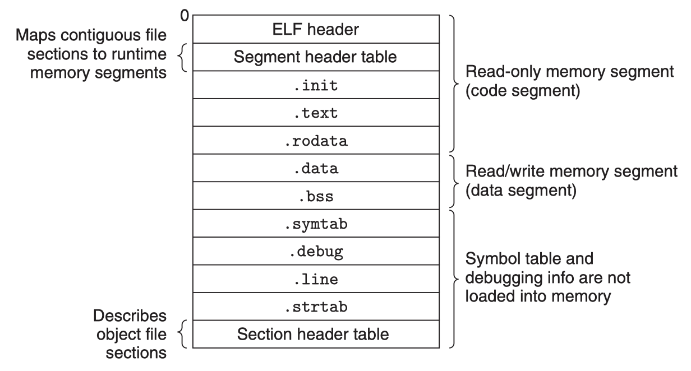

## 程序加载

从我们最初编写的源程序，经过编译工具链处理后，源文件（ASCII or UTF-8编码文件）现在已经被转换为一个可执行的二进制文件，这个二进制文件包含了加载程序到内存运行所需的必要信息。前面我们提及过有些引用了动态共享库的情景，需要在程序加载器加载程序时，调用动态链接器继续完成符号解析和重定位的处理逻辑。然后，加载器才会将控制权限转入我们的二进制程序入口执行。

下面我们来展开详细看看。

### 可执行程序

我们已经了解了，静态链接阶段是如何将多个目标模块合并成一个可执行目标文件的，下图是个典型的ELF可执行文件结构：



ELF Header中还包括了可执行程序的入口点（entry point），也就是当程序运行时要执行的第一条指令的地址。.text、.rodata、.data section和可重定位目标文件中的对应section是相似的，不过是，这些section已经被重定位到它们最终的运行时内存虚拟地址了。.init section定义了一个小函数，叫做_init，程序的初始化代码会调用它。如果可执行程序是完全链接的，这种情况下就不再需要.rel.data、.rel.text section，但如果涉及到动态共享库符号引用，这里面应该还会包含.rel.dyn section来用于完成后续的动态链接器的符号解析和重定位。

ELF可执行文件被设计得很容易加载到内存中，可执行文件的连续的片（chunk）被映射到连续的内存段。段头表（program header table）描述了这种映射关系。下图展示了某个可执行文件的段头表，是由objdump输出的。


> 解释下上述输出的部分字段：
>
> - offset：文件偏移量；
> - vaddr/paddr：虚拟/物理地址；
> - align：段对齐；
> - filesz：目标文件中的段大小；
> - memsz：内存中的段大小；
> - flags：权限；

从段头表中，我们看到可执行文件段头表初始化了两个内存段。

**第1行和第2行告诉我们第1个段（代码段）：**

- align，对齐到一个4KB的边界；
- flags，有读权限和执行权限；
- vaddr+memsz，起始地址位于内存0x08048000处，共占用内存0x448字节；
- off+filesz，并且被初始化为可执行程序的前0x448字节；

这个segment很明显是存了代码，通常会包含.text section中的数据。

**第3行和第4行告诉我们第2个段（数据段）：**

- align，对齐到一个4KB的边界；
- flags，有读权限和写权限，没有执行权限；
- vaddr+memsz，开始于内存地址0x08049448处，总的内存大小为0x104字节；
- off+filesz，并用从文件偏移0x448处开始的0xe8个字节对内存段进行初始化；

这个segment在这个示例中，偏移0x448处正是.data开始的位置。另外，该段中剩下的字节对应于运行时将被初始化为零的.bss数据。

### 加载器原理

要运行一个可执行目标文件p，可以在Linux shell里面键入它的名字，如：

```bash
$ /path-to/p
```

因为p不是一个内置的shell命令，所以shell会认为p是一个可执行目标文件，通过调用某个驻留在内存中的称为**加载器（loader）**的操作系统代码来运行它。任何Linux程序都可以通过调用**execve族函数**来调用加载器，加载器会将可执行目标文件中的代码和数据从磁盘拷贝到内存中，然后通过跳转到程序的第一条指令或者入口点（entry point）位置来执行该程序。这个将程序拷贝到内存并运行的过程叫做“**加载（loading）**”。

每个Linux程序（进程）都有一个运行时存储器映像，类似于下图所示的那样：

- 在32位Linux系统中，代码段总是从0x08048000处开始；
- 数据段是在接下来的下一个4KB对齐的地址处；
- 运行时堆在读写段（.data、.bss）之后接下来的第一个4KB对齐的地址处，并通过malloc库（实际上是brk系统调用）从低地址向高地址增长；
- 用户栈总是从最大的合法用户地址开始，从高地址向低地址方向增长；
- 在用户栈更上部的段是为操作系统内核代码和数据准备的，用户程序无权访问；
- 介于用户栈、运行时堆之间，是为共享库保留的；


当加载器运行时，它将创建如上图所示的存储器映像。在可执行文件ELF文件头的指导下，加载器将可执行文件的相关内容拷贝到代码段和数据段。接下来，加载器跳转到程序的入口点处。

以C程序为例，这里的启动代码通常就是符号_start的地址。在\_start地址处的启动代码（startup code）是在目标文件ctrl.o中定义的，对所有的C程序都一样。下图展示了启动代码中的关键函数调用序列。

在从.text和.init section中调用了初始化例程之后，启动代码调用atexit例程，这个程序附加了一系列在应用程序正常终止时应该调用的程序（exit函数在运行atexit注册的函数，然后通过系统调用\_exit将控制返回给操作系统）。接着，启动代码将调用应用程序的main函数，它会开始执行我们的C代码。在应用程序返回之后，启动代码调用\_exit程序，它将控制权返回给操作系统。


上述过程可以用下图简单概括：


**这个过程中加载器是如何工作的呢？**

首先，考虑到加载时是否需要动态链接，加载器的工作方式是不同的，我们先笼统的介绍一下。

Unix系统中的每个程序都运行在一个进程上下文中，都有自己的进程地址空间。当shell运行一个程序时，父shell进程会生成一个子shell进程，它是父进程的一个复制品。子进程通过调用**execve系统调用来启动加载器**。

加载器会剔除子进程中现有的存储器段，并创建一组新的代码段、数据段、堆和栈段。新的堆段和栈段被初始化为零。通过将虚拟地址空间中的页映射到新的可执行文件的页，新的代码和数据段被初始化为了新的可执行文件的内容。最后，加载器跳转到_start地址，它最终会调用应用程序的main函数。除了一些头部信息，在加载过程中没有任何从磁盘到存储器的数据拷贝动作，直到CPU引用一个被映射的虚拟内存页面时会引起缺页异常（page fault）才会触发实际的拷贝动作，此时操作系统利用页面调度机制自动将页面从磁盘传送到存储器，OK之后，进程继续执行。

上述过程只是笼统的介绍，实际的加载过程要考虑的问题更多。

### 链接与加载

链接，指的是，链接器将多个可重定位文件（目标文件、库文件）进行符号解析、重定位、将多个文件结合成一个可执行程序的过程。

加载，指的是，加载器将可执行程序、共享库等从磁盘加载到内存，组织好内存布局为程序执行做好准备的过程。

可以肯定的是，**链接器（尤其是动态链接器）和加载器之间不是完全孤立的，它们之间也是一种协作关系。**

在Linux系统中，链接的方式**静态链接**和**动态链接**，加载的方式也分为**静态加载和动态加载**。而且它们可以有2x2=4种不同组合，各有特点和应用场景。

1. **静态链接与静态加载**:
   **静态链接**是指在编译时将所有需要的库文件（通常是静态库，后缀为 `.a`）直接嵌入到可执行文件中。链接器 `/usr/bin/ld` 负责将这些库文件链接到最终的可执行文件中。
   **静态加载**则是指在程序运行时，所有的代码都已经包含在可执行文件中，因此不需要额外的库文件，加载器是内核中的ld-linux.so。
2. ~~**静态链接与动态加载**:
   ~~在Linux上，可以使用 `dlopen` 等函数动态加载共享库（`.so`），但静态库并不支持这种方式，因此在实际应用中未见到静态库的动态加载。
3. **动态链接与静态加载**:
   **动态链接**是指在加载时将对动态库（后缀为 `.so`）的引用进行符号解析、重定位，而不是将库的代码直接包含在可执行文件中。动态链接器是有加载器ld-linux.so来完成的。
   **静态加载**前面已经提过，程序是完整的可执行程序，不再需要额外的库文件，加载器就是内核中的ld-linux.so，而且它也是实际上的动态链接器。
   这里的加载过程、动态链接过程，实际上可以细分为初始loading阶段、动态链接阶段、后loading阶段，
   - 初始loading阶段就是将对应的segments mmap映射到进程虚地址空间，
   - 然后动态链接期间会将符号解析&重定位确定下来的地址更新.got地址处对应的数据，
   - 后加载阶段可以通过dlopen等函数进行运行时加载、解析、重定位，这部分就是后面的动态链接与动态加载的方式。
4. **动态链接与动态加载**:
   在**动态链接**和**动态加载**的情况下，程序在运行时可以通过 `libdl` 库使用 `dlopen` 函数动态加载库。
   链接、加载的工作分散在 `libdl` 和用户程序中，例如，使用 `dlopen` 动态加载库，使用 `dlsym` 解析动态链接的符号。

>ps: 动态链接与动态加载的这种方式提供了更大的灵活性，使得程序可以根据需要加载和使用库。

### 总结

本文介绍了程序被加载运行时的执行细节，考虑到链接（静态链接、动态链接）和加载（静态加载、动态加载）的多种方式，本文分别介绍了这几种链接、加载组合方式及适用场景。我们也特别描述了下，使用了动态共享库的情景下，loader加载程序、完成动态链接，以及可能后续的动态加载库、动态解析符号的这几个不同的阶段。

现在我们从源代码到编译、到链接、到加载执行的过程细节都介绍到了。接下来我们会在第6小节快速浏览下相关的go标准库go/src/debug的使用，这其中包含了ELF相关、符号表相关、DWARF相关的支持代码。然后第7小节我们会简单总结下go标准库go/src/debug/dwarf相关的实现，了解这些还是不够的，第8章我们会深入介绍下DWARF是如何对高级语言源程序构造进行描述的，比如如何描述一个函数、一个类型等。

OK，我们离目标又进了一步，让我们继续吧。

### 参考内容

1. Computer System: A Programmer's Perspective, Randal E.Bryant, David R. O'Hallaron, p450-p479
2. 深入理解计算机系统, 龚奕利 雷迎春 译, p450-p479
3. What are the executable ELF files respectively for static linker, dynamic linker, loader and dynamic loader, Roel Van de Paar, https://www.youtube.com/watch?v=yzI-78zy4HQ
4. Advanced Programming in Unix Environment
