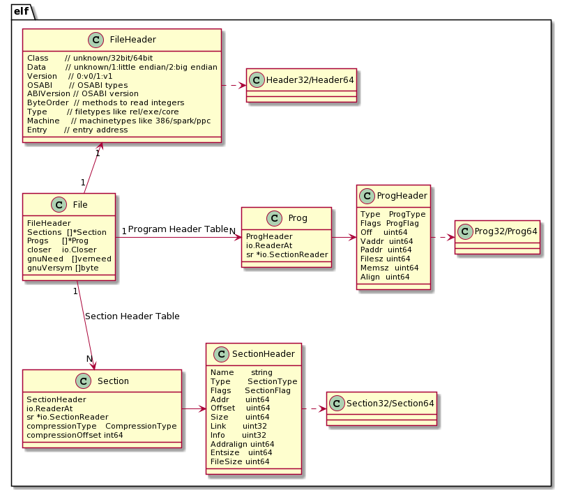

## pkg debug/elf 应用

### 数据类型及关系

标准库提供了package`debug/elf`来读取、解析elf文件数据，相关的数据类型及其之间的依赖关系，如下图所示：




简单讲，elf.File中包含了我们可以从elf文件中获取的所有信息，为了方便使用，标准库又提供了其他package `debug/gosym`来解析.gosymtab符号信息、.gopclntab行号表信息，还提供了`debug/dwarf`来解析.[z]debug_\*调试信息。


### 常用操作及示例

#### 打开一个ELF文件

通过命令选项传递一个待打开的elf文件名，然后打开该elf文件，并打印elf.File的结构信息。这里我们使用了一个三方库go-spew/spew，它基于反射实现能够打印出elf.File结构中各个字段的信息，如果字段也是组合类型也会对齐进行递归地展开。

```go
package main

import (
	"debug/elf"
	"fmt"
	"os"

	"github.com/davecgh/go-spew/spew"
)

func main() {
	if len(os.Args) != 2 {
		fmt.Fprintln(os.Stderr, "usage: go run main.go <prog>")
		os.Exit(1)
	}
	prog := os.Args[1]

	file, err := elf.Open(prog)
	if err != nil {
		panic(err)
	}
	spew.Dump(file)
}
```

运行测试`go run main.go ../testdata/loop`，这个结构非常复杂，为了方便读者查看，我删减了部分内容。

不难看出，ELF文件中包含了如下关键信息：

- FileHeader，即ELF Header；
- Sections，Sections中每个Section都包含了一个elf.SectionHeader定义，它取自ELF文件中的节头表；
- Progs，Progs中每个Prog都包含了一个elf.ProgHeader定义，它取自ELF文件中的段头表；

elf.NewFile()读取ELF文件内容时根据ELF文件头中的Class类型（未知/32bit/64bit），在后续读取ELF文件内容时会有选择地使用Header32/64、Prog32/64、Section32/64中的类型，不管是32bit还是64bit，最终都赋值到了elf.File中的各个字段中并返回elf.File。

通过打印信息，细心的读者会发现：

- 对于sections，我们可以看到section具体的名称，如.text、.rodata、.data；
- 对于segments，也可以看到segment具体的类型，如note、load，还有其虚拟地址；

```bash
(*elf.File)(0xc0000ec3c0)({
 FileHeader: (elf.FileHeader) {
  Class: (elf.Class) ELFCLASS64,
  Data: (elf.Data) ELFDATA2LSB,
  Version: (elf.Version) EV_CURRENT,
  OSABI: (elf.OSABI) ELFOSABI_NONE,
  ABIVersion: (uint8) 0,
  ByteOrder: (binary.littleEndian) LittleEndian,
  Type: (elf.Type) ET_EXEC,
  Machine: (elf.Machine) EM_X86_64,
  Entry: (uint64) 4605856
 },
 Sections: ([]*elf.Section) (len=25 cap=25) {
  (*elf.Section)(0xc0000fe000)({ SectionHeader: (elf.SectionHeader) { Name: (string) "" ...  }}),
  (*elf.Section)(0xc0000fe080)({ SectionHeader: (elf.SectionHeader) { Name: (string) (len=5) ".text", ...  }}),
  (*elf.Section)(0xc0000fe100)({ SectionHeader: (elf.SectionHeader) { Name: (string) (len=7) ".rodata", ...  }}),
  (*elf.Section)(0xc0000fe180)({ SectionHeader: (elf.SectionHeader) { Name: (string) (len=9) ".typelink", ...  }}),
  (*elf.Section)(0xc0000fe200)({ SectionHeader: (elf.SectionHeader) { Name: (string) (len=9) ".itablink", ...  }}),
  (*elf.Section)(0xc0000fe280)({ SectionHeader: (elf.SectionHeader) { Name: (string) (len=9) ".gosymtab", ...  }}),
  (*elf.Section)(0xc0000fe300)({ SectionHeader: (elf.SectionHeader) { Name: (string) (len=10) ".gopclntab", ...  }}),
  (*elf.Section)(0xc0000fe380)({ SectionHeader: (elf.SectionHeader) { Name: (string) (len=13) ".go.buildinfo", }}),
  (*elf.Section)(0xc0000fe400)({ SectionHeader: (elf.SectionHeader) { Name: (string) (len=10) ".noptrdata", ...  }}),
  (*elf.Section)(0xc0000fe480)({ SectionHeader: (elf.SectionHeader) { Name: (string) (len=5) ".data", ...  }}),
  (*elf.Section)(0xc0000fe500)({ SectionHeader: (elf.SectionHeader) { Name: (string) (len=4) ".bss", ...  }}),
  (*elf.Section)(0xc0000fe580)({ SectionHeader: (elf.SectionHeader) { Name: (string) (len=9) ".noptrbss", ...  }}),
  (*elf.Section)(0xc0000fe600)({ SectionHeader: (elf.SectionHeader) { Name: (string) (len=14) ".zdebug_abbrev", ...  }}),
  (*elf.Section)(0xc0000fe680)({ SectionHeader: (elf.SectionHeader) { Name: (string) (len=12) ".zdebug_line", ...  }}),
  (*elf.Section)(0xc0000fe700)({ SectionHeader: (elf.SectionHeader) { Name: (string) (len=13) ".zdebug_frame", ...  }}),
  (*elf.Section)(0xc0000fe780)({ SectionHeader: (elf.SectionHeader) { Name: (string) (len=16) ".zdebug_pubnames", ...  }}),
  (*elf.Section)(0xc0000fe800)({ SectionHeader: (elf.SectionHeader) { Name: (string) (len=16) ".zdebug_pubtypes", ...  }}),
  (*elf.Section)(0xc0000fe880)({ SectionHeader: (elf.SectionHeader) { Name: (string) (len=18) ".debug_gdb_scripts", ...  }}),
  (*elf.Section)(0xc0000fe900)({ SectionHeader: (elf.SectionHeader) { Name: (string) (len=12) ".zdebug_info", ...  }}),
  (*elf.Section)(0xc0000fe980)({ SectionHeader: (elf.SectionHeader) { Name: (string) (len=11) ".zdebug_loc", ...  }}),
  (*elf.Section)(0xc0000fea00)({ SectionHeader: (elf.SectionHeader) { Name: (string) (len=14) ".zdebug_ranges", ...  }}),
  (*elf.Section)(0xc0000fea80)({ SectionHeader: (elf.SectionHeader) { Name: (string) (len=16) ".note.go.buildid", ...  }}),
  (*elf.Section)(0xc0000feb00)({ SectionHeader: (elf.SectionHeader) { Name: (string) (len=7) ".symtab", ...  }}),
  (*elf.Section)(0xc0000feb80)({ SectionHeader: (elf.SectionHeader) { Name: (string) (len=7) ".strtab", ...  }}),
  (*elf.Section)(0xc0000fec00)({ SectionHeader: (elf.SectionHeader) { Name: (string) (len=9) ".shstrtab", ...  }})
 },
 Progs: ([]*elf.Prog) (len=7 cap=7) {
  (*elf.Prog)(0xc0000ba2a0)({ ProgHeader: (elf.ProgHeader) { Type: (elf.ProgType) PT_PHDR, Flags: (elf.ProgFlag) PF_R, Vaddr: (uint64) 4194368 }}),
  (*elf.Prog)(0xc0000ba300)({ ProgHeader: (elf.ProgHeader) { Type: (elf.ProgType) PT_NOTE, Flags: (elf.ProgFlag) PF_R, Vaddr: (uint64) 4198300 }}),
  (*elf.Prog)(0xc0000ba360)({ ProgHeader: (elf.ProgHeader) { Type: (elf.ProgType) PT_LOAD, Flags: (elf.ProgFlag) PF_X+PF_R, Vaddr: (uint64) 4194304 }}),
  (*elf.Prog)(0xc0000ba3c0)({ ProgHeader: (elf.ProgHeader) { Type: (elf.ProgType) PT_LOAD, Flags: (elf.ProgFlag) PF_R, Vaddr: (uint64) 4825088 }}),
  (*elf.Prog)(0xc0000ba420)({ ProgHeader: (elf.ProgHeader) { Type: (elf.ProgType) PT_LOAD, Flags: (elf.ProgFlag) PF_W+PF_R, Vaddr: (uint64) 5500928 }}),
  (*elf.Prog)(0xc0000ba480)({ ProgHeader: (elf.ProgHeader) { Type: (elf.ProgType) PT_LOOS+74769745, Flags: (elf.ProgFlag) PF_W+PF_R, Vaddr: (uint64) 0 }}),
  (*elf.Prog)(0xc0000ba4e0)({ ProgHeader: (elf.ProgHeader) { Type: (elf.ProgType) PT_LOOS+84153728, Flags: (elf.ProgFlag) 0x2a00, Vaddr: (uint64) 0 }})
 },
 ...
})
```

#### 读取文件段头表

elf.File中的Progs字段，即为段头表（Program Header Table）。前面示例展示了如何读取ELF文件并打印其结构。在此基础上我们将继续对段头表数据一探究竟。

现在遍历ELF文件中段头表数据，查看每个段的类型、权限位、虚拟存储器地址、段大小，段中其他数据赞不关心。

```go
package main

import (
    "text/tabwriter"
    ...
)

func main() {
    ...
    file, err := elf.Open(prog)
	...    

	tw := tabwriter.NewWriter(os.Stdout, 0, 4, 3, ' ', 0)
	defer tw.Flush()
	fmt.Fprintf(tw, "No.\tType\tFlags\tVAddr\tMemSize\n")

	for idx, p := range file.Progs {
		fmt.Fprintf(tw, "%d\t%v\t%v\t%#x\t%d\n", idx, p.Type, p.Flags, p.Vaddr, p.Memsz)
	}
}
```

运行测试`go run main.go ../testdata/loop`，程序输出如下。

我们可以看到各个段的索引编号、段类型、权限位、虚拟存储器地址、段占用内存大小（有的段大小可能大于待加载的数据量大小，如包含.data,.bss的段多出来的就可以给堆）。

```bash
No.   Type               Flags       VAddr      MemSize
0     PT_PHDR            PF_R        0x400040   392
1     PT_NOTE            PF_R        0x400f9c   100
2     PT_LOAD            PF_X+PF_R   0x400000   626964
3     PT_LOAD            PF_R        0x49a000   673559
4     PT_LOAD            PF_W+PF_R   0x53f000   295048
5     PT_LOOS+74769745   PF_W+PF_R   0x0        0
6     PT_LOOS+84153728   0x2a00      0x0        0
```

#### 读取文件节头表

只需要遍历file.Sections即可读取节头表信息，注意SectionHeader entry在当前pkg实现中被组织到了每一个elf.Section中。

```go
package main

import (
    "text/tabwriter"
    ...
)

func main() {
    ...
    file, err := elf.Open(prog)
	...    

	tw = tabwriter.NewWriter(os.Stdout, 0, 4, 3, ' ', 0)
	heading := "No.\tName\tType\tFlags\tAddr\tOffset\tSize\tLink\tInfo\tAddrAlign\tEntSize\tFileSize\n"
	fmt.Fprintf(tw, heading)
	for idx, s := range file.Sections {
		fmt.Fprintf(tw, "%d\t%s\t%s\t%s\t%#x\t%d\t%d\t%d\t%d\t%d\t%d\t%d\n",
			idx, s.Name, s.Type.String(), s.Flags.String(), s.Addr, s.Offset,
			s.Size, s.Link, s.Info, s.Addralign, s.Entsize, s.FileSize)
	}
	tw.Flush()
}
```

运行测试`go run main.go ../testdata/loop`，程序会输出如下节头表信息，从中我们可以看到各个section的编号、名称、类型、flags、虚拟地址、偏移量、大小、连接信息，等等。

```bash
No.   Name                 Type           Flags                     Addr       Offset    Size     Link   Info   AddrAlign   EntSize   FileSize
0                          SHT_NULL       0x0                       0x0        0         0        0      0      0           0         0
1     .text                SHT_PROGBITS   SHF_ALLOC+SHF_EXECINSTR   0x401000   4096      622868   0      0      32          0         622868
2     .rodata              SHT_PROGBITS   SHF_ALLOC                 0x49a000   630784    278566   0      0      32          0         278566
3     .typelink            SHT_PROGBITS   SHF_ALLOC                 0x4de200   909824    1844     0      0      32          0         1844
4     .itablink            SHT_PROGBITS   SHF_ALLOC                 0x4de938   911672    80       0      0      8           0         80
5     .gosymtab            SHT_PROGBITS   SHF_ALLOC                 0x4de988   911752    0        0      0      1           0         0
6     .gopclntab           SHT_PROGBITS   SHF_ALLOC                 0x4de9a0   911776    392567   0      0      32          0         392567
7     .go.buildinfo        SHT_PROGBITS   SHF_WRITE+SHF_ALLOC       0x53f000   1306624   32       0      0      16          0         32
8     .noptrdata           SHT_PROGBITS   SHF_WRITE+SHF_ALLOC       0x53f020   1306656   58560    0      0      32          0         58560
9     .data                SHT_PROGBITS   SHF_WRITE+SHF_ALLOC       0x54d4e0   1365216   29712    0      0      32          0         29712
10    .bss                 SHT_NOBITS     SHF_WRITE+SHF_ALLOC       0x554900   1394928   196400   0      0      32          0         196400
11    .noptrbss            SHT_NOBITS     SHF_WRITE+SHF_ALLOC       0x584840   1394928   10312    0      0      32          0         10312
12    .zdebug_abbrev       SHT_PROGBITS   0x0                       0x588000   1394928   281      0      0      1           0         281
13    .zdebug_line         SHT_PROGBITS   0x0                       0x588119   1395209   117701   0      0      1           0         117701
14    .zdebug_frame        SHT_PROGBITS   0x0                       0x5a4cde   1512910   25178    0      0      1           0         25178
15    .zdebug_pubnames     SHT_PROGBITS   0x0                       0x5aaf38   1538088   5283     0      0      1           0         5283
16    .zdebug_pubtypes     SHT_PROGBITS   0x0                       0x5ac3db   1543371   13539    0      0      1           0         13539
17    .debug_gdb_scripts   SHT_PROGBITS   0x0                       0x5af8be   1556910   44       0      0      1           0         44
18    .zdebug_info         SHT_PROGBITS   0x0                       0x5af8ea   1556954   211236   0      0      1           0         211236
19    .zdebug_loc          SHT_PROGBITS   0x0                       0x5e320e   1768190   92521    0      0      1           0         92521
20    .zdebug_ranges       SHT_PROGBITS   0x0                       0x5f9b77   1860711   35995    0      0      1           0         35995
21    .note.go.buildid     SHT_NOTE       SHF_ALLOC                 0x400f9c   3996      100      0      0      4           0         100
22    .symtab              SHT_SYMTAB     0x0                       0x0        1896712   70944    23     443    8           24        70944
23    .strtab              SHT_STRTAB     0x0                       0x0        1967656   67996    0      0      1           0         67996
24    .shstrtab            SHT_STRTAB     0x0                       0x0        2035652   280      0      0      1           0         280

```

#### 读取指定section

现在我们看下如何读取指定的section的数据，以调试器过程中将使用到的section作为示例是一个不错的注意。读取prog的数据并无二致，本质上也是调用的section reader。

**示例1：.text section：**

```go
package main

import (
    "text/tabwriter"
    ...
)

func main() {
    ...
    file, err := elf.Open(prog)
	...    

	// .text section
	dat, err := file.Section(".text").Data()
	if err != nil {
		panic(err)
	}
	fmt.Printf("% x\n", dat[:32])
}
```

运行测试`go run main.go ../testdata/loop`，程序会以16进制形式输出.text section的前32个bytes。

```bash
64 48 8b 0c 25 f8 ff ff ff 48 3b 61 10 76 38 48 83 ec 18 48 89 6c 24 10 48 8d 6c 24 10 0f 1f 00
```

只是查看一堆16进制数，并没有什么特别大帮助，对于.text节，我们还可以调用反汇编框架将这些指令转换为汇编语言。下面的程序将反汇编前10条指令数据并输出。

```go
import (
    ""golang.org/x/arch/x86/x86asm""
)

func main() {
    ...
	// .text section
	dat, err := file.Section(".text").Data()
    ...
    
    offset := 0
	for i := 0; i < 10; i++ {
		inst, err := x86asm.Decode(dat[offset:], 64)
		if err != nil {
			break
		}
		fmt.Println(x86asm.GNUSyntax(inst, 0, nil))
		offset += inst.Len
	}
}
```

**示例2：.data section：**

按照相同的方法，我们可以读取.data section的数据，但是下面的程序同样只能打印16进制数，这并没有太大帮助。联想到.text section可以通过反汇编框架进行反汇编（指令编解码是有规律的），我们如何解析这里的数据呢？

这就要用到对go程序类型系统的理解了，比如.data中存储的一个string，或者一个struct，或者一个interface{}，只有对类型系统有了深入的理解，我们才能正确解释这里的数据，并对我们的调试过程提供帮助。

```go
func main() {
    ...
    dat, err := file.Section(".data").Data()
	if err != nil {
		panic(err)
	}
	fmt.Printf("% x\n", dat[:32])
}
```

直接读写内存数据的场景，往往是我们知道了一个变量的内存地址，既然是变量当然也知道其类型，然后我们再查看并解析该内存地址处的数据，如pmem命令的使用。pmem需要我们手动指定每个元素字节大小才能正确解析。

更方便的做法是借助调试符号信息，分析这个符号对应的类型信息，以及在内存中的位置，然后我们再读取内存数据并按照类型进行解析。我们将在debug/dwarf一节开始介绍。

本节内容我们介绍了标准库debug/elf的设计并演示了常用操作，我们接下来介绍下debug/gosym包的使用，了解下如何利用go工具链生成的符号、行号信息。

### 参考内容

1. How to Fool Analysis Tools, https://tuanlinh.gitbook.io/ctf/golang-function-name-obfuscation-how-to-fool-analysis-tools

2. Go 1.2 Runtime Symbol Information, Russ Cox, https://docs.google.com/document/d/1lyPIbmsYbXnpNj57a261hgOYVpNRcgydurVQIyZOz_o/pub

3. Some notes on the structure of Go Binaries, https://utcc.utoronto.ca/~cks/space/blog/programming/GoBinaryStructureNotes

4. Buiding a better Go Linker, Austin Clements, https://docs.google.com/document/d/1D13QhciikbdLtaI67U6Ble5d_1nsI4befEd6_k1z91U/view


5.  Time for Some Function Recovery, https://www.mdeditor.tw/pl/2DRS/zh-hk