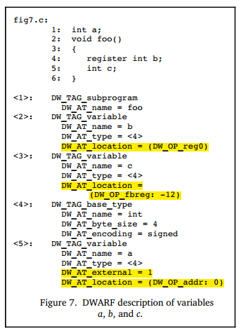

## 位置数据

调试信息必须为调试器提供一种方法，使其能够查找程序变量的位置、确定动态数组和字符串的范围，以及能找到函数栈帧的基地址或函数返回地址的方法。此外，为了满足最新的计算机体系结构和优化技术的需求，调试信息必须能够描述对象的位置，还需要注意的是，该对象的位置可能会在对象的生命周期内发生变化。

DWARF提供了一种非常通用的机制描述如何确定变量在内存中的实际位置，就是通过属性**DW_AT_location**，该属性允许指定一个操作序列，来告知调试器如何确定变量的地址。

### 多种寻址方式

下面是DWARF v2官方示例中的demo，展示了如何使用属性 `DW_AT_location`来定位变量的地址。变量可以定义在寄存器中、内存中（堆、栈、全局存储区），对应的寻址规则也有差异（兼顾寻址的正确性、效率等）。



Figure 7这个示例中：

- 变量b定义在寄存器中， `DW_AT_location = (DW_OP_reg0)`，直接存储在reg0对应的寄存器中；
- 变量c存储在栈上，`DW_AT_location = (DW_OP_fbreg: -12)`，EA=fbreg-12,fbreg (framebase register)，表示该变量位置在当前 `栈基址-12` 这个位置；
- 变量a存储在固定地址（.data section中），`DW_AT_location = (DW_OP_addr: 0)`，存储在.data开头；

描述位置信息的方法，主要可以分为两类：

- **位置表达式（Location Expressions）**，是与语言无关的寻址规则表示形式，它是由一些基本构建块、操作序列组合而成的任意复杂度的寻址规则。 只要对象的生命周期是静态的（static）或与拥有它的词法块相同，并且在整个生命周期内都不会移动，它们就足以描述任何对象的位置。
- **位置列表（Location Lists）**，用于描述生命周期有限的对象或在整个生命周期内对象的地址可能会发生变动的对象。

### “位置表达式”描述单一位置

变量在整个生命周期内，其位置都不会发生变化，此时只需要一个单一的位置表达式即可，用DWARF表达式直接描述变量的存储位置，比如“在寄存器X”或“在栈偏移量Y处”。位置表达式由0个或者多个位置操作组成，可以划分为“寄存器名” 和 “地址操作”两种寻址方式。

> ps: 如果没有位置运算表达式，则表示该对象在源代码中存在、在目标文件中不存在，被编译器给优化掉了。

#### 寄存器名

寄存器名（寄存器号），始终是单独出现的，并指示所引用的对象包含在特定寄存器中。请注意，寄存器号是DWARF中特定的数字到给定体系结构的实际寄存器的映射。`DW_OP_reg${n} (0<=n<=31)` 操作编码了32个寄存器, 该对象地址在寄存器n中. `DW_OP_regx` 操作有一个无符号LEB128编码的操作数，该操作数代表寄存器号。

#### 地址操作

地址操作是针对内存地址的计算规则，所有位置操作的操作码（opcode）和操作数（operand），被编码在同一个操作流里，每个操作码后跟0个或多个操作数，操作数的数量由操作码决定。类似这样 `[opcode1][operand1][operand2][opcode2][opcode3][operand3]...`。

ps：前面查看变量地址时，我们介绍过DW_AT_location是一个byte数组，解码时是从这个byte数组中一起解码的。

每个寻址操作都表示 "**基于栈架构机器上的后缀操作**"，这里的栈，通常称为 “位置栈（Location Stack）” 或 “寻址栈（Addressing Stack）”：

- 栈上每个元素，是一个目标机器上的地址的值（或表达式计算过程中的中间结果）；
- 执行位置表达式之后，栈顶元素的值就是计算结果（对象的地址，或者数组长度，或者字符串长度）。

**位置表达式中的地址计算方式，主要包括如下几种：**

1. **寄存器寻址**

   寄存器寻址方式， 计算目标寄存器中的值与指定偏移量的和，结果push到栈上：

   - DW_OP_fbreg \$offset, 计算栈基址寄存器 (rbp)中的值 与 偏移量 $offset的和；
   - DW_OP_breg\${n} \${offset}, 计算编号n的寄存器中的值 与 偏移量$offset（LEB128编码）的和；
   - DW_OP_bregx \${n} \${offset}, 计算编号n（LEB128编码）的寄存器中的值 与 偏移量 $offset（LEB128编码）的和；
2. **栈操作**

   以下操作执行后都会push一个值到Location Stack上：

   - DW_OP_lit\${n} (0<=n<=31), 编码一个无符号字面量值\${n}；
   - DW_OP_addr, 编码一个与目标机器匹配的机器地址；
   - DW_OP_const1u/1s/2u/2s/4u/4s/8u/8s, 编码一个1/2/4/8 字节 无符号 or 有符号整数；
   - DW_OP_constu/s, 编码一个 LEB128 无符号数 or 有符号整数.

   以下操作会操作Location Stack，栈顶索引值为0：

   - DW_OP_dup, 复制栈顶entry并重新入栈;
   - DW_OP_drop, 弹出栈顶entry；
   - DW_OP_pick, 使用1字节索引值\${index}，从栈中根据\${index}找到对应entry并重新入栈；
   - DW_OP_over, 复制index==2的entry并重新入栈；
   - DW_OP_swap, 指定两个索引值index1\index2，交换这两个索引值对应的entries；
   - DW_OP_rot, 旋转滚动栈顶的的3个entries；
   - DW_OP_deref, 弹栈获取到的值作为有效地址，从这个地址处读取sizeof(ptrOfTargetMachine)大小的数据，并将数据入栈；
   - DW_OP_deref_size, 类似于DW_OP_deref，不同之处在于，要读取的数据量由1-byte操作数来指定, 然后读取到的数据入栈前将被0填充到sizeof(ptrOfTargetMachine)大小；
   - DW_OP_xderef & DW_OP_xderef_size, 类似于DW_OP_ref，不同之处在于，扩展了解引用的机制。解引用时, 弹出的栈顶entry数据作为地址；继续弹栈得到次栈顶数据作为地址空间标志符。执行一点计算得到有效地址，并从中读取数据，并入栈；
3. **算术和逻辑运算**

   DW_OP_abs, DW_OP_and, DW_OP_div, DW_OP_minus, DW_OP_mod, DW_OP_mul, DW_OP_neg, DW_OP_not, DW_OP_or, DW_OP_plus, DW_OP_plus_uconst, DW_OP_shl, DW_OP_shr, DW_OP_shra, DW_OP_xor, 这些操作工作方式类似，都是从栈里面pop操作数然后计算，并将结果push到栈上。
4. **控制流操作**

   以下操作提供对位置表达式流程的简单控制：

   - 关系运算符，这六个运算符分别弹出顶部的两个堆栈元素，并将顶部的第一个与第二个条目进行比较，如果结果为true，则push值1；如果结果为false，则push值0；
   - DW_OP_skip，无条件分支，其操作数是一个2字节常量，表示要从当前位置表达式跳过的位置表达式的字节数，从2字节常量之后开始；
   - DW_OP_bra，条件分支，此操作从栈上pop一个元素，如果弹出的值不为零，则跳过一些字节以跳转到位置表达式。
     要跳过的字节数由其操作数指定，该操作数是一个2字节的常量，表示从当前定位表达式开始要跳过的位置表达式的字节数（从2字节常量开始）；
5. **特殊操作**

   DWARF v2中有两种特殊的操作（DWARF v4中是否有新增，暂时先不关注）：

   - DW_OP_piece, 许多编译器将单个变量存储在一组寄存器中，或者部分存储在寄存器中，部分存储在内存中。 DW_OP_piece提供了一种描述特定地址位置所指向变量的哪一部分、该部分有多大的方式；
   - DW_OP_nop, 它是一个占位符，它对位置堆栈或其任何值都没有影响；

> ps: 对于结构体成员地址的计算，在执行位置表达式之前，需要先将包含该成员的结构体的起始地址push到栈上。

#### 操作示例

上面提到的寻址操作都是些常规描述，下面是一些示例。

- 栈操作示例

``

- 位置表达式示例

  以下是一些有关如何使用位置运算来形成位置表达式的示例。

  

### “位置列表”可描述多个位置

如果一个对象的位置在其生命周期内可能会发生改变，或者生命周期有限，就可以使用位置列表代替位置表达式来描述其位置。实际上，就是用一组区间（PC范围）和对应的DWARF表达式，描述变量在不同代码区间时的存储位置。什么情况下会发生“变量的存储位置在不同的代码区间时会发生变化”呢？比如由于优化、寄存器分配、变量溢出到栈等。

举个例子，比如变量b在函数的前半段保存在寄存器rbx，后半段被溢出到栈上（比如rbp-8），此时就应该用位置列表来跟踪对象地址的变化。

```
[0x100, 0x120): DW_OP_reg3         // 在0x100到0x120之间，b在rbx
[0x120, 0x140): DW_OP_fbreg -8     // 在0x120到0x140之间，b在rbp-8
```

> ps: 有读者会想到有些编程语言里面的移动式GC，那个跟这个完全是两码事，也不能用这种方式来解决。

位置列表 (.debug_loc section) 中的每一项包括:

- 起始地址，相对于引用此位置列表的编译单元的基址，它标记该位置有效的地址范围的起始位置；
- 结束地址，它还是相对于引用此位置列表的编译单元的基址而言的，它标记了该位置有效的地址范围的结尾；
- 一个位置表达式，它描述PC在起始地址和结束地址指定的范围内时，对象在内存中的位置表达式；

位置列表以一个特殊的list entry标识列表的结束，该list entry中的起始地址、结束地址都是0，并且没有位置描述。
DWARF v5会将.debug_loc和.debug_ranges替换为.debug_loclists和.debug_rnglists，从而实现更紧凑的数据表示，并消除重定位。

### 位置信息的生成

DWARF 位置表达式的设计确实相对直观，编译器在生成调试信息时，能够根据变量的存储安排（如寄存器、栈、全局存储区等）直接生成对应的位置表达式。具体来说：

1. 编译器已知变量位置：编译器在编译过程中会进行语法分析、符号表管理、存储分配等工作，因此它能够确定每个变量的存储位置（例如，局部变量在栈上的偏移量、全局变量在 .data 段的地址、寄存器分配等）。
2. 位置表达式的生成：编译器可以根据这些已知信息，直接生成 DWARF 位置表达式。例如：

   * 如果变量 a 存储在全局数据段，编译器会生成 DW_OP_addr: 0 这样的位置表达式。
   * 如果变量 b 存储在寄存器 reg0 中，编译器会生成 DW_OP_reg0。
   * 如果变量 c 存储在栈上，编译器会生成 DW_OP_fbreg: -12，表示栈基址寄存器（如 rbp）减去偏移量 12。
3. 位置表达式的简单性：DWARF 位置表达式的设计是基于栈的后缀操作，这种设计使得表达式能够灵活地描述复杂的地址计算，同时保持简洁。编译器只需要根据变量的存储安排，生成对应的操作码和操作数即可。
4. 当然了，编译器也知道做了哪些优化、寄存器分配、什么情况下会发生变量溢出到栈的情况，自然也可以知道PC处于不同范围时应该生成不同的位置信息（位置列表）；

这个过程属于编译器的工作范畴，并没有那么复杂，这部分了解到这里就可以了。

### 本文总结

本文介绍了DWARF中的位置描述机制。我们了解到DWARF使用位置表达式和位置列表两种方式来描述变量的位置信息:

- 位置表达式是一种基于栈的后缀表达式,通过一系列操作来计算出变量的实际地址
- 位置列表则用于描述变量在其生命周期内可能发生变化的位置信息,通过PC范围和对应的位置表达式来表示

这种灵活的位置描述机制使得调试器能够准确地定位和访问程序中的变量,即使在编译优化、寄存器分配等情况下也能正确工作。编译器在生成调试信息时,能够根据变量的存储安排直接生成对应的位置表达式或位置列表。


### 参考文献

1. DWARF, https://en.wikipedia.org/wiki/DWARF
2. DWARFv1, https://dwarfstd.org/doc/dwarf_1_1_0.pdf
3. DWARFv2, https://dwarfstd.org/doc/dwarf-2.0.0.pdf
4. DWARFv3, https://dwarfstd.org/doc/Dwarf3.pdf
5. DWARFv4, https://dwarfstd.org/doc/DWARF4.pdf
6. DWARFv5, https://dwarfstd.org/doc/DWARF5.pdf
7. DWARFv6 draft, https://dwarfstd.org/languages-v6.html
8. Introduction to the DWARF Debugging Format, https://dwarfstd.org/doc/Debugging-using-DWARF-2012.pdf
9. dwarfviewer, https://github.com/hitzhangjie/dwarfviewer
