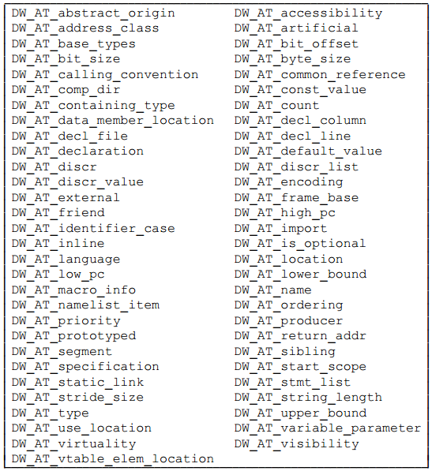

## DIE详细介绍

跟其他一些标准需要不断演进一样，DWARF也经历了DWARF v1到DWARF v5的发展阶段。随着DWARF调试信息的完善，以及高级语言进一步抽象、进化，为了更好更高效地对高级语言进行描述，DWARF标准中的Tag枚举值、Attribute枚举值也在慢慢增加。以Tag枚举值为例，DWARF v1中定义了33个Tag枚举值，v2增加到了47个，v3增加到了57个，v4增加到了60个，最新的v5增加到了68个。Attributes当然也存在类似的扩展、数量增加的情况。

但是增加Tags、Attributes不代表DWARF的理解就变得更复杂了，这正是其“良好扩展性”的体现。只是因为篇幅原因，我们先拿DWARF v2中的Tag、Attributes进行展示，让大家有个直观认识后，后面示例中再与当前go编译工具链使用最多的DWARF v4、v5内容进行对齐。以免必要的内容还未介绍到位，大家就已经淹没在了不同版本的细节变迁中。

### DIE结构及组织

DWARF使用一系列调试信息条目（DIE, Debugging Information Entry）来对程序构造进行描述，每个DIE都由一个tag以及一系列attributes构成:

- tag指明了该DIE描述的程序构造的类型，如编译单元、函数、函数参数及返回值、变量、常量、数据类型等；
- attributes定义了该DIE的一些具体属性、特征，如变量的名字DW_ATTR_name、变量所属的数据类型DW_ATTR_type等；

DIEs之间的关系，可能有兄弟节点（sibling DIEs，由attribute DW_ATTR_type、DW_ATTR_sibling引用），也可能有子节点（Children，如编译单元中包含了一系列函数定义，每个函数定义又包括了入参、出参）。如果进考虑Children关系的话，DIEs构成了一棵树（tree）；如果也把Sibling关系考虑进去的话，就构成了一个图（graph）。
#### DIE Tags

Tag，其枚举值以 `DW_TAG_` 开头，它指明了DIE描述的程序构造所属的类型，下面表格中整理了DWARF v2中定义的Tag枚举值，大部分可以望文生义的方式知道它是描述什么的，但是要详细了解的话，特别是不同Tag类型的DIE可以使用的Attributes，建议阅读DWARF标准进行更深入的了解。


#### DIE Attributes

Attribute，其枚举值以 `DW_AT_` 开头，它表示了DIE的一些属性、特征信息，进一步补充了DIE要描述的程序构造的信息。

不同attributes的值类型可能也不同，可以是一个常量（如函数名称）、变量（如函数的开始地址）、对另一个DIE的引用（如函数返回值对应的类型DIE）等等。即使确定了是哪种类型的值，它的编码方式也可能是有差异的，如，常量数据有多种表示形式（如固定为1、2、4、8字节长度的数据，或者可变长度的数据）。

>ps: Attribute的任何类型实例的特定表示，都与属性名称一起被编码，以方便更好地理解、解释DIE的含义。

下表列出了DWARF v2中定义的attributes：



attribute的值，可以划分为如下几种类型：

1. **Address**, 引用被描述程序的地址空间的某个位置；
2. **Block**, 未被解释的任意数量的字节数据块；
3. **Constant**, 1、2、4、8字节未被解释的数据，或者以LEB128形式编码的数据；
4. **Flag**, 指示属性存在与否的小常数；
5. **lineptr**, 引用存储着行号信息的DWARF section中的某个位置；
6. **loclistptr**, 引用存储着位置列表的DWARF section中的某个位置，某些对象的内存地址在其生命周期内会发生移动，需要通过位置列表来进行描述；
7. **macptr**, 引用存储着macro信息的DWARF section中的某个位置；
8. **rangelistptr**, 引用存储着非相邻地址区间信息的DWARF section中的某个位置；
9. **Reference**, 引用某个描述program的DIE；

   根据被引用DIE所在的编译单元与引用发生的编译单元是否相同，可以划分为两种类型的references：

   - 第一种引用，被引用的DIE所在的编译单元与当前编译单元是同一个，通过相对于该编译单元起始位置的偏移量来引用该DIE；
   - 第二种引用，被引用的DIE所在的编译单元可以在任意编译单元中，不一定与当前编译单元相同，通过被引用DIE的偏移量来引用该DIE；
10. **String**, 以'\0'结尾的字符序列，字符串可能会在DIE中直接表示，也可能通过一个独立的字符串表中的偏移量（索引）来引用。

#### 示例描述

下面是一个简单的C程序对应的DIEs数据展示，我们看到最顶层是一个编译单元DIE（表示源文件），它包含了一个Subprogram类型的Child DIE（表示main函数），该Subprogram类型的DIE的返回值描述对应着一个int类型的BaseType类型的DIE。


### DIE的分类

根据描述信息的不同，可以将所有的DIEs划分为两大类：

1. 描述 **数据 和 类型** 的；
2. 描述 **函数 和 可执行代码** 的；

一个DIE可以有父、兄弟、孩子DIEs，DWARF调试信息可以被构造成一棵树，树中每个节点都是一个DIE，多个DIE组合在一起共同描述编程语言中具体的一个程序构造（如描述一个函数的定义）。

描述不同类型的程序构造，显然需要不同的Tag类型的DIE，而不同Tag的DIE所使用的Attributes也必然是不同的。想要更好地了解如何对特定语言的程序构造如何进行描述，就需要了解DWARF标准中的推荐做法，以及特定编程语言编译工具链中实际采用的描述方法。

从学习角度来说，这部分，我们也不需要真的深入go编译工具链的DWARF生成细节，这个比较费时费力，我们只需要写测试代码，然后使用合适的工具观察它具体包含哪些Tag、哪些Attributes就可以了。

在后面的章节，我们会介绍DIE是如何描述程序中的数据和类型的，然后再介绍是如何描述函数和可执行代码的。

### DIE的存储位置

调试信息条目存储在.debug_info中，DIE可以描述类型、变量、函数、编译单元等等不同的程序构造。DWARF v4中曾经提出将类型相关的描述存储在.debug_types中，初衷是为了避免不同编译单元中存在重复的类型定义，导致linker合并存储到.debug_info时出现重复的DIE信息，解法是每个类型写入独立的section，然后由linker合并、去重后写入.debug_types。即使不写入.debug_types，这也是可以做到的，DWARF v5中已经将类型相关的描述合并入.debug_info，废弃了.debug_types。

see: DWARFv5 Page8:

```
1.4 Changes from Version 4 to Version 5
The following is a list of the major changes made to the DWARF Debugging
13 Information Format since Version 4 was published. The list is not meant to be
14 exhaustive.
15 • Eliminate the .debug_types section introduced in DWARF Version 4 and
16 move its contents into the .debug_info section.
   ...
```

调试信息数据其实是比较大的，如果不经过压缩处理会导致二进制尺寸显著增加。一般会要求编译工具链生成调试信息时进行压缩处理，压缩后的调试信息将存储在：1）目标文件中的".zdebug_"前缀的section中，如未压缩的调试信息条目对应section是.debug_info，那么压缩后将存储在.zdebug_info中；2）也可能仍然存储在".debug_"前缀的section中，但是对应的section的Compressed标记设置为true，并且设置对应的压缩算法，如zlib或者zstd。3）此外，也有些平台上，工具链会将上述调试信息存储在独立的文件或者目录中，如macOS上会写入到对应的 `.dSYM/*` 文件夹中，调试器读取时需要注意这点。

### 从入门到精通

看到作者提到DWARF已经经历了这么多个版本，并且每个新版本较之旧版本都在不断扩展，大家心里难免有些抓毛，“我能掌握吗？”。

1）大家觉得理解 **“反射（reflection）**”困难吗？反射和这里的DWARF其实有异曲同工之妙。借助反射我们可以在程序运行时，动态理解对象的类型信息，有了类型信息我们也可以动态构建对象、修改对象属性信息。反射技术中使用到的类型信息就是程序运行时的对象的一些跟类型相关的元数据信息，这里的元数据信息的设计和组织面向这一种语言专属的设计。

2）大家觉得理解go runtime的 **.gopclntab** 困难吗？可能大家没有看过相关的实现细节，尽管我们多次提到了go runtime依赖它实现了运行时的调用栈跟踪。这里的.gopclntab也是针对go语言专属的设计。

相比较之下，而DWARF则是面向当前甚至将来所有的高级语言设计的一种描述语言，它也描述了程序的类型定义、对象的类型信息，借助它我们也可以知道内存中某个对象的类型信息，也可以据此构造对象、修改对象，只要我们愿意。行号表、调用栈信息表，也需要针对所有高级语言进行描述，而不能仅仅面向一种语言。当然了，DWARF是面向调试领域的，所以它生成的内容不会在程序执行时加载到内存。

所以，我这么给大家类比一下之后，大家觉得还困难吗？大道至简，道理是相通的，能够不拘泥于形式的灵活运用来解决问题，是我们应该向大师们学习的。

> ps: 为了方便大家学习，我编写了一个DIE可视化工具 [hitzhangjie/dwarfviewer](https://github.com/hitzhangjie/dwarfviewer)。借助此工具，您可以方便地查看ELF文件.debug_info中的DIE信息，包括DIE Tag、Attributes以及Children DIEs、Sibling DIEs。您可以写些简单的代码片段，如包含一个函数，或者一个类型，然后使用此工具对生成的DWARF信息进行对比，以加深理解。

### 参考文献

1. DWARF, https://en.wikipedia.org/wiki/DWARF
2. DWARFv1, https://dwarfstd.org/doc/dwarf_1_1_0.pdf
3. DWARFv2, https://dwarfstd.org/doc/dwarf-2.0.0.pdf
4. DWARFv3, https://dwarfstd.org/doc/Dwarf3.pdf
5. DWARFv4, https://dwarfstd.org/doc/DWARF4.pdf
6. DWARFv5, https://dwarfstd.org/doc/DWARF5.pdf
7. DWARFv6 draft, https://dwarfstd.org/languages-v6.html
8. Introduction to the DWARF Debugging Format, https://dwarfstd.org/doc/Debugging-using-DWARF-2012.pdf
9. dwarfviewer, https://github.com/hitzhangjie/dwarfviewer
