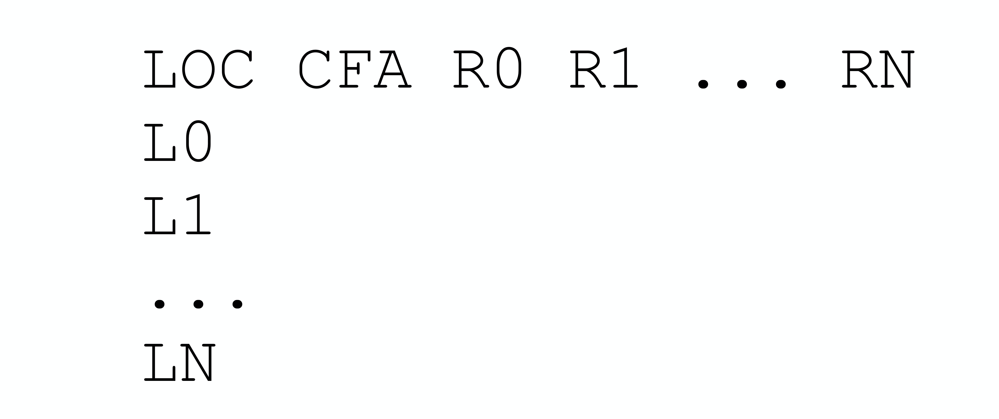
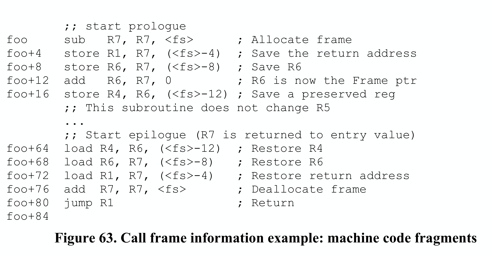
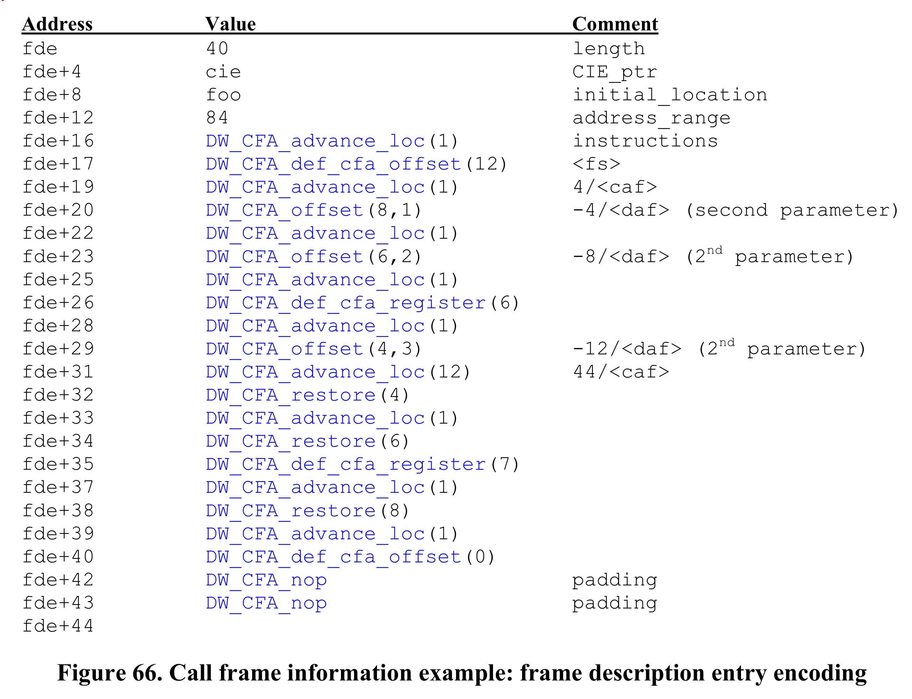

## 调用帧信息表（Call Frame Information）

### 功能介绍

DWARF调试信息中的**调用帧信息表（CFI, Call Frame Information）**是一个重要组成部分，它为调试器提供了函数调用相关的关键信息。它记录了随着函数调用、函数执行期间PC变化时寄存器的值如何被修改的过程。有了这个表，我们就可以知道当前函数的基地址（CFA）、函数的参数、返回地址，并进而找到Caller的栈帧，因为还有各个寄存器的unwinding rules，我们也可以虚拟展开调用栈到指定的某个函数栈帧。

### 调用栈展开

#### CFI栈展开的过程

CFI，我们使用"调用帧信息表"这个翻译，而不是"调用栈信息表"这个翻译。因为CFI记录的是如何从当前函数的帧展开到特定caller的帧时的数据，展开时只要找到对应的函数的FDE，然后执行这个FDE中的字节码指令即可，而不是逐一对callers进行处理一直到达指定caller这种回溯的方式。

> ps: 尽管我们可以做到展开整个调用栈，但是概念理解上扫清误区还是很重要。实际上DWARF的设计上，你可以展开任意函数的帧，只要这个函数的帧真的存在。通常我们查看caller的帧是因为caller->当前被调函数都是在特定tracee上执行，tracee停下来了我们方便观察它的状态。而即使我们直到某个线程执行了函数创建了对应的帧，但是由于调试器没有跟踪这个线程，这个时候去尝试展开它也是没有意义的。

举个例子，在CFI表中，每条机器指令基本对应一行记录：第一列是指令地址，其他列包含了执行该指令前各个寄存器的unwind操作。假定程序从fn1->fn2-> ... -> fnN，对应的PC从addr1一直执行到现在addrN。当我们希望虚拟展开fn1的栈时，该怎么操作呢？我们需要先找到fn1对应的FDE，然后使用CIE=FDE.cie_pointer，执行CIE的初始化指令以及FDE中的指令，直到达到fn1中的目标指令地址。此时，对应的寄存器状态就会被正确地虚拟恢复到fn1执行到该指令时的状态。

OK，调试器确实需要能够查看、修改调用栈上的任意活动记录（subroutine activation）的状态，我们说栈帧（帧）、活动记录，这不是一样的东西，前者强调的是帧的组织，后者强调的是函数调用时的一个新的调用记录，函数调用发生时，一个activation中至少包含：

- 被调函数中的1个有效指令地址，该地址处要么是调试器获得控制权时程序停止的位置（例如断点），要么是调用另一个callee的位置，或者被异步事件（例如信号）中断的位置；
- 栈上分配的内存区域"调用帧"（call frame）或者"函数的栈帧"。该函数对应的帧的起始地址，被称为"**Canonical Frame Address （规范帧地址，CFA）**"，其实就是该函数的帧基址。
- 函数执行到特定指令位置时使用过的一组寄存器；

> ps: 例如函数a调用函数b，会先入栈b函数的参数（返回值go1.17前也是在栈上开辟，1.17后通过寄存器传递），再入栈b函数的返回地址（即rip值），再入栈rbp，...对于b函数栈帧而言，CFA就是其栈帧的基地址，其实也就是入栈rip之前的caller的rsp值。

为了能够查看或修改不在栈帧顶部的某个函数帧的，调试器必须能"虚拟地展开（virtually unwind）"整个调用栈直到目标函数帧被展开。展开的过程，从当前函数帧、指令地址开始，查CFI信息表，找到对应的记录，然后逆序执行对应的寄存器unwinding rules，一直执行直到展开目的栈帧为止。

联想下gdb调试的过程，通过bt可以看到调用帧，然后通过frame N来选择指定的帧。这个时候就是一个虚拟地展开调用帧的过程，Nth帧中的寄存器状态被计算了出来存在某处，比如rsp、rbp被重新算了存在某处，并用于后续print等操作时计算变量地址，这样我们就可以看到Nth帧的函数参数、局部变量、寄存器值。为什么说是虚拟地展开？就是说，这里寄存器unwinding rules只用于重新计算当时寄存器的值，但是并不会设置回寄存器去，并没有修改进程的状态，只是看上去return到对应的caller的栈帧中去了……所以才说是virtually unwind。

通常，在函数调用时会指定一组寄存器并将其状态进行保存。如果被调函数要使用一个寄存器，它就要在函数入口处保存该寄存器值到栈帧中，并在函数退出时将其恢复。

- 在调用帧上调整帧大小（用于分局部变量）并保存寄存器状态的这部分代码，称函数序言（prologue）；
- 执行寄存器状态恢复并销毁调用帧的这部分代码，称为函数后记（epilogue）。

通常，序言代码实际上在函数的开头，而后记代码在函数的结尾。

#### 架构无关编码方式

展开堆栈操作，需要知道寄存器的保存位置以及如何计算调用方的CFA和代码位置。在考虑体系结构无关的信息编码方式时，有些特殊事项需要考虑：

- 子例程（函数）序言和后记代码，并不总是位于子例程的开头和结尾这两个不同的块中。通常子例程后记部分代码会被复制到每次return返回操作的地方。有时，编译器也会将寄存器保存、取消保存操作分割开，并将它们移到子例程代码需要用到它们的位置；
- 编译器会使用不同的方式来管理调用帧，有时是通过一个栈指针，有时可能不是；
- 随着子例程序言和后记部分代码的执行，计算CFA的算法也会发生变化（根据定义，CFA值不变）；
- 一些子例程调用是没有调用帧的（如可能通过"尾递归"优化掉了）；

  > 关于编译器对尾递归的优化，可以参考博文： [tail recursion call optimization](http://www.ruanyifeng.com/blog/2015/04/tail-call.html)，当前go编译器还不支持尾递归优化，gcc是支持的。
  >
- 有时将一个寄存器的值保存在另一个寄存器中，但是后者可能按照惯例是不需要在子例程序言中存储的；
- 某些体系结构具有特殊的指令，这些指令可以在一条指令中执行部分或全部的寄存器管理，而在堆栈上留下一些特殊信息来指示寄存器该如何保存；
- 一些体系结构处理返回地址值比较特殊。 例如，在有的体系结构中，调用指令可确保调用地址低两位为零，而返回指令将忽略这些位。 这留下了两个存储位，可供其他用途使用，必须对其进行特殊处理。

### CFI详细设计

#### CFI表结构设计

DWARF定义了独立于体系结构的基本要素来支持"虚拟展开（virtually unwind）"调用帧，这些基础要素能够记录子例程调用期间如何保存和恢复寄存器的状态。对于某些特定机器，其可能拥有些ABI委员会、硬件供应商或编译器生产商定义的体系结构特定的信息，需要借助这些信息对DWARF基本要素进行补充。

CFI描述的表结构，如下图所示：

- 第1列，指令地址。表示程序中指令的地址（在共享库文件，指令地址是一个相对于起始地址的偏移量）；
- 第2列，CFA（Canonical Frame Address），规范帧地址，简单说其实就是Callee的栈帧的基地址。CFA列的地址计算规则，可以是结合寄存器、偏移量计算，也可以由DWARF表达式计算。
- 其他列，各寄存器对应的虚拟展开规则（virtual unwinding rules）；这里的寄存器规则，包括：

  - undefined，该规则表示对应寄存器在前一个栈帧中没有可恢复的值。通常是，在调用callee的时候没有对相关寄存器的状态进行保存；
  - same value，该规则表示对应寄存器的值与前一个栈帧中寄存器的值相同。通常是，在调用callee的时候对相关寄存器的状态进行了保存，但是并没有进行修改；
  - offset(N)，该规则表示对应寄存器的值被保存在CFA+N对应的地址处，CFA就是当前的CFA值，N是有符号偏移量；
  - val_offset(N)，该规则表示对应寄存器的值就是CFA+N的值，CFA就是当前的CFA值，N是有符号偏移量；
  - register(R)，该规则表示对应寄存器的值，被保存在另一个寄存器R中；
  - expression(E)，该规则表示对应寄存器的值，保存在DWARF表达式E对应的内存地址中；
  - val_expression(E)，该规则表示对应寄存器的值，就是DWARF表达式E的值；
  - architectural，该规则不是当前规范内的定义，它由augmenter定义；

上述CFI信息表，如果我们每条指令都真的存一条记录，则该表空间将会非常大！为了高效存储这些信息，CFI采用了与行号表类似的压缩策略：将信息编码为字节码指令序列，完整的CFI表体积虽然庞大，但由于相邻指令间的状态变化通常很小，我们仍然可以基于差异、增量进行存储，这种编码方式可以让CFI保持相当紧凑的存储格式。还原该CFI表矩阵的时候，这些指令由专门的CFI状态机解释执行即可。

上述CFI信息表被编码在 "**.debug_frame**" section 中。 .debug_frame节中的条目相对于该节的开头按地址大小的倍数对齐，并以两种形式出现：

- 公共信息条目（Common Information Entry, CIE）；
- 帧描述条目（Frame Descriptor Entry, FDE）；

> ps：如果函数的代码段地址范围不是连续的，那可能存在多个CIEs和FDEs。

构建CFI表结构，离不开CIE、FDE，因为构建CFI表结构的字节码程序存储在它们之中，我们需要先介绍下CIE、FDE的内容之后再来介绍如何生成CFI表。

#### 公共信息条目(CIE)

每个编译单元都有一个CIE，每个公共信息条目（CIE，Common Information Entry）的信息，可能会被很多帧描述条目FDE所共享。每个非空的.debug_frame section中至少包含一个CIE，每个CIE都包含如下字段：

1. length (初始长度)，常量，指明了该CIE结构的大小（字节数量），不包含该字段本身。length字段所占字节数，加上length的值，必须是按照address size对齐；
2. CIE_id (4字节或8字节)，常量，用于CIEs、FDEs；
3. version(ubyte)，版本号，该值与CFI信息有关，与DWARF版本无关；
4. augmentation (UTF-8字符串)，null结尾的UTF-8字符串，用于标志当前CIE和使用它的FDEs的扩展信息
5. address_size (ubyte)，该CIE中以及使用该CIE的其他FDEs中，目标机器地址占用几个字节，如果该frame存在一个编译单元，其中的address size必须与这里的address size相同；
6. segment_size (ubyte)，该CIE中以及使用该CIE的其他FDEs中，段选择器占用几个字节；
7. code_alignment_factor (unsigned LEB128)，常量，指令地址偏移量 = operand * code_alignment_factor；
8. data_alignment_factor (signed LEB128)，常量，偏移量 = operand * data_alignment_factor；
9. return_address_register (unsigned LEB128)，常量，指示返回地址存储在哪里，可能是物理寄存器或内存
10. initial_instructions (array of ubyte)，一系列rules，用于指示如何创建CFI信息表的初始设置；
    在执行initial instructions之前，所有列的默认生成规则都是undefined，不过, ABI authoring body 或者 compilation system authoring body 也可以为某列或者所有列指定其他的默认规则；
11. padding (array of ubyte)，字节填充，通过DW_CFA_nop指令填充结构体，使CIE结构体大小满足length要求，length值加字段字节数必须按照address size对齐；

#### 帧描述条目(FDE)

每个函数都有一个FDE，一个帧描述条目（FDE，Frame Descriptor Entry）包含如下字段：

1. length (初始长度)，常量，指明该函数对应header以及instruction流的字节数量，不包含该字段本身。length字段大小（字节数），加上length值，必须是address size（FDE引用的CIE中有定义）的整数倍，即按address size对齐；
2. CIE_pointer (4或8字节），常量，该FDE引用的CIE在.debug_frame的偏移量；
3. initial_location (段选择器，以及目标地址），该table entry对应第一个指令地址，如果segment_size（引用的CIE中定义）非0, initial_location前还需要加一个段选择器；
4. address_range (target address)，该FDE描述的程序指令占用的字节数量；
5. instructions (array of ubyte)，FDE中包含的指令序列，在后面进行描述；
6. padding (array of ubyte)，字节填充，通过DW_CFA_nop指令填充结构体，使FDE结构体大小满足length字段要求；

#### 字节码指令分类

调用帧指令(Call Frame Instructions)，每条指令可以包含零个或多个操作数，某些操作数会被编码到操作码中。部分指令的操作数通过DWARF表达式编码。CIE中的初始化指令序列、FDE中的指令序列，执行这两部分指令用于创建CFI表结构。

这里的调用帧指令，包括如下这几类：

- CFI表的行创建指令，用于创建表中的一行；
- CFI表的CFA定义指令，用于定义当前这一行的CFA计算规则；
- CFI表的寄存器规则指令，用于定义当前这一行中的其他寄存器的unwinding rules；
- CFI表的行状态指令，寄存器状态保存入栈和获取的能力；
- CFI表的行填充指令，填充nop，什么也不干；

##### CFI表行创建指令（Row Creation Instructions）

1. DW_CFA_set_locDW_CFA_set_loc指令采用代表目标地址的单个操作数。 所需的操作是使用指定的地址作为新位置来创建新的表行。新行中的所有其他值最初都与当前行相同。 新位置值始终大于当前位置值。 如果此FDE的CIE的segment_size字段不为零，还需要在在初始位置之前加上段选择器。
2. DW_CFA_advance_locDW_CFA_advance指令采用单个操作数（在操作码中编码），该操作数表示常数增量。 所需的操作是使用位置值创建一个新表行，该位置值是通过获取当前条目的位置值并加上delta * code_alignment_factor的值来计算的。 新行中的所有其他值最初都与当前行相同。
3. DW_CFA_advance_loc1DW_CFA_advance_loc1指令采用一个表示常量增量的单个ubyte操作数。 除了增量操作数的编码和大小外，该指令与DW_CFA_advance_loc相同。
4. DW_CFA_advance_loc2DW_CFA_advance_loc2指令采用单个uhalf操作数表示常数增量。 除了增量操作数的编码和大小外，该指令与DW_CFA_advance_loc相同。
5. DW_CFA_advance_loc4
   DW_CFA_advance_loc4指令采用单个uword操作数来表示恒定增量。 除了增量操作数的编码和大小外，该指令与DW_CFA_advance_loc相同。

##### CFI表CFA定义指令（CFA Definition Instructions）

1. DW_CFA_def_cfaDW_CFA_def_cfa指令有两个操作数，均为无符号LEB128编码，分别代表寄存器号和non-factored偏移量。该指令定义的CFA规则使用提供的寄存器和偏移量。
2. DW_CFA_def_cfa_sfDW_CFA_def_cfa_sf指令采用两个操作数：代表寄存器号的无符号LEB128值和有符号LEB128 factored偏移量。 该指令与DW_CFA_def_cfa相同，不同之处在于第二个操作数是有符号的因数（signed factored）。 结果偏移量为factored_offset * data_alignment_factor。
3. DW_CFA_def_cfa_registerDW_CFA_def_cfa_register指令采用表示寄存器编号的单个无符号LEB128操作数。 该指令定义当前的CFA规则以使用提供的寄存器（但保留旧的偏移量）。 仅当当前CFA规则定义为使用寄存器和偏移量时，此操作才有效。
4. DW_CFA_def_cfa_offsetDW_CFA_def_cfa_offset指令采用单个无符号LEB128操作数表示一个non-factored偏移量。 该指令定义当前的CFA规则使用提供的偏移量（但保留旧寄存器）。 仅当当前CFA规则定义为使用寄存器和偏移量时，此操作才有效。
5. DW_CFA_def_cfa_offset_sfDW_CFA_def_cfa_offset_sf指令采用带符号的LEB128操作数，表示factored偏移量。 该指令与DW_CFA_def_cfa_offset相同，除了该操作数是有符号的因数（signed factored）。 结果偏移量为factored_offset * data_alignment_factor。 仅当当前CFA规则定义为使用寄存器和偏移量时，此操作才有效。
6. DW_CFA_def_cfa_expression
   DW_CFA_def_cfa_expression指令采用单个操作数，该操作数编码为表示DWARF表达式的DW_FORM_exprloc值。 该指令通过表达式作为计算当前CFA的方式。

> ps: 有关可使用的DWARF表达式运算符的限制，请参见第DWARF v4 section 6.4.2。

##### CFI表寄存器规则指令（Register Rule Instructions）

1. DW_CFA_undefinedDW_CFA_undefined指令采用单个无符号LEB128操作数来表示寄存器号。该指令指定寄存器unwind规则设置为"undefined"。
2. DW_CFA_same_valueDW_CFA_same_value指令采用单个无符号的LEB128操作数来表示寄存器号。 该指令将指定寄存器unwind规则设置为"same"。
3. DW_CFA_offsetDW_CFA_offset指令采用两个操作数：一个寄存器号（使用操作码编码）和一个无符号的LEB128常量（factored偏移量）。 该指令将指定寄存器号指示的寄存器unwind规则更改为offset(N)规则，其中N的值是分解后偏移量 * data_alignment_factor。
4. DW_CFA_offset_extendedDW_CFA_offset_extended指令采用两个无符号的LEB128操作数，它们表示寄存器号和factored偏移量。 该指令与DW_CFA_offset相同，不同之处在于寄存器操作数的编码和大小。
5. DW_CFA_offset_extended_sfDW_CFA_offset_extended_sf指令采用两个操作数：代表寄存器号的无符号LEB128值和有符号LEB128编码的factored偏移量。 该指令与DW_CFA_offset_extended相同，不同之处在于第二个操作数是有符号factored偏移量。 结果偏移量为factored_offset * data_alignment_factor。
6. DW_CFA_val_offsetDW_CFA_val_offset指令采用两个无符号的LEB128操作数，它们代表寄存器号和factored偏移量。 所需的操作是将寄存器编号指示的寄存器规则更改为val_offset(N)规则，其中N的值是factored_offset * data_alignment_factor。
7. DW_CFA_val_offset_sfDW_CFA_val_offset_sf指令采用两个操作数：代表寄存器号的无符号LEB128值和有符号LEB128因数偏移量。 该指令与DW_CFA_val_offset相同，不同之处在于第二个操作数是有符号factored偏移量。 结果偏移量为factored_offset * data_alignment_factor。
8. DW_CFA_registerDW_CFA_register指令采用两个无符号的LEB128操作数表示寄存器编号。 该指令将第一个寄存器的unwind规则设置为register(R)，其中R是第二个寄存器。
9. DW_CFA_expressionDW_CFA_expression指令采用两个操作数：代表寄存器号的无符号LEB128值和代表DWARF表达式的DW_FORM_block值。 该指令将由寄存器号指示的寄存器的unwind规则更改为expression(E)规则，其中E是DWARF表达式。

   > 执行DWARF表达式之前，要先将当前CFA的值入到运算用的栈中，最后DWARF表达式执行完成后栈顶就是结果。有关可使用的DWARF表达式运算符的限制，请参见DWARF v4 section 6.4.2。
   >
10. DW_CFA_val_expressionDW_CFA_val_expression指令采用两个操作数：代表寄存器号的无符号LEB128值和代表DWARF表达式的DW_FORM_block值。 该指令将LEB128值指代的寄存器unwind规则修改为为val_expression(E)规则，其中E是DWARF表达式。
11. DW_CFA_restoreDW_CFA_restore指令采用单个操作数（用操作码编码），该操作数表示寄存器号。该指令将指定寄存器unwind规则更改为CIE中initial_instructions为其分配的规则。
12. DW_CFA_restore_extended
    DW_CFA_restore_extended指令采用单个无符号的LEB128操作数来表示寄存器号。 该指令与DW_CFA_restore相同，不同之处在于寄存器操作数的编码和大小。

##### CFI表行状态指令（Row State Instructions）

接下来的两条指令提供了将寄存器状态保存入栈和获取的能力。 比如，对于编译器需要将函数epilogue代码移入函数体中return的地方的时候，它们就很有用。

1. DW_CFA_remember_stateDW_CFA_remember_state指令不接受任何操作数，它将每个寄存器的规则集压入隐式堆栈。
2. DW_CFA_restore_state
   DW_CFA_restore_state指令不接受任何操作数，它将规则集从隐式堆栈中弹出，并将其放置在当前行中。

##### CFI表字节填充指令（Padding Instruction）

1. DW_CFA_nop
   DW_CFA_nop指令没有操作数，也没有必需的操作。 它用作填充字节以使CIE或FDE大小合适。

### CFI两种用法

#### 调用帧指令使用（Call Frame Instruction Usage）

调用帧信息（CFI）的主要用途是在程序执行过程中进行栈回溯（stack unwinding），以重建函数调用链。为了实现这一目标，我们需要能够确定任意执行点的寄存器状态。下面介绍如何使用CFI指令来获取这些信息。

为了**确定给定位置（L1）的虚拟展开规则集（virtual unwind rule set）**，首先需要在FDE headers中搜索包含该位置的FDE。这可以通过比较FDE headers中的initial_location和address_range值来完成。

一旦找到相应的FDE，就可以按照以下步骤确定该位置的unwind rule set：

1. 通过读取FDE关联的CIE的initial_instructions字段来初始化寄存器集合；
2. 读取并处理FDE的指令序列，直到遇到地址大于L1的指令DW_CFA_advance_loc，DW_CFA_set_loc，或遇到指令流的末尾；
3. 如果遇到DW_CFA_advance_loc或DW_CFA_set_loc指令，则计算一个新的位置值（L2）。 如果L1 >= L2，则处理该指令并返回步骤2继续执行；
4. 指令流的末尾可被视为DW_CFA_set_loc（initial_location+address_range）指令。请注意，如果执行到指令流的末尾后，如果L2<L1，则FDE格式不正确；

通过执行上述步骤，我们就能得到位置L1处的虚拟展开规则集（virtual unwind rule set），这些规则描述了如何恢复该位置的所有寄存器状态。有关具体示例，请参见DWARF v4 2附录D.6。

#### 调用帧调用地址（Call Frame Calling Address）

当进行栈展开时，调试器通常会希望获得**函数调用时的指令地址**。这些信息并不一定存在（比如尾递归消除了函数调用）。但通常，CFI中会指定一个寄存器（CIE中指定）来存储函数调用的返回地址。

如果在CFI表中定义了返回地址寄存器，并且其规则是undefined（例如，通过DW_CFA_undefined定义），那就没有返回地址，也没有调用地址，并且调用帧的虚拟展开已完成。

在大多数情况下，返回地址与调用地址在同一上下文中，但实际上不一定要这样，特别是如果编译器以某种方式知道调用将永远不会返回。 "返回地址"的上下文可能在不同的行中、在不同的词法块中，或在调用函数的末尾。 如果使用者要假定返回地址与调用地址在同一上下文中，则展开可能会失败。

对于具有固定长度指令的体系结构，其中返回地址紧跟在调用指令之后，一种简单的解决方案是从返回地址中减去指令的长度以获得调用指令的地址。对于具有可变长度指令的体系结构（例如x86），这是不可能的。 但是，**从返回地址减去1尽管不能保证提供准确的调用地址，但通常会生成一个与调用地址处于相同上下文中的地址，通常就足够了**。为什么说足够了呢？因为至少能确定同一个源码位置呀，这样就够用了。

> ps：所以，Calling Address计算得到的是Callee的函数返回地址-1。将这个地址值减去1（比如Call是多字节指令)，虽然得到的并不是函数调用之前的精确的指令地址，但是至少可以帮助我们确定函数调用发生时的源码位置、栈帧，就可以查看当时的源码位置、上下文信息，通常就足够了。
>
> 我们通过 `gdb> bt`查看当前所有的栈帧，并通过 `frame`命令选择栈帧时并不在乎精确的调用地址是什么，只要能够还原对应的调用时的源码位置、栈帧上下文就足够了。

> ps: 调用地址与返回地址不在同一个上下文中，这点可能有点费解，但是如果你看过Linux内核启动代码的话，你就非常容易理解这点。Linux内核head.s为了填充BIOS 16位操作模式向Linux 32/64位模式之间的转换，需要做很多工作，如支持32位/64位寻址、重建32位/64位中断向量表、重建GDT等等，最后才是调用Linux内核的main函数，因为这里的main函数永远不会返回，head.s里面其实是通过ret main地址，来模拟的call main。表现就是函数调用地址、返回地址根本不在同一个上下文中。
>
> 这里只是举个例子方便大家理解这个点，但也不是说该例子中的情景就完全覆盖了、等同于上面的这个点。

### 示例演示

#### 机器信息

下面的示例，假定是一个RISC机器，Motorola 88000。

- 内存按字节进行寻址；
- 指令都是4字节定长指令，并且都是按word对齐的；
- 指令操作数，一般这样组织：`<destination.reg>, <source.reg>, <constant>`
- load、store指令的内存地址，通过源操作数寄存器source.reg中的值和常量const相加进行计算；
- 有8个4字节寄存器:
  R0：总是0；
  R1：在进行函数调用时，保存返回地址；
  R2-R3：临时寄存器，在进行函数调用时，不用保存原来的值；
  R4-R6：进行函数调用时，需要保存原来的值；
  R7：保存栈指针值；
- 栈增长方向是从高地址向低地址方向增长；
- 架构ABI委员会指定栈指针 `(R7)`与CFA相同；

#### foo对应机器指令

下面是函数foo对应的两个机器指令片段，分别是函数序言（prologue）以及函数后记（epilogue）部分，里面除了使用stack pointer以外，还使用了frame pointer。第一列是指令地址，`<fs>`表示stack frame（栈帧）的大小（按字节算），这个示例中是12字节。

#### foo对应CFI表

上图63对应的CFI信息表如下图64所示，.debug_frame section中对应的代码片段如图65所示。

我们在图64 CFI信息表中使用了下面这些注解符号，请先了解其表示的含义。

1. R8 存储返回地址
2. s = same_value unwind规则
3. u = undefined unwind规则
4. rN = register(N) unwind规则
5. cN = offset(N) unwind规则
6. a = architectural unwind规则

#### CIE中initial instruction指导创建CFI中第一行

CFI信息表第一行，是由当前被调函数foo对应的FDE.CIE_Pointer所引用的CIE中的initial instructions来创建的，因此想了解第一行为什么是 `foo [R7]+0 s u u u s s s a r1`，就需要结合CIE来看，下图65中给出了CIE的说明。

CIE中规定R8是返回地址寄存器，该机型Motorola 88000规定函数调用时R1保存返回地址，故R8的值实际上在R1中。明确了这点后我们看下CIE中的initial instructions部分是如何指导创建CFI信息表第一行的。

在foo第一条指令执行之前，PC值为foo符号对应的内存地址：

- DW_CFA_def_cfa(7,0) 规定CFA=[R7]+0，表示foo的标准帧地址CFA就是调用方的栈指针值，即R7的值（此时 `R7=R7-<fs>`，此时还没有执行，还没有为foo分配栈帧），得到了 `foo [R7]+0`；

  > ps：一般是函数调用指令，如call，将返回地址（PC值）push到调用栈作为后续函数执行完成后的返回地址。
  >
- DW_CFA_same_value(0) 规定R0寄存器总是0，使用same unwind规则，也可以理解，得到了 `foo [R7]+0 s`；
- DW_CFA_undefined(1)/(2)/(3) 规定R1/R2/R3寄存器使用undefined unwind规则，R2、R3因为是无需保存的临时寄存器，所以使用undefined规则无可厚非，而R1实际上是保存返回地址的，这个程序中实际上没有将R1用作其他木目的，所以也是undefined。这样就得到了 `foo [R7]+0 s u u u`；

  > 如果prologue后面代码有用到R1的话，epilogue一定会有其他unwind规则来恢复，但是没有，说明根本就没有使用到R1；
  >
- DW_CFA_same_value(4)/(5)/(6) 规定R4/R5/R6寄存器使用same unwind规则，R4、R5、R6都是需要保存状态的寄存器，所以这里使用same unwind规则。这样就得到了 `foo [R7]+0 s u u u s s s`；
- R7本来是保存栈指针值，它也比较特殊，架构ABI委员会规定它和CFA相同，这里用architecutural unwind规则，得到了 `foo [R7]+0 s u u u s s s a`；
- DW_CFA_register(8,1) 规定寄存器R8存储在寄存器R1中，因为R8表示返回地址，而R1中记录着返回地址，所以使用register(8,1)。这样就得到了 `foo [R7]+0 s u u u s s s a r1`;
- 接下来是padding指令，填充CIE结构体大小使其满足CIE.length要求，这与构建CFI信息表无关，忽略。

当上述几条指令执行后，CFI信息表中的第一行就构建完成了：`foo [R7]+0 s u u u s s s a r1`。

#### FDE中指令序列指导创建CFI表中第2行、第3行、第n行

然后结合foo机器指令代码片段，我们再来看下其中prologue、epilogue部分，这两部分对应的机器指令对应的FDE中的指令序列应该长什么样子，以及这些指令作用到CFI表又是什么样的效果。

回顾下foo prologue、epilogue片段对应的机器指令：

下图66中展示了图63机器指令对应的FDE中的指令序列，图66中使用了如下注解:

1. `<fs>` = 栈帧大小
2. `<caf>` = 代码对齐因子，code alignment factor
3. `<daf>` = 数据对齐因子，data alignment factor

大家一定有疑问，FDE中的指令序列是如何生成的？图63中的每条机器指令的地址是不同的，其影响的寄存器也是不同的，实际上就是根据每条机器指令的具体动作，来生成对应的CFI表构建指令而已，比如CFI表row create rule，以及受影响的寄存器的unwind rule，仅此而已。下面结合图63中机器指令说明下FDE中的指令序列是如何构建的，以及反映到CFI信息表中又是什么样的。看完这里，大家就会对CFI表的构建了然于胸了！

CFI信息表第一行：`foo [R7]+0 s u u u s s s a r1`，它表示PC=foo处地址时，如何计算CFA以及如何恢复各个寄存器。下面解释代码中各条指令操作，如何转换成对应的CFI row rule set。

- `foo sub R7, R7, <fs>`

  R7存储的是栈指针值，指令执行后 `R7=R7-<fs>`，相当于分配了一个 `<fs>`大小的栈帧给foo使用。因为CFI之前用R7、偏移量来作为计算CFA的规则，此处R7的值减少了 `<fs>`，所以需要对CFA规则进行调整。首先需要一条row create rule，然后再来一条CFA调整规则，也就是下图66中的DW_CFA_advance_loc(1)以及DW_CFA_def_cfa_offset(12)，因为不涉及其他寄存器调整，这两个unwind rule就够了。

  这里的DW_CFA_advance_loc(1)表示指令地址前进code_alignment_factor * 1 = 4 * 1 = 4，表示该条机器指令执行后PC=foo+4。DW_CFA_def_cfa_offset(12)表示CFA计算规则中寄存器还是R7，但是偏移量由0变成+12。

  这样CFI表第二行就是 `foo+4 [R7]+fs s u u u s s s a r1`，其中fs=12。

  > 因此CFI信息表中各行 `addr : unwind rule set`表示的是PC=addr（该地址处指令待执行）时的unwind rule set。
  >
- `foo+4 store R1, R7, (<fs>-4)`

  R1里面存的是返回地址，`R7+<fs>-4`是foo栈帧最高的4个字节，该指令意图将foo函数调用的返回地址（R1值）存储到该位置。因为CFI信息表中R8用来存储返回地址，这里需要调整下R8的unwind rule。需要两个操作，首先是需要一条row create rule，接下来再来一条R8的unwind rule。

  DW_CFA_advance_loc(1)、DW_CFA_offset(8,1)，DW_CFA_advance_loc(1)就是将指令地址偏移量增加 `code_alignment_factor * 1 = 4 * 1`，也就是addr = foo+8。DW_CFA_offset(8,1)表示R8寄存器存储在 `当前CFA+偏移量data_alignment_factor * 1 = CFA + (-4) * 1 = CFA-4`的地方，也就是unwind rule变成了c-4。

  这样我们就得到了CFI表第二行 `foo+8 [R7]+fs s u u u s s s a c-4`。

  > data_alignment_factor=-4，这个在CIE中有定义。
  >
- `foo+8 store R6, R7, (<fs>-8)`

  这里是要存储R6寄存器的值到foo栈帧的第4~8字节的位置，影响的是R6寄存器的unwind规则，我们需要两个操作，一个是row create rule，一个是调整R6的unwind rule。

  DW_CFA_advance_loc(1)、DW_CFA_offset(6,2)，表示指令地址 `addr+=code_alignment_factor * 1`，即foo+12，并且R6的值存储在 `当前CFA+data_alignment_factor*2 = CFA+(-4)*2 = CFA-8`的位置，CFA-8表示的刚好是foo栈帧4~8节的位置。

  这样我们就得到了CFI表第三行 `foo+12 [R7]+fs s u u u s s c-8 a c-4`。
- ...
- 其他汇编指令对应的FDE中的操作以及解释，就不一一列举了，大体上就是按照上面这个方式来。

到这里，我们应该对以下过程"**源码->机器指令->CIE+FDE中指令序列的生成方式->CIE、FDE中指令对CFI表构建的过程**"都了解清楚了。而关于 `CFI表的运用`，如给定一个指令地址L1，进一步确定其对应的CFA，或者返回地址，这些更简单，前面也都讲过了。

至此，关于调用帧信息表的介绍可以宣布告一段落了。

### 本文总结

本文详细介绍了DWARF调试信息中的调用帧信息表CFI的相关内容，包括其基本概念、功能作用、表结构设计（CIE和FDE）以及字节码指令系统。通过Motorola 88000架构的具体示例，展示了从源代码到机器指令，再到CFI表构建的完整过程，说明了如何通过CIE和FDE中的指令序列来构建CFI表，以及如何利用这些信息进行栈回溯和调用栈展开。这些知识对于理解调试器的工作原理和程序执行过程具有重要意义。
