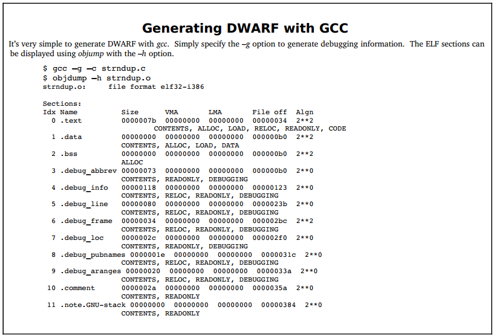

## 本章总结

DWARF的基本概念非常简单：

- 程序被描述为“**DIE节点构成的树**”，以紧凑的语言和与机器无关的方式表示源码中的各种函数、数据和类型；
- “**行号表**”提供了可执行指令地址和生成它们的源码之间的映射关系；
- “**CFI（调用帧信息表）**”描述了如何虚拟地展开调用栈；
- 考虑到DWARF需要针对**多种编程语言**和**不同的机器架构**表达许多不同的细微差别，因此Dwarf中也有很多微妙之处。

以gcc为例，通过选项-g “**gcc -g -c filename.c**” 能够生成DWARF调试信息并将其存储到目标文件filename.o的调试信息相关的section中。go程序构建时则是会默认生成调试信息。

通过使用 “**readelf -w**” 能够读取、显示所有生成的DWARF调试信息，也可以指定特定的section来加载特定的DWARF调试信息，如 “**readelf -wl**” 只加载 .debug_line 行号表信息。

本章已经详细介绍了DWARF对编程语言中不同程序构造的描述，个别的还提供了完整的示例并结合计算过程进行了详细讲解。希望读者已经搞明白了DWARF的大致工作原理。

本章先是介绍了调试信息标准DWARF如何描述程序的不同构造，包括数据结构、编译单元、函数、调用栈、行号表等等，然后我们又以go-delve/delve中DWARF解析相关的代码进行了一定的分析、应用，来帮助大家更好地认识DWARF的实际价值和用途。

尽管我们提供了一些go-delve/delve中DWARF相关的测试用例，但是和实现一个真正的符号级调试器而言，这也只能算是DWARF应用的一点皮毛而已。真正实现的时候，我们需要更加复杂的DWARF操作，甚至要对go的设计实现非常精通，我们才能实现一个真正可用的符号级调试器。

让我们带着储备的基础知识以及实现一个符号级调试器的“野心”，一起进入下一章吧。