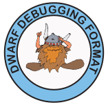

## 软件调试挑战

如果能编写出保证正确运行且无需调试的程序，那将是再好不过了。但至少在实现这一目标之前，正常的编程周期仍然包括编写程序、编译程序、执行程序，以及随之而来的、常常令人头疼的调试过程。然后反复迭代，直到程序达到预期效果。

### 贯穿全生命周期

软件调试这项技术贯穿软件开发的全生命周期，不止是开发测试阶段，软件交付上线后也依然需要长期维护、迭代，本书在第10章详细介绍了软件开发全生命周期中的不同的问题排查技术，希望能启发读者朋友的思路，不同场景采用合适的手段（可能是单一手段，也可能是几种手段的组合) 可以事半功倍。OK，本章我们回归主题，聚焦在基于调试器进行软件调试上。

调试程序的一种方法是在代码中插入打印选定变量值的语句。在某些情况下，例如调试内核驱动程序，这可能是一种常用的方法。低级调试器允许您逐条指令地执行程序，并显示寄存器和内存内容的二进制信息。不过，使用源代码级调试器通常更为便捷，它允许您逐行执行程序代码、设置断点、打印变量值，并提供其他功能，例如在调试过程中调用程序中的函数。关键在于如何协调编译器和调试器这两个完全不同的程序，从而实现程序的调试。

### 重建源码视角之难

将人类可读的代码编译成处理器能够执行的二进制形式，是一个相当复杂的过程。它本质上是将源代码逐步转换成越来越简单的形式，在每一步都丢弃信息，最终得到处理器能够理解的一系列简单指令、寄存器、内存地址和二进制值。 处理器其实并不关心您使用了面向对象编程、模板还是智能指针，它只理解对有限数量的寄存器和内存位置执行的非常基础的操作。

编译器在读取和解析源代码时，会收集关于程序的信息，例如变量或函数声明和使用的行号。 语义分析则在此基础上，补充变量类型和函数参数等细节。 优化阶段可能会重新排列代码结构、合并相似的代码片段、展开内联函数，或者删除冗余的部分。 最后，代码生成器将程序的内部表示转换成实际的机器指令。 为了进一步提升效率，通常还会对机器代码进行“窥孔”优化 (peephole optimization)，这是一种局部优化技术，例如将几条指令改写成更高效的指令、消除重复指令等。

总的来说，编译器的任务是将精心编写且易于理解的源代码，转换成高效但本质上难以理解的机器语言。 编译器越能实现创建紧凑且快速代码的目标，结果就越可能难以理解。

在转换过程中，编译器会收集关于程序的信息，这些信息在后续调试时会非常有用。 这方面存在两个挑战。 一是，在转换过程的后期，编译器可能难以将它所做的更改与程序员最初编写的源代码联系起来。 例如，窥孔优化器可能会删除一条指令，因为它能够重新排列内联函数实例化中 C++ 模板代码的执行顺序。 当优化器对程序进行操作时，它可能难以将低级代码的操作与生成它的原始源代码联系起来。

二是，如何在足够详细地描述可执行程序及其与原始源代码的关系，同时保持描述的简洁性，避免占用过多空间或消耗过多处理器时间，这本身就是一个难题。DWARF 调试格式应运而生，它以一种相对高效的方式表示可执行程序与源代码之间的联系，方便调试器进行处理。

### 软件调试过程

当开发人员对程序进行调试时，他们常常需要执行一些常见的操作。其中最常见的就是设置断点，以便在源代码的特定位置暂停调试，可以通过指定行号或函数名来实现。当断点触发时，程序员通常希望查看局部或全局变量的值，或者函数的参数。查看调用堆栈可以帮助程序员了解程序是如何到达断点的，尤其是在存在多个执行路径的情况下。在掌握这些信息后，程序员可以指示调试器继续测试程序的执行。

调试过程中还有一些其他有用的操作。例如，逐行跟踪程序的执行可能很有帮助，可以进入或跳过调用的函数。在模板或内联函数的每个实例处设置断点对于调试 C++ 程序至关重要。在函数即将返回之前停止，以便查看或修改返回值也可能很有帮助。有时，程序员可能需要绕过函数的执行，直接返回一个已知的值，而不是让函数（可能错误地）计算结果。

此外，一些与数据相关的操作也很有用。例如，直接显示变量的类型可以避免在源代码中查找。以不同的格式显示变量的值，或者以指定的格式显示内存或寄存器，都能提供便利。

有些操作可以被认为是高级调试功能，比如调试多线程程序或存储在只读内存中的程序。人们可能希望调试器（或其它程序分析工具）能够记录代码的哪些部分已经执行过。一些调试器还允许程序员调用正在测试程序的函数。过去，调试优化过的程序曾被视为一项高级功能。

调试器的目标是尽可能以自然、易于理解的方式向程序员呈现正在执行的程序，并提供广泛的控制权限。这意味着调试器需要尽可能还原编译器所做的复杂转换，将程序的内部状态转换回程序员最初编写的源代码所使用的形式。

像DWARF这样的调试数据格式的挑战就在于，要实现这种还原，并且还要让它变得简单易行。

### 调试信息格式

软件调试领域，曾经出现了如下几种调试格式，但是都存在这样那样的问题，比如 stabs、COFF、PE-COFF、OMF、IEEE-695，而 DWARF 算是后起之秀吧。

“stabs” 这个名字源于符号表字符串，因为最初的调试数据以字符串的形式保存在 Unix a.out 对象文件符号表中。Stabs 使用文本字符串来编码程序的信息。它最初非常简单，但随着时间的推移，演变成一种相当复杂、有时难以理解且不太一致的调试格式。Stabs 既没有标准化，文档也比较匮乏。Sun Microsystems 对 stabs 进行了许多扩展，GCC 也进行了其他扩展，试图逆向工程 Sun 的扩展。尽管如此，stabs 仍然被广泛使用。

COFF 代表 Common Object File Format，起源于 Unix System V Release 3。在 COFF 格式中定义了基本的调试信息，但由于 COFF 支持命名部分，因此各种不同的调试格式，例如 stabs，都与 COFF 一起使用。COFF 的主要问题在于，尽管名称中包含“Common”，但它在不同的体系结构上并不完全一致。COFF 存在多种变体，包括 XCOFF（用于 IBM RS/6000）、ECOFF（用于 MIPS 和 Alpha）和 Windows PE-COFF。这些变体的文档可用性各不相同，但对象模块格式和调试信息均未标准化。

PE-COFF 是 Microsoft Windows 从 Windows 95 开始使用的对象模块格式。它基于 COFF 格式，包含 COFF 调试数据以及 Microsoft 自己的专有 CodeView 或 CV4 调试数据格式。关于调试格式的文档既不完整，又难以获取。

OMF 代表 Object Module Format，是 CP/M、DOS 和 OS/2 系统以及少量嵌入式系统使用的对象文件格式。OMF 定义了调试器使用的公共名称和行号信息，并且可以包含 Microsoft CV、IBM PM 或 AIX 格式的调试数据。OMF 仅提供对调试器的最基础的支持。

IEEE-695 是一种由 Microtec Research 和 HP 在 20 世纪 80 年代末联合开发的标准对象文件和调试格式，用于嵌入式环境。它于 1990 年成为 IEEE 标准。这是一种非常灵活的规范，旨在适用于几乎任何机器架构。调试格式采用块结构，更好地反映了源代码的组织方式。尽管它是一个 IEEE 标准，但在很多方面，它更像一种专有格式。虽然原始标准可以从 IEEE 获得，但 Microtec Research 对其进行了扩展以支持 C++ 和优化代码，这些扩展记录不详。IEEE 标准从未修改以纳入 Microtec Research 或其他更改。尽管它是一个 IEEE 标准，但它的使用仅限于少数小型处理器。

**DWARF** 是现在广泛使用的调试信息格式（尽管最初设计用于 ELF文件）。“DWARF”一词源于中世纪幻想小说，本身没有官方含义。后来，人们提出了“**Debugging With Attributed Record Formats**”作为 DWARF 调试信息的另一种定义。DWARF 使用 **DIE + Attributes** 来描述类型和数据、代码等程序构造。DWARF 还定义了 **行号表 (Line Number Table)** 和 **调用栈信息表 (Call Frame Information)**等数据，这些使得开发者能够在源码视角动态设置断点、显示当前 PC 对应的源码位置、跟踪调用栈信息。

### 本文小结

本文简要介绍了软件调试在软件开发全生命周期中的必要性、重要性，也介绍了源码到可执行程序的转换过程中存在一些刻意去除的信息，从可执行程序还原到源码视角存在比较大的困难和挑战，然后列举了常见的调试信息格式的问题，它们都曾经致力于实现源码视角的重建。其中的 DWARF 标准包含许多精妙的设计，已经是当前使用最广泛的调试信息格式，比如C、C++、Go等都使用的DWARF。如果你对高级语言的符号级调试感兴趣，建议学习本章内容。

### 参考文献

1. DWARF, https://en.wikipedia.org/wiki/DWARF
2. DWARFv1, https://dwarfstd.org/doc/dwarf_1_1_0.pdf
3. DWARFv2, https://dwarfstd.org/doc/dwarf-2.0.0.pdf
4. DWARFv3, https://dwarfstd.org/doc/Dwarf3.pdf
5. DWARFv4, https://dwarfstd.org/doc/DWARF4.pdf
6. DWARFv5, https://dwarfstd.org/doc/DWARF5.pdf
7. DWARFv6 draft, https://dwarfstd.org/languages-v6.html
8. Introduction to the DWARF Debugging Format, https://dwarfstd.org/doc/Debugging-using-DWARF-2012.pdf
