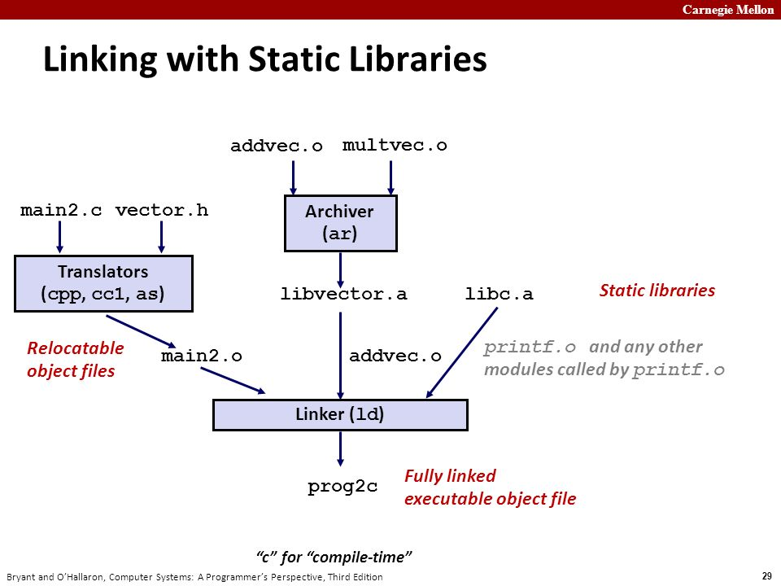
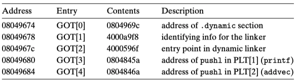

## 符号解析

每个可重定位目标模块m都有一个符号表，它包含m所定义和引用的符号的信息，在链接器上下文中，有3种不同的符号：

- 由m定义并能够被其他模块引用的全局符号；
- 由其他模块定义并能被当前模块m引用的全局符号；
- 只被模块定义和引用的本地符号（如c语言static修饰的全局函数或全局变量）；

链接器解析符号引用，指的是对于每个被引用的符号，链接器需要将这个符号与其具体的定义关联起来，如从所输入的可重定位目标文件列表中，逐一检查各重定位目标文件的符号表，找到与该符号对应的符号定义。

### 本地符号解析

对那些引用当前模块中定义的本地符号的情况，符号解析是非常简单明了的。编译器只允许每个模块中每个本地符号只有一个定义。编译器还能确保静态局部变量，它们也会有本地链接符号，拥有唯一的名字。

### 全局符号解析

但是，对于解析全局符号就棘手多了。当编译器遇到一个不是在当前模块中定义的符号的时候（可能是变量名或者函数名），它会假设该符号是在其他某个模块中定义的，编译器将为这样的每个符号都生成一个链接器符号表条目，并把它交给链接器进行处理。

链接器连接的时候会读取这个待重定位符号表，然后从所有的输入模块中查找对应的符号定义，如果某个引用符号没有找到其定义，链接器就会输出一个错误。

如果链接器找到了一个引用符号的多次重复定义（多重定义），是直接抛出错误？还是有办法知道该选择哪一个呢？这就涉及到符号的强弱规则问题。

在编译时，编译器向汇编器输出每个全局符号，或者是强（strong）或者是弱（weak），而汇编器把这个信息隐含地编码在可重定位目标文件的符号表的符号里，准确地说是记录在字段Elf_symbol.bind中。

- 强符号：(bind & global != 0) && (bind & weak == 0)
- 弱符号：bind & weak == 1

根据强弱符号的定义，Unix链接器使用下面的规则来处理多重定义的符号：

- 规则1：不允许有多个强符号
- 规则2：如果有一个强符号和多个弱符号，那么选择强符号；
- 规则3：如果有多个弱符号，那么从这些弱符号中任意选择一个；

严格遵循这些规则，就可以正确完成全局符号的解析任务。


### 与静态库链接

迄今为止，我们都是假设链接器读取一组可重定位的目标文件，并把他们链接起来，成为一个可执行文件。实际上，所有的编译系统都提供一种机制，允许将所有相关的目标模块打包成为一个单独的文件，称为**静态库**（static library），它也可以作为链接器的输入。

静态库，一种称为存档（archive）的特殊文件格式存储在磁盘中。存档文件是一组连接起来的可重定位目标文件的集合，其中每一个模块文件都有一个头部来描述其大小和位置。存档文件名由后缀.a标识。我们可以通过`ar`命令来创建静态库。如果您是用go工具对目标模块创建静态库，可通过`go tool pack`来创建。

当链接器链接输出一个可执行文件时，它只拷贝静态库里被应用程序引用的目标模块。静态库提高了常用代码的复用性，一定程度上节省了每个应用程序因为拷贝待复用模块*.o文件所带来的磁盘存储空间的浪费。

下面是一个静态链接过程的示意图：



大致含义是main2.c里面调用了vector.h中的函数，这个函数的实现在静态库文件libvector.a中，addvec实现在addvec.o中，multvec实现在multvec.o中，同时main2.c中还使用了libc的io函数，实现包含在libc.a中。现在通过静态链接（gcc -static -o prog2c main2.o ./libvector.a）构造一个完整链接的可执行程序，程序加载和运行时无需执行动态链接。

链接器会检测到addvec是在addvec.o中实现的，所以从libvector.a中只提取addvec.o来进行最后的链接，而不是也将multvec.o也链接过来，这种方式也可以节省存储空间占用。

**链接器如何使用静态库来解析引用呢？**其实这个过程很简单。

在符号解析阶段，链接器从左到右扫描在编译命令上输入的可重定位目标文件和静态库存档文件（命令上列出的.c文件会被转换为对应的.o文件），在这次扫描中，链接器维持一个可重定位目标文件的集合E（这个集合中的文件会被合并起来形成可执行文件），一个未解析的符号（引用了但是尚未定义的符号）集合U，以及一个在前面输入文件中已经定义的符号集合D。初始时，E、U、D都是空集。

- 对于命令上的每个输入文件f，链接器会判断f是一个目标文件，还是一个存档文件，如果f是一个目标文件，那么链接器会把f添加到E，修改U、D来反映f中的符号定义和引用，并继续处理下一个文件；
- 如果f是一个静态库存档文件，那么链接器就尝试匹配U中未解析的符号，看看能否在存档文件中找到对应的定义的符号。如果某个存档文件成员m，定义了一个符号来解析U中的一个符号引用，那么就将m加到E中，并且链接器修改U和D来反映m中的符号定义和引用。对存档文件中所有的成员目标文件都反复执行这个过程，直到U和D不再发生变化。在此时，任何不包含在E中的成员目标文件都简单地被丢弃，而链接器将继续处理下一个输入文件；
- 如果当链接器完成对命令上输入文件的扫描后，U是非空的，表明存在未解析成功的符号，链接器就会输出一个错误并终止。否则，它会合并并重定位E中的目标文件，从而构出完整的可执行程序文件。

这种处理方式需注意命令行上的库、目标文件的顺序，否则可能会导致符号解析失败。

关于符号重定位的问题，篇幅原因我们将在下一节中进行进一步的介绍。

### 与动态库链接

前面提了静态库的一些优点，其实它也有明显的缺点，就是各个应用程序复用静态库的时候，会把自己需要的目标文件从静态库中提取出来然后和其他目标文件链接成可执行程序，相当于每个应用程序都或多或少拷贝了一部分代码，代码体积大对磁盘空间、内存空间都会造成浪费。

比如对于系统提供的io相关的库，其实没必要每个应用程序都去copy到自身，只要能实现这部分代码的引用即可。动态库就是用来解决静态库的这些不足的。

共享库（shared library），在某些系统上也称为动态链接库（DLL），在Linux下是以*.so为扩展名。共享库通过两种方式达成共享的目标：

- 首先，在文件系统中，对于一个库，只有一个.so文件，所有引用该库的可执行程序都共享这个.so文件中的代码和数据，而不是像静态库的内容那样还要被拷贝和嵌入到引用它们的可执行程序文件中；
- 其次，在内存中，一个共享库的.text section的同一个副本可以被不同的正在运行的进程共享，联想下mmap时可以指定内存区为共享还是排他性访问；

使用命令`ar`可以创建静态库，创建共享库可以使用命令gcc -shared -fPIC`来完成。

下面是一个动态链接过程的示意图：


大致含义是，main2.c中使用了vector.h中的函数，对应实现在libvector.so这个共享库中，现在是通过动态链接技术进行链接的，然后生成一个可执行程序。

这里的思路是，当创建可执行程序时，静态执行一些链接，然后在程序加载时，再进一步动态完成链接。

- 静态执行一些链接，指的是这个阶段如果有需要多个目标文件可以执行静态链接的，则执行静态链接。这个时候并没有拷贝任何共享库的代码或数据到可执行文件中，而只是拷贝了一些重定位和符号表信息，这些信息使得运行时可以解析对libvector.so中代码和数据的引用。

- 当加载器（kernel）加载和运行可执行文件时，加载部分链接的可执行文件之后，接着注意到它包含一个.interp section，这个section包含了动态链接器的路径名，动态链接器本身就是一个共享库（如在Linux上为ld-linux.so）。加载器不再像一样那样将控制直接传递给应用程序了，而是加载和运行这个动态链接器ld-linux.so。

  动态链接器会执行下面的重定位操作来完成链接任务：

  - 重定位libc.so的文本和数据到某个内存段；
  - 重定位libvector.so的文本和数据到另一个内存段；
  - 重定位可执行程序中对由libc.so和libvector.so定义的符号的引用；

  最后，动态链接器将控制传递给应用程序，从这个时候开始，共享库的位置就固定了，并且在进程执行过程中都不会改变。

关于符号重定位的问题，篇幅原因我们将在下一节中进行进一步的介绍。

动态链接除了加载时链接，还有运行时链接的情况，即通过dlopen来加载一个共享库，通过dlsym来解析一个符号，通过dlclose卸载一个共享库。

#### 位置无关代码

动态链接中，与位置无关的代码（PIC，Position Independent Code）就显得非常重要。

那为什么位置无关代码这么重要呢？

共享库的一个主要目的就是允许多个正在运行的进程共享内存中相同的库代码，因而节约宝贵的内存资源。那么多个进程是如何共享程序的一个拷贝的呢？一种方法是给每个共享库分配一个事先准备好的专用的地址空间片（chunk），然后要求加载器总是在这个地址处加载共享库。虽然这种方法很简单，但是它也造成了一些严重的问题。

- 首先，它对地址空间的使用效率不高，因为即使一个进程不使用这个库，那部分空间还是会被分配出来；
- 其次，它也难以管理，我们将不得不保证没有chunk重叠，每当一个库修改了之后，我们必须确认它的已分配的chunk还适合它的大小，如果不适合了就要重新分配一个新的chunk。并且如果我们创建了一个新的库，还需要为他分配一个新的chunk。

随着时间发展，假设一个系统中有了成百个库、各种库版本，就很难避免地址空间分列成大量小的、未使用而又不能再使用的空洞。甚至更糟糕的是，对每个系统而言，库在内存中的分配都是不同的，这就引起了更令人头痛的管理问题。

一种更好的方法是编译库代码，使得不需要链接器修改库代码就可以在任何地址加载和执行这些代码。这样的代码就叫做与位置无关的代码（PIC，Position Independent Code）。用户可以使用`gcc -fPIC`生成位置无关代码。

在一个IA32系统中，对同一个目标模块中过程的调用是不需要特殊处理的，因为引用是PC相对的，已知偏移量就已经是PIC了。然而对外部定义的过程调用和对全局变量的引用通常不是PIC，因为它们都要求在链接时重定位。

#### PIC数据引用

编译器通过运用以下事实来生成对全局变量的PIC引用：无论我们在内存中的何处加载一个目标模块（包括共享目标模块），数据段总是分配成紧随在代码段后面。因此代码段中任何指令和数据段中任何变量之间的距离都是一个运行时常量，与代码段和数据段的物理地址是无关的。

为了运用这个事实，编译器在数据段开始的地方的创建了一个表，叫做**全局偏移表（GOT，Global Offset Table）**。在GOT中，每个被这个目标模块引用的全局数据对象都有一个条目。编译器还为GOT中每个条目生成一个重定位记录。在加载时，动态链接器会重定位GOT中的每个条目，使得它包含正确的绝对地址。每个引用全局数据的目标模块都有自己的GOT。

> 下一小节会介绍，链接器如何基于重定位记录完成重定位操作。

在运行时，使用下面形式的代码，通过GOT间接地引用每个全局变量：

```asm
		call L1
L1:		popl %ebx			; ebx contains the current PC
		addl $VAROFF, %ebx	; ebx points to the GOT entry for var
		movl (%ebx), %eax	; reference indirect through the GOT
		movl (%eax), %eax
```

这里的代码比较有趣，首先call L1将把返回地址（L1地址）入栈，接下来popl %ebx刚好把入栈的返回地址给pop出来到%ebx中，其中$VAROFF是一个常数偏移量，给%ebx增加这个常数偏移量使其指向GOT表中适当的条目，该条目包含数据项的绝对地址。然后通过两条movl指令（间接地通过GOT）加载全局变量的内容到寄存器%eax中。

- GOT表项中怎么会包含数据项的绝对地址的呢？动态链接器对GOT表项逐个重定位的时候，会根据指令与数据之前的固定偏移量关系，加上代码段起始物理地址，来算出每个GOT表项的绝对地址；
- $VAROFF是怎么得到的呢？前面提过了，指令、数据之间的距离是个固定偏移量，这个在静态链接重定位时就已经算出来了，现在只是在指令物理地址上加这个固定偏移量来得到数据的绝对地址而已；

可以很明显地发现，访问一个全局变量现在是用了5条指令，而非一条指令，PIC代码有性能缺陷。此外，还需要一个额外的对GOT的内存引用，而且PIC还需要用一个额外的寄存器来保持GOT条目的地址，在具有大寄存器文件的机器上，这不是一个大问题，然而在寄存器供应不足的IA32系统中，就可能有问题。

#### PIC函数调用

PIC代码当然也可以用相同的方法来解析外部过程调用：

```asm
		call L1
L1: 	popl %ebx			; ebx contains the current pc
		addl $PROCOFF, %ebx	; ebx points to GOT entry for proc
		call *(%ebx)		; call indirect through the GOT
```

不过，这种方法对每一个运行时过程调用都要求用3条额外指令来完成，性能肯定好不了。

反之，ELF编译系统使用了一种有趣的技术，叫做**延迟绑定（lazy binding）**，将过程地址的绑定推迟到第一次调用该过程时，第一次调用过程的运行时开销很大，但是其后的没此次调用都只会花费一条指令和一个间接的内存引用的开销。

延迟绑定是通过两个数据结构之间简洁但是又有些复杂的交互来实现的，这两个数据结构是GOT和过程链接表（PLT，Procedure Linkage Table）。如果一个目标模块调用定义在共享库中的任何函数，那么它就会有自己的GOT和PLT，GOT是.data section的一部分，PLT是.text section中的一部分。

下图是示例程序main2.o的GOT的格式，头三条GOT条目比较特殊：GOT[0]包含.dynamic段的地址，这个段包含了动态链接器用来绑定过程地址的信息，比如符号表的位置和重定位信息。GOT[1]包含定义这个模块的一些信息。GOT[2]包含动态链接器的延迟绑定代码的入口点。



定义在共享目标中并被main2.o调用的每个过程在GOT中都会有一个GOT条目，从GOT[3]条目开始的都是。对于示例程序，我们给出了printf和addvec的GOT条目，printf定义在libc.so中，而addvec定义在libvector.so中。

下图展示了实例程序的PLT。PLT是一个数组，其中每个PLT条目是16字节，第一个条目PLT[0]是一个特殊条目，它跳转到动态链接器中。每个被调用的过程在PLT中都有一个PLT条目，从PLT[1]开始都是。在图中，PLT[1]对应于printf，PLT[2]对应于addvec。

开始时，在程序被动态链接并开始执行后，过程printf和addvec被分别绑定到它们对应的PLT条目的第一条指令上。现在指令中假如存在addvec的调用，有如下形式：

```asm
80485bb:	e8 a4 fe ff ff		call 8048464 <addvec>
```

当addvec第一次调用时，控制传递到PLT[2]的第1条指令处（地址为8048464），该指令通过GOT[4]执行一个间接跳转。开始时，每个GOT条目包含相应的PLT条目中的pushl这条指令的地址，所以开始时GOT[4]条目中的内容为0x804846a，现在执行`jmp *GOT[4]`之后，相当于饶了一圈回到了PLT[2]的第2条指令处，这条指令将addvec符号的ID入栈，第3条指令则跳转到PLT[0]。

好戏开始了，PLT[0]中的代码将GOT[1]中的标识信息的字入栈，然后通过GOT[2]间接跳转到动态链接器（ld-linux.so）中，动态链接器用两个栈顶参数来确定addvec的位置，然后用这个算出的新地址覆盖掉GOT[4]，并跳过去执行把控制传递给了addvec。


下一次在程序中调用addvec时，控制像前面一样传递给PLT[2]，不过这次通过GOT[4]的间接跳转可以直接将控制传递给addvec了，从此刻起，唯一额外的开销就算是对间接跳转存储器的引用了，再也不会兜一大圈，函数调用效率上有了明显提升。

### 参考内容	

1. Go: Package objabi, https://golang.org/pkg/cmd/internal/objabi/

2. Go: Object File & Relocations, Vincent Blanchon, https://medium.com/a-journey-with-go/go-object-file-relocations-804438ec379b

3. Golang Internals, Part 3: The Linker, Object Files, and Relocations, https://www.altoros.com/blog/golang-internals-part-3-the-linker-object-files-and-relocations/

4. Computer System: A Programmer's Perspective, Randal E.Bryant, David R. O'Hallaron, p450-p479

   深入理解计算机系统, 龚奕利 雷迎春 译, p450-p479

5. Linker and Libraries Guide, Object File Format, File Format, Symbol Table, https://docs.oracle.com/cd/E19683-01/816-1386/chapter6-79797/index.html

6. Linking, https://slideplayer.com/slide/9505663/