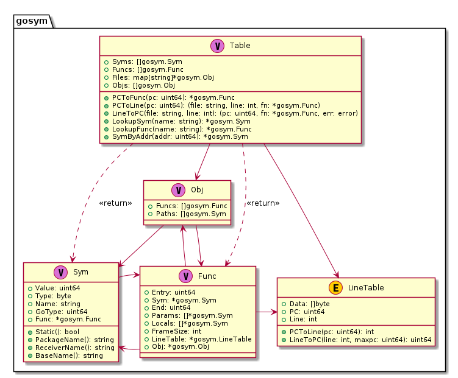

## pkg debug/gosym 应用

### 数据类型及关系

标准库提供了package `debug/gosym` 来读取go工具链为go语言生成的一些特有的section数据，如.gosymtab、.gopclntab。其为go语言运行时提供了一种高效快速的计算调用栈的方法，这在go语言出现panic希望打印堆栈信息的时候非常有帮助。

package debug/gosym中的相关重要数据结构，如下图所示：



关于go定制的.gosymtab、.gopclntab相关的符号信息设计，可以参考 [Go 1.2 Runtime Symbol Information](Go 1.2 Runtime Symbol Information, Russ Cox, https://docs.google.com/document/d/1lyPIbmsYbXnpNj57a261hgOYVpNRcgydurVQIyZOz_o/pub)，整体来看，比较重要的就是Table这个数据结构，注意到它有几个非常实用的导出方法，我们可以用来在指令地址与源文件位置之前进行快速的转换，借此可以实现一个调用栈追踪的能力。.gosymtab、.gopclntab的主要目的也是在此。

### go定制的sections

ELF文件中符号表信息一般会存储在`.symtab` section中，go程序有点特殊在go1.2及之前的版本有一个特殊的.gosymtab，其中存储了接近plan9风格的符号表结构信息，但是在go1.3之后，.gosymtab不再包含任何符号信息。

还注意到，ELF文件中行号表信息，如果是DWARF调试信息格式的话，一般会存储在debug_line或者.zdebug_line中，go程序又有点特殊，它还存在一个名为`.gopclntab`的section，其中保存了go程序的行号表信息。

那么，go为什么不使用.debug/.zdebug前缀的sections呢？为什么要独立添加一个.gosymtab、.gopclntab呢？这几个section有什么区别呢？

我们很确定的是.debug/.zdebug前缀开头的sections中包含的是调试信息，是给调试器等使用的，.gosymtab、.gopclntab则是给go运行时使用的。go程序执行时，其运行时部分会加载.gosymtab、.gopclntab的数据到进程内存中，用来执行栈跟踪（stack tracebacks），比如runtime.Callers，.symtab、.debug/.zdebug sections并没有被加载到内存中，它是由外部调试器来读取并加载的，如gdb、delve。

可能会有疑问，为什么go程序不直接利用.symtab、.debug/.zdebug sections呢，这几个sections中的数据结合起来也足以实现栈跟踪？

目前我了解到的是，DWARF数据的解析、使用应该会更复杂一点，go早期核心开发者很多有Plan9的工作经验，在研发Plan9时就已经有了类似pclntab的尝试，从Plan9的man手册中可以查看到相关的信息。

**Plan9's man a.out**

```bash
NAME
    a.out - object file format

 SYNOPSIS
    #include <a.out.h>

DESCRIPTION
    An executable Plan 9 binary file has up to six sections: a
    header, the program text, the data, a symbol table, a PC/SP
    offset table (MC68020 only), and finally a PC/line number
    table.  The header, given by a structure in <a.out.h>, con-
    tains 4-byte integers in big-endian order:

   ....

   A similar table, occupying pcsz-bytes, is the next section
   in an executable; it is present for all architectures.  The
   same algorithm may be run using this table to recover the
   absolute source line number from a given program location.
   The absolute line number (starting from zero) counts the
   newlines in the C-preprocessed source seen by the compiler.
   Three symbol types in the main symbol table facilitate con-
   version of the absolute number to source file and line num-
   ber:
```

go程序的很多核心开发者本身就是Plan9的开发者，go中借鉴Plan9的经验也就不足为奇了，早期pclntab的存储结构与plan9下程序的pclntab很接近，但是现在已经差别很大了，可以参考go1.2 pclntab的设计proposal：[Go 1.2 Runtime Symbol Information](https://docs.google.com/document/d/1lyPIbmsYbXnpNj57a261hgOYVpNRcgydurVQIyZOz_o/pub)。

> TODO ps: 另外提一下，cgo程序中，似乎是没有.gosymtab、.gopclntab的。

通过package `debug/gosym`可以构建出pcln table，通过其方法PcToLine、LineToPc等，可以帮助我们快速查询指令地址与源文件中位置的关系，也可以通过它来进一步分析调用栈，如程序panic时我们希望打印调用栈来定位出错的位置。

我理解，对调用栈信息的支持才是.gosymtab、.gopclntab所主要解决的问题，go1.3之后调用栈数据应该是完全由.gopclntab支持了，所以.gosymtab也就为空了。所以它和调试器需要的.debug/.zdebug_frame有着本质区别，后者不但可以追踪调用栈信息，也可以追踪每一个栈帧中的寄存器数据的变化，其数据编码、解析、运算逻辑也更加复杂。

那.gosymtab、.gopclntab能否用于调试器呢？也不能说完全没用，只是这里面的数据相对DWARF调试信息来说，缺失了一些调试需要的信息，我们还是需要用到DWARF才能完整解决调试场景中的问题。

现在我们应该清楚package debug/gosym以及对应.gosymtab、.gopclntab sections的用途了，也应该清楚与.symtab以及调试相关的.debug/.zdebug_这些sections的区别了。 

### 常用操作及示例

这是我们的一个测试程序 testdata/loop2.go，我们先展示下其源文件信息，接下来执行`go build -gcflags="all=-N -l" -o loop2 loop2.go`将其编译成可执行程序loop2，后面我们读取loop2并继续做实验。

**testdata/loop2.go：**

```go
     1  package main
     2  
     3  import (
     4      "fmt"
     5      "os"
     6      "time"
     7  )
     8  
     9  func init() {
    10      go func() {
    11          for {
    12              fmt.Println("main.func1 pid:", os.Getpid())
    13              time.Sleep(time.Second)
    14          }
    15      }()
    16  }
    17  func main() {
    18      for {
    19          fmt.Println("main.main pid:", os.Getpid())
    20          time.Sleep(time.Second * 3)
    21      }
    22  }
```


### 参考内容

1. How to Fool Analysis Tools, https://tuanlinh.gitbook.io/ctf/golang-function-name-obfuscation-how-to-fool-analysis-tools

2. Go 1.2 Runtime Symbol Information, Russ Cox, https://docs.google.com/document/d/1lyPIbmsYbXnpNj57a261hgOYVpNRcgydurVQIyZOz_o/pub

3. Some notes on the structure of Go Binaries, https://utcc.utoronto.ca/~cks/space/blog/programming/GoBinaryStructureNotes

4. Buiding a better Go Linker, Austin Clements, https://docs.google.com/document/d/1D13QhciikbdLtaI67U6Ble5d_1nsI4befEd6_k1z91U/view


5.  Time for Some Function Recovery, https://www.mdeditor.tw/pl/2DRS/zh-hk