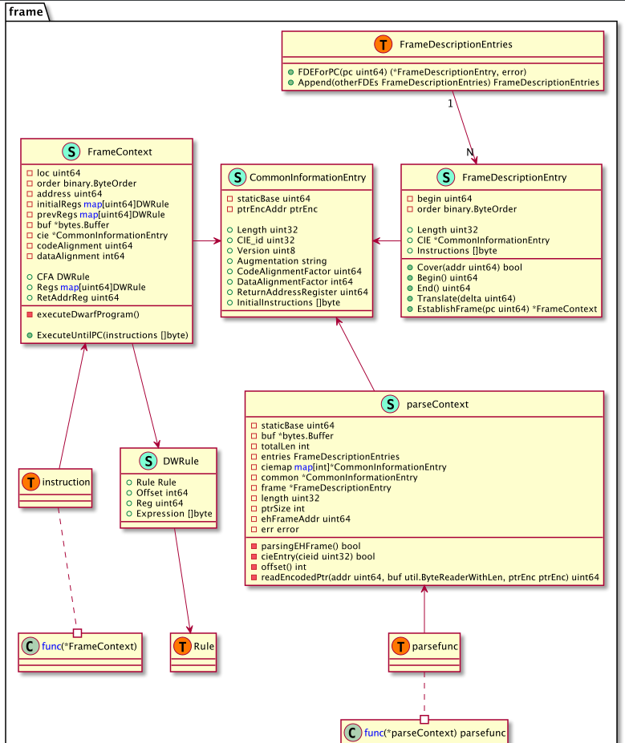
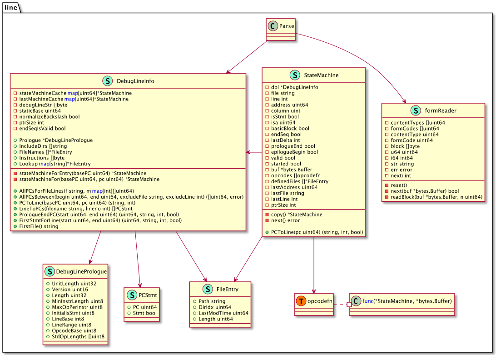
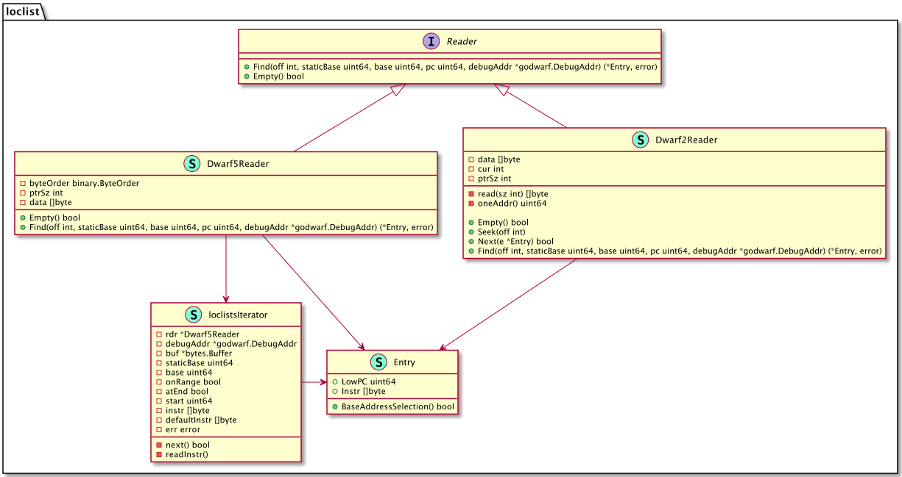
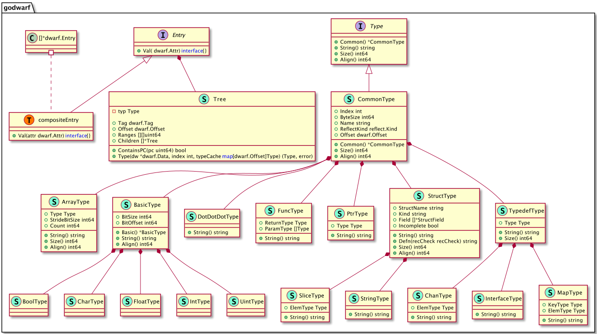
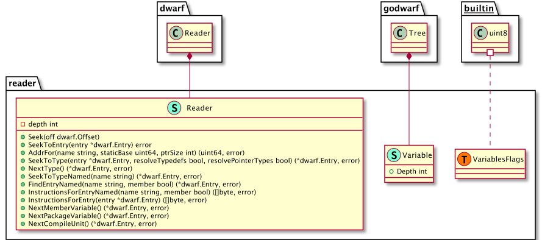

## 后端符号层设计


本节我们来介绍下调试器后端的符号层设计，这里的符号层指的就是利用DWARF调试信息建立起指令地址和源码层面的视图转换，比如指令地址对应的源码位置、调用栈，或者数据地址对应的数据类型。在第8章中我们介绍了DWARF调试信息标准，也提供了一些通过DWARF获取变量、类型、行号表等信息的示例，大家应该对DWARF是什么、怎么用有了一定的认识了。

由于调试信息标准以及编译工具链生成调试信息的复杂性，即便是诞生这么多年的DWARF标准、go、delve，也还是在不断演进优化中。从go1.25开始将默认生成DWARFv5的调试信息，而DWARFv6出版草案也已经完成了。这是一个不会停止、不断演进中的过程。不过作者写这本书时，中间经历了很多变故，从go1.13到go1.24，go工具链DWARF信息生成及解析都发生了一些变化 …… 我们就不追着最新版go1.25去介绍了，我们还是按照go1.24及DWARFv4进行介绍。

> The compiler and linker in Go 1.25 now generate debug information using DWARF version 5; the newer DWARF version reduces the space required for debugging information in Go binaries.

### DWARFv4 sections

DWARFv4，ELF文件中对应的debug sections及其存储内容如下:

| Section         | Description                                                           |
| --------------- | --------------------------------------------------------------------- |
| .debug_abbrev   | 存储.debug_info中使用的缩写信息                                       |
| .debug_arranges | 存储一个加速访问的查询表，通过内存地址查询对应编译单元信息            |
| .debug_frame    | 存储调用栈帧信息                                                      |
| .debug_info     | 存储核心DWARF数据，包含了描述变量、代码等的DIEs                       |
| .debug_line     | 存储行号表程序 (程序指令由行号表状态机执行，执行后构建出完整的行号表) |
| .debug_loc      | 存储location描述信息                                                  |
| .debug_macinfo  | 存储宏相关描述信息                                                    |
| .debug_pubnames | 存储一个加速访问的查询表，通过名称查询全局对象和函数                  |
| .debug_pubtypes | 存储一个加速访问的查询表，通过名称查询全局类型                        |
| .debug_ranges   | 存储DIEs中引用的address ranges                                        |
| .debug_str      | 存储.debug_info中引用的字符串表，也是通过偏移量来引用                 |
| .debug_types    | 存储描述数据类型相关的DIEs                                            |

这些debug sections之间的引用关系入下图所示（详情see：DWARFv4 Appendix B）。


为了更好地了解这部分，您可以利用aarzilli写的小工具 [aarzilli/diexplorer](https://github.com/aarzilli/diexplorer) or 我写的 [hitzhangjie/dwarfviewer](https://github.com/hitzhangjie/dwarfviewer)，来浏览 debug sections 中的调试信息，非常有助于加深理解。

### DWARFv4读写查询

为了更好地实现对DWARFv4 数据的读写，方便对不同形式DWARF数据的查询转换，设计了如下packages。

| package      | 作用及用途                                                                                                                                                                                                                                                                                                                                                                                                                                                                                                                                                                                                                                                                                                                                                                                                                                                                                                                                                                                                                                                                                                                                                                                                                                                                                                                                                                                                                                                         |
| ------------ | ------------------------------------------------------------------------------------------------------------------------------------------------------------------------------------------------------------------------------------------------------------------------------------------------------------------------------------------------------------------------------------------------------------------------------------------------------------------------------------------------------------------------------------------------------------------------------------------------------------------------------------------------------------------------------------------------------------------------------------------------------------------------------------------------------------------------------------------------------------------------------------------------------------------------------------------------------------------------------------------------------------------------------------------------------------------------------------------------------------------------------------------------------------------------------------------------------------------------------------------------------------------------------------------------------------------------------------------------------------------------------------------------------------------------------------------------------------------ |
| dwarfbuilder | 实现了一个Builder，通过该Builder可以方便地生成不同代码结构对应的DWARF调试信息，如New()返回一个Builder并初始设置DWARF信息的header字段，然后通过返回的builder增加编译单元、数据类型、变量、函数等等。`<br>`可以说，这个Builder为快速为源码生成对应的调试信息提供了很大遍历。但是这个package对于实现调试器而言应该是没多大用处的，但是对于验证go编译工具链如何生成调试信息很有帮助。一旦能认识到go编译工具链是如何生成DWARF调试信息的，我们就可以进一步了解到该如何去解析、应用对应的调试信息。`<br>`这个package的作用更多地是用于学习、验证DWARF调试信息生成和应用的。                                                                                                                                                                                                                                                                                                                                                                                                                                                                                                                                                                                                                                                                                                                                                                                                                                                                                           |
| frame        | .[z]debug_frame中的信息可以帮助构建CFI (Canonical Frame Information)，指定任意指令地址，我们便可以借助CFI计算出当前的调用栈。`<br>`DWARF信息中的编译单元可能压缩了多个go源文件，每个编译单元都以CIE (Common Information Entry) 开始，然后接下来是一系列的FDE (Frame Description Entry)。`<br>`这里定义了类型CommonInformationEntry、FrameDescriptionEntry用来分别表示CIE、FDE。FDE里面引用CIE，CIE中包含了初始指令序列，FDE中包含了自己的指令序列，结合CIE、FDE可以构建出完整的CFI表。`<br>`为了方便判断某个指令地址是否在某个FDE范围内，类型FrameDescriptionEntry中定义了方法Cover，还提供了Begin、End来给出该FDE的范围，此外它还定义了方法EstablishFrame通过状态机执行CIE、FDE中的指令序列来按需构建CFI表的全部或者一部分，方便我们计算CFA (Canonical Frame Address) ，有了它可以进一步计算出被调函数的返回地址。`<br>`有了这个返回地址，它实际是个指令地址，我们就可以计算出对应的源码位置（如文件名、行号、函数名）。将这个返回地址继续作为指令地址去迭代处理，我们就可以计算出完整的调用栈。`<br><br>`**注意：FDE中的begin、end描述的是创建、销毁栈帧及其存在期间的指令序列instructions的地址范围，详见DWARF v4 standard。**`<br>`此外还定义了类型FrameDescriptionEntries，它实际上是一个FDE的slice，只是增加了一些帮助函数，比如FDEForPC用于通过指令地址查询包含它的FDE。`<br>`每个函数都有一个FDE，每个函数的每条指令都是按照定义时的顺序来安排虚拟的内存地址的，不存在一个函数的FDE的指令范围会包括另一个函数的FDE的指令范围的情况）。 |
| godwarf      | 这个包提供了一些基础的功能，addr.go中提供了DWARF v5中新增的.[z]debug_addr的解析能力。`<br>`sections.go中提供了读取不同文件格式中调试信息的功能，如GetDebugSectionElf能从指定elf文件中读取指定调试section的数据，并且根据section数据是否压缩自动解压缩处理。`<br>`tree.go提供了读取DIE构成的Tree的能力，一个编译单元如果不连续的话在Tree.Ranges中就存在多个地址范围，当判断一个编译单元的地址范围是否包含指定指令地址时就需要遍历Tree.Ranges进行检查，Tree.ContainsPC方法简化了这个操作。Tree.Type方法还支持读取当前TreeNode对应的类型信息。`<br>`type.go中定义了对应go数据类型的一些类型，包括基本数据类型BasicType以及基于组合扩展的CharType、UcharType、IntType等，也包括一些组合类型如StructType、SliceType、StringType等，还有其他一些类型。这些类型都是以DIE的形式存储在.[z]debug_info中的。tree.go中提供了一个非常重要的函数ReadType，它能从DWARF数据中读取定义在指定偏移量处的类型信息，并在对应类型中通过reflect.Kind来建立与go数据类型的对应关系，以后就可以很方便地利用go的reflect包来创建变量并赋值。                                                                                                                                                                                                                                                                                                                                                                                                                                             |
| line         | 符号级调试很重要的一点是能够在指令地址与源文件名:行号之间进行转换，比如添加给语句添加断点的时候要转化成对指令地址的指令patch，或者停在某个断点处时应该显示出当前停在的源代码位置。行号表就是用来实现这个转换的，行号表被编码为一个字节码指令流，存储在.[z]debug_line中。`<br>`每个编译单元都有一个行号表，不同的编译单元的行号表数据最终会被linker合并在一起。每个行号表都有固定的结构以供解析，如header字段，然后后面跟着具体数据。`<br>`line_parser.go中提供了方法ParseAll来解析.[z]debug_line中的所有编译单元的行号表，对应类型DebugLines表示，每个编译单元对应的行号对应类型DebugLineInfo。DebugLineInfo中很重要的一个字段就是指令序列，这个指令序列也是交给一个行号表状态机去执行的，状态机实现定义在state_machine.go中，状态机执行后就能构建出完整的行号表。`<br>`有了完整的行号表，我们就可以根据pc去查表来找到对应的源码行。                                                                                                                                                                                                                                                                                                                                                                                                                                                                                                                                                                                                                         |
| loclist      | 描述对象在内存中的位置可以用位置表达式，也可以用位置列表。如果在对象生命周期中对象的位置可能发生变化，那么就需要一个位置列表来描述。再者，如果一个对象在内存中的存储不是一个连续的段，而是多个不相邻的段合并起来，那这种也需要用位置列表来描述。`<br>`在DWARF v2~v4中，位置列表信息存储在.[z]debug_loc中，在DWARF v5中，则存储在.[z]debug_loclist中。loclist包分别针对旧版本（DWARF v2~v4）、新版本（DWARF v5）中的位置列表予以了支持。`<br>`这个包中定义了Dwarf2Reader、Dwarf5Reader分别用来从旧版本、新版本的位置列表原始数据中读取位置列表。                                                                                                                                                                                                                                                                                                                                                                                                                                                                                                                                                                                                                                                                                                                                                                                                                                                                                                               |
| op           | 先看op.go，DWARF中前面讲述地址表达式的运算时，提到了地址运算是通过执行一个基于栈操作的程序指令列表来完成的。程序指令都是1字节码指令，这里的字节码在当前package中均有定义，其需要的操作数就在栈中，每个字节码指令都有一个对应的函数stackfn，该函数执行时会对栈中的数据进行操作，取操作数并将运算结果重新入栈。最终栈顶元素即结果。`<br>`opcodes.go中定义了一系列操作码、操作码到名字映射、操作码对应操作数数量。`<br>`registers.go定义了DWARF关心的寄存器列表的信息DwarfRegisters，还提供了一些遍历的方法，如返回指定编号对应的的寄存器信息DwarfRegister、返回当前PC/SP/BP寄存器的值。                                                                                                                                                                                                                                                                                                                                                                                                                                                                                                                                                                                                                                                                                                                                                                                                                                                                          |
| reader       | 该包定义了类型Reader，它内嵌了go标准库中的dwarf.Reader来从.[z]debug_info中读取DIE信息，每个DIE在DWARF中被组织成一棵树的形式，每个DIE对应一个dwarf.Entry，它包括了此前提及的Tag以及[]Field（Field中记录了Attr信息），此外还记录了DIE的Offset、是否包含孩子DIE。`<br>`这里的Reader，还定义了一些其他函数如Seek、SeekToEntry、AddrFor、SeekToType、NextType、SeekToTypeNamed、FindEntryNamed、InstructionsForEntryNamed、InstructionsForEntry、NextMemberVariable、NextPackageVariable、NextCompileUnit。`<br>`该包还定义了类型Variable，其中嵌入了描述一个变量的DIE构成的树godwarf.Tree。它还提供了函数Variables用来从指定DIE树中提取包含的变量列表。                                                                                                                                                                                                                                                                                                                                                                                                                                                                                                                                                                                                                                                                                                                                                                                                            |
| regnum       | 定义了寄存器编号与寄存器名称的映射关系，提供了函数快速双向查询。                                                                                                                                                                                                                                                                                                                                                                                                                                                                                                                                                                                                                                                                                                                                                                                                                                                                                                                                                                                                                                                                                                                                                                                                                                                                                                                                                                                                   |
| leb128       | 实现了几个工具函数：从一个sleb128编码的reader中读取一个int64；从一个uleb128编码的reader中读取一个uint64；对一个int64按sleb128编码后写入writer；对一个uint64按uleb128编码后写入writer。                                                                                                                                                                                                                                                                                                                                                                                                                                                                                                                                                                                                                                                                                                                                                                                                                                                                                                                                                                                                                                                                                                                                                                                                                                                                             |
| dwarf        | 实现了几个工具函数：从DWARF数据中读取基本信息（长度、dwarf64、dwarf版本、字节序），读取包含的编译单元列表及对应的版本信息，从buffer中读取DWARF string，从buffer中按指定字节序读取Uint16、Uint32、Uint64，按指定字节序编码一个Uint32、Uint64并写入buffer。                                                                                                                                                                                                                                                                                                                                                                                                                                                                                                                                                                                                                                                                                                                                                                                                                                                                                                                                                                                                                                                                                                                                                                                                          |

手写一个完备的DWARF解析库，要精通DWARF调试信息标准，还要了解go编译工具链在从DWARF v4演变到DWARF v5的过程中所做的各种调整，工作量还是很大的。为了避免大家学习过程过于枯燥，我们不会再手写一个新的DWARF支持库，而是复用go-delve/delve中的实现。

OK，下面来看下这些上述packages内部是如何组织的。

#### dwarfbuilder

package dwarfbuilder主要是用来生成DWARF调试信息的，我们什么时候会需要生成DWARF调试信息呢？我们希望能让运行中的go程序生成core文件。我们通常会在go程序crash时得到一个core文件（启动时要加环境变量GOTRACEBACK=crash），其实也可以在程序运行期间动态地让其生成一个core文件。

core文件在Linux下也是ELF格式的，我们要写入一些可以用于调试的DWARF信息，dwarfbuilder就是用来生成这里的DWARF数据的（主要是.[z]debug_info中的数据）。


#### frame

.[z]debug_frame中的数据可以用来构建调用栈信息表，当在程序执行期间可以用来构建调用栈，并能允许我们在调用栈上往前往后选择栈帧，并查看处于这个栈帧中的变量信息。当然也可以通过bt打印当前的调用栈信息。

.[z]debug_frame中的信息主要由一系列CIE（每个编译单元一个）以及一系列的FDE（每个编译单元中有很多的FDE）构成。实际解析完这里的数据后就能得到一个FrameDescriptionEntries，并在其上面封装了几个常用方法，如FDEForPC，当我们指定了一个指令地址时，它能够返回对应的栈帧。

当我们指定了一个PC值，执行它的EstablishFrame将执行调用栈信息表中的指令，完成之后就可以构建出一个FrameContext，其中就记录了此时的CFA、Regs、RetAddrReg数据，有了这些数据就可以算出当前函数的返回地址，从而进一步计算出调用函数对应的栈帧……重复这个过程就能够计算出调用栈。



#### line

.[z]debug_line中记录着指令地址与源码文件的行号表信息，这张表中的数据将协助我们完成源码地址与指令地址之间的相互转换。

这个package的设计大致如下所示，`line.Parse(*DebugLineInfo, *bytes.Buffer)`，.[z]debug_info中的数据即为第二个参数，解析完后*DebugLineInfo中的数据将被填充好。

解析的过程中，需要用到formReader来从*bytes.Buffer中读取并解析数据，这张表在建立过程中需要用到这里的StateMachine来执行其中的字节码指令来完成表的重建。

最终，我们可以通过DebugLineInfo中的导出方法来实现一些常用操作，如PCToLine将PC地址转换为源文件地址，LineToPC将源文件地址转换为指令地址PC等。



#### loclist

.[z]debug_loc、.[z]debug_loclist中存储了一些地址相关的信息，前者是DWARF standard v2中定义的，后者是DWARF standard v5中定义的，后者比前者更节省存储空间、效率也更高。



这部分数据描述了对象的地址，当要描述一个对象的地址时，如果在其整个生命周期内它的地址可能会改变的话，就需要通过loclists来描述。什么情况下会出现这种情况呢？

这里的位置改变并不是说对象会迁移（类似GC那样），它的意思是说随着程序一条条指令执行，PC值是一直在变化的，此时为了更快速的计算出对象地址，可能会在loclists中生成新的一条loc entry，这样通过查找对应的entry就可以快速计算出其地址。

比如有段这样的程序：

```c
void delay(int num)
{
   volatile int i;
   for(i=0; i<num; i++);
}
```

执行编译 `gcc -g -O1 -o delay.o delay.c`会生成一个delay.o文件，反汇编：

```asm
00000000 <delay>:
   0:   e24dd008    sub sp, sp, #8
   4:   e3a03000    mov r3, #0
   8:   e58d3004    str r3, [sp, #4]
   c:   e59d3004    ldr r3, [sp, #4]
  10:   e1500003    cmp r0, r3
  14:   da000005    ble 30 <delay+0x30>
  18:   e59d3004    ldr r3, [sp, #4]
  1c:   e2833001    add r3, r3, #1
  20:   e58d3004    str r3, [sp, #4]
  24:   e59d3004    ldr r3, [sp, #4]
  28:   e1530000    cmp r3, r0
  2c:   bafffff9    blt 18 <delay+0x18>
  30:   e28dd008    add sp, sp, #8
  34:   e12fff1e    bx  lr
```

我们可以看到指令地址范围，现在我们继续看下对应的DWARF数据：

```bash
<1><25>: Abbrev Number: 2 (DW_TAG_subprogram)
   <26>   DW_AT_external    : 1
   <27>   DW_AT_name        : (indirect string, offset: 0x19): delay
   <2b>   DW_AT_decl_file   : 1
   <2c>   DW_AT_decl_line   : 1
   <2d>   DW_AT_prototyped  : 1
   <2e>   DW_AT_low_pc      : 0x0
   <32>   DW_AT_high_pc     : 0x38
   <36>   DW_AT_frame_base  : 0x0      (location list)
   <3a>   DW_AT_sibling     : <0x59>
...
<2><4b>: Abbrev Number: 4 (DW_TAG_variable)
   <4c>   DW_AT_name        : i
   <4e>   DW_AT_decl_file   : 1
   <4f>   DW_AT_decl_line   : 3
   <50>   DW_AT_type        : <0x60>
   <54>   DW_AT_location    : 0x20     (location list)
```

我们看到了变量i的定义，从其属性DW_AT_location中看到其位置在location list中描述，因此也继续输出下其.debug_loc：

```bash
Offset   Begin    End      Expression
00000000 00000000 00000004 (DW_OP_breg13 (r13): 0)
00000000 00000004 00000038 (DW_OP_breg13 (r13): 8)
00000000 <End of list>
00000020 0000000c 00000020 (DW_OP_fbreg: -12)
00000020 00000024 00000028 (DW_OP_reg3 (r3))
00000020 00000028 00000038 (DW_OP_fbreg: -12)
00000020 <End of list>
```

我们可以看到当指令地址从4到38时其位置的计算表达式为r13+8，当其地址为c到20时其地址为fbreg-12，当地址为24到28时其地址为r3，当地址为28到38时其地址为fbreg-12。可见这里的位置改变是说的随着指令地址PC值的改变，其位置计算的表达式发生了改变，而之所以发生改变，是因为随着指令执行过程中，某些寄存器被使用了不能再按照之前的表达式进行计算，所以才在.debug_loc或者.debug_loclists中生成了新的loclists entry。

> 该demo取自stackoverflow问答：https://stackoverflow.com/q/47359841。

#### godwarf

.[z]debug_info中通过DIE Tree来描述定义的类型、变量、函数、编译单元等信息，DIE通过Tag、Attr来描述具体的对象，这些DIE可以构成一个Tree。

package godwarf提供了导出函数来简化DIE Tree的加载、解析逻辑。



#### op

package op中最重要的一个导出函数，`op.ExecuteStackProgram(...)`执行一个DWARF位置表达式并返回计算出的地址值（int64类型表示），或者返回一个[]Piece，每个Piece描述了一个位置，这里的位置可能是在内存（地址为Piece.Val）、寄存器（编号在Piece.Val）、立即数（Piece.Val或Piece.Bytes）。

op.DwarfRegisters、op.DwarfRegister这两个类型比较重要，它定义了stack program所需要用到的寄存器。相关的函数、方法逻辑也比较简单。


#### reader

这里定义了DWARF读取解析.debug_info的一个更方便的reader，它建立在go标准库实现dwarf.Reader基础上。这个reader能够很方便地seek、读取变量、类型、函数、编译单元等程序要素。



#### regnum

定义了一些寄存器号和对应的寄存器名，

```go
// amd64架构下的寄存器列表
const (
	AMD64_Rax     = 0
	AMD64_Rdx     = 1
	AMD64_Rcx     = 2
	AMD64_Rbx     = 3
	AMD64_Rsi     = 4
	AMD64_Rdi     = 5
	...
)

// 寄存器号到寄存器名的映射关系
var amd64DwarfToName = map[uint64]string{
	AMD64_Rax:        "Rax",
	AMD64_Rdx:        "Rdx",
	AMD64_Rcx:        "Rcx",
	AMD64_Rbx:        "Rbx",
	...
}

var AMD64NameToDwarf = func() map[string]int {
	r := make(map[string]int)
	for regNum, regName := range amd64DwarfToName {
		r[strings.ToLower(regName)] = int(regNum)
	}
	r["eflags"] = 49
	r["st0"] = 33
	r["st1"] = 34
	r["st2"] = 35
	r["st3"] = 36
	r["st4"] = 37
	r["st5"] = 38
	r["st6"] = 39
	r["st7"] = 40
	return r
}()

// 返回最大寄存器编号
func AMD64MaxRegNum() uint64 { ... }

// 返回寄存器编号对应的寄存器名
func AMD64ToName(num uint64) string { ... }
```

#### leb128

定义了一些读写leb128常用的工具函数：

```go
// Reader is a io.ByteReader with a Len method. This interface is
// satisfied by both bytes.Buffer and bytes.Reader.
type Reader interface {
	io.ByteReader
	io.Reader
	Len() int
}

// DecodeUnsigned decodes an unsigned Little Endian Base 128
// represented number.
func DecodeUnsigned(buf Reader) (uint64, uint32) {...}

// DecodeSigned decodes a signed Little Endian Base 128
// represented number.
func DecodeSigned(buf Reader) (int64, uint32) { ... }

// EncodeUnsigned encodes x to the unsigned Little Endian Base 128 format.
func EncodeUnsigned(out io.ByteWriter, x uint64) { ... }

// EncodeSigned encodes x to the signed Little Endian Base 128 format.
func EncodeSigned(out io.ByteWriter, x int64) { ... }
```

#### dwarf

定义了一些读写string、uint等常用的工具函数：

```go
const (
	_DW_UT_compile = 0x1 + iota
	_DW_UT_type
	_DW_UT_partial
	_DW_UT_skeleton
	_DW_UT_split_compile
	_DW_UT_split_type
)

// ReadString reads a null-terminated string from data.
func ReadString(data *bytes.Buffer) (string, error) { ... }

// ReadUintRaw reads an integer of ptrSize bytes, with the specified byte order, from reader.
func ReadUintRaw(reader io.Reader, order binary.ByteOrder, ptrSize int) (uint64, error) { ... }

// WriteUint writes an integer of ptrSize bytes to writer, in the specified byte order.
func WriteUint(writer io.Writer, order binary.ByteOrder, ptrSize int, data uint64) error { ... }

// ReadDwarfLengthVersion reads a DWARF length field followed by a version field
func ReadDwarfLengthVersion(data []byte) (length uint64, dwarf64 bool, version uint8, byteOrder binary.ByteOrder) { ... }

// ReadUnitVersions reads the DWARF version of each unit in a debug_info section and returns them as a map.
func ReadUnitVersions(data []byte) map[dwarf.Offset]uint8 { ... }
```

### 本节小结

本节介绍了符号层调试信息这块的debug sections以及它们之间的联系，介绍了对这些DWARF数据进行读写用到的一些go packages的设计。这块我们就没有从0到1进行设计了，后续也不用从0到1去实现，我们阅读理解并复用go-delve/delve中沉淀了多年的实现就可以。
