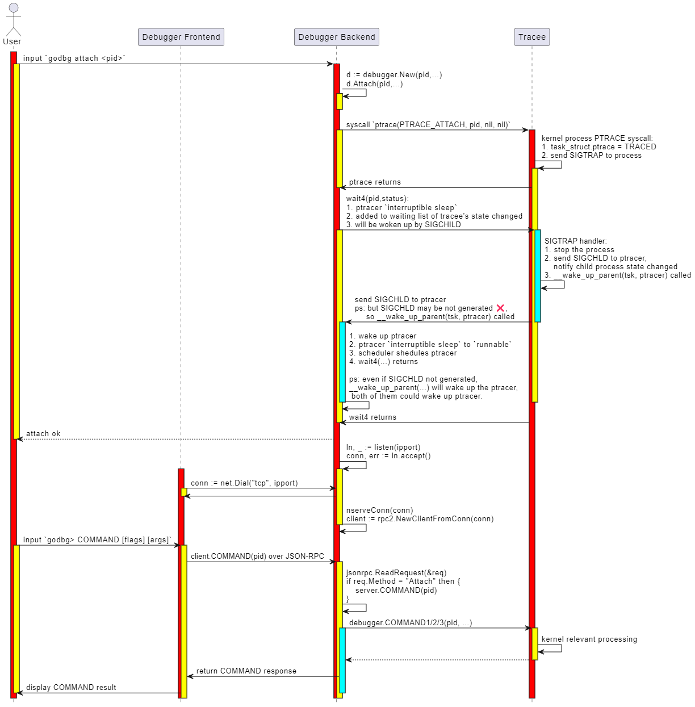

## Debug Session

### 实现目标

后面的attach、exec、debug、core、connect，这几个命令本质上都是启动一个debugger backend，然后让debugger frontend和debugger backend建立连接的操作。

在建立连接之后，debugger frontend就需要建立一个调试会话了，调试会话中我们可以键入调试命令 `godbg> COMMAND [flags] [args]` 进行调试。

在第6章介绍指令级调试器时，我们已经介绍过如何实现一个调试会话了。这里，其实大同小异，尤其是我们对 go-delve/delve 进行了大幅简化之后：

- 移除了分页输出操作，尽管它在输出大量数据时比较有用（比如print一个数据比较多的变量、bt打印一个比较深的调用栈、goroutines显示所有goroutines列表等）；
- 移除了starlark支持，尽管repl的方式交互式执行starlark命令、或者source执行starlark脚本很酷、能进一步增强调试器能力；
- 移除了语法高亮支持，尽管list展示源码时、bt打印堆栈时、whatis查看类型定义时可以让可读性更好；

OK，你们肯定知道我们移除的原因，我们想最大程度简化我们的demo tinydbg。其实对于上述每个特性，我们都在 “9.3 高级功能扩展中” 章节进行了介绍，但是不希望tinydbg中保留相关的代码，因为代码很复杂、读者容易淹没在代码洪流中。

这里简化后的调试会话，与第6章中的调试会话对比，有哪些区别呢？主要是实现了前后端分离式架构，然后前后端基于JSON-RPC进行通信，当我们在调试会话中执行一个调试命令时，调试会话会解析调试命令、选项、参数，然后会转换为对应的client方法调用，client本地方法桩代码会转化为对debugger backend的接口方法调用，debugger backend再执行对tracee的控制。我们主要是介绍这个部分的实现细节。

### 基础知识

下图展示了 `godbg attach <pid>` 启动一个一个调试器backend，以及在调试会话中执行命令 `godbg> COMMAND [flags] [args]` 过程中的详细交互过程、关键处理逻辑。



这个时序图介绍了调试期间的两个重要步骤：
- 第1部分启动一个调试器backend的操作，这部分将在介绍attach操作的实现时进行介绍，本节先不展开；
- 第2部分调试会话中执行调试命令的操作，这是本小节我们要介绍的重点内容；

简单讲调试会话就是一个交互式调试窗口，允许你输入调试命令，并展示调试结果，如此反复直到结束调试。默认情况下调试会话就是一个交互式的命令行窗口，从stdin读取调试命令，然后在stdout、stderr输出调试结果。除非你想以非交互式的方式进行调试，如 `tinydbg debug --allow-non-terminal-interactive` 显示声明非交互式方式并设置正确的IO重定向。

```bash
tinydbg help debug
Compiles your program with optimizations disabled, starts and attaches to it.

By default, with no arguments, Delve will compile the 'main' package in the
current directory, and begin to debug it. Alternatively you can specify a
package name and Delve will compile that package instead, and begin a new debug
session.

Usage:
  tinydbg debug [package] [flags]
...

Global Flags:
    --allow-non-terminal-interactive   Allows interactive sessions of Delve that don't have a terminal as stdin, stdout and stderr
-r, --redirect stringArray             Specifies redirect rules for target process (see 'dlv help redirect')
	...
```

OK，下面我们介绍下这块的调试会话初始化、输入调试命令进行调试的主流程。

### 代码实现

#### 调试器前端初始化调试会话

什么情况下会启动一个调试会话呢？
- 本地调试时总是会创建一个调试会话，不管是执行attach、debug、exec、core，此时调试器前端、后端位于同一个调试器进程中，它们通过net.Pipe进行通信；
- 远程调试时调试器前后端分离，后端单独一个进程且没有控制终端，调试器前端通过connect命令连接到调试器后端，前后端通过net.TCPConn或者net.UnixConn进行通信。调试器前端会初始化一个调试会话，用户通过这个调试会话进行交互。

如果咱们是本地调试，执行的是attach命令，那么建立调试会话的代码路径是：

```bash
main.go:main.main
    \--> cmds.New(false).Execute()
            \--> attachCommand.Run()
                    \--> attachCmd(...)
                            \--> execute(pid, args, conf, "", debugger.ExecutingOther, args, buildFlags)
```

在execute函数中，会根据是本地调试还是远程调试，来用不同的方法初始化RPC服务层：

- 本地调试(未指定--headless)：setup client/server communicate via preConnectedListener+net.Pipe
- 远程调试(指定了--headless): setup client/server communicate via net.TCPListener+net.TCPConn or net.UnixListener+net.UnixConn

如果执行的是exec命令，那么建立调试会话的代码路径是：

```bash
main.go:main.main
    \--> cmds.New(false).Execute()
            \--> execCommand.Run()
                    \--> execute(0, args, conf, "", debugger.ExecutingExistingFile, args, buildFlags)
```

如果执行的是debug命令，那么建立调试会话的代码路径是：

```bash
main.go:main.main
    \--> cmds.New(false).Execute()
            \--> debugCommand.Run()
                    \--> debugCmd(...)
                            \--> execute(0, processArgs, conf, "", debugger.ExecutingGeneratedFile, dlvArgs, buildFlags)
```

如果执行的是core命令，那么建立调试会话的代码路径是：

```bash
main.go:main.main
    \--> cmds.New(false).Execute()
            \--> coreCommand.Run()
                    \--> coreCmd(...)
                            \--> execute(0, []string{args[0]}, conf, args[1], debugger.ExecutingOther, args, buildFlags)
```

如果咱们很明确就是远程调试，执行的是connect命令，那么建立调试会话的代码路径是：

```bash
main.go:main.main
    \--> cmds.New(false).Execute()
            \--> connectCommand.Run()
                    \--> connectCmd(...)
                            \--> connect(addr, nil, conf)
```

这里讲的是调试器前后端如何连接起来，我们还需要看看调试前端如何输出 "godbg> " 以及如何解析命令、解析为本地client方法调用。

本地调试过程中的execute方法，和这里远程调试中的connect方法，都涉及到初始化调试会话的动作。

本地调试中execute方法最终会调用connect方法，只不过 `listener.Addr().String()=="" && clientConn != nil`，此时client就使用clientConn与net.Pipe另一端的server进行通信。而远程模式时, `listener.Addr().String() != "" && clientConn == nil`，此时client就会使用netDial(listener.Addr().String())新建连接并与server端通信。最后在connect最后，会完成调试会话的建立，并运行调试会话。

```go
func execute(attachPid int, processArgs []string, ...) int {
    ...

	var listener net.Listener
	var clientConn net.Conn

	// Make a TCP listener
	if headless {
		listener, _ = netListen(addr)
	} else {
		listener, clientConn = service.ListenerPipe()
	}
	defer listener.Close()

    ...

	return connect(listener.Addr().String(), clientConn, conf)
}

// 如果远程调试模式，则addr有效、clientConn无效，net.Dial即可
// 如果本地调试模式，则addr无效、clientConn有效，直接使用net.Pipe的一端clientConn即可
func connect(addr string, clientConn net.Conn, conf *config.Config) int {
	// Create and start a terminal - attach to running instance
	var client *rpc2.RPCClient
	if clientConn == nil {
		if clientConn = netDial(addr); clientConn == nil {
			return 1 // already logged
		}
	}
	client = rpc2.NewClientFromConn(clientConn)
    ...

    // 初始化调试会话
	session := debug.New(client, conf)
	session.InitFile = initFile
	status, err := session.Run()
	if err != nil {
		fmt.Println(err)
	}
	return status
}
```

可以看到，在connect最后完成了调试会话的创建、运行：

```go
session := debug.New(client, conf)
status, err := session.Run()
```

那调试会话是如何Run的呢？我们来看看session.Run()的更多细节。

#### 调试会话如何运行的

这个方法 `debug.(*Session).Run()` 函数有点长，但是逻辑相对比较清晰：
- 记录target定义的函数列表，方便后续在函数位置添加断点、执行到函数、创建tracepoint时，能够自动补全函数名；
- 记录当前调试器支持的调试命令和别名，方便后续在输入命令时自动补全，并且输入命令参数时，能够做到自动补全参数
    - 如果输入命令是break、continue、trace，则自动补全函数名
    - 如果输入命令是nullcmd、nocmd，无特殊操作，此时是复用上一条调试命令；
    - 如果输入是print、whatis，则自动补全局部变量名；
- 记录上一条执行的命令lastCmd；
- 进入调试会话主循环，输入调试命令、执行调试命令，重点关注执行调试命令 `t.cmds.Call(cmdstr, t)`；


先来看看上述调试会话的函数：

```go
// Run begins running the debugging session in the terminal.
func (t *Session) Run() (int, error) {
	defer t.Close()

	multiClient := t.client.IsMulticlient()

	// Send the debugger a halt command on SIGINT
	ch := make(chan os.Signal, 1)
	signal.Notify(ch, syscall.SIGINT)
	go t.sigintGuard(ch, multiClient)

	// Record which functions are defined in the target
	fns := trie.New()
	// Record which debug commands and command aliases are supported by the current debugger
	cmds := trie.New()

	funcs, _ := t.client.ListFunctions("", 0)
	for _, fn := range funcs {
		fns.Add(fn, nil)
	}
	for _, cmd := range t.cmds.cmds {
		for _, alias := range cmd.aliases {
			cmds.Add(alias, nil)
		}
	}

	var locs *trie.Trie

	// Read current input, auto-complete command parameters based on input debug commands and incomplete command parameters
	t.line.SetCompleter(func(line string) (c []string) {
		cmd := t.cmds.Find(strings.Split(line, " ")[0], noPrefix)
		switch cmd.aliases[0] {
		// For breakpoint-related operations, complete function names
		case "break", "trace", "continue":
			if spc := strings.LastIndex(line, " "); spc > 0 {
				prefix := line[:spc] + " "
				funcs := fns.FuzzySearch(line[spc+1:])
				for _, f := range funcs {
					c = append(c, prefix+f)
				}
			}
		// If no command is entered
		case "nullcmd", "nocmd":
			commands := cmds.FuzzySearch(strings.ToLower(line))
			c = append(c, commands...)
		// If it's print or whatis, complete variable names
		case "print", "whatis":
			if locs == nil {
				localVars, err := t.client.ListLocalVariables(
					api.EvalScope{GoroutineID: -1, Frame: t.cmds.frame, DeferredCall: 0},
					api.LoadConfig{},
				)
				if err != nil {
					fmt.Fprintf(os.Stderr, "Unable to get local variables: %s\n", err)
					break
				}

				locs = trie.New()
				for _, loc := range localVars {
					locs.Add(loc.Name, nil)
				}
			}

			if spc := strings.LastIndex(line, " "); spc > 0 {
				prefix := line[:spc] + " "
				locals := locs.FuzzySearch(line[spc+1:])
				for _, l := range locals {
					c = append(c, prefix+l)
				}
			}
		}
		return
	})

	// Read historical debug commands to quickly execute the previous command or repeat the last command via up/enter
	fullHistoryFile, err := config.GetConfigFilePath(historyFile)
	if err != nil {
		fmt.Printf("Unable to load history file: %v.", err)
	}

	t.historyFile, err = os.OpenFile(fullHistoryFile, os.O_RDWR|os.O_CREATE, 0600)
	if err != nil {
		fmt.Printf("Unable to open history file: %v. History will not be saved for this session.", err)
	}
	if _, err := t.line.ReadHistory(t.historyFile); err != nil {
		fmt.Printf("Unable to read history file %s: %v\n", fullHistoryFile, err)
	}

	fmt.Println("Type 'help' for list of commands.")

	if t.InitFile != "" {
		err := t.cmds.executeFile(t, t.InitFile)
		if err != nil {
			if _, ok := err.(ExitRequestError); ok {
				return t.handleExit()
			}
			fmt.Fprintf(os.Stderr, "Error executing init file: %s\n", err)
		}
	}

	// Record the last executed command
	var lastCmd string

	// Ensure that the target process is neither running nor recording by
	// making a blocking call.
	_, _ = t.client.GetState()

	// Enter the main loop of the debugger
	for {
		locs = nil

		// Read the user's input
		cmdstr, _ := t.promptForInput()
		if strings.TrimSpace(cmdstr) == "" {
			cmdstr = lastCmd
		}

		// Record the last executed command
		lastCmd = cmdstr

		// Execute the debugging command
		if err := t.cmds.Call(cmdstr, t); err != nil {
			if _, ok := err.(ExitRequestError); ok {
				return t.handleExit()
			}
			...
		}
	}
}
```

再来看看执行命令的 `t.cmds.Call(cmdstr, t)`：

```go
// Call takes a command to execute.
func (s *DebugCommands) Call(cmdstr string, t *Session) error {
	ctx := callContext{Prefix: noPrefix, Scope: api.EvalScope{GoroutineID: -1, Frame: s.frame, DeferredCall: 0}}
	return s.CallWithContext(cmdstr, t, ctx)
}

// callContext represents the context of a command.
type callContext struct {
	Prefix     cmdPrefix
	Scope      api.EvalScope
	Breakpoint *api.Breakpoint
}


type cmdfunc func(t *Session, ctx callContext, args string) error

type command struct {
	aliases         []string
	builtinAliases  []string
	group           commandGroup
	allowedPrefixes cmdPrefix
	helpMsg         string
	cmdFn           cmdfunc
}

type DebugCommands struct {
	cmds   []*command
	client service.Client
	frame  int // Current frame as set by frame/up/down commands.
}

// CallWithContext takes a command and a context that command should be executed in.
func (s *DebugCommands) CallWithContext(cmdstr string, t *Session, ctx callContext) error {
	vals := strings.SplitN(strings.TrimSpace(cmdstr), " ", 2)
	cmdname := vals[0]
	var args string
	if len(vals) > 1 {
		args = strings.TrimSpace(vals[1])
	}
	return s.Find(cmdname, ctx.Prefix).cmdFn(t, ctx, args)
}
```

DebugCommands相当于是对调试会话中的调试命令的管理，这里的调试命令需要的参数，就没有attach、debug、exec、connect、core那么简单了，每个调试命令需要的参数有很大不同。spf13/corbra中command的执行函数 `spf13/cobra.(*Command).Run(fset *flagsset, args []string)`，如果还是使用flagset、args这俩固定参数，不是很够，为什么这么说呢？我们第6章指令级调试章节，不就是完全基于spf13/corbra Command管理机制实现的吗？我们接下来会解释。

```go
type command struct {
	aliases         []string
	builtinAliases  []string
	group           commandGroup
	allowedPrefixes cmdPrefix
	helpMsg         string
	cmdFn           cmdfunc
}
```

DebugCommands相当于自己维护所有的调试会话中的命令：

1. 每个命令的内置别名、自定义别名；
2. 每个命令的所属分组；           
3. 每个命令允许的cmdprefix；
4. 每个命令的帮助信息；
5. 每个命令对应的执行函数；

spf13/cobra的命令补全机制依赖生成的shell completion文件，spf13/cobra支持通过annotation机制来对命令分组、可以定制帮助信息，但是每个命令的执行函数还是固定只有`flagset *pflag.FlagSet`和`args []string`，如果函数中希望用到一些JSON-RPC client或者其他东西，就需要通过全局变量的形式来定义。但是到处读写全局变量的形式，对可读性和可维护性不好，还是希望函数签名能体现它依赖的对象。

OK，所以dlv这里是通过自定义的方式来对调试会话中的命令进行管理，当找到对应的调试命令后，就执行对应命令的 `cmdFn()`。所以每个调试命令的核心，是这个cmdFn内的实现逻辑，它往往涉及到对远程调试器backend的请求（拼接请求参数、序列化数据、网络交互、数据展示），涉及到的RPC请求可能也不止一个，比如`print varNam<tab>` 可能涉及到 `client.ListLocalVariables(...)`，`client.ExamineMemory(...)`, 等等。

OK，下面我们先看看JSON-RPC这里的代码逻辑，然后结合一个具体的例子看看。

#### 调试器前端发送 json-rpc请求给后端

这个小节我们重点得看几个代表性的调试命令的cmdFn的实现。

```bash
t.cmds.Call(cmdstr, t)
	\--> DebugCommands.CallWithContext(...)
			\--> cmd:= s.Find(cmdname, ctx.Prefix)
					\--> cmd.cmdFn(t, ctx, args)
```

我们看下JSON-RPC client实现了哪些方法吧，然后选几个有代表性的进行介绍，不用在这里一一介绍。

我们以查看当前栈帧中的变量列表为例吧，ok，当我们执行 `godbg> vars [-v] [<regex>]` ，此时会执行 `varsCmd.cmdFun(...) -> vars(...)`。

see path-to/tinydbg/cmds/debug/def.go，首先解析输入的命令行参数，filter就是要对变量列表进行过滤的一个正则表达式。然后请求t.client.ListPackageVariables(...)发起RPC调用，拿到服务端返回的变量列表后，将其打印出来。

```go
func vars(t *Session, ctx callContext, args string) error {
	// 解析
	filter, cfg := parseVarArguments(args, t)
	vars, err := t.client.ListPackageVariables(filter, cfg)
	if err != nil {
		return err
	}
	return t.printFilteredVariables("vars", vars, filter, cfg)
}
```

see path-to/tinydbg/service/rpc2/client.go，这部分就是发起JSON-RPC的逻辑，调用调试器后端的RPCServer.ListPackageVariables(...)这个方法，并且请求体为args，响应是replay。

```go
func (c *RPCClient) ListPackageVariables(filter string, cfg api.LoadConfig) ([]api.Variable, error) {
	var out ListPackageVarsOut
	err := c.call("ListPackageVars", ListPackageVarsIn{filter, cfg}, &out)
	return out.Variables, err
}

// don't change this method name, it's used by main_test.go:TestTypecheckRPC
func (c *RPCClient) call(method string, args, reply interface{}) error {
	return c.client.Call("RPCServer."+method, args, reply)
}
```

所有的JSON-RPC的请求、响应类型都定义在 `path-to/tinydbg/service/rpc2/*.go` 中，OK，接下来就是Go标准库中JSON-RPC实现的细节了：


```bash
go/src/net/rpc.(*Client).Call(serverMethod, args, replay) error
	\--> rpc.(*Client).Go(serviceMethod, args, reply, donechan) *Call {
			\--> rpc.(*Client).send(call)
					\--> rpc.(*clientCodec).WriteRequest(request, call.Args)
							\--> rpc.(*Encoder).Encode(request)
											\--> e.marshal(v, encOpts) as JSON data
											\--> e.w.Write(jsondata), w==net.Conn
```

发出去之后，调试器前端就等着调试器后端接受请求并处理、返回结果，那这里的JSON-RPC client是如何读取到结果返回的呢？

注意JSON-RPC client.Call这个方法的实现， `client.Go(serviceMethod, args, reply, ...)` 执行后会返回一个chan，这个chan里就放的是RPC的上下文的信息 `*rpc.Call`，这个call包含了request、request-id、response、error信息，当RPC执行结束，如超时、网络错误、或者收到回包的时候，就会将这个call放回这个chan并close掉，表示这个请求已经处理结束。此时 `<-client.Go(...).Done` 就会返回RPC上下文信息，这个函数最终返回有没有错误。

```go
// Call invokes the named function, waits for it to complete, and returns its error status.
func (client *Client) Call(serviceMethod string, args any, reply any) error {
	call := <-client.Go(serviceMethod, args, reply, make(chan *Call, 1)).Done
	return call.Error
}
```

函数调用逐级返回，当到达下面这个函数时，就返回了服务器返回的变量列表：

```go
func (c *RPCClient) ListPackageVariables(filter string, cfg api.LoadConfig) ([]api.Variable, error) {
	var out ListPackageVarsOut
	err := c.call("ListPackageVars", ListPackageVarsIn{filter, cfg}, &out)
	return out.Variables, err
}
```

然后，就可以打印出这些变量列表，显示给用户了：

```go
func vars(t *Session, ctx callContext, args string) error {
	filter, cfg := parseVarArguments(args, t)
	vars, err := t.client.ListPackageVariables(filter, cfg)
	if err != nil {
		return err
	}
	return t.printFilteredVariables("vars", vars, filter, cfg)
}
```

OK，那底层网络收包的细节是怎样的呢？和其他支持TCPConn、UnixConn全双工通信的网络编程框架类似，协议设计的时候请求、响应都要包含request-id，clientside记录一个`map[request-id]*rpc.Call`，等从服务端连接收到响应时，就从响应体力提取request-id，然后从上述map中找到原始的请求体，并将响应结果放回这个RPC上下文的内部`*rpc.Call.Reply`。

see go/src/net/rpc/client.go

```go
// Call represents an active RPC.
type Call struct {
	ServiceMethod string     // The name of the service and method to call.
	Args          any        // The argument to the function (*struct).
	Reply         any        // The reply from the function (*struct).
	Error         error      // After completion, the error status.
	Done          chan *Call // Receives *Call when Go is complete.
}
```

see go/src/net/rpc/client.go，收回包的路径是这样的：

```bash
go/src/net/rpc.(*Client).input()
	\--> forloop
			\--> client.codec.ReadResponseHeader(&response)
			\--> seq := response.Seq
			\--> call := client.pending[seq]
				 delete(client.pending, seq)
			\--> if call == nil then this request timeout and deleted already
			\--> if reponse.Error != "" then set call.Error and done
					\--> call.Done <- call
			\--> if reponse.Error == nil then set call.Replay and done
					\--> call.Done <- call

go/src/net/rpc.(*Client).Call(serviceMethod string, args any, reply any) error
	\--> call := <-client.Go(serviceMethod, args, reply, make(chan *Call, 1)).Done
	\--> return call.Err

func (c *RPCClient) ListPackageVariables(filter string, cfg api.LoadConfig) ([]api.Variable, error)
	\--> err := c.call("ListPackageVars", ListPackageVarsIn{filter, cfg}, &out)
	\--> return out.Variables, err
```

OK，大致就是这样，如果你对更多细节感兴趣，可以自己看下这部分的源码。

#### 调试器后端初始化并接受请求

OK，接下来就是服务器测收包并处理这些请求了，当我们以 `--headless` 模式启动时，我们会启动一个调试器backend，它以服务的形式运行。

see path-to/tinydbg/cmds/root.go

```go
func execute(attachPid int, processArgs []string, conf *config.Config, coreFile string, kind debugger.ExecuteKind, dlvArgs []string, buildFlags string) int {
	...
	// Make a TCP listener or Unix listener, or preConnectedListener via net.Pipe
	if headless {
		listener, err = netListen(addr)
	} else {
		listener, clientConn = service.ListenerPipe()
	}
	...

	// Create and start a debugger server
	server := rpccommon.NewServer(&service.Config{
		Listener:       listener,
		ProcessArgs:    processArgs,
		AcceptMulti:    acceptMulti,
		Debugger: debugger.Config{
			AttachPid:             attachPid,
			WorkingDir:            workingDir,
			CoreFile:              coreFile,
			Foreground:            headless && tty == "",
			Packages:              dlvArgs,
			...
		},
	})
	...

	// run the server
	_ = server.Run()
	...
```

那么server.Run()具体做了什么呢？

```go
// Run starts a debugger and exposes it with an JSON-RPC server. The debugger
// itself can be stopped with the `detach` API.
func (s *ServerImpl) Run() error {
	...
	// Create and start the debugger
	config := s.config.Debugger
	if s.debugger, err = debugger.New(&config, s.config.ProcessArgs); err != nil {
		return err
	}

	// Register the RPC methods mapping, map[methodName] = methodHandler
	s.s2 = rpc2.NewServer(s.config, s.debugger)
	s.methodMap = make(map[string]*methodType)
	registerMethods(s.s2, s.methodMap)

	// Accept connection and serve the connection requests
	go func() {
		defer s.listener.Close()
		for {
			c, err := s.listener.Accept()
			if err != nil {
				select {
				case <-s.stopChan:
					// We were supposed to exit, do nothing and return
					return
				default:
					panic(err)
				}
			}

			// serve the connection requests
			go s.serveConnection(c)
			if !s.config.AcceptMulti {
				break
			}
		}
	}()
	return nil
}

func registerMethods(s *rpc2.RPCServer, methods map[string]*methodType) {
	methods["RPCServer.Command"] = &methodType{method: reflect.ValueOf(s.Command)}
	methods["RPCServer.CreateBreakpoint"] = &methodType{method: reflect.ValueOf(s.CreateBreakpoint)}
	methods["RPCServer.CreateWatchpoint"] = &methodType{method: reflect.ValueOf(s.CreateWatchpoint)}
	methods["RPCServer.Detach"] = &methodType{method: reflect.ValueOf(s.Detach)}
	methods["RPCServer.Disassemble"] = &methodType{method: reflect.ValueOf(s.Disassemble)}
	methods["RPCServer.Eval"] = &methodType{method: reflect.ValueOf(s.Eval)}
	methods["RPCServer.ExamineMemory"] = &methodType{method: reflect.ValueOf(s.ExamineMemory)}
	...
	methods["RPCServer.ListLocalVars"] = &methodType{method: reflect.ValueOf(s.ListLocalVars)}
	methods["RPCServer.ListPackageVars"] = &methodType{method: reflect.ValueOf(s.ListPackageVars)}
}
```

OK，看下如何处理连接请求的，JSON-RPC这里的serializer当然是JSON decoder了，这里从连接循环收包，收完一个包equest，就取出request.Method对应的handler `mtype`，这个handler就是一个方法了，然后就根据方法的入参类型、出参类型，通过反射将JSON中的数据decode成具体类型的字段值，然后通过反射调用对应的方法进行处理。处理完成后回包。

值得一提的是，这里的服务端接口，有些是同步接口，有些是异步接口：
- 同步接口，来一个请求处理一个，响应直接写回给前端，当前接口处理函数才返回；
- 异步接口，来一个请求直接起协程异步处理，接口处理逻辑提前返回，处理完后通过callback的形式返回结果给前端；

```go
func (s *ServerImpl) serveConnection(c io.ReadWriteCloser) {
	conn := &bufReadWriteCloser{bufio.NewReader(c), c}
	s.log.Debugf("serving JSON-RPC on new connection")
	go s.serveJSONCodec(conn)
}

func (s *ServerImpl) serveJSONCodec(conn io.ReadWriteCloser) {
	...
	codec := jsonrpc.NewServerCodec(conn)
	var req rpc.Request
	var resp rpc.Response
	for {
		req = rpc.Request{}
		err := codec.ReadRequestHeader(&req)
		...

		mtype, ok := s.methodMap[req.ServiceMethod]

		var argv, replyv reflect.Value
		...

		// argv guaranteed to be a pointer now.
		if err = codec.ReadRequestBody(argv.Interface()); err != nil {
			return
		}
		...

		if mtype.Synchronous {
			replyv = reflect.New(mtype.ReplyType.Elem())
			function := mtype.method
			returnValues := function.Call([]reflect.Value{argv, replyv})
			errInter := returnValues[0].Interface()
			...
			resp = rpc.Response{}
			s.sendResponse(sending, &req, &resp, replyv.Interface(), codec, errmsg)
			...
		} else {
			function := mtype.method
			ctl := &RPCCallback{s, sending, codec, req, make(chan struct{}), clientDisconnectChan}
			go func() {
				...
				function.Call([]reflect.Value{argv, reflect.ValueOf(ctl)})
			}()
			<-ctl.setupDone
		}
	}
	...
}
```

举一个异步的调试命令disconnect作为参考，注意它和vars的不同：

```go
// disconnectCmd
func (c *RPCClient) Disconnect(cont bool) error {
	if cont {
		out := new(CommandOut)
		// 异步处理的，并没有等待RPCServer.Command执行结束才返回
		c.client.Go("RPCServer.Command", &api.DebuggerCommand{Name: api.Continue, ReturnInfoLoadConfig: c.retValLoadCfg}, &out, nil)
	}
	return c.client.Close()
}

// varsCmd
func (c *RPCClient) ListPackageVariables(filter string, cfg api.LoadConfig) ([]api.Variable, error) {
	var out ListPackageVarsOut
	// call操作，等到收到处理结果后才返回
	err := c.call("ListPackageVars", ListPackageVarsIn{filter, cfg}, &out)
	return out.Variables, err
}
```

OK! 就介绍到这里。

### 本文总结

这个小节我们对tinydbg调试器会话进行了非常详细的介绍，我们介绍了裁剪go-delve/delve过程中移除的一些特性，以让tinydbg尽可能保持代码精简，方便读者朋友们学习。我们介绍了tinydbg启动前后端以及调试会话工作期间，整个的一个交互时序，前后端的一些关键操作以及Linux内核介入的一些关键处理。然后，我们介绍了调试器会话中键入一个调试器命令开始，调试器前端如何解析并转入JSON—RPC发起对调试器后端RPC方法的调用、调试器后端的收包、处理、返回结果，我们甚至还介绍了标准库JSON-RPC的工作过程。

相信读者已经了解了调试器会话的具体工作过程，将来我们如果要扩展一个新的调试命令，大家应该了解我们需要对项目中哪些部分做调整了。OK，本节就先介绍到这里。
