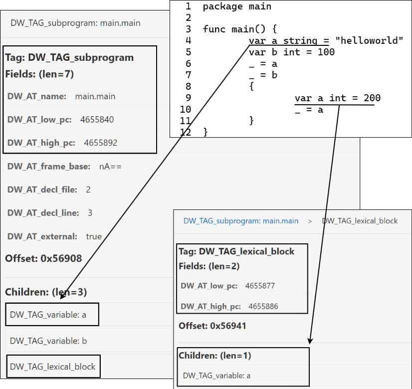

## 支持表达式计算

### 实现目标：理解并实现表达式计算 evalexpr

调试器调试过程中，我们经常会输入调试命令，有些调试命令允许输入一些表达式，比如 `print 1+2`， `print a+b`，`break 20`，`break *<addr>`，`whatis a.b.c` 等等。支持表达式计算能够让我们的调试过程更加便利，这个小节我们就来介绍下如何实现表达式计算。

### 基础知识

其实大家对于表达式计算并不陌生，我举几个你可能“并不陌生”的例子，帮你梳理下曾经的知识点：

- 读者学习《数据结构与算法》时，学习过中缀表达式转后缀表达式吧？还可以基于栈（运算符栈、操作数栈）的方式算出结果。
- 读者学习《编译原理》时，学习过词法分析、语法分析、语义分析吧，对抽象语法树AST有了解吧，其中包含了很多的表达式构造；

我们调试场景下支持的表达式，其实就是使用Go语言可以写出的表达式（表达式并不是语句），这也是为了以最小的记忆成本就可以写出想要的表达式。表达式操作数可以是常量、变量、指针等，运算符不仅包括 `+-*/()`，还包括索引操作 `[idx]`，slice操作 `[low:high]`，包括结构体成员访问操作 `.`等。

1. eval(expr)，需要先解析理解这个表达式，这一步就需要进行此法分析、语法解析得到这个表达式的AST。
2. 然后我们需要walk这个AST，准备好运算符每个操作数的值：
   - 如果操作数是字面量true/false，这种操作数一般要处理为bool类型，然后再参与表达式计算；
   - 如果操作数是字面量nil，在Go表达式里面通常是表示一个nil指针或者无类型接口变量值；
   - 其他符号名，需要先在DWARF DIEs中搜索该符号对应的变量、常量定义，从而得知其具体类型信息 `DIE.DW_AT_type`，以及在内存中的位置  `DIE.DW_AT_location`。
3. 最后对表达式进行计算，处理不同运算符的计算逻辑，最终得到计算结果。如将AST转为后缀表达式，使用基于栈的方法进行运算，运算符栈空、操作数栈栈顶就是结果。

**注意：关于在DWARF DIEs中搜索符号定义，不得不强调下作用域的问题。** 变量、常量的定义是要注意区分作用域的，我们自然都明白。在DWARF DIEs中通过操作数名字搜索它的定义时，除了检查DIE的 `DW_AT_name` 是否与名字相同外，还要注意包含该DIE定义的当前PC是否位于 `DW_TAG_lexical_block[DW_AT_low_pc,DW_AT_high_pc]` 作用域范围内。如果不注意检查作用域相关的DIE，您可能最后使用了一个错误的同名变量，表达式计算结果就错了。

OK，我们来看下这部分的代码实现。

### 代码实现

截止到现在，tinydbg支持Go语言中的如下表达式写法：

- 除了 <-, ++ 和 -- 之外的所有基本类型上的二元和一元运算符
- 任意类型上的比较运算符
- 数值类型之间的类型转换
- 整型常量与任意指针类型之间的相互转换
- string、[]byte 和 []rune 之间的类型转换
- 结构体成员访问（例如：somevar.memberfield）
- 数组、切片和字符串的切片和索引运算符
- Map访问
- 指针解引用
- 内置函数调用：cap、len、complex、imag 和 real
- 接口变量的类型断言（例如：somevar.(concretetype)）

#### Expr类型

Go标准库 `go/src/go/parser.ParseExpr(string)` 支持表达式解析并返回一个ast.Expr实例，ast.Expr是个接口类型，Go语言中的不同表达式都要实现这个接口。

see: go/src/go/ast/ast.go, ast.Expr

```go
// All expression nodes implement the Expr interface.
type Expr interface {
    Node

    // 这里额外定义了一个非导出方法，这样用户自定义的类型就无法赋值给ast.Expr类型的接量，
    // 因为只有go标准库内的表达式类型可以实现接口Expr。
    exprNode()
}

// All AST node types implement the Node interface.
type Node interface {
    Pos() token.Pos // position of first character belonging to the node
    End() token.Pos // position of first character immediately after the node
}
```

实现了ast.Expr接口的表达式，可以分为如下两类：

- Value Expression, 包括 BadExpr, Ident, Ellipsis, BasicLit, FuncLit, CompositeLit, ParenExpr, SelectorExpr, IndexExpr, IndexListExpr, SliceExpr, TypeAssertExpr, CallExpr, StarExpr, UnaryExpr, BinaryExpr, KeyValueExpr；
- Type Expressions, 包括 ArrayType, StructType, FuncType, InterfaceType, MapType, ChanType；

这就是理论上所有可以支持的Go表达式类型，调试器tinydbg支持了其中的绝大部分操作，本文前面提到过，只有极少数表达式操作不支持。

#### step1：AST解析

OK, 当输入一个表达式字符串后，调试器后端要先调用 `parser.ParseExpr(...)` 实现AST解析，返回一个ast.Expr。这个操作是通过go标准库函数 `go/parser.ParseExpr(x string)` 来完成的。

see: go/src/go/parser/interface.go

```go
// ParseExpr is a convenience function for obtaining the AST of an expression x.
// The position information recorded in the AST is undefined. The filename used
// in error messages is the empty string.
//
// If syntax errors were found, the result is a partial AST (with [ast.Bad]* nodes
// representing the fragments of erroneous source code). Multiple errors are
// returned via a scanner.ErrorList which is sorted by source position.
func ParseExpr(x string) (ast.Expr, error) {
    return ParseExprFrom(token.NewFileSet(), "", []byte(x), 0)
}

func ParseExprFrom(fset *token.FileSet, filename string, src any, mode Mode) (expr ast.Expr, err error) {
    // get source from filename or use src directly
    text, _ := readSource(filename, src)

    // parse expr
    var p parser
    file := fset.AddFile(filename, -1, len(text))
    p.init(file, text, mode)
    expr = p.parseRhs()
    ...

    return
}
```

因为是Go标准库中的实现，我们就不浪费太多篇幅展示相关的源代码了，感兴趣的读者可以自行查看源码。毕竟大家有编译原理基础，结合 [Go语言文法](https://go.dev/ref/spec) 手写一个词法分析器、语法分析器也不困难。

> 可能有些读者毕业之后再也没有接触过编译相关的实践，OK，那这里提供个可视化工具，供大家了解下，[AST Explorer](https://astexplorer.net/)，你可以在页面上编程语言的源代码，右侧就可以及时输出解析后的AST。如果你对上述提及的ast.Expr的具体实现类型没有任何一点感觉，不代表你看不懂，只是你很少涉猎这方面的内容，所以看了后很陌生。
>
> 举几个简单例子吧，你可以像这样写一些并不用十分完整的Go代码，看下解析出来的AST结构，比如这里的表达式IndexExpr、SliceExpr、BinaryExpr，这样你就知道了我们输入的表达式，最终解析完后大约长什么样子。
>
> ```go
> // ast.File.Name.(*Ident).Name="main"
> package main
>
> // GenDecl.Tok="import"
> // GenDecl.Specs[0].(*ImportSpec).Path.(*BasicLit).Value="\"fmt\""
> // GenDecl.Specs[0].(*ImportSpec).Path.(*BasicLit).Kind="STRING"
> import "fmt"
>
> // main.main对应FuncDecl，FuncDecl.Body.Statements表示函数体中的每一行语句
> func main() {  
>   var nums []int  // DeclStmt.Decl.(*GenDecl).Tok="nums", 
>                   // DeclStmt.Decl.(*GenDecl).Specs[0].(*ValueSpec).Type=ArrayType, 
>                   // DeclStmt.Decl.(*GenDecl).Specs[0].(*ValueSpec).Elt.(*Ident).Name="int"
>                   // DeclStmt.Decl.(*GenDecl).Specs[0].(*ValueSpec).Values=[]
>
>   nums[1]         // ExprStmt.X.(*IndexExpr).X.(*Ident).name="nums"
>                   // ExprStmt.X.(*IndexExpr).Index.(*BasicLit).Value=1
>                   // ExprStmt.X.(*IndexExpr).Index.(*BasicLit).Kind=INT
>
>   nums[1:2]       // ExprStmt.X.(*SliceExpr).X.(*Ident).Name="nums"
>                   // ExprStmt.X.(*SliceExpr).Low.(*BasicLit).Value="1"
>                   // ExprStmt.X.(*SliceExpr).Low.(*BasicLit).Kind="INT"
>                   // ExprStmt.X.(*SliceExpr).High.(*BasicLit).Value="2"
>                   // ExprStmt.X.(*SliceExpr).High.(*BasicLit).Kind="INT"
>
>   var a int       // DeclStmt.Decl.(*GenDecl).Tok="var"
>                   // DeclStmt.Decl.(*GenDecl).Specs[0].(*ValueSpec).Type.(*Ident).Name="int"
>                   // DeclStmt.Decl.(*GenDecl).Specs[0].(*ValueSpec).Names[0].(*Ident).Name="a"
>   var b int
>   var c int
>
>   var d = a + b*c // DeclStmt.Decl.(*GenDecl).Tok="var"
>                   // DeclStmt.Decl.(*GenDecl).Specs[0].(*ValueSpec).Names[0] = &Ident{Name:"d"}
>                   // DeclStmt.Decl.(*GenDecl).Specs[0].(*ValueSpec).Values[0] =
>                   //   &BinaryExpr{Op:"+", X:&Ident{Name:"a"}, Y:&BinaryExpr{Op:"*", X:&Ident{Name:"b"}, Y:&Ident{Name:"c"}}}
> }
> ```

#### step2: EvalScope

OK，现在从输入的表达啥字符串得到了ast.Expr之后，我们如何进行计算呢？如果我们把符号替换成对应的真实值（比如变量名a,b,c对应的数值），然后再结合运算表达式进行计算，不就得到最终结果了吗？确实如此。

但是要通过符号名，知道它到底是个int还是个string，还是个slice或者其他类型，我们需要知道它的确切定义信息。同一个符号名，在源码不同作用域下可能会被多次使用，这很常见。因此，我们还必须提供执行此表达式时的硬件上下文信息(PC)，进而确定当前执行指令所处的源码作用域，然后在该作用域中搜索对应的符号定义，如果找不到再继续搜索上一层作用域。

这里举个简单的例子：

```go
$ cat main.go
1  package main
2  
3  func main() {
4          var a string = "helloworld"
5          var b int = 100
6          _ = a
7          _ = b
8          {
9                  var a int = 200
10                 _ = a
11         }
12 }
```

假设当前执行到main.go:6，此事变量a是一个值为"helloworld"的字符串，但是当执行到main.go:10时，变量a变成了值为"200"的int类型变量。



读者一看就明白了，表达式中操作数的作用域信息很关键，对，那作用域信息从何得到呢？就是要根据当前调试器执行到的指令PC，结合DWARF调试信息中DW_TAG_subprogram、DW_TAG_lexical_block的作用域范围 `[DW_AT_low_pc,DW_AT_high_pc]`，我们就可以确定当前搜索符号的定义时，应该优先从哪个作用域开始搜索。比如上面的例子，如果当前PC位于main.go:10这行，如果查找a的定义，那我们就应该优先在这个block内搜索到`var a int = 200`，而如果是搜索b，也要先搜索当前block，但是这个block没有定义，此时应该查找更上一层block，即搜索main.main这个block，进而搜索到 `var b int = 100`。

至此，大家应该了解了，当我们知道了当前硬件上下文信息（PC），结合DWARF调试信息，我们不光可以推断出当前程序执行到的栈帧、函数，这部分主要是靠搜索FDEs，我们还可以通过搜索DIEs找到当前的作用域，任意给出一个符号名，还可以准确找到符号定义相关信息，DWARF不仅描述了作用域信息，也描述了某个作用域中定义了那些变量，包括变量值在内存中的位置，以及变量类型信息。

OK，proc.EvalScope中就记录了一些当前的硬件上下文信息，比如proc.EvalScope.Regs。当借助DWARF确定了变量在内存中的位置之后，我们还可以通过proc.EvalScope.target去读取内存数据（实际上封装了`ptrace(PTRACE_PEEKDATA,...)`，然后再根据DWARF中记录的类型信息，借助Go reflection精准构造出对应的变量实例。最后就可以在这个变量实例上执行相应的运算符对应的计算逻辑。

see: tinydbg/pkg/proc/eval.go: proc.EvalScope

```go
// EvalScope is the scope for variable evaluation. Contains the thread,
// current location (PC), and canonical frame address.
type EvalScope struct {
    Location
    Regs     op.DwarfRegisters
    Mem      MemoryReadWriter // Target's memory
    g        *G
    threadID int
    BinInfo  *BinaryInfo
    target   *Target
    loadCfg  *LoadConfig

    frameOffset int64

    // When the following pointer is not nil this EvalScope was created
    // by EvalExpressionWithCalls and function call injection are allowed.
    // See the top comment in fncall.go for a description of how the call
    // injection protocol is handled.
    callCtx *callContext

    dictAddr uint64 // dictionary address for instantiated generic functions

    enclosingRangeScopes []*EvalScope
    rangeFrames          []Stackframe
}
```

ps：proc.EvalScope还包含了一些其他的上下文信息，这里先不介绍。值得一提的是，proc.EvalScope不同于api.EvalScope，后者是为了识别调试会话命令是在哪个goroutine、哪个栈帧、哪个defer函数中执行来定义的。而proc.EvalScope是为了支持表达式计算而定义的。

#### step3: 表达式计算

OK，现在我们了解了如何将输入的表达式解析为AST（ast.Expr），并且了解了应该如何确定变量在源码中的定义（作用域、类型、内存地址），简单提了下内存数据读取、借助DWARF类型描述以及Go反射机制可以对表达式中的符号用对应的变量实例精准替换。有了这些之后，我们就可以了解不同的ast.Expr支持哪些运算符，然后去实现这些运算符的计算逻辑。

每一种不同类型的表达式，它对应的类型、运算符也不一样，比如SliceExpr描述的是获取一个slice、string、array的subslice，而IndexExpr描述的是获取一个slice、string、array特定下标位置的元素……OK，笼统来说，剩余的就是针对每种表达式的计算逻辑。

```go
var expr ast.Expr
expr, _ := parser.ParseExpr(s string)

switch vv := expr.(type) {
    case ast.Ident:
    evalIdent(...)
    case ast.Ellipsis:
    evalEllipssis(...)
    case ast.SliceExpr
    evalSliceExpr(...)
    case ast.StarExpr
    evalStarExpr(...)
    case ast.UnaryExpr
    evalUnaryExpr(...)
    case ast.BinaryExpr
    evalBinaryExpr(...)
    ...
}
```

OK，你可以按照我这样的描述来理解表达式就是这样计算的，完全没问题，2015年aarzilli提交了dlv[第一版表达式计算实现](https://github.com/go-delve/delve/pull/285/commits/43b64ec39e8188cd5b215d15ec0175868c548a8b)，这个版本大致实现逻辑就是前面介绍的这样。2023年aarzilli提交了dlv[第二版表达式计算实现：基于栈机器的表达式计算](https://github.com/go-delve/delve/commit/2c700230de0db2f84c537f00b388b183d35645ac)。按aarzilli的说法是，这么做有诸多好处。

>之前 Delve 的表达式求值是递归实现的，涉及 goroutine 和 channel 通信，结构复杂且难以维护。新方案将表达式“编译”为一组指令，然后用栈机器顺序执行，这样结构更清晰，易于维护和扩展。这样可以更好地支持运行时函数调用注入、变量状态同步以及未来的新特性实现，比如利用 Go 1.20 的 runtime.Pin 优化。
整体提高了可扩展性和兼容性，并简化了运行时状态同步的逻辑。

OK，我们来了解下当前这个版本的实现，将表达式解析为ast.Expr，然后将其编译为一组操作指令，然后基于栈机器执行这组指令，最后计算完成得到结果。

#### Put It Together

##### 整体流程

`proc.(*EvalScope).EvalExpression(expr string, cfg LoadConfig) (*Variable, error)` 执行了上述提及的所有操作：

1. 对输入表达式 `expr string` 的AST解析，得到表达式ast.Expr实例；
2. 然后结合上下文信息确定当前表达式中各个操作数的作用域，进而确定具体的操作数的值，
3. 最终根据不同表达式的计算规则，完成最终结果的计算，计算结果是一个Variable。
   ps：这里的计算，tinydbg采用了一种巧妙的办法，它将不同ast.Expr对应的处理操作编译成了一系列的操作指令。然后执行这些操作指令，最终就得到了计算结果。

```go
// EvalExpression returns the value of the given expression.
func (scope *EvalScope) EvalExpression(expr string, cfg LoadConfig) (*Variable, error) {
    // 解析ast.Expr，编译为一系列操作指令
    ops, _ := evalop.Compile(scopeToEvalLookup{scope}, expr, scope.evalopFlags())

    // 执行指令，最终得到结果
    stack := &evalStack{}
    scope.loadCfg = &cfg
    stack.eval(scope, ops)

    // 执行结束，获取执行结果
    ev, _ := stack.result(&cfg)

    // 对于表达式中的变量，查询DWARF得到了其类型信息、内存地址信息，会为其构造类型名为Variable的变量加以表示。
    // 当将这些变量入栈时（stack.stack参数栈），才会加载内存中数据，而且还会cache，因为同一个变量可能出现多次。
    //
    // 但是对于计算结果，`Variable.Addr==0 && Variable.Base==0`，不用从被调试进程内存中读取数据。
    ev.loadValue(cfg)
    if ev.Name == "" {
        ev.Name = expr
    }
    return ev, nil
}
```

see: tinydbg/pkg/proc/evalcompile.go, evalop.Compile

```go
// Compile compiles the expression expr into a list of instructions.
// If canSet is true expressions like "x = y" are also accepted.
func Compile(lookup evalLookup, expr string, flags Flags) ([]Op, error) {
    // 先解析为ast.Expr
    t, err := parser.ParseExpr(expr)
    if err != nil {
        ...
    }
    // 将不同的ast.Expr编译为不同的操作指令序列，
    // 每条指令有入栈、出栈、计算逻辑相关的操作指令：
    // - 比如pushIndent只涉及到入栈，一般是入栈操作数变量，比如a+b涉及到两条指令pushIdent(a), pushIdent(b)
    // - 比如pushBinary涉及到出栈、计算、入栈，比如从操作数栈出栈两个操作数Variable(a), Variable(b)，
    //   然后执行计算逻辑 Variable(c) = Variable(a)+Variable(b)，然后将计算结果入栈
    //
    // 不同的指令有不同的操作序列，OK!
    return CompileAST(lookup, t, flags)
}

// CompileAST compiles the expression t into a list of instructions.
func CompileAST(lookup evalLookup, t ast.Expr, flags Flags) ([]Op, error) {
    // 编译为一系列操作指令
    ctx := &compileCtx{evalLookup: lookup, allowCalls: true, flags: flags}
    _ := ctx.compileAST(t, true)
    ...

    // 栈深度校验
    _ = ctx.depthCheck(1)
    return ctx.ops, nil
}
```

##### 如果你想细致掌握

如果你想细致掌握每一个不同的表达式类型的详细处理过程，你可以阅读源码，也可以通过dlv调试器调试tinydbg调试器，然后在tinydbg调试会话中输入简单的表达式`whatis <expr>`来触发表达式计算过程，这样你可以单步执行的方式跟踪每一个细节，不至于淹没在巨量的分支代码逻辑中。这部分内容如果每个表达式类型我们都详细介绍的话，篇幅会非常非常大，我们不大可能在有限的篇幅内全盘介绍。所以如果你是和作者一样喜欢刨根问底、希望对每个细节了如指掌，那你可以这么做。

如果真的准备这么干，可以按照下列步骤跟踪调试器的内部执行过程：

首先准备一个测试程序 main.go：

```go
1  package main
2  
3  func main() {
4          var a string = "helloworld"
5          var b int = 100
6          _ = a
7          _ = b
8          {
9                  var a int = 200
10                 _ = a
11                 println(a+b)      // <= 我们将执行 `break main.go:11`
12         }
13 }
```

然后安装调试器tinydbg，注意要禁用优化并生成DWARF调试信息：

```bash
$ go install -v -gcflags 'all=-N -l' github.com/hitzhangjie/tinydbg
```

然后启动调试器tinydbg进行调试：

```bash
$ tinydbg debug main.go
(tinydbg) break main.go:11
...
(tinydbg) continue
(tinydbg) whatis a+b                // <= whatis会触发调试器表达式Eval操作
                                    // 注意，此时先不要好敲回车键，
                                    // 我们要用调试器调试调试器，得给调试器tinydbg加断点
```

OK，现在我们用另一个调试器dlv来调试上述tinydbg进程：

```bash
dlv attach `pidof tinydbg`
(dlv) break EvalExpression
(dlv) continue

(dlv) 当whatis执行后，dlv会停在tinydbg的proc.EvalExpression函数位置，等待调试
```

断点创建成功后，回到tinydbg调试会话中，敲击“回车键”，触发`whatis`命令执行，此时调试器tinydbg后端逻辑会执行`proc.EvalExpression(s)`操作，dlv调试会话中会停在该函数断点处，此时你就可以通过单步执行，来了解详细的EvalExpression过程了。

##### 以 `a+b` 进行说明

尽管我们不能兼顾每个细节，但是我们还是希望能对关键处理路径进行介绍，这样读者朋友们才不会觉得，“嗯，又是一本部头很大但是啥也没讲清楚的书……失望”。

所以，我们按照上面的main.go示例，解释下执行 `whatis a+b` 时，EvalExpression逻辑是如何执行的，当读者跟随这里的描述过完这一遍的流程之后，你将彻底明白这个过程是如何工作的，以及有能力去深入探索其他表达式计算逻辑是如何执行的。

还是老习惯，先列下大致的核心代码路径。

**client**: client端代码比较简单，大致如下所示。

```bash
whatisCmd.cmdFn
    \--> whatisCommand(t *Session, ctx callContext, args string) error
            \--> val, err := t.client.EvalVariable(ctx.Scope, args, ShortLoadConfig)
                    \--> (c *RPCClient) EvalVariable(scope api.EvalScope, expr string, cfg api.LoadConfig) (*api.Variable, error)
                            \--> err := c.call("Eval", EvalIn{scope, expr, &cfg}, &out)
            \--> print the variable info
```

**server**: server端涉及到的代码量非常大，我分3个关键步骤进行介绍。

加载配置，并发起表达式计算：

```bash
tinydbg/service/rpc2(*RPCServer).Eval(arg EvalIn, out *EvalOut) error
    \--> cfg = &api.LoadConfig{FollowPointers: true, ...)
    |       \--> pcfg := *api.LoadConfigToProc(cfg)
    \--> v, _ := s.debugger.EvalVariableInScope(arg.Scope.GoroutineID, arg.Scope.Frame, arg.Scope.DeferredCall, arg.Expr, pcfg)
    |       \--> s, err := proc.ConvertEvalScope(d.target.Selected, goid, frame, deferredCall)
    |       \--> return s.EvalExpression(expr, cfg)
```

编译阶段，对表达式字符串进行AST解析，并对ast.Expr编译一系列操作指令ops，这里的指令并不是机器指令 :)

>执行完编译之后，ctx.ops将包含3个操作，入栈ident{a}，入栈ident{b}，执行+计算，活脱脱一个后缀表达式但是这里的ctx.ops并不是最终要执行的执行。

```bash
return s.EvalExpression(expr, cfg)
   // step1: 进行AST解析，并将其表达式求值操作编译为一系列操作指令
   \--> ops, err := evalop.Compile(scopeToEvalLookup{scope}, expr, scope.evalopFlags())
   |       // ast分析得到ast.Expr
   |       \--> t, err := parser.ParseExpr(expr)
   |       // 对ast.Expr进行编译
   |       \--> return CompileAST(lookup, t, flags)
   |               \--> err := ctx.compileAST(t, true)
   |                       \--> `a+b` operator `+`: case *ast.BinaryExpr: err := ctx.compileBinary(node.X, node.Y, sop, &Binary{node})
   |                               \--> operand `a`: err := ctx.compileAST(a, false)
   |                                       \--> ctx.pushOp(&PushIdent{node.Name})
   |                                           \--> ctx.ops = append(ctx.ops, op)
   |                               \--> operand `b`: err := ctx.compileAST(b, false)
   |                                       \--> ctx.pushOp(&PushIdent{node.Name})
   |                                           \--> ctx.ops = append(ctx.ops, op)
   |                                           \--> ctx.ops = append(ctx.ops, op)
   |                               \--> operator `+`: ctx.pushOp(op) // `op` is `&Binary{node}`
   |               // `ctx.pushOp(op OP)`放到ctx.ops里的每一个操作，都是OP接口的实现，
   |               // OP接口要求各个操作汇报各自的popstack、pushstack的次数，
   |               // 如：
   |               // - pushIdent分别popstack 0次，pushstack 1次，因为仅需要入栈1个参数；
   |               // - Binary则是popstack 2次，pushstack 1次，因为二元运算符要通过2次popstack得到2个参数，结果再入栈1次；
   |               // 这里的栈深度检查，即校验这些操作执行完后，目标栈深度是否符合预期，如果不符合预期那设计的操作指令有问题。
   |               \--> err = ctx.depthCheck(1)
   |               \--> return ctx.ops
   // step2: evalStack执行指令阶段，这个过程就是对表达式求值的过程
   // step3: 从evalStack操作数栈栈顶获取计算结果
   ...
```

指令执行，初始化一个evalStack（栈机器），它会执行我们前面编译expr生成的操作序列：

```bash
// step2: evalStack执行指令阶段，这个过程就是对表达式求值的过程
stack := &evalStack{}
stack.eval(scope, ops)
    \--> stack.ops = ops
    \--> stack.scope = scope
    \--> stack.spoff = ... / stack.bpoff = ... / stack.fboff = ... / stack.curthread = ...
    \--> stack.run()
```

OK, 我们看下这个栈机器是如何执行我们编译后的操作序列的，在我们的例子中，stack.ops 包含3个操作，前两个操作是为最后一个操作准备操作数的。

1. 第1个操作、第2个操作分别是 pushIdent{a} 和 pushIdent{b}, 它们会在下面代码中的分支 `case *evalop.PushIdent` 中处理。
   从结果来看，它们的不同之处在于：
  - 变量 `a` 找到2个定义, 1) block 8~12, line 9； 2) main.main 3~13, line 4，最终确定其定义应为block 8~12, line 9处的定义；
  - 变量 `b` 找到1个定义, main.main 3~13, line 5；
2. 第3个操作是 pushBinary{+}, 下面代码分支中 `case *evalop.Binary` 中处理。

```bash
stack.run():
    \--> foreach op in stack.ops:
	|    for stack.opidx < len(stack.ops) && stack.err == nil,
    |       \--> stack.executeOp()
    |               \--> switch op := ops[stack.opidx].(type)
                            case *evalop.PushIdent: ... // pushIdent{a}, pushIdent{b}
                            case *evalop.Binary: ...    // pushBinary{+}
```

OK，我们先来看看pushIdent{a}, pushIdent{b}这个处理分支是如何处理的：优先搜索函数作用域以及内部作用域有没有同名变量定义，找不到再从包级别作用域查找。

```bash
op = stack.ops[stack.opidx]
switch op := ops[stack.opidx].(type)
...
case *evalop.PushIdent: 
    stack.pushIdent(scope, op.Name)
    |   \--> step1: search `name` from function scopes and inner blocks
    |   |    found = stack.pushLocal(scope, name, 0)
    |   |       \--> vars, _ = scope.Locals(0, name)
    |   |       |       \--> vars0, _ := scope.simpleLocals(flags|rangeBodyFlags, wantedName)
    |   |       |       |       \--> dwarfTree, _ := scope.image().getDwarfTree(scope.Fn.offset)
    |   |       |       |       \--> varEntries := reader.Variables(dwarfTree, scope.PC, scope.Line, variablesFlags)
    |   |       |       |       |       \--> variablesInternal(nil, root, 0, pc, line, flags, true)
    |   |       |       |       |       |        // search main.main scope and inner blocks
    |   |       |       |       |       |        case dwarf.TagLexDwarfBlock, dwarf.TagSubprogram:
    |   |       |       |       |       |            \--> if (... || root.ContainsPC(pc) then
    |   |       |       |       |       |                 check each children of root.Children: 
    |   |       |       |       |       |                 v = variablesInternal(v, child, depth+1, pc, line, flags, false)
    |   |       |       |       |       \--> return varEntries
    |   |       |       |       \--> vars := make([]*Variable, 0, len(varEntries))vars []
    |   |       |       |       \--> foreach var in varEntries
    |   |       |       |       |       var, := extractVarInfoFromEntry(scope.target, scope.BinInfo, scope.image(), ......)
    |   |       |       |       |       |    \--> 由DIE.DW_ATTR_type读取类型信息, 由DIE.DW_ATTR_location计算地址（DWARF定义的栈字节码指令）
    |   |       |       |       |       |    |    n, t, _ := readVarEntry(entry, image)
    |   |       |       |       |       |    |    addr, _, _, := bi.Location(entry, dwarf.AttrLocation, regs.PC(), regs, mem)
    |   |       |       |       |       |    \--> 创建新变量，初始化类型信息、数据地址
    |   |       |       |       |       |    |    v := newVariable(n, uint64(addr), t, bi, mem)
    |   |       |       |       |       |    |    return v
    |   |       |       |       |       vars = append(vars, var)
    |   |       |       |       \--> 按定义位置（源码上）进行排序、嵌套深度进行排序
    |   |       |       |       |    sort.Stable(&variablesByDepthAndDeclLine{vars, depths})
    |   |       |       |       \--> 将被shadow的外部作用域的变量标识下
    |   |       |       |       |    mark vars `flags|=VariableShadowed` if shadowed
    |   |       |       |       \--> return vars
    |   |       |       \--> only keep the lastseen one in vars0
    |   |       |       |    that's the one defined in expected scope,
    |   |       \--> foreach var in vars
    |   |       |       found := varflags&VariableShadowed == 0
    |   |       |        if found then 
    |   |       |           stack.push(vars[i]) 
    |   |       |               \--> stack.stack = append(stack.stack, v)
    |   |       |           break
    |   |       \--> return found
    |   |      
    |   \--> step2: if `found`, then return vars
    |   |            
    |   \--> step3: if `!found`, then find in globals
    |            v, err := scope.findGlobal(scope.Fn.PackageName(), name)
    |                \--> search pacakge.variable, if found then return
    |                \--> search package.functions, if found then returns
    |                \--> search package.constants, if found then returns
```

第1、2个操作执行完后就完成了操作数栈stack.stack的入栈操作，入栈时的变量Variable.Type+Variable.Location都已经根据DWARF信息初始化过了，只是Variable.Value还没有加载。在evalStack这个栈机器取出二元运算符“Binary{+}"之后，会尝试从操作数栈获取操作数，这个阶段，会从被调试进程的内存中读取数据到Variable.Value，然后再进行基于运算符逻辑的加法计算。

OK，我们下面来看下Binary{+}这个操作的处理逻辑：

```bash
op = stack.ops[stack.opidx]
switch op := ops[stack.opidx].(type)
...
case *evalop.Binary:
    scope.evalBinary(op, stack)
    \--> step1: 从操作数栈stack.stack获取运算符的左右操作数
    |    yv := stack.pop(); 
    |    |  \--> v := s.stack[len(s.stack)-1]
    |    |  \--> s.stack = s.stack[:len(s.stack)-1]
    |    |  \--> return v
    |    xv := stack.pop(): 略
    \--> step2: 根据Variable中记录的地址信，加载其在被调试进程内存数据
    |    xv.loadValue(...); 
    |    |  \--> v.loadValueInternal(0, cfg)
    |    |          \--> if v.Kind == reflect.Int, ..., reflect.Int64 then
    |    |          |    var val int64
    |    |          |    val, v.Unreadable = readIntRaw(v.mem, v.Addr, v.RealType.(*godwarf.IntType).ByteSize)
    |    |          |       \--> val := make([]byte, int(size))
    |    |          |       \--> _, err := mem.ReadMemory(val, addr)
    |    |          |       |       \--> n, _ = processVmRead(t.ID, uintptr(addr), data)
    |    |          |       |            uses syscall SYS_PROCESS_VM_READV, maybe failed
    |    |          |       |       \-- if n == 0 then use syscall ptrace(PTRACE_PEEKDATA, ...)
    |    |          |       |            t.dbp.execPtraceFunc(func() { n, err = sys.PtracePeekData(t.ID, uintptr(addr), data) })
    |    |          |       \--> n = int64(binary.LittleEndian.Uint64(val))
    |    |          |       \--> return n
    |    |          |    v.Value = constant.MakeInt64(val)
    |    yv.loadValue(...): 略
    \--> step3: 校验运算符左右操作数类型是否一致
         typ, err := negotiateType(node.Op, xv, yv)
    \--> step4: 构造计算结果
    |    rc, err := constantBinaryOp(op, xv.Value, yv.Value)
    |    |  \--> if op isn't token.SHL, token.SHR then
    |    |   |   r = constant.BinaryOp(x, op, y)
    |    |   |      \--> a := int64(x), b := int64(y)
    |    |   |      \--> if op == token.Add then c = a+b
    |    |   |      \--> return int64Val(c)
    |    |  \--> return r
    \--> step5:结果变量类型应该和操作数相同，构造一个新结果变量
    |    r := xv.newVariable("", 0, typ, scope.Mem)
    |    r.Value = rc
    \--> step6: 确保计算结果符合目标平台的限制, see: convertInt中符号位扩展、截断处理逻辑
    |     switch r.Kind
    |        case reflect.Int, reflect.Int8, reflect.Int16, reflect.Int32, reflect.Int64:
    |            \--> n, _ := constant.Int64Val(r.Value)
    |             \--> r.Value = constant.MakeInt64(int64(convertInt(uint64(n), true, typ.Size())))
    \--> step7: 最后，将计算结果放入操作数栈
         stack.push(r)
            \--> s.stack = append(s.stack, v)
```

已经计算完成，且已经将计算结果变量入栈，此结果变量的Variable.Value已经有只值了，且结果变量 `Variable.Addr==0 && Variable.Base==0` 。OK，接下来我们来读取计算结果。

```bash
step1: 栈机器的操作数栈栈顶就是最终计算结果，取出这个变量，这个变量是个计算结果，ev.loaded=true，不用读进程内存进行加载
ev, err := stack.result(&cfg)
    \--> r = stack.peek()
    \--> r.loadValue(*cfg)
    |       \--> v.loadValueInternal(0, cfg)
    |               // r这个结果变量，是调试器进程构造出来的，r的结果不存储在被调试进程中,
    |               // 所以这里 `v.Addr == 0 && v.Base == 0` 成立，无需从被调试进程内存中加载，直接返回 
    |               \--> if v.Unreadable != nil || v.loaded || (v.Addr == 0 && v.Base == 0) then return
    \--> return r
step2: 这次loadValue对这里的场景来说，有点多余，前面stack.peek()过程已经loadValue过了。
ev.loadValue(cfg)
```

最后，由于是前后端分离式架构，只有调试器后端所在进程上的数据类型定义，需要告知调试器前端，前端才能正常展示。

```bash
func (s *RPCServer) Eval(arg EvalIn, out *EvalOut) error
	\--> v, err := s.debugger.EvalVariableInScope(arg.Scope.GoroutineID, arg.Scope.Frame, arg.Scope.DeferredCall, arg.Expr, pcfg)
	\--> 将Eval的结果proc.Variable转换成客户端可读的信息api.Variable
	|    out.Variable = api.ConvertVar(v)
    |   	\--> r := Variable{Addr, Name, Kind, Len, Cap, ...}
    |   	\--> r.Type = PrettyTypeName(v.DwarfType)
    |         			\--> godwarf.Type.String(), 这里就是int
    |   	\--> r.Value = VariableValueAsString(v), 这里就是a+b的结果字符串"300"
    |   	\--> return &r
```

客户端收到响应后，得知这个结果类型是int，并且当前结果值是"300"，就可以将结果转换后，输出到调试会话窗口了。

### 执行测试

略

### 本文总结

至此整个 `whatis` 等命令中涉及到的表达式计算过程就执行结束了。我们只介绍了 `a+b` 这么简单的表达式，就花去了大量的篇幅，但是好的一点是，我们把处理过程中所有重要的细节都给大家介绍到了。包括AST解析，编译ast.Expr为一系列操作序列，以及evalStack这个栈机器如何执行这个序列，并得到计算结果。最后我们还介绍了如何将目标平台数据结构，转换为调试器前端可以理解的结构样式。

如果您对其他表达式类型的设计实现感兴趣，您可以参考本文介绍的调试过程去跟踪调试，或者根据本文介绍的源代码关键路径，去阅读相关源码。OK，本文就到这里了。

### 参考文献

1. 后缀表达式, https://en.wikipedia.org/wiki/Reverse_Polish_notation
2. Go语言文法, https://go.dev/ref/spec
3. AST Explorer, https://astexplorer.net/
4. dwarfviewer, https://github.com/hitzhangjie/dwarfviewer
