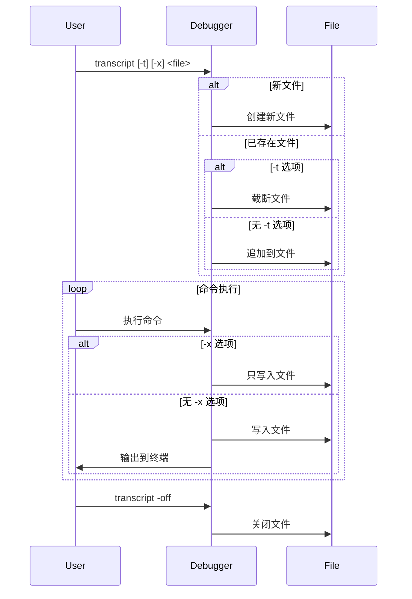

## transcript 设计与实现

### 调试记录本

大家在执行Linux命令时，为了记录刚才一系列操作中执行的命令，以及命令的输出，通常我们会使用 `script` 命令来完成这个事情。系统学习过Linux命令行操作的读者，对此应该都不会感到陌生。

see `man 1 script`:

```bash
NAME
       script - make typescript of terminal session

SYNOPSIS
       script [options] [file]

DESCRIPTION
       script makes a typescript of everything displayed on your terminal.  It is useful for students who need a hardcopy record of an inter‐
       active session as proof of an assignment, as the typescript file can be printed out later with lpr(1).

       If the argument file is given, script saves the dialogue in this file.  If no filename is given, the dialogue is  saved  in  the  file
       typescript.
```

其实对于调试场景，我们也很希望能拥有这样的调试能力。调试过程大多数是循序渐进的，不大可能第一遍调试就100%定位到问题，同行我们需要参考之前执行的调试过程，重新发起多轮调试才能定位到问题源头。tinydbg（dlv）就设计实现了 `transcript` 命令来实现这个操作，保存您在调试会话中生成的调试命令、命令输出到一个您指定的文件中去，方便后续查看。

### 功能概述

`transcript` 命令用于将调试会话中的命令输出记录到文件中，支持追加或覆盖模式，并可选择是否同时输出到标准输出。这个功能对于保存调试会话记录、生成调试报告或进行后续分析非常有用。

### 执行流程

1. 用户在前端输入 `transcript [options] <output file>` 命令。
2. 前端解析命令参数，包括：
   - `-t`: 如果输出文件存在则截断
   - `-x`: 抑制标准输出
   - `-off`: 关闭转录功能
3. 后端根据配置打开或关闭文件输出流。
4. 在调试会话中，所有命令的输出都会被写入到指定的文件中。
5. 用户可以随时通过 `transcript -off` 停止记录。

### 关键源码片段

```go
var transcriptCmd = func(c *DebugSession) *command {
    return &command{
        aliases: []string{"transcript"},
        cmdFn:   transcript,
        helpMsg: `Appends command output to a file.

    transcript [-t] [-x] <output file>
    transcript -off

Output of Delve's command is appended to the specified output file. If '-t' is specified and the output file exists it is truncated. If '-x' is specified output to stdout is suppressed instead.

Using the -off option disables the transcript.`,
    }
}
```

### 流程图



### 小结

transcript 命令为调试会话提供了完整的输出记录功能，通过灵活的选项配置，可以满足不同的记录需求。这个功能对于调试过程的追踪、问题分析和知识分享都很有帮助。其设计充分考虑了实用性和灵活性，是调试工具中一个重要的辅助功能。
