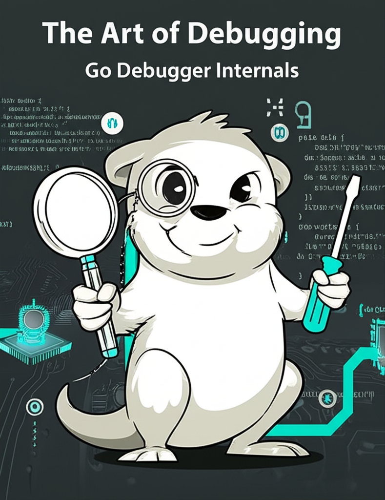

# 1 软件调试的艺术：Go语言调试器设计实现内幕

## 1.1 作者简介

大家好，我是张杰，目前在腾讯担任高级后台开发工程师，长期从事大规模业务的后台、基础技术、系统架构相关工作，方向包括微服务框架、微服务架构、可观测性、工程效能、DevOps、自动化测试等。我参与了腾讯微服务框架 [Tencent/trpc](https://github.com/Tencent/trpc) 的设计与实现，在团队内推动改善工程效能，主导过多个核心系统的设计实现与上线筹备。这些经历除了为我沉淀技术提供了宝贵的锻炼机会，也让我对不同场景面临的挑战有了更广泛深入的理解，“如果不能跟踪、观测、量化问题，就无法做出进一步的优化治理”。

工程效能，要将研发工作流的各个环节进行度量，才能去分析优化；架构设计，要将系统中不可见的东西变得可见，才能观测治理；分布式+微服务，要通过可观测性技术展开调用全景，才能理解系统的运转情况。更进一步看，一个产品体量再大最终也会落到一个个进程层面。对系统的整体把控、性能分析、故障排查，离不开对一个个进程层面的微观洞见做支撑。这是我理解的从高层理念到落地执行过程中，DEBUG能力在不同场景的差异与共通之处。

我喜欢DEBUG，不仅仅是为了排除眼下的故障，更是为了“确定性”所带来的复利价值。琐碎的技术细节于我便不再只是麻烦，而是宝贵的阅历。一次成功的 Linux 内核、Go 运行时代码的调试跟踪，能一扫积压心头多天的困惑，并能助力日后解决同类问题，这种满足感是令人兴奋的。我多么希望能有一双“上帝之眼”，让我可以洞察一切，这也让我对调试器 DEBUGGER 的应用和设计实现产生了浓厚的兴趣。

毕业工作至今，一转眼十年过去了，计算机技术的发展始终吸引着我去不断探索，而且乐此不疲。在这个过程中，“**开源**”让我接触了更大的世界，我很欣赏那种技术精湛、乐于分享甚至连指尖都洋溢着才华与天赋的工程师，并将他们作为我的榜样。“**在开源中学习，在开源中贡献**”，写博客、写书、分享，也算是我对这种理念的一种支持吧。

## 1.2 为什么要写这本书

### 1.2.1 Go很有意思

这里首先提一下学习go语言的历程，如果不是因为go，我也不会接触到delve，便不会有这本书的诞生。

- 2016年开始接触go，起初还有点抵触，比如坚持用C来模拟Go特性，详见 [C实现Go风格并发](https://www.hitzhangjie.pro/libmill-book/)；
- 2018年 c\c++\java 服务器开发有了些沉淀，认识到go的优雅并开始在项目中使用；
- 多年实操、go源码、设计提案、调试跟踪等方式深入了解了go的设计实现，详见 [Go设计实现内幕](https://www.hitzhangjie.pro/go-internals-v0/)；
- 2025年开始，将过去多年的项目踩坑经验整理成书，陆续更新到公众号，详见 [Go"安全"编程](https://mp.weixin.qq.com/mp/appmsgalbum?__biz=MzU2NjY3MTc3MQ==&action=getalbum&album_id=3544414370141700100#wechat_redirect)；

如今go语言越来越完善、生态越来越好，go语言已经成为最受欢迎的编程语言之一。

### 1.2.2 调试器很有意思

软件调试，其实是个系统性工程，它牵扯到了编程语言、编译器、链接器、调试器、操作系统、处理器、内存等多方面的内容。尽管调试器很有帮助、有趣，但真要掌握相关技术却需要长时间的技术涉猎和实践摸索。

新手学习go时，难免会遇到通过“调试”来排查问题的的情况，可能是排查逻辑bug or 语言设计如运行时、内存管理等复杂逻辑。[delve](https://github.com/go-delve/delve) 作为最流行的go语言调试器，在使用delve的过程中，我联想到可以从调试器角度切入来窥探计算机世界的秘密。不管是什么编程语言，只要有调试信息支持，总能借助调试器来窥探进程的运行过程。形象点的话可以联想下FPS游戏，一倍镜窥探代码执行，二倍镜窥探变量，三倍镜窥探类型系统，四倍镜窥探硬件特性……有什么能逃过调试器的法眼呢？本书主要内容就是分享几十年来软件调试领域沉淀的智慧。

本书希望能从调试器角度出发让开发者更好地理解编程语言、编译器、链接器、操作系统、调试器、硬件之间的联系，相比书籍课本上割裂式的教学，这样更能让读者感受到它们彼此间密切的协作，可以让开发者从更宏观的视角来审视软件开发的全貌。读完本书，开发者不光能掌握**go程序的高级调试技巧**，在日后的问题排查中事半功倍；开发者还将掌握**调试器开发和定制化能力**，如修改、扩展dlv调试器功能、编写starlark脚本实现dlv自动化调试等等；当然，也加深了对计算机系统全局的认识。

> ps: 如果较真，内核就需要内核级调试器，硬件就需要更加专门的手段来观察了 …… 这超出了本书的范畴。

### 1.2.3 工程素养传承

有些工程师认为他们不再需要调试器，靠经验和思路就可以高效定位问题。经验确实减少了对调试器的依赖，但这只能说明在其熟悉领域内得心应手，还不能论证调试器无用。所以，我们不能简单地认为“~~**不需要调试器**~~”这个观点。是否需要调试器，取决于多种因素，如具体问题的性质，不同分析方法的可行性，需要投入的时间精力，以及问题定位效率等。很多时候不是调试器无用，而是在特定问题场景下还没有到必须用调试器来解决问题的地步。比如问题场景是，让你调查一个运行时内存分配器创建1GB ballast、mspan脏页导致的内存提交问题呢？

对一些稍复杂的问题或者为加深理解的探索，借助调试器的一次有效追根溯源，就可能将一类“疑惑”给彻底终结。这才是我们最需要调试器介入的情况。当然了，通过调试器调试跟踪也只是众多debug手段中的一种而已。在我感兴趣的一些领域中，我就特别需要调试器来辅助跟踪代码执行路径的情况，这里的代码逻辑也不是写几个微服务RPC调用、ifelse分支处理、打几行日志覆盖所能比的，这种问题情况下加日志、编译测试、走读代码，都不是特别高效的选择。

下次再听到或者萌生 “~~**不需要调试器**~~” 想法的时候，不妨换个思路，”**有哪些调试方法**“，”**分别适用于什么场景**“，以及”**一个聪明人会如何进行调试**“。

调试器领域确实沉淀了一些值得拿出来分享的东西，比如DWARF标准演进以支持更多语言特性，调试器架构演进以支持更多调试场景，如与IDE集成、跨平台调试、远程调试等，以及录制回放技术（record & replay）以实现确定性调试，等等。这些东西如果只停留在成熟稳定的项目代码中，或者少数几个核心贡献者的大脑里，未免太可惜了。

## 1.3 本书内容

本书以“从零开发Go语言调试器”为主线，旨在通过实战方式串联软件调试这一复杂领域涉及的多项核心技术。尽管业界已经有如gdb、delve这样成熟的调试器，我们重拾轮子，借助调试器开发实践，将go语言、操作系统、编译器、链接器、硬件架构等知识融会贯通，帮助开发者建立起对软件底层机制的系统性认识。开发过程中接触到大量命令行工具开发、网络服务器开发、系统级编程以及需要深入理解go语言设计实现的内容，相信读者朋友们一定会有所收获。

本书内容紧密围绕“从零开发Go语言调试器”的主线展开，依托各章节循序渐进，逐步深入：

- **第2-3章：前言与常用术语** —— 针对新手做简要引导，罗列调试器开发相关的核心术语，为后续阅读扫清知识障碍。
- **第4章：软件调试基础** —— 介绍调试的基本概念、目的、依赖条件和反调试技术，帮助读者建立调试的整体认知和背景知识。
- **第5章：走进调试器开发** —— 从零带读者设计和实现一个简单调试器雏形，讲解核心模块架构设计，分析不同实现方案及各自优劣，奠定后续工程基础。
- **第6章：开发Go指令级调试器godbg** —— 详细拆解指令级调试器的各主要功能实现：从进程启动、跟踪，到断点管理、单步执行、内存/寄存器查看与修改、支持多线程/多进程调试，直至ASLR机制与更多进阶话题，帮助读者系统掌握底层调试原理及实践。
- **第7章：挺进符号级调试器** —— 深入讲解Go程序二进制构建原理，elf文件、符号表、DWARF调试信息等知识，以及符号级调试器的功能模块实现，为观测和操作高层代码对象奠定基础。
- **第8章：调试信息标准DWARF剖析** —— 对DWARF标准进行详细剖析，帮助读者理解DWARF的结构、内容、以及如何使用DWARF进行调试，包括如何用DWARF对源码进行描述、如何解析DWARF数据。
- **第9章：实现完整的Go符号级调试器tinydbg** —— 以实际工程推进为主线，逐步攻克核心功能（源码级断点、单步、变量/栈帧/协程/goroutine等信息展示、watch、trace等），带领读者完成一个可用的Go符号级调试器，以及高级功能扩展。
- **第10~12章：更多高级话题** —— 调试器、日志系统、可观测系统的演进，bisect在debug中的引用，ebpf、录制重放、分布式系统调试、AI辅助调试，以及现代调试技术展望等相关内容，扩宽技术视野。

## 1.4 示例代码

**本书对应的示例代码，包括指令级调试器godbg、符号级调试器tinydbg、以及探索测试类代码golang-debugger-lessons：**

1. **[hitzhangjie/godbg](https://github.com/hitzhangjie/godbg)**，该项目提供了一个功能相对完整的 “**指令级调试器**” 实现，供读者测试、学习了解整体代码组织；
2. **[hitzhangjie/tinydbg](https://github.com/hitzhangjie/tinydbg)**，该项目提供了一个可用标准的 ”**符号级调试器**“ 实现，由 [dlv](https://github.com/go-delve/delve) 裁剪调整而来（剔除了与linux/amd64无关扩展，及高级功能）；
3. **[hitzhangjie/golang-debugger-lessons](https://github.com/hitzhangjie/golang-debugger-lessons)**，该项目按章节组织目录，每节实现目标在godbg、tinydbg落地前，会先在此项目中编写demo进行验证；

ps: **[hitzhangjie/golang-debugger-lessons/0_godbg](https://github.com/hitzhangjie/godbg)**，该submodule即hitzhangjie/godbg。

**关于示例代码对应测试环境的一些补充说明**：

- godbg项目中提供了vscode的容器化开发配置 (详见./devcontainer/devcontainer.json)，指定的基础开发镜像是CentOS Stream9+go1.22.4。如果您更喜欢使用容器开发环境，您可以在vscode中安装插件 "Dev Containers"，在准备就绪后可以唤出Command Palette并选择 "Dev Containers: Reopen in Container"。
- 您也可以直接在Linux虚拟机或者Linux物理机中进行测试，请务必注意开发环境设置，Go版本必须>=go1.22并且<go1.25。
- 所有示例代码都是在linux/amd64平台架构下进行的测试，请您使用相同的环境进行测试。

> ps：关于上述Go版本约束的相关说明
>
> 1. Go版本不能低于go1.22：新版本才有的标准库函数旧版本无法正常编译，即使侥幸编译通过，实际产物也可能与书中内容描述有差异：
>   - go1.13将调试信息写入.zdebug_sections，但go1.19不再写入.zdebug_ sections（写入的是.debug_ sections并通过flag指明是否开压缩）；
>   - go1.14引入SIGURG支持抢占，如果使用更古老的go版本测试，这些SIGURG处理相关的代码永远不会被触发，可能会影响读者阅读和理解。
> 2. Go版本必须低于go1.25：因为go1.25已经推进到了DWARF v5，而本书基于Go1.13~Go1.24编写，这期间Go工具链使用的是DWARF v4；

## 1.5 联系方式

如果您有任何建议，请提[Issues](https://github.com/hitzhangjie/golang-debugger-book/issues)，或邮件联系 `hit.zhangjie@gmail.com`，标题中注明来意 `GoDebugger交流`。

希望该书及相关示例，能顺利完成，也算是我磨练心性、自我提高的一种方式，如果能对大家确实起到帮助的作用那是再好不过了。借此机会，我也想向 go-delve/delve 的维护人员 [derekparker](https://github.com/derekparker)、[aarzilli](https://github.com/aarzilli) 以及其他贡献者致以诚挚的敬意，没有你们多年来的贡献、沉淀，我也没有什么好学习总结分享的。

如果喜欢本书，请点个 [Star](https://github.com/hitzhangjie/golang-debugger-book) 对作者予以支持 :)

## 1.6 版权说明

© 2018–present 张杰（hitzhangjie）。

本书是免费公开的技术读物，供阅读和非商业分享。欢迎阅读，也欢迎将**未修改的完整副本**发布到你自己的网站，但不得借此收费或用于商业牟利。本书采用[知识共享署名-非商业性使用-禁止演绎 4.0 国际许可协议（CC BY-NC-ND 4.0）](https://creativecommons.org/licenses/by-nc-nd/4.0/deed.zh-hans)。

**作者保留全部商业权利**，包括未来正式出版纸质书、电子书或其他付费版本。本许可只约束他人如何使用本书，并不限制作者本人对作品的使用。

用更直白的话说：

**你可以**

- 以任何媒介、任何形式**非商业地**复制、传播本书未修改的内容，包括发布到个人或机构网站
- 在注明出处的前提下引用、摘录本书片段

**你不可以**

- 出售本书，或将其用于商业牟利（包括包装成付费课程、付费转载、商业出版物等）
- 将本书改写、删减、翻译后作为新作品公开发布或传播
- 删除、替换作者署名，或把本书（全部或实质性部分）宣称为你自己的作品
- 在传播时去掉版权声明或许可协议

如果需要超出本许可范围的授权（例如出版译本、将大段内容收入其他书籍或付费课程），请发邮件至 [hit.zhangjie@gmail.com](mailto:hit.zhangjie@gmail.com) 联系作者。
