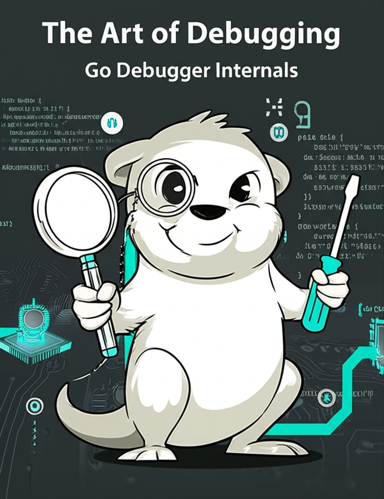

# 1 软件调试的艺术：Go语言调试器设计实现内幕

## 1.1 作者简介

大家好，我是张杰，目前担任腾讯（深圳）科技有限公司高级后台开发工程师。在腾讯的职业生涯中，我曾参与多个关键项目，包括 Now直播、腾讯看点、内容中台、QQ浏览器、三角洲行动 等产品。2018年7月–2019年3月，我为团队量身打造了微服务框架 GoNeat，它大幅提升了研发效率，并通过一系列可观测性建设显著优化了问题排查效率。2019年7月起，我投身公司技术治理工作，担任架构师和核心开发者，参与了腾讯微服务框架 [Tencent/trpc](https://github.com/Tencent/trpc) 的设计与实现。同时，我还积极探索 EPC 工程效能提升，并推动其在团队内落地。在 PCG/IEG 代码委员会期间，参与了公司代码规范讨论制定、lint工具开发、代码评审、工程素养培训相关工作。2022年7月，我加入 三角洲行动 项目组，主导完成了一系列基础技术建设、核心系统设计与上线筹备工作。这些经历不仅让我深入了解各类业务挑战与解决方案，也为我持续磨练技术、实现个人成长提供了宝贵机会。

我是高中毕业之后才开始接触计算机编程的，再经过大学系统性学习、毕业参加工作至今，一转眼十年过去。但是，计算机技术的发展始终吸引着我去学习、去思考、去探索更广阔的应用场景来丰富现实生活，而且乐此不疲。而“开源”让我接触了更大的世界，我很欣赏那种技术精湛、乐于分享甚至连指尖都洋溢着才华与天赋的工程师，并将这类人作为我的榜样。“在开源中学习，在开源中贡献”，写博客、写书、分享，也算是我对这种理念的一种支持和坚守吧。

## 1.2 为什么要写这本书

### 1.2.1 Go很有意思

这里首先提一下学习go语言的历程，如果不是因为go，我也不会接触到delve，便不会有这本书的诞生。

- 2016年开始接触go，起初还有点抵触，比如坚持用C来模拟Go特性，详见 [C实现Go风格并发](https://www.hitzhangjie.pro/libmill-book/)；
- 2018年 c\c++\java 服务器开发有了些沉淀，认识到go的优雅并开始在项目中使用；
- 多年实操、go源码、设计提案、调试跟踪等方式深入了解了go的设计实现，详见 [Go设计实现内幕](https://www.hitzhangjie.pro/go-internals-v0/)；
- 2025年开始，将过去多年的项目踩坑经验整理成书，陆续更新到公众号，详见 [Go&#34;安全&#34;编程](https://mp.weixin.qq.com/mp/appmsgalbum?__biz=MzU2NjY3MTc3MQ==&action=getalbum&album_id=3544414370141700100#wechat_redirect)；

如今go语言越来越完善、生态越来越好，go语言已经成为最受欢迎的编程语言之一。

### 1.2.2 调试器很有意思

计算机是个系统性工程，比如“一个程序是如何运行的”，看似简单的问题牵扯到了编程语言、编译器、链接器、操作系统、处理器、内存、总线控制等方方面面的内容，要掌握这些内容需要长时间的学习与实践。

新手学习go时，难免会遇到通过“调试”来排查问题的的情况，可能是排查逻辑bug or 语言设计如运行时、内存管理等复杂逻辑。[delve](https://github.com/go-delve/delve) 作为最流行的go语言调试器，在使用delve的过程中，我联想到可以从调试器角度切入来窥探计算机世界的秘密。不管是什么编程语言，只要有调试信息支持，总能借助调试器来窥探进程的运行过程。形象点的话可以联想下FPS游戏，一倍镜窥探代码执行，二倍镜窥探变量，三倍镜窥探类型系统，四倍镜窥探硬件特性……有什么能逃过调试器的法眼呢？

> ps: 如果较真，内核就需要内核级调试器，硬件就需要更加专门的手段来观察了 …… 这超出了本书的范畴。

本书希望能从调试器角度出发让开发者更好地理解编程语言、编译器、链接器、操作系统、调试器、硬件之间的联系，相比书籍课本上割裂式的教学，这样更能让读者感受到它们彼此间密切的协作，可以让开发者从更宏观的视角来审视软件开发的全貌。读完本书，开发者不光能掌握**go程序的高级调试技巧**，在日后的问题排查中事半功倍；开发者还将掌握**调试器开发和定制化能力**，如修改、扩展dlv调试器功能、编写starlark脚本实现dlv自动化调试等等；当然，也加深了对计算机系统全局的认识。

### 1.2.3 工程素养传承

有资历的工程师可能认为他们不再需要调试器，靠以往的经验和思路就可以高效定位问题。没错，资深工程确实减少了对调试器的依赖，但这不能论证调试器无用，只能说明某开发者在其专精的领域内排查问题已经得心应手。所以，我们不能简单地认同“~~**我们真的不需要调试器**~~”这个观点。实际上，是否需要调试器，更取决于具体问题的复杂性、时间精力的投入、现有排查手段的效率，以及对最终结果的要求等多方面因素的权衡。很多时候不是调试器无用，而是在当前情况下还没有到必须用调试器来解决问题的地步而已。

对一些稍显复杂的问题，或者为加深理解的一次探索，借助调试器的一次有效追根溯源过程，就可能将一类“疑惑”给彻底终结。这才是我们最需要调试器介入的情况。当然了，通过调试器调试跟踪也只是众多Debug手段中的一种而已。在我感兴趣的一些领域中，我就特别需要调试器来辅助跟踪代码执行路径的情况，当然这里的代码逻辑也不是写几个微服务调用、ifelse所能比的，这种情况下加日志、编译测试、走读代码显然都不是特别高效的选择。

> ps: 别管谁跟你说“~~**我们真的不需要调试器**~~”，你都要保持质疑的态度，“这家伙说的到底是什么情景下不需要”，不要被轻易带偏，更不要因为自己不精通“调试”，还想“偷懒”，就欣欣然接受别人的观点。不如多思考下，一个聪明人会如何进行调试？

我理解，调试器领域也确实沉淀了一些值得拿出来分享的东西，比如DWARF标准演进以支持更多语言特性，调试器架构演进以支持更多调试场景，如与IDE集成、跨平台调试、远程调试等，以及录制任意回放技术以实现确定性调试，等等。这些东西如果只停留在成熟稳定的项目代码中，或者少数几个核心贡献者的大脑里，未免太可惜了。

## 1.3 本书内容

本书以“从零开发Go语言调试器”为主线，旨在通过实战方式串联软件调试这一复杂领域涉及的多项核心技术。尽管业界已经有如gdb、delve这样成熟的调试器，我们重拾轮子，借助调试器开发实践，将go语言、操作系统、编译器、链接器、硬件架构等知识融会贯通，帮助开发者建立起对软件底层机制的系统性认识。开发过程中接触到大量命令行工具开发、网络服务器开发、系统级编程以及需要深入理解go语言设计实现的内容，相信读者朋友们一定会有所收获。

本书内容结构清晰，紧密围绕“从零开发Go语言调试器”的主线展开，依托各章节循序渐进，逐步深入。下面结合目录梳理各章节的核心内容：

- **第2-3章：前言与常用术语** —— 针对新手做简要引导，罗列调试器开发相关的核心术语，为后续阅读扫清知识障碍。
- **第4章：软件调试基础** —— 介绍调试的基本概念、目的、依赖条件和反调试技术，帮助读者建立调试的整体认知和背景知识。
- **第5章：走进调试器开发** —— 从零带读者设计和实现一个简单调试器雏形，讲解核心模块架构设计，分析不同实现方案及各自优劣，奠定后续工程基础。
- **第6章：开发Go指令级调试器godbg** —— 详细拆解指令级调试器的各主要功能实现：从进程启动、跟踪，到断点管理、单步执行、内存/寄存器查看与修改、支持多线程/多进程调试，直至ASLR机制与更多进阶话题，帮助读者系统掌握底层调试原理及实践。
- **第7章：挺进符号级调试器** —— 深入讲解Go程序二进制构建原理，elf文件、符号表、DWARF调试信息等知识，以及符号级调试器的功能模块实现，为观测和操作高层代码对象奠定基础。
- **第8章：调试信息标准DWARF剖析** —— 对DWARF标准进行详细剖析，帮助读者理解DWARF的结构、内容、以及如何使用DWARF进行调试，包括如何用DWARF对源码进行描述、如何解析DWARF数据。
- **第9章：实现完整的Go符号级调试器tinydbg** —— 以实际工程推进为主线，逐步攻克核心功能（源码级断点、单步、变量/栈帧/协程/goroutine等信息展示、watch、trace等），带领读者完成一个可用的Go符号级调试器，以及高级功能扩展。
- **第10~12章：更多高级话题** —— 调试器、日志系统、可观测系统的演进，bisect在debug中的引用，ebpf、录制重放、分布式系统调试、AI辅助调试，以及现代调试技术展望等相关内容，扩宽技术视野。

## 1.4 示例代码

**本书对应的示例代码，包括指令级调试器godbg、符号级调试器tinydbg、以及探索测试类代码golang-debugger-lessons：**

1. [**hitzhangjie/godbg**](https://github.com/hitzhangjie/godbg)，该项目提供了一个功能相对完整的 “**指令级调试器**” 实现，供读者测试、学习了解整体代码组织；
2. [**hitzhangjie/tinydbg**](https://github.com/hitzhangjie/tinydbg)，该项目提供了一个可用标准的 ”**符号级调试器**“ 实现，由 [dlv](https://github.com/go-delve/delve) 裁剪调整而来（剔除了与linux/amd64无关扩展，及高级功能）；
3. [**hitzhangjie/golang-debugger-lessons**](https://github.com/hitzhangjie/golang-debugger-lessons)，该项目按章节组织目录，每节实现目标在godbg、tinydbg落地前，会先在此项目中编写demo进行验证；

ps: [**hitzhangjie/godbg-debugger-lessons/0-godbg**](https://github.com/hitzhangjie/godbg)，该submodule即hitzhangjie/godbg。

**关于示例代码对应测试环境的一些补充说明**：

- godbg项目中提供了vscode的容器化开发配置 (详见./devcontainer/devcontainer.json)，指定的基础开发镜像是CentOS Stream9+go1.22.4。如果您更喜欢使用容器开发环境，您可以在vscode中安装插件 "Dev Conatiners"，在准备就绪后可以唤出Command Palette并选择 "Dev Containers: Reopen in Container"。
- 您也可以直接在Linux虚拟机或者Linux物理机中进行测试，请务必注意开发环境设置，Go版本必须>=go1.22并且<go1.25。
- 所有示例代码都是在linux/amd64平台架构下进行的测试，请您使用相同的环境进行测试。

> ps：关于上述Go版本约束的相关说明
>
> 1. Go版本不能低于go1.22：新版本才有的标准库函数旧版本无法正常编译，即使侥幸编译通过，实际产物也可能与书中内容描述有差异：
>
>    - go1.13将调试信息写入.zdebug_sections，但go1.19不再写入.zdebug_ sections（写入的是.debug_ sections并通过flag指明是否开压缩）；
>    - go1.14引入SIGURG支持抢占，如果使用更古老的go版本测试，这些SIGURG处理相关的代码永远不会被触发，可能会影响读者阅读和理解。
> 2. Go版本必须低于go1.25：因为go1.25已经推进到了DWARF v5，而本书基于Go1.13~Go1.24编写，这期间Go工具链使用的是DWARF v4；

## 1.5 联系方式

如果您有任何建议，请提[Issues](https://github.com/hitzhangjie/golang-debugger-book/issues)，或邮件联系 `hit.zhangjie@gmail.com`，标题中注明来意 `GoDebugger交流`。

希望该书及相关示例，能顺利完成，也算是我磨练心性、自我提高的一种方式，如果能对大家确实起到帮助的作用那是再好不过了。借此机会，我也想向 go-delve/delve 的维护人员 [derekparker](https://github.com/derekparker)、[aarzilli](https://github.com/aarzilli) 以及其他贡献者致以诚挚的敬意，没有你们多年来的贡献、沉淀，我也没有什么好学习总结分享的。

如果喜欢本书，请点个 [Star](https://github.com/hitzhangjie/golang-debugger-book) 对作者予以支持 :)
