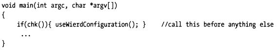

## 4.3 Countertactics

Give enough time and effort, any program can be reverse engineered. The goal, then, is to make it as painful as possible for a malicious engineer to figour out how things work. In light of this, there’re steps that you can take that will make it difficult for someone to peek at your program with a debugger. In this section, I will examine a few of these steps.

### 4.3.1 System Calls

#### 4.3.1.1 Windows
Some operating systems provides a special call that will indicate if the current process is being executed under the auspices of a debugger. For example, Windows KERNEL32.DLL exports a function named `IsDebuggerPresent()`. You can wrap this call in an innocuous little routine like chk().


The trick to this technique is to call chk() immediately. This will increase the likelihood that the code will get a chance to execute before the debugger encounters the first breakpoint.



If a debugger is present, you can force the program to behave strangely, and send the person debugging your application on a wild-goose chase. Debuggers are unique tools because they allow the user to observe a program from a neutral frame of reference. By inserted code like chk(), you are forcing the user into a warped quantum universe where the very act of observing influences the output of the program.

#### 4.3.1.2 Linux

In Linux, we may use other similar tricks to check whether a process is debugged or not. Usually we can check “`/proc/self/status`” for “**TracerPid**” attribute.

> On Linux, you can quickly check this, here is an example:
>
> ```go
> package main
> 
> import "fmt"
> import "os"
> 
> func main() {
> 
>         fmt.Println("vim-go, pid: %d", os.Getpid())
> }
> ```
>
> ```bash
> $ dlv debug main.go
> dlv> b main.main
> dlv> c
> dlv> n
> dlv> n
> dlv> vim-go, pid: 746
> ```
>
> ```bash
> >cat /proc/746/status | grep TracePid
> TracePid: 688
> > cat /proc/688/cmdline
> dlv debug main.go
> ```
>
> Now we confirmed this process is debugged by debugger `dlv`.

#### 4.3.1.X Others
Coming Soon ~

### 4.3.2 Remove Debugging Information

One simple way to make debugging more expensive is to remove debugging information from your deliverable. This can be done by stripping debug information (with a tool like GNU’s strip utility) or by setting your development tools to generate a release build.

Some business software companies prefer to strip debug information and accept the associated performance hit, because it allows sales engineers to perform an on-site diagnosis. When sales engineers make a house call, all that they need to do in order to take a look under the hood is insert the debug information and crank up a debugger.

The gcc compiler uses the **option -g** to insert debug information in the object code that it generates. If the option is not specified, then no symbol information will be included for debugging purposes.

If you try and debug this with gdb, it will complain that it cannot find any debugging symbols. The absence of debugging symbols will make it very difficult to see what’s going on in terms of anything but raw machine state.


The absence of debugging symbols will not stop everyone, some decompilers out there can take machine code and recast it as high-level source code. The good news is that these tools tend to generate code that is difficult to read and use arbitrary naming conventions. In other words, the cure is almost as bad as the illness.

### 4.3.3 Coding Salt

If memory footprint is not a big issue, and you don’t mind a slight performance hit, one way to foil a debugger is to periodically salt your code with unnecessary statements. This will make it easy for someone trying to reverse engineer your code to become lost among the trees and lose sight of the forest, so to speak.

In this manner, even if you shipped this program with debug symbols, it would be difficult to figure out what was happening (particularly if you believed that each statement had a legitimate purpose).

### 4.3.4 Mixed Memory Models

There’re robust debuggers, like SoftICE, that can gracefully make the jump between user mode and kernel mode. However, not many debuggers can make the jump between two different memory models. Windows in particular is guilty of allowing this kind of abomination to occur. On Windows, this phenomenon is generally known as thunking, and it allows 16-bit code and 32-bit code to fraternize.

Following depicts the thunking techniques used in Windows:


