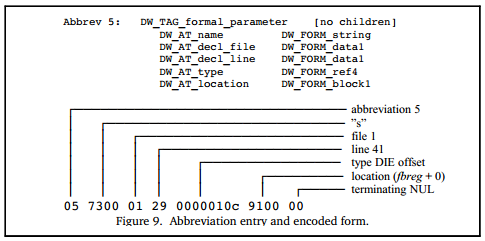

### 5.3.4 数据编码

DWARF数据在概念上是DIE构成的树，一个DIE可能具有孩子DIE或者兄弟DIE，每个DIE可能具有多个属性。 DWARF数据有很多冗余，数据量也比较大，因此必须对其进行压缩以减小大小，然后将压缩后的数据存储到目标文件中。

DWARF提供了几种压缩数据的方法：

- 通过树前序遍历使树结构扁平化  

  前序遍历DWARF中DIEs树，每访问到一个树节点（DIE）就存储起来。 通过这种方式，消除了DIE及其子DIE和兄弟DIE之间的链接。 当读取DWARF数据时，可能需要跳转到下一个兄弟DIE，兄弟DIE可通过属性存储在当前DIE中。

- 使用缩写以避免存储重复的值  

DIE中不直接存储tag值和attributes kvpairs，将tag值和attributes类型存储到缩写表中，DIE中仅存储缩写表中的索引，并跟着属性值。 每个缩写均包含tag值、指示该DIE是否具有孩子DIE的flag，以及具有其期望值类型的属性列表。

因为DIE的tag、包含的属性列表往往是相同的，不同的是属性值，通过缩写表+索引的方式可以增加复用的次数，减少对存储空间的占用。图 9是一个使用缩写表的示例：

DWARF v3、v4中还有种压缩数据的方法，允许从一个编译单元引用存储在另一编译单元中的DWARF数据，但不常用。