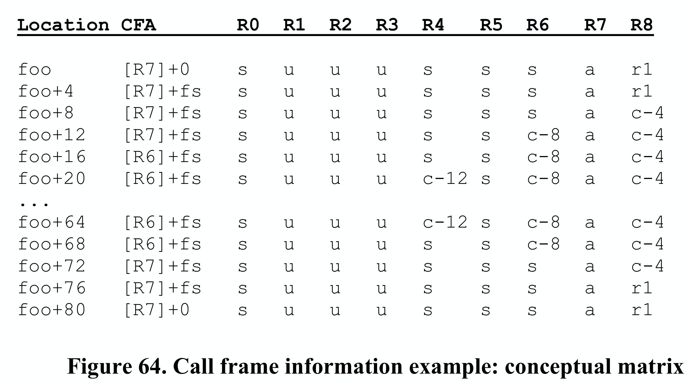

### 5.4.3 Call Frame Information 

#### 5.4.3.0 Introduction

Dwarf call frame information (CFI) provides the debugger enough information about how a function is called, how to locate the parameters to the functions, how to locate the return address, how to locate the call frame for the calling function. This information is used by the debugger to unwind the stack, locating the previous function, the location where the function is called, and the values passed. 

Like the line number table, CFI is also encoded as a sequence of instructions that are interpreted to generate a table. There’s one row for each address that contains code. The first column contains the machine address, while others contain the registers’ values (actually, unwind rules) at when instruction at that address is executed. Like the line number table, the complete CFI is huge. Luckily, there’s very little change between two instructions, so the CFI encoding is quite compact. 

#### 5.4.3.1 Subroutine Activation (or Call Frame)

Debuggers often need to be able to **view and modify the state of any subroutine activation** that is on the call stack. An activation consists of:

- A code location that is within the subroutine. This location is either the place where the program stopped when the debugger got control (e.g. a breakpoint), or is a place where a subroutine made a call or was interrupted by an asynchronous event (e.g. a signal).
- An area of memory that is allocated on a stack called a “call frame.” The call frame is identified by an address on the stack. We refer to this address as the **Canonical Frame Address or CFA**. Typically, the CFA is defined to be the value of the stack pointer at the call site in the previous frame (which may be different from its value on entry to the current frame).
- A set of registers that are in use by the subroutine at the code location.

Typically, a set of registers are designated to be preserved across a call. If a callee wishes to use such a register, it saves the value that the register had at entry time in its call frame and restores it on exit. The code that allocates space on the call frame stack and performs the save operation is called the subroutine’s prologue, and the code that performs the restore operation and deallocates the frame is called its epilogue. Typically, the prologue code is physically at the beginning of a subroutine and the epilogue code is at the end.

To be able to view or modify an activation that is not on the top of the call frame stack, the debugger must **“virtually unwind” the stack of activations** until it finds the activation of interest. A debugger unwinds a stack in steps. Starting with the current activation it virtually restores any registers that were preserved by the current activation and computes the predecessor’s CFA and code location. This has the logical effect of returning from the current subroutine to its predecessor. We say that the debugger virtually unwinds the stack because the actual state of the target process is unchanged.

#### 5.4.3.2 Arch-Independent Way of Encoding

The unwinding operation needs to know where registers are saved and how to compute the predecessor’s CFA and code location. When considering an architecture-independent way of encoding this information one has to consider a number of special things.

- Prologue and epilogue code is not always in distinct blocks at the beginning and end of a subroutine. It is common to duplicate the epilogue code at the site of each return from the code. Sometimes a compiler breaks up the register save/unsave operations and moves them into the body of the subroutine to just where they are needed.
- Compilers use different ways to manage the call frame. Sometimes they use a frame pointer register, sometimes not.
- The algorithm to compute CFA changes as you progress through the prologue and epilogue code. (By definition, the CFA value does not change.)
- Some subroutines have no call frame.
- Sometimes a register is saved in another register that by convention does not need to be
  saved.
- Some architectures have special instructions that perform some or all of the register management in one instruction, leaving special information on the stack that indicates how registers are saved.
- Some architectures treat return address values specially. For example, in one architecture, the call instruction guarantees that the low order two bits will be zero and the return instruction ignores those bits. This leaves two bits of storage that are available to other uses that must be treated specially.

#### 5.4.3.3 Structure of Call Frame Information

DWARF supports virtual unwinding by defining an architecture independent basis for recording how procedures save and restore registers during their lifetimes. This basis must be augmented on some machines with specific information that is defined by an architecture specific ABI authoring committee, a hardware vendor, or a compiler producer. The body defining a specific augmentation is referred to below as the “augmenter.”

Abstractly, this mechanism describes a very large table that has the following structure:

The first column indicates an address for every location that contains code in a program. (In shared objects, this is an object-relative offset.) The remaining columns contain virtual unwinding rules that are associated with the indicated location.

The CFA column defines the rule which computes the Canonical Frame Address value; it may be either a register and a signed offset that are added together, or a DWARF expression that is evaluated.

The remaining columns are labeled by register number. This includes some registers that have special designation on some architectures such as the PC and the stack pointer register. (The actual mapping of registers for a particular architecture is defined by the augmenter.) The register columns contain rules that describe whether a given register has been saved and the rule to find the value for the register in the previous frame.

The register rules are:

- undefined, A register that has this rule has no recoverable value in the previous frame. (By convention, it is not preserved by a callee.)
- same value, This register has not been modified from the previous frame. (By convention, it is preserved by the callee, but the callee has not modified it.)
- offset(N), The previous value of this register is saved at the address CFA+N where CFA is the current CFA value and N is a signed offset.
- val_offset(N), The previous value of this register is the value CFA+N where CFA is the current CFA value and N is a signed offset.
- register(R), The previous value of this register is stored in another register numbered R.
- expression(E), The previous value of this register is located at the address produced by
  executing the DWARF expression E.
- val_expression(E), The previous value of this register is the value produced by executing the
  DWARF expression E.
- architectural, The rule is defined externally to this specification by the augmenter.

This table would be extremely large if actually constructed as described. Most of the entries at any point in the table are identical to the ones above them. The whole table can be represented quite compactly by recording just the differences starting at the beginning address of each subroutine in the program.

The virtual unwind information is encoded in a self-contained section called .debug_frame. Entries in a .debug_frame section are aligned on a multiple of the address size relative to the start of the section and come in two forms: a Common Information Entry (CIE) and a Frame Description Entry (FDE).

If the range of code addresses for a function is not contiguous, there may be multiple CIEs and FDEs corresponding to the parts of that function.

##### 5.4.3.3.1 Common Information Entry

A Common Information Entry holds information that is shared among many Frame Description Entries. There is at least one CIE in every non-empty .debug_frame section. A CIE contains the following fields, in order:

1. length (initial length)
   A constant that gives the number of bytes of the CIE structure, not including the length field itself (see Section 7.2.2). The size of the length field plus the value of length must be an integral multiple of the address size.

2. CIE_id (4 or 8 bytes, see Section 7.4)
   A constant that is used to distinguish CIEs from FDEs.

3. version(ubyte)
   A version number (see Section 7.23). This number is specific to the call frame information and is independent of the DWARF version number.

4. augmentation (UTF-8 string)
   A null-terminated UTF-8 string that identifies the augmentation to this CIE or to the FDEs that use it. If a reader encounters an augmentation string that is unexpected, then only the following fields can be read:

   - CIE: length, CIE_id, version, augmentation
   - FDE: length, CIE_pointer, initial_location, address_range
     If there is no augmentation, this value is a zero byte.
     The augmentation string allows users to indicate that there is additional target-specific information in the CIE or FDE which is needed to unwind a stack frame. For example, this might be information about dynamically allocated data which needs to be freed on exit from the routine.
     Because the .debug_frame section is useful independently of any .debug_info section, the augmentation string always uses UTF-8 encoding.

5. address_size (ubyte)
   The size of a target address in this CIE and any FDEs that use it, in bytes. If a compilation
   unit exists for this frame, its address size must match the address size here.

6. segment_size (ubyte)

   The size of a segment selector in this CIE and any FDEs that use it, in bytes.

7. code_alignment_factor (unsigned LEB128)
   A constant that is factored out of all advance location instructions (seeSection 6.4.2.1).
8. data_alignment_factor (signed LEB128)
   A constant that is factored out of certain offset instructions (see below). The resulting value is (operand * data_alignment_factor).
9. return_address_register (unsigned LEB128)
   An unsigned LEB128 constant that indicates which column in the rule table represents the return address of the function. Note that this column might not correspond to an actual machine register.
10. initial_instructions (array of ubyte)
    A sequence of rules that are interpreted to create the initial setting of each column in the
    table.
    The default rule for all columns before interpretation of the initial instructions is the undefined rule. However, an ABI authoring body or a compilation system authoring body may specify an alternate default value for any or all columns.
11. padding (array of ubyte)
    Enough DW_CFA_nop instructions to make the size of this entry match the length value
    above.

##### 5.4.3.3.2 Frame Descriptor Entry

An FDE contains the following fields, in order:

1. length (initial length)
   A constant that gives the number of bytes of the header and instruction stream for this function, not including the length field itself (see Section 7.2.2). The size of the length field plus the value of length must be an integral multiple of the address size.
2. CIE_pointer (4 or 8 bytes, see Section 7.4)
   A constant offset into the .debug_frame section that denotes the CIE that is associated with
   this FDE.
3. initial_location (segment selector and target address)
   The address of the first location associated with this table entry. If the segment_size field of this FDE's CIE is non-zero, the initial location is preceded by a segment selector of the given length.
4. address_range (target address)
   The number of bytes of program instructions described by this entry.
5. instructions (array of ubyte)
   A sequence of table defining instructions that are described below.
6. padding (array of ubyte)
   Enough DW_CFA_nop instructions to make the size of this entry match the length value above.

#### 5.4.3.4 Call Frame Instructions

Each call frame instruction is defined to take 0 or more operands. Some of the operands may be encoded as part of the opcode (see Section 7.23). The instructions are defined in the following sections.
Some call frame instructions have operands that are encoded as DWARF expressions (see Section 2.5.1). The following DWARF operators cannot be used in such operands:

- DW_OP_call2, DW_OP_call4 and DW_OP_call_ref operators are not meaningful in an operand of these instructions because there is no mapping from call frame information to any corresponding debugging compilation unit information, thus there is no way to interpret the call offset.
- DW_OP_push_object_address is not meaningful in an operand of these instructions because there is no object context to provide a value to push.
- DW_OP_call_frame_cfa is not meaningful in an operand of these instructions because its use would be circular.

Call frame instructions to which these restrictions apply include DW_CFA_def_cfa_expression, DW_CFA_expression and DW_CFA_val_expression.

##### 5.4.3.4.1 Row Creation Instructions

1. DW_CFA_set_loc
The DW_CFA_set_loc instruction takes a single operand that represents a target address. The required action is to create a new table row using the specified address as the location. All other values in the new row are initially identical to the current row. The new location value is always greater than the current one. If the segment_size field of this FDE's CIE is non- zero, the initial location is preceded by a segment selector of the given length.
2. DW_CFA_advance_loc
The DW_CFA_advance instruction takes a single operand (encoded with the opcode) that represents a constant delta. The required action is to create a new table row with a location value that is computed by taking the current entry’s location value and adding the value of delta * code_alignment_factor. All other values in the new row are initially identical to the current row.
3. DW_CFA_advance_loc1
The DW_CFA_advance_loc1 instruction takes a single ubyte operand that represents a constant delta. This instruction is identical to DW_CFA_advance_loc except for the encoding and size of the delta operand.
4. DW_CFA_advance_loc2
The DW_CFA_advance_loc2 instruction takes a single uhalf operand that represents a constant delta. This instruction is identical to DW_CFA_advance_loc except for the encoding and size of the delta operand.
5. DW_CFA_advance_loc4
The DW_CFA_advance_loc4 instruction takes a single uword operand that represents a constant delta. This instruction is identical to DW_CFA_advance_loc except for the encoding and size of the delta operand.

##### 5.4.3.4.2 CFA Definition Instructions

1. DW_CFA_def_cfa
The DW_CFA_def_cfa instruction takes two unsigned LEB128 operands representing a register number and a (non-factored) offset. The required action is to define the current CFA rule to use the provided register and offset.
2. DW_CFA_def_cfa_sf
The DW_CFA_def_cfa_sf instruction takes two operands: an unsigned LEB128 value representing a register number and a signed LEB128 factored offset. This instruction is identical to DW_CFA_def_cfa except that the second operand is signed and factored. The resulting offset is factored_offset * data_alignment_factor.
3. DW_CFA_def_cfa_register
The DW_CFA_def_cfa_register instruction takes a single unsigned LEB128 operand representing a register number. The required action is to define the current CFA rule to use the provided register (but to keep the old offset). This operation is valid only if the current CFA rule is defined to use a register and offset.
4. DW_CFA_def_cfa_offset
The DW_CFA_def_cfa_offset instruction takes a single unsigned LEB128 operand representing a (non-factored) offset. The required action is to define the current CFA rule to use the provided offset (but to keep the old register). This operation is valid only if the current CFA rule is defined to use a register and offset.
5. DW_CFA_def_cfa_offset_sf
The DW_CFA_def_cfa_offset_sf instruction takes a signed LEB128 operand representing a factored offset. This instruction is identical to DW_CFA_def_cfa_offset except that the operand is signed and factored. The resulting offset is factored_offset * data_alignment_factor. This operation is valid only if the current CFA rule is defined to use a register and offset.
6. DW_CFA_def_cfa_expression
The DW_CFA_def_cfa_expression instruction takes a single operand encoded as a DW_FORM_exprloc value representing a DWARF expression. The required action is to establish that expression as the means by which the current CFA is computed.
See Section 6.4.2 regarding restrictions on the DWARF expression operators that can be used.

##### 5.4.3.4.3 Register Rule Instructions

1. DW_CFA_undefined
The DW_CFA_undefined instruction takes a single unsigned LEB128 operand that represents a register number. The required action is to set the rule for the specified register to “undefined.”
2. DW_CFA_same_value
The DW_CFA_same_value instruction takes a single unsigned LEB128 operand that represents a register number. The required action is to set the rule for the specified register to “same value.”
3. DW_CFA_offset
The DW_CFA_offset instruction takes two operands: a register number (encoded with the opcode) and an unsigned LEB128 constant representing a factored offset. The required action is to change the rule for the register indicated by the register number to be an offset(N) rule where the value of N is factored offset * data_alignment_factor.
4. DW_CFA_offset_extended
The DW_CFA_offset_extended instruction takes two unsigned LEB128 operands representing a register number and a factored offset. This instruction is identical to DW_CFA_offset except for the encoding and size of the register operand.
5. DW_CFA_offset_extended_sf
The DW_CFA_offset_extended_sf instruction takes two operands: an unsigned LEB128 value representing a register number and a signed LEB128 factored offset. This instruction is identical to DW_CFA_offset_extended except that the second operand is signed and factored. The resulting offset is factored_offset * data_alignment_factor.
6. DW_CFA_val_offset
The DW_CFA_val_offset instruction takes two unsigned LEB128 operands representing a register number and a factored offset. The required action is to change the rule for the register indicated by the register number to be a val_offset(N) rule where the value of N is factored_offset * data_alignment_factor.
7. DW_CFA_val_offset_sf
The DW_CFA_val_offset_sf instruction takes two operands: an unsigned LEB128 value representing a register number and a signed LEB128 factored offset. This instruction is identical to DW_CFA_val_offset except that the second operand is signed and factored. The resulting offset is factored_offset * data_alignment_factor.
8. DW_CFA_register
The DW_CFA_register instruction takes two unsigned LEB128 operands representing register numbers. The required action is to set the rule for the first register to be register(R) where R is the second register.
9. DW_CFA_expression
The DW_CFA_expression instruction takes two operands: an unsigned LEB128 value representing a register number, and a DW_FORM_block value representing a DWARF expression. The required action is to change the rule for the register indicated by the register number to be an expression(E) rule where E is the DWARF expression. That is, the DWARF expression computes the address. The value of the CFA is pushed on the DWARF evaluation stack prior to execution of the DWARF expression.
See Section 6.4.2 regarding restrictions on the DWARF expression operators that can be used.
10. DW_CFA_val_expression
The DW_CFA_val_expression instruction takes two operands: an unsigned LEB128 value representing a register number, and a DW_FORM_block value representing a DWARF expression. The required action is to change the rule for the register indicated by the register number to be a val_expression(E) rule where E is the DWARF expression. That is, the DWARF expression computes the value of the given register. The value of the CFA is pushed on the DWARF evaluation stack prior to execution of the DWARF expression.
See Section 6.4.2 regarding restrictions on the DWARF expression operators that can be used.
11. DW_CFA_restore
The DW_CFA_restore instruction takes a single operand (encoded with the opcode) that represents a register number. The required action is to change the rule for the indicated register to the rule assigned it by the initial_instructions in the CIE.
12. DW_CFA_restore_extended
The DW_CFA_restore_extended instruction takes a single unsigned LEB128 operand that represents a register number. This instruction is identical to DW_CFA_restore except for the encoding and size of the register operand.

##### 5.4.3.4.4 Row State Instructions

The next two instructions provide the ability to stack and retrieve complete register states. They may be useful, for example, for a compiler that moves epilogue code into the body of a function.
1. DW_CFA_remember_state
The DW_CFA_remember_state instruction takes no operands. The required action is to push the set of rules for every register onto an implicit stack.
2. DW_CFA_restore_state
The DW_CFA_restore_state instruction takes no operands. The required action is to pop the set of rules off the implicit stack and place them in the current row.

##### 5.4.3.4.5 Padding Instruction

1. DW_CFA_nop
The DW_CFA_nop instruction has no operands and no required actions. It is used as padding to make a CIE or FDE an appropriate size.

#### 5.4.3.5 Call Frame Instruction Usage

To determine the virtual unwind rule set for a given location (L1), one searches through the FDE headers looking at the initial_location and address_range values to see if L1 is contained in the FDE. If so, then:
1. Initialize a register set by reading the initial_instructions field of the associated CIE.
2. Read and process the FDE’s instruction sequence until a DW_CFA_advance_loc,
DW_CFA_set_loc, or the end of the instruction stream is encountered.
3. If a DW_CFA_advance_loc or DW_CFA_set_loc instruction is encountered, then compute a new location value (L2). If L1 >= L2 then process the instruction and go back to step 2.
4. The end of the instruction stream can be thought of as a DW_CFA_set_loc (initial_location + address_range) instruction. Note that the FDE is ill-formed if L2 is less than L1.
The rules in the register set now apply to location L1. For an example, see Appendix D.6.

#### 5.4.3.6 Call Frame Calling Address

When unwinding frames, consumers frequently wish to obtain the address of the instruction which called a subroutine. This information is not always provided. Typically, however, one of the registers in the virtual unwind table is the Return Address.

If a Return Address register is defined in the virtual unwind table, and its rule is undefined (for example, by DW_CFA_undefined), then there is no return address and no call address, and the virtual unwind of stack activations is complete.

In most cases the return address is in the same context as the calling address, but that need not be the case, especially if the producer knows in some way the call never will return. The context of the 'return address' might be on a different line, in a different lexical block, or past the end of the calling subroutine. If a consumer were to assume that it was in the same context as the calling address, the unwind might fail.

For architectures with constant-length instructions where the return address immediately follows the call instruction, a simple solution is to subtract the length of an instruction from the return address to obtain the calling instruction. For architectures with variable-length instructions (e.g. x86), this is not possible. However, subtracting 1 from the return address, although not guaranteed to provide the exact calling address, generally will produce an address within the same context as the calling address, and that usually is sufficient.

#### 5.4.3.7 Example

##### 5.4.3.7.1 Target Info

The following example uses a hypothetical RISC machine in the style of the Motorola 88000.
- Memory is byte addressed.

- Instructions are all 4 bytes each and word aligned.

- Instruction operands are typically of the form:
  <destination.reg>, <source.reg>, <constant>

- The address for the load and store instructions is computed by adding the contents of the source register with the constant.

- There are 8 4-byte registers:
  R0 always 0
  R1 holds return address on call
  R2-R3 temp registers (not preserved on call) 

  R4-R6 preserved on call
  R7 stack pointer.

- The stack grows in the negative direction.

- The architectural ABI committee specifies that the stack pointer (R7) is the same as the CFA

##### 5.4.3.7.2 Instruction Fragments of `foo`

The following are two code fragments from a subroutine called foo that uses a frame pointer (in addition to the stack pointer). The first column values are byte addresses. <fs> denotes the stack frame size in bytes, namely 12.

##### 5.4.3.7.3 CFI table of `foo`

An abstract table (see Section 6.4.1) for the foo subroutine is shown in Figure 64. Corresponding fragments from the .debug_frame section are shown in Figure 65.
The following notations apply in Figure 64:

1. R8 is the return address 
2. s = same_value rule
3. u = undefined rule
4. rN = register(N) rule 
5. cN = offset(N) rule
6. a = architectural rule

##### 5.4.3.7.4 CIE.initial_instruction creates the 1st row of CFI table

##### 5.4.3.7.5 FDEs.instructions create the following rows of CFI table

**How does FDE.instructions created?**

Actually, after the source code will be transformed to machine instructions by build toolchain, we can analyze instructions. Each instruction has different address, and its effect on registers can be worked out. According to this, we can use `row create rule` to advance the address, and we can use `register unwind rules` to record the changes to registers. All the rules combined fullfill the FDE’s instructions field.

That’s how FDE’s instructions built.

**Now let’s look at the FDE’s instructions.** If you’re interested how FDE’s instructions are built, you can compare the Figure 63 instructions with Figure 65 FDE’s instructions, it’s not difficult to understand the association between them.

The following notations apply in Figure 66:

1. <fs> = frame size
2. <caf> = code alignment factor
3. <daf> = data alignment factor

Now I think we have mastered the knowledge and thinks behind Call Frame Information.

