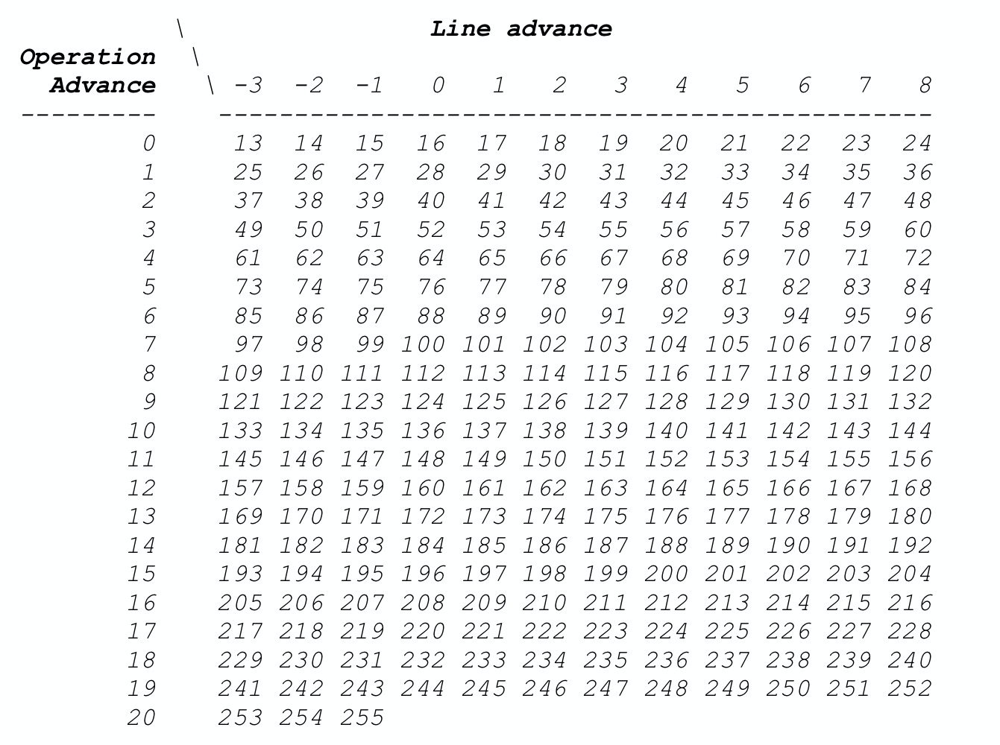

### 5.4.1 Line Number Table 

#### 5.4.1.1 Introduction

A source-level debugger will need to know how to associate locations in the source files with the corresponding machine instruction addresses in the executable object or the shared objects used by that executable object. Such an association would make it possible for the debugger user to specify machine instruction addresses in terms of source locations. This would be done by specifying the line number and the source file containing the statement. The debugger can also use this information to display locations in terms of the source files and to single step from line to line, or statement to statement.

Line number information generated for a compilation unit is represented in the **.debug_line** section of an object file and is referenced by a corresponding compilation unit debugging information entry (see Section 3.1.1 in DWARF v4) in the .debug_info section.

The Dwarf line number table contains the mapping between the memory address of executable code of a program and the source lines that corresponds to these address. 

#### 5.4.1.2 Structure

In the simplest form, this can be looked as a matrix with following columns:

- instruction address
- source filename
- source line number
- source column number
- whether is the beginning of source statement
- whether is the beginning of source block
- and or so

One column contains the instruction address while another 3 columns contain the source line triplet (file, line, column). Another 2 columns indicating whether it’s the beginning of source statement and source block. When setting a breakpoint of a source line, query this table to find the first instruction and set a breakpoint. When program has a fault during execution, query current instruction address related source line to analyze it.

##### 5.4.1.3 Compress Data

As we imagined, if this table were stored with one row one each instruction, this line number table would be too huge. How to compress it? 

We shrink it with two techniques. 

- First, we delete from the matrix each row whose file, line, source column and discriminator information is identical with that of its predecessors. Any deleted row would never be the beginning of a source statement. 
- Second, we design a byte-coded language for a state machine and store a stream of bytes in the object file instead of the matrix. This language can be much more compact than the matrix. 

Dwarf encodes it as a sequence of instructions called a line number table program. These instructions are interpreted by a simple finite state machine to recreate the complete line number table. Also, when recreating the complete line number table, only the first machine instruction of each source statement is stored into the table.

By means of this, line number table is compressed. 

#### 5.4.1.4 Design Internals

##### 5.4.1.4.1 Definitions

The following terms are used in the description of the line number information format:

- state machine, The hypothetical machine used by a consumer of the line number information to expand the byte-coded instruction stream into a matrix of line number information.
- line number program, A series of byte-coded linenumber information instructions representing one compilation unit.
- basic block, A sequence of instructions where only the first instruction may be a branch target and only the last instruction may transfer control. A procedure invocation is defined to be an exit from a basic block.
- sequence, A basic block does not necessarily correspond to a specific source code construct.
  A series of contiguous target machine instructions. One compilation unit may emit multiple sequences (that is, not all instructions within a compilation unit are assumed to be contiguous).

##### 5.4.1.4.2 State Machine Registers

The line number information state machine has the following registers:

- address, The program-counter value corresponding to a machine instruction generated by the compiler.

- op_index, An unsigned integer representing the index of an operation within a VLIW instruction. The index of the first operation is 0. For non-VLIW architectures, this register will always be 0.
  The address and op_index registers, taken together, form an operation pointer that can reference any individual operation with the instruction stream.

- file, An unsigned integer indicating the identity of the source file corresponding to a machine instruction.

- line, An unsigned integer indicating a source line number. Lines are numbered beginning at 1. The compiler may emit the value 0 in cases where an instruction cannot be attributed to any source line.

- column, An unsigned integer indicating a column number within a source line. Columns are numbered beginning at 1. The value 0 is reserved to indicate that a statement begins at the “left edge” of the line.

- is_stmt, A boolean indicating that the current instruction is a recommended breakpoint location. A recommended breakpoint location is intended to “represent” a line, a statement and/or a semantically distinct subpart of a statement.

- basic_blcok, A boolean indicating that the current instruction is the beginning of a basic block.

- end_sequence, A boolean indicating that the current address is that of the first byte after the end of a sequence of target machine instructions. end_sequence terminates a sequence of lines; therefore other information in the same row is not meaningful.

- prologue_end, A boolean indicating that the current address is one (of possibly many) where execution should be suspended for an entry breakpoint of a function.

- epilogue_begin, A boolean indicating that the current address is one (of possibly many) where execution should be suspended for an exit breakpoint of a function.

- isa, An unsigned integer whose value encodes the applicable instruction set architecture for the current instruction.

- discriminator, An unsigned integer identifying the block to which the current instruction belongs. Discriminator values are assigned arbitrarily by the DWARF producer and serve to distinguish among multiple blocks that may all be associated with the same source file, line, and column. Where only one block exists for a given source position, the discriminator value should be zero.

At the beginning of each sequence within a line number program, the state of the registers is:


##### 5.4.1.4.3 Line Number Program Instructions

The state machine instructions in a line number program belong to one of three categories:

- special opcodes, These have a ubyte opcode field and no operands. Most of the instructions in a line number program are special opcodes.
- standard opcodes, These have a ubyte opcode field which may be followed by zero or more LEB128 operands (except for DW_LNS_fixed_advance_pc, see below). The opcode implies the number of operands and their meanings, but the line number program header also specifies the number of operands for each standard opcode.
- extended opcodes, These have a multiple byte format. The first byte is zero; the next bytes are an unsigned LEB128 integer giving the number of bytes in the instruction itself (does not include the first zero byte or the size). The remaining bytes are the instruction itself (which begins with a ubyte extended opcode).

##### 5.4.1.4.4 The Line Number Program Header

The optimal encoding of line number information depends to a certain degree upon the architecture of the target machine. The line number program header provides information used by consumers in decoding the line number program instructions for a particular compilation unit and also provides information used throughout the rest of the line number program.
The line number program for each compilation unit begins with a header containing the following fields in order:

- unit_length (initial length), The size in bytes of the line number information for this compilation unit, not including the unit_length field itself (see DWARF v4 Section 7.2.2).
- version (uhalf), A version number (see DWARF v4 Appendix F). This number is specific to the line number information and is independent of the DWARF version number.
- header_length, The number of bytes following the header_length field to the beginning of the first byte of the line number program itself. In the 32-bit DWARF format, this is a 4-byte unsigned length; in the 64-bit DWARF format, this field is an 8-byte unsigned length (see DWARF v4 Section 7.4).
- minimum_instruction_length (ubyte), The size in bytes of the smallest target machine instruction. Line number program opcodes that alter the address and op_index registers use this and maximum_operations_per_instruction in their calculations.
- maximum_operations_per_instruction (ubyte), The maximum number of individual operations that may be encoded in an instruction. Line number program opcodes that alter the address and op_index registers use this and minimum_instruction_length in their calculations.
- default_is_stmt (ubyte), The initial value of the is_stmt register.
  A simple approach to building line number information when machine instructions are emitted in an order corresponding to the source program is to set default_is_stmt to “true” and to not change the value of the is_stmt register within the line number program. One matrix entry is produced for each line that has code generated for it. The effect is that every entry in the matrix recommends the beginning of each represented line as a breakpoint location. This is the traditional practice for unoptimized code.
  A more sophisticated approach might involve multiple entries in the matrix for a line number; in this case, at least one entry (often but not necessarily only one) specifies a recommended breakpoint location for the line number. DW_LNS_negate_stmt opcodes in the line number program control which matrix entries constitute such a recommendation and default_is_stmt might be either “true” or “false”. This approach might be used as part of support for debugging optimized code.
- line_base (sbyte), This parameter affects the meaning of the special opcodes. See below.
- line_range (ubyte), This parameter affects the meaning of the special opcodes. See below.
- opcode_base (ubyte), The number assigned to the first special opcode.
  Opcode base is typically one greater than the highest-numbered standard opcode defined for the specified version of the line number information (12 in DWARF Version 3 and Version 4, 9 in Version 2). If opcode_base is less than the typical value, then standard opcode numbers greater than or equal to the opcode base are not used in the line number table of this unit (and the codes are treated as special opcodes). If opcode_base is greater than the typical value, then the numbers between that of the highest standard opcode and the first special opcode (not inclusive) are used for vendor specific extensions.
- standard_opcode_lengths (array of ubyte), This array specifies the number of LEB128 operands for each of the standard opcodes. The first element of the array corresponds to the opcode whose value is 1, and the last element corresponds to the opcode whose value is opcode_base - 1.
- include_directories (sequence of path names), Entries in this sequence describe each path that was searched for included source files in this compilation.
- file_names (sequence of file entries), Entries in this sequence describe source files that contribute to the line number information for this compilation unit or is used in other contexts, such as in a declaration coordinate or a macro file inclusion.

##### 5.4.1.4.5 The Line Number Program

As stated before, the goal of a line number program is to build a matrix representing one compilation unit, which may have produced multiple sequences of target machine instructions. Within a sequence, addresses (operation pointers) may only increase. (Line numbers may decrease in cases of pipeline scheduling or other optimization.)

The line number program is made up of special opcodes, standard opcodes, and extended opcodes. Here we only describe special opcodes. If you’re interested in standard opcodes or extended opcodes, please refer to DWARF v4 standards 6.2.5.2 and 6.2.5.3.

Each ubyte special opcode has the following effect on the state machine:
1. Add a signed integer to the line register.
2. Modify the operation pointer by incrementing the address and op_index registers as described below.
3. Append a row to the matrix using the current values of the state machine registers.
4. Set the basic_block register to “false.”
5. Set the prologue_end register to “false.”
6. Set the epilogue_begin register to “false.”
7. Set the discriminator register to 0.

All of the special opcodes do those same seven things; they differ from one another only in what
values they add to the line, address and op_index registers.

A special opcode value is chosen based on the amount that needs to be added to the line, address and op_index registers. The maximum line increment for a special opcode is the value of the line_base field in the header, plus the value of the line_range field, minus 1 (line_base + line_range - 1). If the desired line increment is greater than the maximum line increment, a standard opcode must be used instead of a special opcode. The operation advance represents the number of operations to skip when advancing the operation pointer.

**The special opcode is then calculated using the following formula:**

```
opcode = (desired line increment - line_base) + (line_range * operation advance) + opcode_base
```

If the resulting opcode is greater than 255, a standard opcode must be used instead.

When *maximum_operations_per_instruction* is 1, the *operation advance* is simply the address increment divided by the *minimum_instruction_length*.

**To decode a special opcode**, subtract the opcode_base from the opcode itself to give the adjusted opcode. The operation advance is the result of the adjusted opcode divided by the line_range. The new address and *op_index* values are given by:

```
adjusted opcode = opcode – opcode_base 
operation advance = adjusted opcode / line_range

new address = address + 
			minimum_instruction_length *
			((op_index + operation advance)/maximum_operations_per_instruction) 

new op_index = (op_index + operation advance) % maximum_operations_per_instruction
```

When the *maximum_operations_per_instruction* field is 1, *op_index* is always 0 and these calculations simplify to those given for addresses in DWARF Version v3. The amount to increment the line register is the line_base plus the result of the adjusted opcode modulo the line_range. That is:

```
line increment = line_base + (adjusted opcode % line_range)
```

As an example, **suppose that the opcode_base is 13, line_base is -3, line_range is 12, minimum_instruction_length is 1 and maximum_operations_per_instruction is 1**. This means that we can use a special opcode whenever two successive rows in the matrix have source line numbers differing by any value within the range [-3, 8] and (because of the limited number of opcodes available) when the difference between addresses is within the range [0, 20], but not all line advances are available for the maximum operation advance (see below).

**The opcode mapping would be:**



#### 5.4.1.5 Examples

Consider the simple source file and the resulting machine code for the Intel 8086 processor in Figure 60.


Let's try to build the Line Number Table Program step by step. Actually, we compile source code to assembly, then we calculate the increment of instruction address and line number of every successive statements’. 

For example, `2: main()` and `4: printf`, the increment of the statements' first instruction address is `0x23c-0x239=3`, the increment of line number of the statements is `4-2=2`. Then we can use `Special(lineIncr,operationAdvance)` to encode a special opcode, here it is ``Special(2, 3)`.


Remember the formular:

 `opcode = (desired line increment - line_base) + (line_range * operation advance) + opcode_base`

Suppose the line number program header includes the following (header fields not needed below are not shown):


Then:

```
opcode = (2 - 1) + (15 * 3) + 10 = 56 = 0x38
```

Then we handle all the statements, we could get the following program:


If we want to build the full Line Number Table, we read the Line Number Table first, then the State Machine decode the opcode and get the line increment and operation advance, then we can build the full matrix.