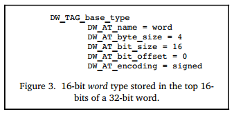
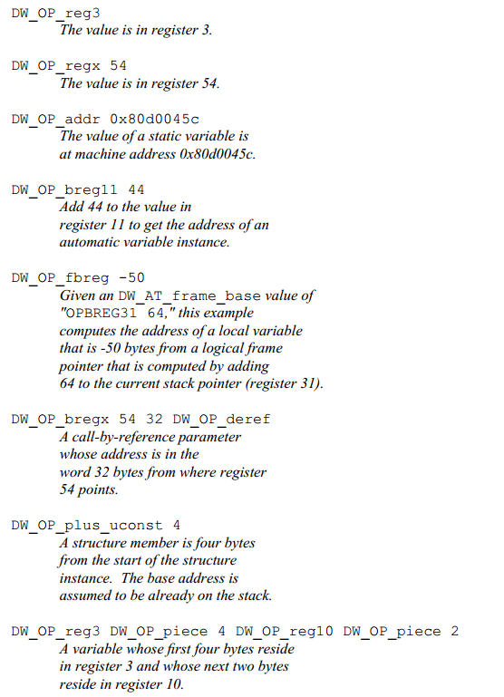

### 5.3.2 Describing Data and Type

Most of programming languages provide sophisticated description of data types, including the builtin basic data type and the method to create new data type. Dwarf aims to support all programming languages, so it abstracts out a solution to represent all languages.

Dwarf abstracts out several base types (number) based on the hardware, other types are constructed as collections or composition of base types.

#### 5.3.2.1 Base Types

Dwarf v1 and other debugging formats suppose that compiler and debugger need sharing common understanding of the size of base type, such as whether an int is 8, 16 or 32 bits. Same language on different hardware platforms may have different size of the same type, an int could be 16 bits on 16-bit processor and 32 bits on 32-bit processor. But different language on the same hardware platform may have different size of the same type, such as golang int is 64 bits on 64-bit processor, while in C it is 32 bits.

So the problem is how to remapping the base type to different bit size flexibly? Dwarf v2 solves this issue, it provides the lowest level mapping between the simple data types and how they are implemented on the target machine’s hardware. 

**Here are 3 examples:**

Figure 2a depicts that type int is 4 byte signed numer on 32-bit processor, figure 2b depicts that int is 2 byte signed number on 16-bit processor.

figure 3 depicts that type word is 16 bit signed number, while it takes up 4 bytes, in which only the first 2 upper bytes is used, leaving the lower 2 bytes zero.

DW_TAG_base_type, this tag allows a number of base types to be described, including binary integer, packed integer, address, character, fixed number and floating number. Floating number’s encoding format (such as IEEE-754) is determined by the hardware. 

#### 5.3.2.2 Type Composition

Dwarf defines a new data type via grouping or chaining builtin base types. 

Figure 5 depicts that variable px is defined, its data type DW_AT_type = <2> references DW_TAG_pointer_type, this pointer byte size is 4 byte, this pointer type is defined via modifying base type int (DW_AT_type = <3>), which is defined by DW_AT_base_type. 

Other data types can also be defined via chaining several DW_TAG_...., such as reference type can be built based on DW_TAG_pointer_type. 

#### 5.3.2.3 Array

Array is defined in a DIE which specifies whether the elements is stored in column major order (as in Fortran) or row major order (as in C or C++). The index for the array is specified by a subrange type that gives the lower and upper bounds of each dimension. This allows Dwarf to describe both C style arrays, which always have zero as the lowest index, as well as arrays in Pascal or Ada, which can have any value for the low and high bounds. 

#### 5.3.2.4 Structures, Classes, Unions, and Interfaces

Most programming languages allow programmer to group different data types into a new compositive type, such as struct.

Struct allows grouping several members of different types. C union allows this too, but every member shares the same space. C++ struct add some features beyond of C. C++ class and Java interfaces are similar entities to some extent. 

Different languages may have nearly the same compositive data type, but data type name differs, such as C++ class and class members are called Record and Fields in Pascal, Dwarf uses the terminology in C\C++\Java. 

DIE for a class is a parent for DIEs of class members, each class has a name and other possible attributes. If the size of class instance is known at compile time, the DIE will have a DW_AT_byte_size attribute. Each of these descriptions are very similar to a base type, which may be added some more details, such as class members accessibility modifier. 

C\C++ also allow bit field in struct, this can be described in attribute DW_AT_bit_offset and DW_AT_bit_size combined with DW_AT_byte_size. Bit offset and bit size specify how many bits is taken up and where it is stored, byte size specifies total space taken up by the struct.

#### 5.3.2.5 Variables

Variables are generally pretty simple, they have a name which presents a chunk of memory (or register) that store the value. Variable’s type describes what value is contained and whether it can be modified (such as const) or not. 

What distinguishes a variable is where its value is stored and its scope.

- A variable can be stored at global data section, stack, heap or register. 

- Variable’s scope describes where it can be known in the program, to some extent, its scope is determined by declaration. Dwarf documents where the variable is defined in triplet (file, line, column).

#### 5.3.2.6 Location

Dwarf provides a very general schema to describe how to locate the data represented by a variable. That is Dwarf location attribute DW_AT_location, which specifies a sequence of operations to tell debugger how to locate the data.  

Following is an example to show how DW_AT_location attribute helps to locate the variable address.

Figure 7 depicts that variable b is stored in a register, variable c is stored at stack, variable a is stored at fixed address (data section).

The debugging information must provides consumers a way to find the location of program variables, determine the bounds of of dynamic arrays and strings and possibly to find the base address of a subroutine’s stack frame or the return address of a subroutine. Furthermore, to meet the needs of recent computer architectures and optimization techniques, the debugging information must be able to describe the location of an object whose location changes over the objects’ lifetime.

Information about the location of program object is provided by location descriptions. Location descriptions can be classified into two forms:

- **Location expressions**, which are a language independent representation of addressing rules of arbitrary complexity built from a few basic building blocks, operations. They are sufficient for describing the location of any object as long as its lifetime is either static or the same as the lexical block that owns it, and it does not move throughout its lifetime.

- **Location lists**, which are used to describe objects that have a limited lifetime or change their location throughout their lifetime.

#### 5.3.2.7 Location Expression

A location expression consists of zero or more location operations. An expression with zero operations is used to denote an object that is present in the source code but not present in the object code (perhaps because of optimization). 

**The location operations fall into two categories, register names and addressing operations**:

- Register names
- Address operations

##### 5.3.2.7.1 Register names

Register names always appear alone and indicate that the referred object is contained inside a particular register.  

Note that the register number represents a Dwarf specific mapping of numbers onto the actual registers of a given architecture. `DW_OP_reg${n} (0<=n<=31)` operations encode the names of up to 32 register, the object is addressed in register n. `DW_OP_regx` operation has a single unsigned LEB128 literal operand that encodes the name of a register.

##### 5.3.2.7.2 Address operations

Address operations are memory address computation rules. All location operations are **encoded as a stream of opcodes that are each followed by zero or more literal operands**. The number of operands is determined by the opcode.  

Each addressing operation represents a **postfix operation on a simple stack machine**. 

- Each element of the stack is the size of an address on the target machine;
- The value on the top of the stack after executing the location expression is taken to be the result (the address of the object, or the value of the array bound, or the length of a dynamic string). 

In the case of locations used for structure members, the computation assumes that the base address of the containing structure has been pushed on the stack before evaluation of the address operation.

**There’re several address operation manners, including:**  

1. **Register Based Addressing**  

   Register based addressing, push a value onto the stack that is the result of adding the contents of a register with a given signed offset.

   -   DW_OP_fbreg \$offset, adding contents in frame base register (rbp) with $offset.

   - DW_OP_breg\${n} \${offset}, adding contents in register ${n} with LEB128 encoded offset.
   - DW_OP_bregx \${n} ${offset}, adding contents in register whose number is LEB128 encoded  with a LEB128 encoded offset .

2. **Stack Operations**  

   The following operations all push a value onto the addressing stack:  

   - DW_OP_lit\${n} (0<=n<=31), encode the unsigned literal values ${n}.
   - DW_OP_addr, encode the machine address that matches the target machine.
   - DW_OP_const1u/1s/2u/2s/4u/4s/8u/8s, encode 1/2/4/8 bytes unsigned or signed integer.
   - DW_OP_constu/s, encode LEB128 unsigned or signed integer.

   Following operations manipulate the location stack, location operations that index the location stack assumes that the top of the stack has index 0.  

   - DW_OP_dup, duplicates the top stack entry and pushes.
   - DW_OP_drop, pops the value at the top of stack.
   - DW_OP_pick, picks the stack entry specified by 1-byte ${index} and pushes.
   - DW_OP_over, duplicate the stack entry with index 2 and pushes.
   - DW_OP_swap, swap two stack entries, which are specified by two operands.
   - DW_OP_rot, rotate the top 3 stack entries.
   - DW_OP_deref, pops the value at the top of stack as address and retrieves data from that address, then pushes the data whose size is the size of address on target machine.
   - DW_OP_deref_size, similar to DW_OP_deref, plus when retrieveing data from address, bytes that’ll be read is specified by 1-byte operand, the read data will be zero-extended to match the size of address on target machine.
   - DW_OP_xderef & DW_OP_xderef_size, similar to DW_OP_deref, plus extended dereference mechanism. When dereferencing, the top stack entry is popped as address, the second top stack entry is popped as an address space identifier. Do some calculation to get the address and retrieve data from it, then push the data to the stack.

3. **Arithmetic and Logical Operations**

   DW_OP_abs, DW_OP_and, DW_OP_div, DW_OP_minus, DW_OP_mod, DW_OP_mul, DW_OP_neg, DW_OP_not, DW_OP_or, DW_OP_plus, DW_OP_plus_uconst, DW_OP_shl, DW_OP_shr, DW_OP_shra, DW_OP_xor, all these operations works similarly, pop the operands from the stack and calculate, then push value to the stack.

4. **Control Flow Operations**

   The following operations provide simple control of flow of a location expression.

   - Relational operators, the six operators each pops the top two stack entries and compares the top first one with the second one, and pushes value 1 if the result is true or pushes value 0 if the result is false.
   - DW_OP_skip, unconditional branch, its operand is a 2-byte constant representing the number of bytes of the location expression to skip from current location expression, beginning after the 2-byte constant.
   - DW_OP_bra, conditional branch, this operation pops the stack, if the popped value is not zero, then skip some bytes to jump to the location expression. The number of bytes to skip is specified by its operand, which is a 2-byte constant representing the number of bytes of the location expression to skip from current locating expression, beginning after the 2-byte constant.
   
5. **Special Operations**

   There’re two special operations currently defined in Dwarf 2:

   - DW_OP_piece, many compilers store a single variable in a set of registers, or store partially in register and partially in memory. DW_OP_piece provides a way of describing how large a part of a variable a particular address location refers to.
   - DW_OP_nop, it’s a placeholder, it has no effect on the location stack or any of its values. 

   The location operations mentioned above are described conventionally, following are some examples. 

   - Stack Operation Sample

   

   - Location Expression Sample

   ​		Here are some examples of how location operations are used to form location expressions.

​					

#### 5.3.2.8 Location Lists

Location lists are used in place of location expressions whenever the object whose location can be changed during its lifetime. Location lists are contained in a separate object file section **.debug_loc**. 

A location list is indicated by a constant offset from the beginning of the .debug_loc to the first byte of this list for the object in question. 

Each entry in location list consists of:

- A beginning address, it is relative to the base address of the compilation unit referring to this location list, it marks the beginning of the address range over which the location is valid.
- An ending address, it is again relative to the base address of the compilation unit referring to this location list, it marks the end of the address range over which the location is valid.
- A location expression, it describes the location of the object over range specified by the beginning and end address. 

The end of any location list is marked by a 0 for the beginning address and a 0 for the end address, no location description is provided. 

>Dwarf 5 will replace .debug_loc and .debug_ranges with .debug_loclists and .debug_rnglists allowing more compact representation and eliminating relocations.

#### 5.3.2.9 Further Reading

- Types of Declarations, please refer to DwarfStandards 3.2.2.1 and 3.2.2.2.
- Accessibility of Declarations, some languages provides support for accessibility of an object or some other program entity, this can be specififed by attribute DW_AT_accessibility, whose value is a constant drawn from the set of codes listed here: DW_ACCESS_public, DW_ACCESS_private, DW_ACCESS_protected.
- Visualbility of Declarations, it specifies which declaration are to be visible outside of the module in which they are declared, this can be specified by attribute DW_AT_visualbility, whose value is constant drawn from the set of codes listed here: DW_VIS_local, DW_VIS_exported, DW_VIS_qualified.
- Virtuality of Declarations, C++ provides support for virtual and pure virtual structure or class member functions and for virtual base classes, this is specified by attribute DW_AT_virtuality, whose value is a constant drawn from codes listed here: DW_VIRTUALITY_none, DW_VIRTUALITY_virtual, DW_VIRTUALITY_pure_virtual.
- Artificial Entries, a compiler may wish to generate debugging information entries for objects and types that were not actually declared in the source of the application. An example is a formal parameter entry to represent the hidden **this** parameter that most C++ implementations pass as the first argument to non-static member functions.
- Declaration coordinates, any DIE representing the declaration of an object, module, subprogram or type may have DW_AT_decl_file, DW_AT_decl_line and DW_AT_decl_column attributes, each of whose value is a constant.

